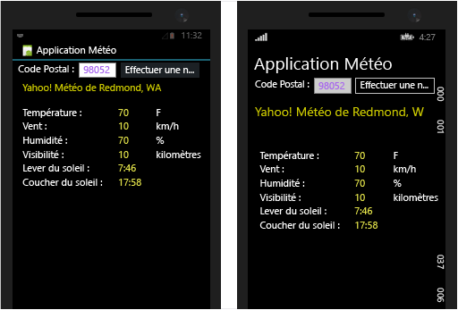
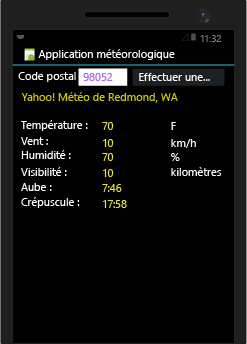
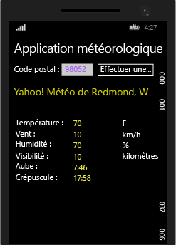

# Cr&#233;er des applications Xamarin avec une interface utilisateur native dans Visual Studio
[!INCLUDE[vs2017banner](../code-quality/includes/vs2017banner.md)]

Une fois que vous avez effectué les étapes de [Configurer et installer](../cross-platform/setup-and-install.md) et de [Vérifier votre environnement Xamarin](../cross-platform/verify-your-xamarin-environment.md), cette procédure pas à pas vous permet de générer une application Xamarin de base avec des couches d’interface utilisateur natives sur Android et Windows Phone :  
  
   
  
 Vous allez effectuer les opérations suivantes pour la générer :  
  
-   [Configurer la solution](#solution)  
  
-   [Exécuter vos applications pour vous assurer qu’elles fonctionnent](#run)  
  
-   [Écrire du code que vous pouvez partager entre vos applications](#shared)  
  
-   [Concevoir pour Android](#Android)  
  
-   [Concevoir pour Windows Phone](#Windows)  
  
-   [Étapes suivantes](#next)  
  
> [!NOTE]
>  La documentation du développeur Xamarin comporte également plusieurs procédures pas à pas, avec les sections de démarrage rapide \(Quickstart\) et d’approfondissement \(Deep Dive\) présentées ci\-dessous : Dans chacune de ces pages, vérifiez que « Visual Studio » est sélectionné en haut à droite de la page pour afficher les procédures pas à pas s’appliquant à Visual Studio.  
>   
>  -   Applications Xamarin avec une interface utilisateur native :  
>   
>      -   [Hello, Android](https://developer.xamarin.com/guides/android/getting_started/hello,android/) \(application simple avec un seul écran\)  
>     -   [Hello, Android Multiscreen](https://developer.xamarin.com/guides/android/getting_started/hello,android_multiscreen/) \(application avec une navigation entre des écrans\)  
>     -   [Android Fragments Walkthrough](http://developer.xamarin.com/guides/android/platform_features/fragments/fragments_walkthrough/) \(utilisé entre autres choses pour des écrans maître\/détails\)  
>     -   [Hello, iOS](https://developer.xamarin.com/guides/ios/getting_started/hello,_iOS/)  
>     -   [Hello, iOS Multiscreen](https://developer.xamarin.com/guides/ios/getting_started/hello,_iOS_multiscreen/)  
> -   Applications Xamarin avec Xamarin.Forms \(interface utilisateur partagée\)  
>   
>      -   [Hello, Xamarin.Forms](https://developer.xamarin.com/guides/cross-platform/xamarin-forms/getting-started/hello-xamarin-forms/quickstart/)  
>     -   [Hello, Xamarin.Forms Multiscreen](https://developer.xamarin.com/guides/cross-platform/xamarin-forms/getting-started/hello-xamarin-forms-multiscreen/)  
  
##  <a name="solution"></a> Configurer la solution  
 Créez un projet Android, un projet Windows Phone et un projet partagé, puis apportez quelques modifications à la solution.  
  
#### Créer un projet Android  
  
1.  Dans Visual Studio, créez un projet **Application vide \(Android\)** et nommez\-le **WeatherApp**.  
  
     Ce modèle se trouve sous **Visual C\#** \> **Android** dans la boîte de dialogue **Nouveau projet**.  
  
     S’il n’y figure pas, vous devez peut\-être installer Xamarin ou activer la fonctionnalité Visual Studio 2015. Consultez [Configurer et installer](../cross-platform/setup-and-install.md).  
  
2.  Renommez le projet **WeatherApp \(Android\)**.  
  
#### Ajouter un projet Windows Phone  
  
1.  Ajoutez un projet **Application vide \(Windows Phone\)** à la solution et nommez\-le **WeatherAppWindows**.  
  
     Ce modèle se trouve sous **Visual C\#** \> **Windows** \> **Windows 8** \> **Windows Phone** dans la boîte de dialogue **Nouveau projet**.  
  
     S’il n’y figure pas, vous pouvez être amené à installer les outils de développement d’applications Windows 8.1. Pour cela, ouvrez **Programmes et fonctionnalités** et modifiez votre installation de Visual Studio.  
  
#### Créer un projet partagé  
  
1.  Ajoutez un **Projet partagé** à la solution et nommez\-le **Partagé**.  
  
     Ce modèle se trouve sous **Visual C\#** \> **Windows** dans la boîte de dialogue **Nouveau projet**.  
  
2.  Ouvrez le menu contextuel du projet **WeatherApp \(Android\)**, puis choisissez **Ajouter** \> **Référence**.  
  
3.  Dans la boîte de dialogue qui s’affiche, sélectionnez le projet **Partagé**, puis le bouton **OK**.  
  
       
  
4.  Répétez ce processus pour le projet Windows Phone.  
  
#### Apporter quelques modifications mineures à la solution  
  
1.  Choisissez **Outils** \> **Gestionnaire de package NuGet** \> **Gérer les packages NuGet pour la solution**, puis ajoutez le package NuGet **Newtonsoft.Json** à votre solution.  
  
       
  
     Vous utiliserez les classes de ce package pour traiter les informations que vous récupérerez à partir d’un service météo.  
  
2.  Ouvrez le menu contextuel du projet **WeatherApp \(Android\)**, puis choisissez **Ajouter** \> **Référence**.  
  
3.  Dans la boîte de dialogue **Gestionnaire de références**, ajoutez une référence à l’assembly **Microsoft.CSharp**.  
  
##  <a name="run"></a> Exécuter vos applications pour vous assurer qu’elles fonctionnent  
 Vous avez configuré la solution. Vous êtes maintenant prêt à exécuter vos applications et à vérifier qu’elles fonctionnent.  
  
### Exécuter l’application Android  
  
1.  Dans Visual Studio, choisissez **Déboguer** \> **Démarrer le débogage**.  
  
     L’émulateur Visual Studio pour Android démarre.  
  
    > [!TIP]
    >  En guise d’alternative à l’émulateur Visual Studio pour Android, vous pouvez aussi essayer d’utiliser le [Lecteur Android Xamarin](http://xamarin.com/android-player).  
  
     L’application apparaît dans l’émulateur Android. L’application affiche un bouton qui contient le texte **Hello World, Click Me\!**. Cela signifie qu’elle fonctionne.  
  
2.  Arrêtez le débogueur.  
  
### Exécuter l’application Windows  
  
1.  Ouvrez le menu contextuel du projet **WeatherAppWindows \(Windows Phone 8.1\)**, puis choisissez **Définir comme projet de démarrage**.  
  
2.  Dans la barre d’outils **Standard**, sélectionnez l’une des options d’émulateur.  
  
       
  
3.  Appuyez sur la touche F5 de votre clavier pour exécuter l’application dans l’émulateur Windows Phone.  
  
     Votre application s’exécute dans l’émulateur, mais vous ne voyez aucun contrôle, car le modèle **Application vide \(Windows Phone\)** ne comporte aucune interface utilisateur par défaut.  
  
4.  Arrêtez le débogueur.  
  
##  <a name="shared"></a> Écrire du code que vous pouvez partager entre vos applications  
 Ajoutez du code que vous souhaitez partager entre vos applications au projet **Partagé**.  Un projet partagé est essentiellement un conteneur pour du code qui s’exécute sur les deux plateformes. Tout ce que vous ajoutez à ce projet est inclus automatiquement dans le projet Android et le projet Windows Phone.  
  
1.  Ajoutez une classe au projet **Partagé** et nommez\-la **Weather**.  
  
     Dans le menu contextuel du projet **Partagé**, choisissez **Ajouter** \> **Nouvel élément**. Ensuite, dans la boîte de dialogue **Ajouter un nouvel élément**, sélectionnez l’élément **Classe** et nommez\-le **Weather**.  
  
2.  Ouvrez le fichier **Weather.cs** et remplacez la déclaration de la classe par le code suivant :  
  
    ```c#  
    public class Weather  
    {  
        public string Title { get; set; }  
        public string Temperature { get; set; }  
        public string Wind { get; set; }  
        public string Humidity { get; set; }  
        public string Visibility { get; set; }  
        public string Sunrise { get; set; }  
        public string Sunset { get; set; }  
  
    }  
    ```  
  
     Vous utiliserez cette classe pour stocker les données d’un service météo.  
  
3.  Ajoutez une autre classe au projet **Partagé** et nommez le fichier **DataService**.  
  
4.  Ouvrez le fichier **DataService.cs** et ajoutez les instructions suivantes en haut du fichier :  
  
    ```c#  
    using System.Threading.Tasks;  
    using System.Net;  
    using System.IO;  
    using Newtonsoft.Json;  
    ```  
  
5.  Remplacez la déclaration de la classe par le code suivant :  
  
    ```c#  
    public class DataService  
    {  
        public static async Task<dynamic> getDataFromService(string queryString)  
        {  
            HttpWebRequest request = (HttpWebRequest)WebRequest.Create(queryString);  
  
            var response = await request.GetResponseAsync().ConfigureAwait(false);  
            var stream = response.GetResponseStream();  
  
            var streamReader = new StreamReader(stream);  
            string responseText = streamReader.ReadToEnd();  
  
            dynamic data = JsonConvert.DeserializeObject(responseText);  
  
            return data;  
         }  
    }  
    ```  
  
     Ce code illustre une manière de traiter des données JSON provenant d’un service.  
  
6.  Ajoutez une autre classe au projet **Partagé** et nommez\-la **Core**.  
  
     Le nom **Core** est arbitraire. Cette classe est simplement un endroit où placer la logique métier partagée. Dans notre cas, la logique qui forme une chaîne de requête à l’aide du code postal appelle le service météo, puis remplit une instance de la classe **Weather**.  
  
7.  Ouvrez **Core.cs** et ajoutez l’instruction suivante en haut du fichier :  
  
    ```c#  
    using System.Threading.Tasks;  
    ```  
  
8.  Remplacez la déclaration de la classe par le code suivant :  
  
    ```c#  
    public class Core  
    {  
        public static async Task<Weather> GetWeather(string zipCode)  
        {  
            string queryString =   
                "https://query.yahooapis.com/v1/public/yql?q=select+*+from+weather.forecast+where+location=" +  
                 zipCode + "&format=json";  
  
            dynamic results = await DataService.getDataFromService(queryString).ConfigureAwait(false);  
  
            dynamic weatherOverview = results["query"]["results"]["channel"];  
  
            if ((string)weatherOverview["description"] != "Yahoo! Weather Error")  
            {  
                Weather weather = new Weather();  
  
                weather.Title = (string)weatherOverview["description"];  
  
                dynamic wind = weatherOverview["wind"];  
                weather.Temperature = (string)wind["chill"];  
                weather.Wind = (string)wind["speed"];  
  
                dynamic atmosphere = weatherOverview["atmosphere"];  
                weather.Humidity = (string)atmosphere["humidity"];  
                weather.Visibility = (string)atmosphere["visibility"];  
  
                dynamic astronomy = weatherOverview["astronomy"];  
                weather.Sunrise = (string)astronomy["sunrise"];  
                weather.Sunset = (string)astronomy["sunset"];  
  
                return weather;  
            }  
            else  
            {  
                return null;  
            }  
        }  
    }  
    ```  
  
##  <a name="Android"></a> Concevoir pour Android  
 À présent, vous allez concevoir l’interface utilisateur, la connecter à votre code partagé, puis exécuter l’application.  
  
### Concevoir l'apparence de votre application  
  
1.  Dans l’**Explorateur de solutions**, développez le dossier **WeatherApp \(Android\)** \>**Ressources** \>**disposition**, sélectionnez le fichier **Main.axml** et appuyez sur la touche Entrée.  
  
     **Main.axml** s’ouvre dans le concepteur visuel. Si une erreur Java s’affiche, consultez ce [billet de blog](http://forums.xamarin.com/discussion/32365/connection-to-the-layout-renderer-failed-in-xs-5-7-and-xamarinvs-3-9).  
  
    > [!TIP]
    >  Le projet contient de nombreux autres fichiers. Ils ne sont pas abordés dans cette rubrique, mais si vous souhaitez étudier plus en détails la structure d’un projet Android, consultez [Part 2 Deep Dive](http://developer.xamarin.com/guides/android/getting_started/hello,android/hello,android_deepdive/).  
  
2.  Supprimez le bouton par défaut affiché dans le concepteur.  
  
3.  Dans la **Boîte à outils**, faites glisser un contrôle **RelativeLayout** sur le concepteur.  
  
     Vous pouvez utiliser ce contrôle comme conteneur parent pour d’autres contrôles.  
  
4.  Dans la **Boîte à outils**, faites glisser un contrôle **TextView** sur le contrôle **RelativeLayout**.  
  
5.  Dans la fenêtre **Propriétés**, définissez les propriétés suivantes :  
  
    |Propriété|Valeur|  
    |---------------|------------|  
    |**texte**|**Code postal :**|  
    |**ID**|**@\+id\/ZipCodeLabel**|  
    |**layout\_centerVertical**|**true**|  
    |**layout\_marginLeft**|**10dp**|  
    |**textSize**|**20sp**|  
  
    > [!TIP]
    >  Notez que de nombreuses propriétés ne contiennent pas de liste déroulante de valeurs sélectionnables.  Il peut être difficile d’évaluer la valeur de chaîne à utiliser pour une propriété donnée. Pour obtenir des suggestions, essayez de rechercher le nom d’une propriété dans la page de la classe [R.attr](http://developer.android.com/reference/android/R.attr.html).  
    >   
    >  De plus, une recherche rapide sur le web permet souvent d’accéder à une page sur [http:\/\/stackoverflow.com\/](http://stackoverflow.com/) où d’autres personnes ont utilisé la même propriété.  
  
6.  Dans la **Boîte à outils**, faites glisser un contrôle **Nombre** sur le contrôle **RelativeLayout** et positionnez\-le à côté de l’étiquette **Code postal**.  
  
       
  
7.  Dans la fenêtre **Propriétés**, définissez les propriétés suivantes :  
  
    |Propriété|Valeur|  
    |---------------|------------|  
    |**ID**|**@\+id\/ZipCodeEdit**|  
    |**layout\_centerVertical**|**true**|  
    |**layout\_marginLeft**|**10dp**|  
    |**textSize**|**20sp**|  
    |**layout\_width**|**100sp**|  
    |**textColor**|**\#9933FF**|  
  
8.  Choisissez le bouton en regard de la propriété **arrière\-plan**.  
  
9. Sous l’onglet **Ressources de l’infrastructure**, choisissez la couleur **background\_light**, puis le bouton **OK**.  
  
10. Dans la **Boîte à outils**, faites glisser un **bouton** sur le contrôle **RelativeLayout** et positionnez\-le à côté de la zone d’édition du code postal.  
  
11. Dans la fenêtre **Propriétés**, définissez les propriétés suivantes :  
  
    |Propriété|Valeur|  
    |---------------|------------|  
    |**ID**|**@\+id\/GetWeatherButton**|  
    |**texte**|**Obtenir la météo**|  
    |**layout\_marginLeft**|**10dp**|  
    |**textSize**|**20sp**|  
  
12. Sélectionnez la zone d'édition du code postal.  Redimensionnez\-la pour qu'elle corresponde à la hauteur du bouton **Obtenir la météo** en sélectionnant et en faisant glisser le petit cercle qui apparaît sous la zone d'édition.  
  
       
  
     Vous avez maintenant suffisamment d'expérience pour créer une interface utilisateur de base à l'aide du concepteur Android. Mais vous pouvez aussi créer une interface utilisateur en ajoutant des balises directement au fichier .asxml de la page. Appliquons cette méthode pour créer le reste de l’interface utilisateur.  
  
13. En bas du concepteur, choisissez l'onglet **Source**.  
  
       
  
14. Dans la vue **Source**, collez le balisage suivant sous la balise `</RelativeLayout>`.  
  
    ```xml  
    <TextView  
        android:text="Current Weather"  
        android:textAppearance="?android:attr/textAppearanceLarge"  
        android:layout_width="match_parent"  
        android:layout_height="wrap_content"  
        android:id="@+id/ResultsTitle"  
        android:textColor="#FFFF4D"  
        android:visibility="visible"  
        android:layout_marginLeft="25px" />  
    <TableLayout  
        android:minWidth="25px"  
        android:minHeight="25px"  
        android:layout_width="match_parent"  
        android:layout_height="wrap_content"  
        android:id="@+id/ResultsTable"  
        android:padding="10dp"  
        android:visibility="visible">  
        <TableRow  
            android:id="@+id/tableRow1">  
            <TextView  
                android:text="Temp:"  
                android:textAppearance="?android:attr/textAppearanceMedium"  
                android:layout_column="0"  
                android:id="@+id/textView21" />  
            <TextView  
                android:textAppearance="?android:attr/textAppearanceMedium"  
                android:layout_column="1"  
                android:id="@+id/TempText"  
                android:text="70"  
                android:textColor="#FFFF4D"  
                android:layout_height="wrap_content" />  
            <TextView  
                android:text="F"  
                android:textAppearance="?android:attr/textAppearanceMedium"  
                android:layout_column="2"  
                android:id="@+id/textView26" />  
        </TableRow>  
        <TableRow  
            android:id="@+id/tableRow2">  
            <TextView  
                android:text="Wind:"  
                android:textAppearance="?android:attr/textAppearanceMedium"  
                android:layout_column="0"  
                android:id="@+id/textView22" />  
            <TextView  
                android:textAppearance="?android:attr/textAppearanceMedium"  
                android:layout_column="1"  
                android:id="@+id/WindText"  
                android:text="10"  
                android:textColor="#FFFF4D" />  
            <TextView  
                android:text="mph"  
                android:textAppearance="?android:attr/textAppearanceMedium"  
                android:layout_column="2"  
                android:id="@+id/textView27"  
                android:layout_height="wrap_content" />  
        </TableRow>  
        <TableRow  
            android:id="@+id/tableRow3">  
            <TextView  
                android:text="Humidity:"  
                android:textAppearance="?android:attr/textAppearanceMedium"  
                android:layout_column="0"  
                android:id="@+id/textView23"  
                android:layout_width="107.0dp" />  
            <TextView  
                android:textAppearance="?android:attr/textAppearanceMedium"  
                android:layout_column="1"  
                android:id="@+id/HumidityText"  
                android:text="70"  
                android:textColor="#FFFF4D"  
                android:layout_height="wrap_content" />  
            <TextView  
                android:text="%"  
                android:textAppearance="?android:attr/textAppearanceMedium"  
                android:layout_column="2"  
                android:id="@+id/textView28" />  
        </TableRow>  
        <TableRow  
            android:id="@+id/tableRow4">  
            <TextView  
                android:text="Visibility:"  
                android:textAppearance="?android:attr/textAppearanceMedium"  
                android:layout_column="0"  
                android:id="@+id/textView34" />  
            <TextView  
                android:textAppearance="?android:attr/textAppearanceMedium"  
                android:layout_column="1"  
                android:id="@+id/VisibilityText"  
                android:text="10"  
                android:textColor="#FFFF4D"  
                android:layout_height="wrap_content" />  
            <TextView  
                android:text="miles"  
                android:textAppearance="?android:attr/textAppearanceMedium"  
                android:layout_column="2"  
                android:id="@+id/textView50" />  
        </TableRow>  
        <TableRow  
            android:id="@+id/tableRow5">  
            <TextView  
                android:text="Sunrise:"  
                android:textAppearance="?android:attr/textAppearanceMedium"  
                android:layout_column="0"  
                android:id="@+id/textView40" />  
            <TextView  
                android:textAppearance="?android:attr/textAppearanceMedium"  
                android:layout_column="1"  
                android:id="@+id/SunriseText"  
                android:text="7:46 am"  
                android:textColor="#FFFF4D" />  
        </TableRow>  
        <TableRow  
            android:id="@+id/tableRow6">  
            <TextView  
                android:text="Sunset:"  
                android:textAppearance="?android:attr/textAppearanceMedium"  
                android:layout_column="0"  
                android:id="@+id/textView46" />  
            <TextView  
                android:textAppearance="?android:attr/textAppearanceMedium"  
                android:layout_column="1"  
                android:id="@+id/SunsetText"  
                android:text="5:58 PM"  
                android:textColor="#FFFF4D" />  
        </TableRow>  
    </TableLayout>  
  
    ```  
  
15. Basculez en mode **Design**.  
  
     Votre interface utilisateur doit s'afficher comme suit :  
  
       
  
16. Générez la solution.  
  
     Cela ajoute des ID de contrôles au fichier **Resource.Designer.cs** pour que vous puissiez y faire référence par leur nom dans le code.  
  
### Consommer votre code partagé  
  
1.  Ouvrez le fichier **MainActivity.cs** du projet **WeatherApp** dans l'éditeur de code.  
  
2.  Ajoutez l'instruction suivante en haut du fichier  
  
    ```c#  
  
    using Shared;  
    ```  
  
3.  Remplacez la méthode `OnCreate` par le code suivant.  
  
    ```c#  
    protected override void OnCreate(Bundle bundle)  
    {  
        base.OnCreate(bundle);  
  
        SetContentView(Resource.Layout.Main);  
  
        Button button = FindViewById<Button>(Resource.Id.GetWeatherButton);  
  
        button.Click += delegate  
        {  
            EditText ZipCodeEditText = FindViewById<EditText>(Resource.Id.ZipCodeEdit);  
  
            Weather weather = Core.GetWeather(ZipCodeEditText.Text).Result;  
  
            if (weather != null)  
            {  
                FindViewById<TextView>(Resource.Id.ResultsTitle).Text = weather.Title;  
                FindViewById<TextView>(Resource.Id.TempText).Text = weather.Temperature;  
                FindViewById<TextView>(Resource.Id.WindText).Text = weather.Wind;  
                FindViewById<TextView>(Resource.Id.VisibilityText).Text = weather.Visibility;  
                FindViewById<TextView>(Resource.Id.HumidityText).Text = weather.Humidity;  
                FindViewById<TextView>(Resource.Id.SunriseText).Text = weather.Sunrise;  
                FindViewById<TextView>(Resource.Id.SunsetText).Text = weather.Sunset;  
  
                button.Text = "Search Again";  
            }  
            else  
            {  
                FindViewById<TextView>(Resource.Id.ResultsTitle).Text = "Couldn't find any results";  
            }  
  
        };  
    }  
    ```  
  
     Ce code appelle la méthode `GetWeather` que vous avez définie dans votre code partagé. Ensuite, dans l'interface utilisateur de l'application, il affiche les données qui sont récupérées à partir de cette méthode.  
  
### Exécuter l'application pour vérifier son fonctionnement  
  
1.  Dans l'**Explorateur de solutions**, définissez le projet **WeatherApp** comme projet de démarrage.  
  
2.  Démarrez l'application en appuyant sur la touche F5.  
  
3.  Dans l'émulateur Android, tapez un code postal valide dans la zone d'édition \(par exemple 98052\), puis appuyez sur le bouton **Obtenir la météo**.  
  
     Les données météorologiques de cette région apparaissent dans les contrôles.  
  
       
  
##  <a name="Windows"></a> Concevoir pour Windows Phone  
 À présent, vous allez concevoir l'interface utilisateur, la connecter à votre code partagé, puis exécuter l'application.  
  
### Concevoir l'apparence de votre application  
  
1.  Dans l'**Explorateur de solutions**, sélectionnez le fichier **MainPage.xaml** du projet **WeatherAppWindows \(WinPhone\)** et appuyez sur la touche Entrée.  
  
     Le fichier MainPage.xaml s'ouvre dans le concepteur.  
  
2.  Dans la **Boîte à outils**, faites glisser un contrôle **TextBlock** sur le concepteur et placez\-le vers le haut de la page.  
  
3.  Dans la fenêtre **Propriétés**, développez la section **Common** des propriétés et affectez à la propriété **Texte** la valeur **Weather App**.  
  
       
  
4.  Développez la section **Texte** et définissez la taille de la police sur **30 pt**.  
  
5.  Dans la **Boîte à outils**, faites glisser un contrôle **TextBlock** sur le concepteur et placez\-le sous le titre **Weather App**.  
  
6.  Affectez la valeur **Code postal** à la propriété **Texte** et définissez la taille de la police sur **15 pt**.  
  
7.  Dans la **Boîte à outils**, faites glisser un contrôle **TextBox** sur le concepteur et placez\-le à côté de l'étiquette **Code postal**.  
  
8.  Affectez la valeur **ZipCodeEdit** à la propriété **Nom**.  
  
9. Effacez la propriété **Texte** pour qu'aucun texte n'apparaisse dans la zone de texte.  
  
10. Sur le concepteur, faites glisser le bord de la zone de texte pour élargir sa taille.  
  
     Elle doit être assez large pour afficher cinq chiffres.  
  
11. Dans la fenêtre **Propriétés**, développez la section **Pinceau**, puis sélectionnez la propriété **Premier plan**. Choisissez une couleur intéressante, par exemple le violet.  
  
       
  
     Quand les utilisateurs entrent un code postal, le texte est affiché dans cette couleur.  
  
12. Dans la **Boîte à outils**, faites glisser un bouton sur le concepteur et placez\-le à côté de la zone de texte.  
  
13. Dans la fenêtre **Propriétés**, développez la section **Common**, puis affectez à la propriété **Contenu** la valeur **Obtenir la météo**.  
  
14. Affectez la valeur **GetWeatherButton** à la propriété **Nom**.  
  
       
  
15. Vous avez maintenant suffisamment d'expérience pour créer une interface utilisateur de base à l'aide du concepteur Windows. Mais vous pouvez aussi créer une interface utilisateur en ajoutant des balises directement au fichier xaml de la page. Appliquons cette méthode pour créer le reste de l’interface utilisateur.  
  
16. Dans la vue XAML, collez le balisage suivant sous le bouton.  
  
    ```xaml  
  
    <TextBlock x:Name="ResultsTitle" HorizontalAlignment="Left" Margin="13,130,0,0" TextWrapping="Wrap" Text="Current Weather" VerticalAlignment="Top" FontSize="25" Foreground="#FFFBF400"/>  
    <StackPanel x:Name="ResultsStackPanel" HorizontalAlignment="Left" Height="198" Margin="13,223,0,0" VerticalAlignment="Top" Width="335" Orientation="Horizontal">  
        <StackPanel Width="100">  
            <TextBlock TextWrapping="Wrap" Text="Temp:" FontSize="20" Padding="0,0,0,5"/>  
            <TextBlock TextWrapping="Wrap" Text="Wind:" FontSize="20" Padding="0,0,0,5"/>  
            <TextBlock TextWrapping="Wrap" Text="Humidity:" FontSize="20" Padding="0,0,0,5"/>  
            <TextBlock TextWrapping="Wrap" Text="Visibility:" FontSize="20" Padding="0,0,0,5"/>  
            <TextBlock TextWrapping="Wrap" Text="Sunrise:" FontSize="20" Padding="0,0,0,5"/>  
             <TextBlock TextWrapping="Wrap" Text="Sunset:" FontSize="20" Padding="0,0,0,5"/>  
        </StackPanel>  
        <StackPanel Width="100">  
            <TextBlock x:Name="TempText" TextWrapping="Wrap" Text="70" FontSize="20" Margin="0,0,-17,5" HorizontalAlignment="Right" Width="117" Foreground="#FFF2FF00"/>  
            <TextBlock x:Name="WindText" TextWrapping="Wrap" Text="10" FontSize="20" Margin="0,0,-17,5" Foreground="#FFEEFB00"/>  
            <TextBlock x:Name="HumidityText" TextWrapping="Wrap" Text="70" FontSize="20" Margin="0,0,-17,5" Foreground="#FFF0FD00"/>  
            <TextBlock x:Name="VisibilityText" TextWrapping="Wrap" Text="10" FontSize="20" Margin="0,0,-17,5" Foreground="#FFE8F400"/>  
            <TextBlock x:Name="SunriseText" TextWrapping="Wrap" Text="7:46 AM" FontSize="20" Margin="0,0,-17,5" Foreground="#FFF0FD00"/>  
            <TextBlock x:Name="SunsetText" TextWrapping="Wrap" Text="5:58 PM" FontSize="20" Margin="0,0,-17,5" Foreground="#FFEDF900"/>  
        </StackPanel>  
        <StackPanel Width="100">  
            <TextBlock TextWrapping="Wrap" Text="F" FontSize="20" Padding="0,0,0,5"/>  
            <TextBlock TextWrapping="Wrap" Text="mph" FontSize="20" Padding="0,0,0,5"/>  
            <TextBlock TextWrapping="Wrap" Text="%" FontSize="20" Padding="0,0,0,5"/>  
            <TextBlock TextWrapping="Wrap" Text="miles" FontSize="20" Padding="0,0,0,5"/>  
        </StackPanel>  
    </StackPanel>  
    ```  
  
     Dans la vue de conception, votre interface utilisateur doit ressembler à ce qui suit :  
  
       
  
### Consommer votre code partagé  
  
1.  Dans le concepteur, sélectionnez le bouton **Obtenir la météo**.  
  
2.  Dans la fenêtre **Propriétés**, sélectionnez le bouton du gestionnaire d’événements \(\).  
  
     Cette icône figure dans l'angle supérieur de la fenêtre **Propriétés**.  
  
3.  À côté de l’événement **Click**, tapez **GetWeatherButton\_Click**, puis appuyez sur la touche Entrée.  
  
     Cela génère un gestionnaire d'événements nommé `GetWeatherButton_Click`. L'éditeur de code s'ouvre et place votre curseur à l'intérieur du bloc de code de gestionnaire d'événements.  
  
4.  Remplacez ce gestionnaire d'événements par le code suivant.  
  
    ```c#  
    private void GetWeatherButton_Click(object sender, RoutedEventArgs e)  
    {  
        Weather weather = Core.GetWeather(ZipCodeEdit.Text).Result;  
        if (weather != null)  
        {  
            ResultsTitle.Text = weather.Title;  
            TempText.Text = weather.Temperature;  
            WindText.Text = weather.Wind;  
            VisibilityText.Text = weather.Visibility;  
            HumidityText.Text = weather.Humidity;  
            SunriseText.Text = weather.Sunrise;  
            SunsetText.Text = weather.Sunset;  
  
            GetWeatherButton.Content = "Search Again";  
  
            }  
            else  
            {  
                ResultsTitle.Text = "Couldn't find any results";  
            }  
        }  
    }  
    ```  
  
     Ce code appelle la méthode `GetWeather` que vous avez définie dans votre code partagé. Il s'agit de la même méthode que celle que vous avez appelée dans votre application Android. Ce code montre aussi les données récupérées à partir de cette méthode dans les contrôles d'interface utilisateur de votre application.  
  
5.  Ajoutez l'instruction suivante en haut du fichier  
  
    ```c#  
  
    using Shared;  
    ```  
  
### Exécuter l'application pour vérifier son fonctionnement  
  
1.  Dans l'**Explorateur de solutions**, définissez le projet **WeatherAppWindows \(WinPhone\)** comme projet de démarrage.  
  
2.  Démarrez l'application en appuyant sur la touche F5.  
  
3.  Dans l'émulateur Windows Phone, tapez un code postal valide dans la zone d'édition \(par exemple 98052\), puis appuyez sur le bouton **Obtenir la météo**.  
  
     Les données météorologiques de cette région apparaissent dans les contrôles.  
  
       
  
##  <a name="next"></a> Étapes suivantes  
 Félicitations \! Vous venez de créer votre première application mobile multiplateforme. Cette rubrique ne constitue qu'un point de départ. Il y a bien d'autres choses à découvrir et à apprendre.  
  
 Voici quelques suggestions qui vous permettront de poursuivre votre apprentissage en vue de créer des applications mobiles natives et attrayantes à l'aide de C\# et Visual Studio.  
  
 **Ajoutez un projet iOS à la solution**  
  
 Étendez cet exemple en ajoutant un projet pour iOS. Pour générer et exécuter cette application, vous devez vous connecter à un Mac sur votre réseau local, sur lequel Xcode et Xamarin sont installés.  
  
 Consultez [Hello, iOS](http://developer.xamarin.com/guides/ios/getting_started/hello,_iOS/hello,iOS_quickstart/) \(xamarin.com\). Remarque : dans cette page, vérifiez que « Visual Studio » est sélectionné en haut à droite de la page sur xamarin.com pour que les instructions appropriées s’affichent.  
  
 **Ajoutez du code spécifique à une plateforme dans le projet partagé**  
  
 Il n'est pas obligatoire que tout le code partagé s'exécute sur les deux plateformes. Utilisez des constantes de compilation conditionnelle pour isoler le code spécifique à une plateforme. Vous pouvez réduire le nombre de constantes qui apparaissent dans un fichier en créant des classes partielles. Isolez le code spécifique à une plateforme dans un fichier distinct, puis appliquez une constante de compilation à ce fichier.  
  
 Consultez [Créer des applications UWP avec Visual Studio](http://msdn.microsoft.com/library/windows/apps/xaml/dn609832.aspx) \(MSDN\). Pour obtenir un exemple d'application de constantes, voir en bas de la page.  
  
 **Réfléchissez à d’autres manières de partager votre code**  
  
 Vous pouvez aussi partager du code en utilisant une bibliothèque de classes portables. Découvrez les différences entre une bibliothèque de classes portables et un projet partagé et choisissez l'approche la plus logique pour votre projet.  
  
 Consultez [Sharing Code Options](http://developer.xamarin.com/guides/cross-platform/application_fundamentals/building_cross_platform_applications/sharing_code_options/) \(xamarin.com\).  
  
 **Concevez une seule interface utilisateur qui s’exécute sur toutes les plateformes**  
  
 Si votre interface utilisateur utilise des modèles courants tels que des affichages de listes et de détails, vous pouvez utiliser Xamarin.Forms pour l'implémenter. Xamarin.Forms utilisant XAML, vous pouvez lier de manière déclarative des propriétés et des méthodes à votre interface utilisateur. Cela peut être très intéressant si votre objectif consiste à réduire la quantité de code dans votre code d'interface utilisateur.  
  
 Consultez [Xamarin.Forms](http://developer.xamarin.com/guides/cross-platform/xamarin-forms/) \(xamarin.com\).  
  
## Voir aussi  
 [Site de développement Xamarin](http://developer.xamarin.com/)   
 [Centre de développement Windows](https://dev.windows.com/en-us)   
 [Affiche aide\-mémoire pour Swift et C\#](http://aka.ms/scposter)