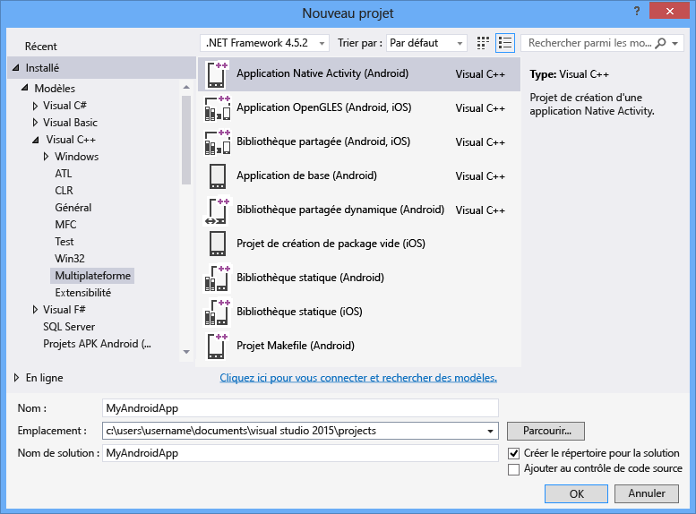

# Créer une application Android Native Activity
Quand vous installez l’option Visual C++ pour le développement mobile multiplateforme, vous pouvez utiliser Visual Studio 2015 pour créer des applications Android Native Activity entièrement fonctionnelles. Android Native Development Kit (NDK) est un ensemble d’outils vous permettant d’implémenter la majorité de votre application Android au moyen de code C/C++ pur. Certaines parties de code Java JNI font office de colle pour permettre à votre code C/C++ d’interagir avec Android. Android NDK a introduit la possibilité de créer des applications Native Activity à l’aide de l’API Android de niveau 9. Le code Native Activity est couramment employé pour créer des jeux et des applications à fort contenu graphique qui utilisent Unreal Engine ou OpenGL. Cette rubrique vous guide tout au long de la création d’une application Native Activity simple utilisant OpenGL. D’autres rubriques examinent plus en détail les étapes du cycle de développement, à savoir la modification, la génération, le débogage et le déploiement de code Native Activity.  
  
 [Configuration requise](#req)   
 [Créer un projet Native Activity](#Create)   
 [Générer et exécuter l’application Android Native Activity par défaut](#BuildHello)  
  
##   Configuration requise  
 Avant de pouvoir créer une application Android Native Activity, vous devez vous assurer que vous disposez de la configuration système requise et que vous avez installé l’option Développement mobile Visual C++ dans Visual Studio 2015. Pour plus d’informations, consultez [Install Visual C++ for Cross-Platform Mobile Development](../cross-platform/install-visual-cpp-for-cross-platform-mobile-development.md). Assurez-vous que les SDK et les outils tiers requis sont inclus dans l’installation, et que l’Émulateur Microsoft Visual Studio pour Android est installé.  
  
##   Créer un projet Native Activity  
 Dans ce didacticiel, vous allez tout d’abord créer un projet Android Native Activity, puis vous allez générer et exécuter l’application par défaut dans l’Émulateur Visual Studio pour Android.  
  
#### Pour créer un projet  
  
1.  Ouvrez Visual Studio. Dans la barre de menus, sélectionnez **Fichier**, **Nouveau**, **Projet**.  
  
2.  Dans la boîte de dialogue **Nouveau projet** , sous **Modèles**, choisissez **Visual C++**, **Interplateforme**, puis choisissez le modèle **Application Native Activity (Android)** .  
  
3.  Donnez à l’application un nom comme `MyAndroidApp`, puis choisissez **OK**.  
  
       
  
     Visual Studio crée la solution et ouvre l’Explorateur de solutions.  
  
       
  
 La nouvelle solution Application Android Native Activity comprend deux projets :  
  
-   **MyAndroidApp.NativeActivity** contient les références et le code de type glue pour que votre application s’exécute comme Native Activity sur Android. L’implémentation des points d’entrée à partir du code de type glue se trouve dans main.cpp. Les en-têtes précompilés sont dans pch.h. Ce projet d’application Native Activity est compilé en fichier de bibliothèque partagée (.so), qui est utilisé par le projet de création de package.  
  
-   **MyAndroidApp.Packaging** crée le fichier .apk pour le déploiement sur un émulateur ou un appareil Android. Il contient les ressources et le fichier AndroidManifest.xml où vous avez défini les propriétés de manifeste. Il contient aussi le fichier build.xml qui contrôle le processus de génération Ant. Il est configuré comme projet de démarrage par défaut et peut donc être déployé et exécuté directement à partir de Visual Studio.  
  
##   Générer et exécuter l’application Android Native Activity par défaut  
 Générez et exécutez l’application générée par le modèle pour vérifier votre installation et votre configuration. Pour ce test initial, exécutez l’application sur l’un des profils d’appareils installés par l’Émulateur Visual Studio pour Android. Si vous préférez tester votre application sur une autre cible, vous pouvez charger l’émulateur cible ou connecter l’appareil à votre ordinateur.  
  
#### Pour générer et exécuter l’application Native Activity par défaut  
  
1.  Si ce n’est pas déjà fait, choisissez **x86** dans la liste déroulante **Plateformes Solution** .  
  
       
  
     Si la liste **Plateformes Solution** n’est pas visible, choisissez **Plateformes Solution** dans la liste **Ajouter/supprimer des boutons**, puis choisissez votre plateforme.  
  
2.  Dans la barre de menus, choisissez **Générer**, puis **Générer la solution**.  
  
     La fenêtre Sortie affiche la sortie du processus de génération pour les deux projets de la solution.  
  
3.  Sélectionnez l’un des profils Émulateur VS Android Phone (x86) comme cible de déploiement.  
  
     Si vous avez installé d’autres émulateurs ou si vous avez connecté un appareil Android, vous pouvez les choisir dans la liste déroulante de cible de déploiement.  
  
4.  Appuyez sur F5 pour démarrer le débogage, ou sur Maj+F5 pour démarrer sans débogage.  
  
     Voici à quoi ressemble l’application par défaut dans l’émulateur Visual Studio pour Android.  
  
       
  
     Visual Studio démarre l’émulateur qui, après quelques secondes, charge et déploie votre code. Une fois l’application démarrée, vous pouvez définir des points d’arrêt et utiliser le débogueur pour parcourir le code, examiner les variables locales et observer les valeurs.  
  
5.  Appuyez sur Maj+F5 pour arrêter le débogage.  
  
     L’émulateur est un processus distinct qui continue à s’exécuter. Vous pouvez modifier, compiler et déployer votre code plusieurs fois sur le même émulateur.