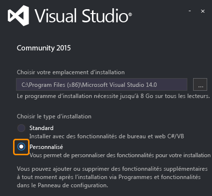

# Configurer et installer
Pour générer des applications natives iOS, Android et Windows à partir d’une base de code C#/.NET commune en utilisant Xamarin, vous avez besoin des éléments suivants :  
  
-   Pour travailler avec des applications Windows et Android : un ordinateur de développement Windows où Visual Studio 2015 et Xamarin 4 sont installés (voir la remarque ci-dessous). (Vous pouvez également utiliser Visual Studio 2013 en suivant les instructions relatives à l’[installation directe de Xamarin](https://developer.xamarin.com/guides/cross-platform/getting_started/requirements/#install) (xamarin.com).)   
  
-   Pour travailler avec des applications iOS : un Mac avec OS X Yosemite (10.10.5) ou ultérieur, où Xcode et Xamarin sont installés.  
  
 Vous pouvez configurer les ordinateurs Windows et Mac en même temps. Pendant l’exécution de ces programmes d’installation, vous pouvez parcourir la rubrique [En savoir plus sur le développement mobile avec Xamarin](../cross-platform/learn-about-mobile-development-with-xamarin.md) pour vous familiariser avec les informations nécessaires.  
 
Si vous rencontrez des problèmes d’utilisation de Xamarin après les phases d’installation et de configuration, publiez votre question sur [forums.xamarin.com](http://forums.xamarin.com/).
  
> [!NOTE]
>  À partir du 31 mars 2016, Xamarin est inclus dans toutes les éditions de Visual Studio, sans coût supplémentaire et sans nécessiter de licence distincte. Xamarin Studio Community pour Mac est également gratuit pour les étudiants, les développeurs de logiciels open source et les petites équipes. Notez que pour les installations existantes de Visual Studio configurées avec des licences antérieures de Xamarin, vous devez mettre à jour Xamarin vers la version 4.0.3.214 ou une version ultérieure. Pour ce faire, accédez à **Outils > Options > Xamarin > Autre**, cliquez sur le lien **Vérifier maintenant**, puis téléchargez la mise à jour 4.0.3.214. Après avoir redémarré Visual Studio, accédez à **Outils > Compte Xamarin** pour voir la mise à jour de l’état de la licence.  
  
 **Dans cette rubrique :**  
  
-   [Prérequis](#prereq)  
  
-   [Configuration pour Windows (Visual Studio et Xamarin)](#windows)  
  
-   [Configuration pour Mac (identifiant Apple, Xcode et Xamarin)](#mac)  
  
##   Prérequis  
  
1.  Compte Xamarin : accédez à [https://www.xamarin.com/](https://www.xamarin.com/), cliquez sur **Sign In** (Connexion) en haut à droite de la page, puis cliquez sur **Create a new account** (Créer un compte) dans la page qui s’affiche. Sélectionnez une adresse e-mail et un mot de passe pour votre compte Xamarin. Vous les utiliserez plus tard.  
  
2.  Pour cibler Windows et Android :  
  
    1.  Recommandé : un ordinateur Windows physique (pas une machine virtuelle) exécutant Windows 8 ou ultérieur, ce qui permet l’utilisation de l’émulateur Visual Studio pour Android, lequel est rapide et basé sur Hyper-V, si vous n’avez pas d’appareil Android. (Avons-nous bien précisé que vous avez besoin d’un ordinateur physique et non d’une machine virtuelle ?)  
  
    2.  Si vous disposez d’un ordinateur Windows 7 (ou version antérieure), utilisez Xamarin Player pour Android en tant qu’émulateur. 
    
    3. Pour chaque configuration, vous pouvez toujours exécuter les applications directement sur les appareils physiques connectés.  
  
3.  Pour cibler iOS :  
  
    1.  Mac ou Mac mini en réseau avec OS X Yosemite exécutant OS X 10.10.5 ou ultérieur (obligatoire pour Xcode 7.1).  
  
    2.  Quand vous utilisez Visual Studio sur un ordinateur Windows 7 (ou version ultérieure) comme environnement de développement principal, un Mac en réseau est nécessaire uniquement pour compiler et déboguer les applications iOS, se connecter au simulateur iOS ou aux appareils attachés, et utiliser le concepteur de storyboards de Visual Studio pour concevoir l’interface utilisateur. Les modèles de Mac plus anciens sont tout à fait suffisants pour ce rôle secondaire.  
  
##   Configuration pour Windows (Visual Studio et Xamarin)  
  
> [!TIP]
>  Ces instructions s’appliquent à Visual Studio 2015. Pour utiliser Xamarin avec Visual Studio 2013 (Update 2 obligatoire), suivez les instructions d’[installation directe de Xamarin](https://developer.xamarin.com/guides/cross-platform/getting_started/requirements/#install) (xamarin.com).  
  
1.  [Téléchargez et lancez le programme d’installation de n’importe quelle édition de Visual Studio 2015](https://www.visualstudio.com/en-us/downloads/download-visual-studio-vs.aspx) (Community, Professional ou Enterprise). Visual Studio 2015 Community est une version gratuite, tandis que les éditions Professional et Enterprise peuvent être utilisées dans le cadre d’un essai de 30 jours. Au-delà, vous devez acheter une licence.  
  
    1.  Si vous avez déjà installé Visual Studio, ouvrez **Panneau de configuration > Programmes et fonctionnalités**, choisissez l’élément **Visual Studio 2015**, puis cliquez sur **Modifier**. Une fois le programme d’installation ouvert, cliquez sur **Modifier**, puis passez à l’étape 3 ci-dessous.  
  
2.  (Nouvelles installations uniquement) Dans le programme d’installation, sélectionnez une installation **Personnalisée** :  
  
       
  
3.  Cochez les cases suivantes :  
  
    1.  **Développement mobile multiplateforme > C#/.NET (Xamarin)**. Différents outils Android sont aussi automatiquement sélectionnés sous Kits de développement logiciel (SDK) et outils courants. Cette option permet également de mettre à jour les installations Xamarin existantes.  
  
           
  
    2.  Pour Windows 8 (et versions ultérieures) : **Développement mobile multiplateforme > Émulateur Microsoft Visual Studio pour Android**. Remarque : Si vous utilisez un ordinateur Windows 7 (ou version antérieure), ou si vous exécutez Windows sur un Mac, vérifiez que cette case est *décochée*. Consultez « Remarque pour les émulateurs sur des ordinateurs Windows » après l’étape 5. Vous pouvez également laisser cette case décochée, si vous avez l’intention de déboguer uniquement sur les appareils Android physiques.  
  
    3.  (Facultatif) Si vous prévoyez de cibler des appareils Windows, cochez aussi **Développement d’applications Windows et web > Outils de développement d’applications Windows universelles** et/ou **Outils Windows 8.1 et Windows Phone 8.0/8.1**. Des options y sont proposées pour l’installation d’images d’émulateurs dont le chargement prend davantage de temps : vous pouvez toujours revenir au programme d’installation de Visual Studio pour les ajouter ultérieurement.  
  
4.  Cliquez sur le bouton Installer et laissez le processus s’exécuter. Là encore, cette opération va prendre un certain temps. Vous pouvez en profiter pour poursuivre la lecture des instructions de configuration du Mac, puis consulter [En savoir plus sur le développement mobile avec Xamarin](../cross-platform/learn-about-mobile-development-with-xamarin.md).  
  
5.  Une fois l’installation terminée, lancez Visual Studio et connectez-vous avec votre compte Microsoft si vous y êtes invité (il s’agit du même compte que celui que vous utilisez avec Windows). Recherchez ensuite les mises à jour de Xamarin via **Outils > Options > Xamarin** ou **Outils > Options > Xamarin > Autre**, où vous trouverez un lien **Vérifier maintenant** :  
  
       
  
    > [!NOTE]
    >  Comme indiqué précédemment, veillez à mettre à jour Xamarin vers la version 4.0.3.214 (ou une version ultérieure) pour éviter les problèmes liés aux licences antérieures Xamarin.  

    Si vous ne voyez pas d’option pour Xamarin dans **Outils > Options**, revérifiez votre installation, ou essayez de redémarrer Visual Studio. Vous pouvez également rechercher Xamarin dans la boîte de dialogue Options.
      
6.  Pour Windows 7 (ou version antérieure), ou si vous exécutez Windows sur un Mac, utilisez l’[Émulateur du kit Android SDK](https://developer.xamarin.com/guides/android/deployment,_testing,_and_metrics/debug-on-emulator/android-sdk-emulator/) en l’absence d’appareils physiques. Voir la remarque ci-dessous.  
  
 **Remarque pour les émulateurs sur des ordinateurs Windows :** Les UC ne prenant en charge qu’une seule technologie de virtualisation à la fois, il est préférable d’avoir un seul émulateur actif sur un ordinateur de développement. Il existe trois technologies de virtualisation principales : Hyper-V (utilisé par l’émulateur Visual Studio pour Android et par l’émulateur Windows Phone), Virtual Box (utilisé par Genymotion) et Intel HAXM (utilisé par l’émulateur du kit Android SDK). En raison de différents problèmes entre Hyper-V et Virtual Box, il est préférable d’utiliser des émulateurs d’un seul type sur un ordinateur donné. Ainsi, il est recommandé d’utiliser Hyper-V sur les ordinateurs Windows 8 (ou ultérieur) et les émulateurs Intel HAXM sur Windows 7 (ou antérieur) et dans les situations où Windows est exécuté sur un Mac.  
  
##   Configuration pour Mac (identifiant Apple, Xcode et Xamarin)  
  
1.  Créez un ID Apple gratuit sur [https://appleid.apple.com](https://appleid.apple.com/) si vous n’en avez pas déjà un. Cette opération est nécessaire pour l’installation et la connexion à Xcode.  
  
2.  Téléchargez et installez Xcode à partir de [https://developer.apple.com/xcode/](https://developer.apple.com/xcode/), puis ajoutez votre identifiant Apple comme indiqué dans [Ajout de votre compte à Xcode](https://developer.apple.com/library/content/documentation/IDEs/Conceptual/AppStoreDistributionTutorial/AddingYourAccounttoXcode/AddingYourAccounttoXcode.html#//apple_ref/doc/uid/TP40013839-CH40-SW1) (apple.com).  
  
3.  Téléchargez et installez Xamarin en suivant les instructions de [Installing and Configuring Xamarin.iOS](http://developer.xamarin.com/guides/ios/getting_started/installation/mac/) (xamarin.com).  
  
4.  Une fois que vous avez fini d’installer Xamarin sur les ordinateurs Windows et Mac, suivez les instructions de la page [Connecting to the Mac](http://developer.xamarin.com/guides/ios/getting_started/installation/windows/xamarin-mac-agent/) (xamarin.com) pour pouvoir utiliser iOS et le Mac à partir de Visual Studio sur l’ordinateur Windows.  
  
     Notez que les deux ordinateurs doivent être sur le même réseau local.
