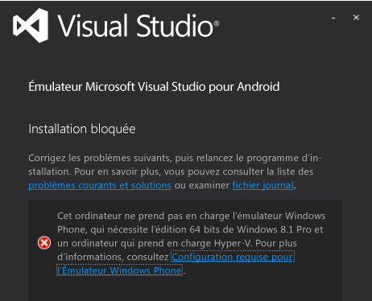
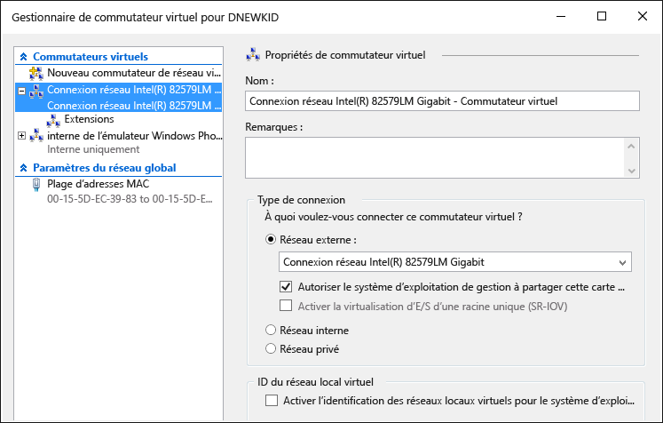

# D&#233;pannage de l&#39;&#233;mulateur Visual Studio pour Android
[!INCLUDE[vs2017banner](../code-quality/includes/vs2017banner.md)]

Cette rubrique contient des informations pour vous aider à résoudre les problèmes que vous pouvez rencontrer quand vous utilisez l'Émulateur Visual Studio pour Android.  
  
> [!WARNING]
>  Quand l'émulateur est installé, le programme d'installation vérifie la configuration requise pour l'exécution du logiciel. Il affiche des avertissements si les composants requis ne sont pas présents, mais il ne les exige pas pour procéder à l'installation.  
  
 Cette rubrique contient les sections suivantes.  
  
-   [Avant de commencer](#BeforeYouStart)  
  
-   [L’installation de l’émulateur échoue](#NoInstall)  
  
-   [Impossible de se connecter à des destinations réseau sur un domaine ou un réseau d'entreprise](#DomainNetwork)  
  
-   [Impossible de se connecter à des destinations réseau quand des paramètres réseau nécessitent une configuration manuelle](#ManualNetworkConfig)  
  
-   [L'émulateur démarre lentement, son démarrage échoue à cause d'un dépassement de délai d'attente ou le déploiement d'application échoue](#SlowStart)  
  
-   [Le démarrage de l'émulateur échoue](#NoStart2)  
  
-   [Le démarrage de l’émulateur échoue (première utilisation)](#NoStart)  
  
-   [Le démarrage de l'ordinateur échoue après l'installation de l'émulateur](#NoBoot)  
  
-   [Visual Studio se bloque en essayant de déployer l’application sur l’émulateur, ou l’émulateur n’apparaît pas comme cible de débogage dans d’autres IDE](#ADB)  
  
-   [L’émulateur se bloque, car il n’a pas pu configurer le port UDP](#XamarinPlayer)  
  
-   [L'émulateur ne parvient pas à exécuter une application qui utilise les services Google Play](#GooglePlay)  
  
-   [Le glisser-déplacer de fichier, APK ou fichier zip pouvant être flashé ne fonctionne pas](#DragAndDrop)  
  
-   [La résolution de capture d'écran est incorrecte](#Resolution)  
  
-   [L'émulateur ne parvient pas à afficher le contenu OpenGL](#OpenGL)  
  
-   [L'émulateur ne répond pas aux entrées tactiles multipoints](#Multitouch)  
  
-   [Ressources de support technique](#Support)  
  
##   Avant de commencer  
 Avant de commencer le dépannage, il peut être utile de consulter les rubriques suivantes :  
  
-   [Configuration système requise pour l'émulateur Visual Studio pour Android](../cross-platform/system-requirements-for-the-visual-studio-emulator-for-android.md)  
  
##   L’installation de l’émulateur échoue  
 Si vous n’avez pas installé Hyper\-V, le message suivant s’affiche quand vous essayez d’installer l’émulateur. Effectuez l’installation sur une machine qui prend en charge Hyper\-V et sur laquelle Hyper\-V est activé.  
  
   
  
> [!NOTE]
>  Ce message concerne à la fois l’émulateur Visual Studio pour Android et l’émulateur Windows Phone. Windows 8.1 et Windows 10 prennent en charge l’émulateur.  
  
 Si vous voyez ce message, consultez [Configuration système requise pour l'émulateur Visual Studio pour Android](../cross-platform/system-requirements-for-the-visual-studio-emulator-for-android.md) pour vérifier si vous pouvez exécuter l’émulateur.  
  
##   Impossible de se connecter à des destinations réseau sur un domaine ou un réseau d'entreprise  
 L'Émulateur Visual Studio pour Android apparaît sur le réseau comme une unité distincte avec sa propre adresse IP. Il n'est pas joint à un domaine Windows et ne partage pas d'informations d'identification de domaine ou de groupe de travail avec l'ordinateur hôte.  
  
 Si votre réseau nécessite une autorisation de domaine ou de groupe de travail pour la connectivité réseau de base et Internet, contactez votre administrateur informatique pour créer une exception. Cette exception permet à votre ordinateur de développement de servir d'ordinateur de limite et d'accepter les connexions en provenance de périphériques réseau non liés à un domaine, comme l'émulateur.  
  
 L'Émulateur Visual Studio pour Android utilise également son propre ensemble d'adresses MAC. Si vous ne pouvez pas accéder aux ressources réseau ou Internet à partir de l'émulateur, contactez votre administrateur informatique pour vous assurer que les adresses MAC de l'émulateur ont été autorisées sur votre réseau.  
  
#### Pour afficher les adresses MAC de l'émulateur  
  
1.  Lancez l'émulateur.  
  
2.  Dans la barre d'outils de l'émulateur, cliquez sur le bouton chevron \(\>\>\) pour ouvrir la fenêtre Outils supplémentaires.  
  
3.  Dans la fenêtre Outils supplémentaires, cliquez sur l'onglet Réseau.  
  
4.  Dans la page Réseau, recherchez les entrées d'adresses physiques.  
  
##   Impossible de se connecter à des destinations réseau quand des paramètres réseau nécessitent une configuration manuelle  
 Pour vous connecter à des destinations réseau à partir de l'émulateur, votre réseau doit remplir les conditions suivantes :  
  
-   DHCP. L'émulateur nécessite le protocole DHCP, car il se configure lui\-même comme périphérique distinct sur le réseau avec sa propre adresse IP.  
  
-   Paramètres DNS et de passerelle configurés automatiquement. Vous ne pouvez pas configurer les paramètres DNS et de passerelle manuellement pour l'émulateur.  
  
 Si votre réseau nécessite des paramètres configurés manuellement, contactez votre administrateur informatique pour déterminer comment activer la connectivité réseau pour l'émulateur.  
  
##   L'émulateur démarre lentement, son démarrage échoue à cause d'un dépassement de délai d'attente ou le déploiement d'application échoue  
 Dans certaines conditions, le démarrage de l'émulateur prend plusieurs minutes ou échoue à cause d'un dépassement de délai d'attente. Quand le démarrage de l'émulateur échoue, le message suivant s'affiche : `App deployment failed. Please try again`. Les conditions suivantes peuvent provoquer cette erreur.  
  
-   Exécution de l'Émulateur Visual Studio pour Android à partir d'un disque dur virtuel démarrable. Cette configuration n'est pas prise en charge.  
  
-   Disque dur défaillant. Exécutez le programme chkdsk.  
  
-   Disque dur nécessitant une défragmentation. Défragmentez le disque.  
  
-   Dur dur presque plein. Vérifiez l'espace disponible sur le disque.  
  
-   Mémoire disponible insuffisante à cause d'autres applications en cours d'exécution. Réduisez le nombre d'applications qui consomment de la mémoire ou augmentez la quantité de mémoire.  
  
-   En règle générale, tout facteur qui contribue à de mauvaises performances sur le système. Commencez le dépannage par le composant dont le sous\-score est le plus faible dans l'Indice de performance Windows, que vous trouverez dans la page Informations et outils de performances du Panneau de configuration.  
  
##   Le démarrage de l'émulateur échoue  
 Si l’émulateur ne démarre pas alors qu’il fonctionnait auparavant, effectuez les étapes suivantes. Si vous utilisez l’émulateur pour la première fois, consultez [Le démarrage de l’émulateur échoue (première utilisation)](#NoStart) avant d’essayer ces étapes.  
  
-   Supprimez toutes les autres instances Hyper\-V de l’émulateur.  
  
    -   Fermez Visual Studio.  
  
    -   Ouvrez le Gestionnaire Hyper\-V, puis arrêtez les instances Hyper\-V de l’émulateur \(machines virtuelles\) en cours d’exécution qui présentent un état endommagé.  
  
    -   Dans le Gestionnaire Hyper\-V, supprimez tout autre émulateur de machine virtuelle.  
  
    -   Redémarrez votre machine.  
  
-   Assurez\-vous de disposer d'au moins 4 Go de mémoire système et qu'elle n'est pas consommée par d'autres programmes et processus gourmands en ressources.  
  
-   Dans le Gestionnaire Hyper\-V, ouvrez le Gestionnaire de commutateur virtuel et vérifiez que vous disposez de deux commutateurs réseau. Vérifiez aussi que le premier correspond au commutateur interne et le second au commutateur externe.  
  
       
  
     Si le programme d’installation ne fonctionne pas correctement sur Windows 10, essayez de [réinstaller les périphériques réseau à l’aide de la commande netcfg –d](http://windows.microsoft.com/en-us/windows-10/fix-network-connection-issues) \(section 6\).  
  
-   Si ces étapes ne résolvent pas le problème, consultez [Le démarrage de l’émulateur échoue (première utilisation)](#NoStart) pour obtenir des informations sur les logiciels tiers susceptibles d’interférer avec l’émulateur.  
  
##   Le démarrage de l’émulateur échoue \(première utilisation\)  
 Si l'émulateur ne démarre pas, effectuez les tâches suivantes pour identifier et résoudre le problème.  
  
-   Assurez\-vous que la configuration matérielle requise est satisfaite et que les paramètres du BIOS sont corrects.  
  
     L'émulateur et Windows 8 Hyper\-V nécessitent un processeur 64 bits avec SLAT \(Second Level Address Translation\). Pour Intel, il faut essentiellement un processeur Core i3, i5 ou i7 \(ou l’un des nombreux Xeon existants\). Une liste de puces AMD est disponible [ici](http://support.amd.com/en-us).  
  
    1.  Assurez\-vous que votre ordinateur possède la [configuration système requise](../cross-platform/system-requirements-for-the-visual-studio-emulator-for-android.md).  
  
    2.  Vérifiez que l’[outil SLAT](https://slatstatuscheck.codeplex.com/) indique que votre ordinateur est compatible SLAT.  
  
    3.  Dans les paramètres du BIOS de votre ordinateur, assurez\-vous que toutes les technologies de virtualisation sont activées. Les descriptions de BIOS exactes peuvent varier pour chaque fabricant de matériel. En général, vous devez activer les fonctionnalités liées à :  
  
        -   SLAT \(Second Level Address Translation\)  
  
        -   EPT \(Extended Page Tables\) \(Intel\)  
  
        -   NPT \(Nested Page Tables\) \(AMD\)  
  
        -   RVI \(Rapid Virtualization Indexing\) \(AMD\)  
  
        -   VMX \(acronyme Intel indiquant la prise en charge de l'assistance matérielle à la virtualisation\)  
  
        -   SVM \(acronyme AMD indiquant la prise en charge de l'assistance matérielle à la virtualisation\)  
  
        -   XD \(Execute Disable\) \(Intel\) ; ce paramètre doit être activé  
  
        -   NX \(No Execute\)\(AMD\) ; ce paramètre doit être activé  
  
    4.  Si les options suivantes sont présentes dans le BIOS, désactivez\-les.  
  
        -   Disable Intel VT\-d  
  
        -   Disable Trusted Execution  
  
         Pour plus d'informations, consultez cet article : Technet : Hyper\-V : Comment corriger les erreurs de BIOS lors de l'activation d'Hyper\-V  
  
    5.  Assurez\-vous de disposer d'au moins 4 Go de mémoire système et qu'elle n'est pas consommée par d'autres programmes et processus gourmands en ressources.  
  
    6.  Vérifiez que vous exécutez Windows 8 Professionnel ou mieux \(Windows Server 2008 n'est pas pris en charge\). Windows Server 2012 est pris en charge, mais vous devez activer la fonctionnalité Expérience utilisateur.  
  
     Vous pouvez inspecter l'Observateur d'événements pour voir s'il existe des erreurs liées à l'hyperviseur. Pour cela, ouvrez l'Observateur d'événements \(touche Windows \+ R, puis tapez `eventvwr`\), puis sélectionnez **Journaux Windows**, **Système**. Ensuite, filtrez le journal par source d'événements, en définissant **Hyperviseur Hyper\-V** comme source. Recherchez les erreurs pour aider à identifier la cause initiale.  
  
     Si votre processeur satisfait à la configuration requise mais que l'hyperviseur échoue encore, vérifiez si une mise à niveau du BIOS est disponible pour votre ordinateur. Si c'est le cas et que vous choisissez de mettre à niveau, veillez à respecter toutes les précautions du fabricant lors de la mise à niveau du BIOS \(par exemple, assurez\-vous que la mise à niveau du microprogramme BIOS n'est pas interrompue par une panne de courant, ce qui peut altérer définitivement le BIOS\).  
  
-   Assurez\-vous de disposer d'au moins 4 Go de mémoire système et qu'elle n'est pas consommée par d'autres programmes et processus gourmands en ressources.  
  
-   Supprimez ou désactivez les logiciels ou pilotes tiers qui peuvent interférer avec la mise en réseau virtuel.  
  
     Il existe des problèmes connus avec certains produits tiers installés sous Windows 8, tels que des pilotes\/protocoles réseau qui ne sont pas entièrement compatibles avec la pile de mise en réseau Hyper\-V.  
  
     En général, il incombe aux développeurs de ces produits de mettre à jour leurs logiciels pour qu'ils soient compatibles avec Windows 8 et Hyper\-V.  
  
     Les produits suivants peuvent nécessiter une mise à niveau pour la compatibilité avec Windows 8 : VirtualBox, Virtual PC 7, VMWare, certains clients VPN, pare\-feu logiciels, versions de clients VPN Cisco et autres systèmes de virtualisation. Collaborez avec le développeur du logiciel de virtualisation en question pour l'inciter à mettre à niveau le logiciel pour le rendre compatible avec Windows 8 et Hyper\-V.  
  
     En guise de **solution de contournement**, vous pouvez désactiver tous les pilotes et applications tiers susceptibles d'interférer avec le réseau virtuel utilisé par l'émulateur pour communiquer avec Visual Studio. Il peut s'agir notamment :  
  
    -   d'applications antivirus \(qui se raccordent à la pile réseau\) ;  
  
    -   d'outils d'analyse de réseau ;  
  
    -   d'outils de journalisation de réseau ;  
  
    -   d'autres logiciels d'analyse du système.  
  
     Une autre solution possible, avant de considérer la désinstallation des produits en question \(et de demander au développeur du produit de publier une version mise à jour\) consiste à effectuer les étapes suivantes.  
  
    1.  Démarrez le Gestionnaire de connexions réseau \(dans l'écran d'accueil, tapez `View Network Connections` et sélectionnez cette option pour afficher les connexions réseau.\)  
  
    2.  Pour la carte vEthernet \(port Ethernet interne \- commutateur interne de l'émulateur Windows Phone\), choisissez **Propriétés** dans le menu contextuel.  
  
           
  
         Les propriétés de la carte sont présentées ici.  
  
           
  
    3.  Pour cette carte, les seuls éléments qui doivent être sélectionnés sous **Cette connexion utilise les éléments suivants** sont les suivants :  
  
        -   Client pour les réseaux Microsoft  
  
        -   Planificateur de paquets QoS  
  
        -   Partage de fichiers et d'imprimantes pour les réseaux Microsoft  
  
        -   Pilote de protocole LLDP Microsoft  
  
        -   Pilote E\/S Mappage de découverte de couche liaison  
  
        -   Répondeur de découverte de la topologie de la couche de liaison  
  
        -   Protocole Internet version 6 \(TCP\/IPv6\)  
  
        -   Protocole Internet version 4 \(TCP\/IPv4\)  
  
    4.  Désactivez tous les autres éléments.  
  
     L'inconvénient de cette technique est que chaque fois qu'un nouveau produit tiers installe des pilotes non pris en charge ou chaque fois que l'émulateur est installé, vous devez répéter ces étapes.  
  
     Après avoir désinstallé des produits tiers, vous devrez peut\-être restaurer le commutateur interne de l'émulateur Windows Phone. Pour cela :  
  
    -   Ouvrez Hyper V et accédez au Gestionnaire de commutateur virtuel. Créez un commutateur virtuel nommé « Commutateur interne de l'émulateur Windows Phone » et sélectionnez **Réseau interne** comme type de connexion.  
  
           
  
     Maintenant, lancez l'émulateur. Il devrait fonctionner.  
  
##   Le démarrage de l'ordinateur échoue après l'installation de l'émulateur  
 Ce problème peut se produire quand les conditions suivantes sont remplies :  
  
-   Votre ordinateur dispose d'une carte mère Gigabyte.  
  
-   USB3 est activé sur la carte mère.  
  
 Pour résoudre ce problème, désactivez USB3 dans les paramètres du BIOS de la carte mère et redémarrez l'ordinateur. Vérifiez ensuite si Gigabyte a publié une mise à jour pour le BIOS de votre carte mère.  
  
 Pour plus d’informations, consultez l’article suivant de la Base de connaissances : [Échec de démarrage après l’installation du rôle Hyper\-V sur les systèmes Gigabyte](https://support.microsoft.com/en-us/kb/2693144).  
  
##   Visual Studio se bloque en essayant de déployer l’application sur l’émulateur, ou l’émulateur n’apparaît pas comme cible de débogage dans d’autres IDE  
 Si l’émulateur est en cours d’exécution mais ne semble pas être connecté à ADB \(Android Debug Bridge\) ou s’il ne figure pas parmi les outils Android qui utilisent ADB \(par exemple, Android Studio ou Eclipse\), vous devrez peut\-être ajuster l’emplacement où l’émulateur recherche ADB. L'émulateur utilise une clé de Registre pour identifier l'emplacement de base de votre Kit de développement logiciel Android et il recherche le fichier \\platform\-tools\\adb.exe sous ce répertoire. Pour modifier le chemin d'accès du Kit de développement logiciel Android utilisée par l'émulateur  
  
-   Ouvrez l'Éditeur du Registre en sélectionnant **Exécuter** dans le menu contextuel du bouton Démarrer, en tapant `regedit` dans la boîte de dialogue et en choisissant **OK**.  
  
-   Accédez à HKEY\_LOCAL\_MACHINE\\SOFTWARE\\Wow6432Node\\Android SDK Tools dans l'arborescence des dossiers sur la gauche.  
  
-   Modifiez la variable de Registre **Path** pour qu'elle corresponde au chemin d'accès à votre Kit de développement logiciel Android.  
  
 Redémarrez l'émulateur. Il doit maintenant être connecté à ADB et aux outils Android associés.  
  
##   L’émulateur se bloque, car il n’a pas pu configurer le port UDP  
 Ce problème peut se produire à cause d’une incompatibilité avec Xamarin Player. Si l’émulateur ne répond plus ou si vous voyez s’afficher le message d’erreur « L’émulateur ne peut pas se connecter au système d’exploitation du périphérique : impossible de définir le port UDP.  Certaines fonctionnalités peuvent être désactivées. », il peut s’agir d’un problème de compatibilité. Effectuez les étapes suivantes.  
  
-   Désinstallez Xamarin Player.  
  
-   Vérifiez que VirtualBox a été supprimé \(Xamarin Player s’exécute sur VirtualBox\).  
  
-   Accédez au Gestionnaire de périphériques, sélectionnez l’option pour afficher les périphériques cachés, puis supprimez tous les éléments à l’exception des cartes réseau physiques.  
  
-   Après avoir supprimé toutes les cartes réseau \(autres que les cartes réseau physiques\), essayez de désinstaller\/réinstaller Hyper\-V.  
  
##   L'émulateur ne parvient pas à exécuter une application qui utilise les services Google Play  
 L'émulateur n'est pas fourni avec les bibliothèques nécessaires pour les services Google Play. En revanche, il prend en charge l'installation par glisser\-déplacer des fichiers zip pouvant être flashés.  
  
##   Le glisser\-déplacer de fichier, APK ou fichier zip pouvant être flashé ne fonctionne pas  
 L'émulateur utilise ADB.exe pour faciliter le transfert de fichier quand vous glissez\-déplacez un fichier à l'écran. Si vous rencontrez une erreur quand vous essayez de glisser\-déplacer un fichier, cela indique probablement que l'émulateur n'est pas connecté à ADB.exe. Pour résoudre le problème, suivez les étapes décrites dans [Visual Studio se bloque en essayant de déployer l’application sur l’émulateur, ou l’émulateur n’apparaît pas comme cible de débogage dans d’autres IDE](#ADB).  
  
##   La résolution de capture d'écran est incorrecte  
 Si vous prenez une capture d'écran à l'aide de l'onglet Capture d'écran de la fenêtre **Outils supplémentaires** et que l'image résultante a une taille inattendue, vous devrez peut\-être ajuster le niveau de zoom de l'écran avant de choisir **Capturer**. L'émulateur prend des captures d'écran à la résolution de l'écran sur votre moniteur d'ordinateur hôte.  
  
##   L'émulateur ne parvient pas à afficher le contenu OpenGL  
 L'émulateur affiche le contenu OpenGL à l'aide du GPU de votre ordinateur hôte et utilise le projet ANGLE pour convertir ces appels vers et à partir de DirectX. Si votre application s'affiche correctement sur un appareil mais de façon incorrecte sur l'émulateur, il est probable que l'appareil atténue un appel OpenGL incorrect \(par exemple, à l'aide de variables de nuanceur qui ne correspondent pas\).  
  
##   L'émulateur ne répond pas aux entrées tactiles multipoints  
 Dans certains cas, l'émulateur démarre mais ne répond pas aux entrées tactiles multipoints effectuées par interaction directe par le biais de votre écran tactile ou à l'aide de l'outil multipoint dans la barre d'outils de l'émulateur. Dans ce cas, choisissez le bouton **Pivoter** dans la barre d'outils de l'émulateur et réessayez d'utiliser la fonctionnalité multipoint. Si le problème persiste, consultez la section [L'émulateur ne parvient pas à afficher le contenu OpenGL](#OpenGL).  
  
##   Ressources de support technique  
 Si votre ordinateur hôte satisfait à la configuration système requise et que vous rencontrez un problème non couvert dans ce guide de dépannage :  
  
-   Posez une question sur StackOverflow en utilisant les balises [android\-emulator](http://stackoverflow.com/questions/tagged/android-emulator) et visual\-studio.  
  
-   Signalez un problème en utilisant l'outil Envoyer un sourire dans Visual Studio ou dans le gestionnaire de l'émulateur.