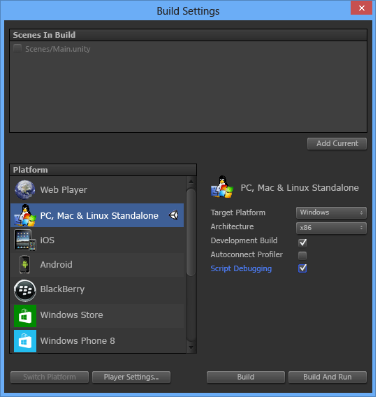

# Utilisation de Visual Studio Tools pour Unity
Dans cette section, vous allez apprendre à utiliser les fonctionnalités d’intégration et de productivité de Visual Studio Tools pour Unity, ainsi qu’à utiliser le débogueur Visual Studio pour le développement Unity.  
  
## Intégration et productivité d'Unity  
 Visual Studio Tools pour Unity s'intègre à l'éditeur Unity pour vous aider à être plus productif. Ces fonctionnalités d'amélioration de la productivité automatisent les tâches de script courantes et importent les informations Unity dans Visual Studio afin que vous ne soyez pas obligé de basculer sur l'éditeur Unity pour y accéder.  
  
### Accès à la documentation Unity  
 Vous pouvez accéder rapidement à la documentation sur les scripts Unity à partir de Visual Studio. Si Visual Studio Tools pour Unity ne trouve pas la documentation de l'API en local, il la recherche en ligne.  
  
##### Pour accéder à la documentation Unity  
  
-   Dans Visual Studio, placez le curseur sur l’API Unity pour laquelle vous souhaitez obtenir des informations ou sélectionnez-la, puis appuyez sur **Ctrl+Alt+M, Ctrl+H**.  
  
### Assistant de script MonoBehavior d'Unity  
 Dans Unity, la plupart des scripts sont implémentés en dérivant de la classe MonoBehavior et par substitution de certaines de ses méthodes. Vous pouvez utiliser l'Assistant MonoBehavior pour créer rapidement des définitions vides des méthodes MonoBehavior que vous souhaitez surcharger. À l'aide de cet Assistant, vous pouvez spécifier une ou plusieurs méthodes que vous voulez surcharger à partir de la liste des méthodes disponibles, choisir où elles vont être insérées dans le code et décider s'il faut inclure des commentaires sur leur utilisation.  
  
 ![La boîte de dialogue de l’Assistant Monobehavior.] (~/docs/cross-platform/media/vstu_monobehavior_wizard_full.png "vstu_monobehavior_wizard_full")  
  
##### Pour créer des définitions de méthode MonoBehavior vides à l'aide de l'Assistant MonoBehavior  
  
1.  Dans Visual Studio, placez le curseur à l’endroit où vous souhaitez insérer les méthodes, puis appuyez sur **Ctrl+Maj+M** pour lancer l’Assistant MonoBehavior. Si vous voulez insérer les nouvelles méthodes après une méthode déjà implémentée, vous pouvez le spécifier ultérieurement ; appuyez simplement sur **Ctrl+Maj+M**.  
  
2.  Sélectionnez les méthodes que vous souhaitez surcharger. Dans la fenêtre **Créer des méthodes de script**, sous **Sélectionner des méthodes à créer**, cochez la case en regard du nom de chaque méthode que vous voulez surcharger.  
  
3.  Vérifiez que la version du .NET Framework affichée dans la liste déroulante **Version du Framework** correspond à celle que vous utilisez. Dans le cas contraire, remplacez la valeur de la liste déroulante par la version que vous souhaitez utiliser.  
  
4.  Choisissez à quel endroit les méthodes vont être insérées. Par défaut, les méthodes sont insérées à l'emplacement du curseur. Si vous souhaitez les insérer ailleurs, vous pouvez choisir de le faire après une méthode déjà implémentée dans votre classe. Pour choisir un de ces emplacements, remplacez la valeur de la liste déroulante **Point d’insertion** par l’emplacement de votre choix.  
  
5.  Si vous voulez que l’Assistant génère des commentaires pour les méthodes que vous avez sélectionnées, cochez la case **Générer des commentaires de méthode**. Ces commentaires ont pour but de vous aider à comprendre à quel moment la méthode est appelée et quelles sont ses responsabilités générales.  
  
6.  Cliquez sur le bouton **OK** pour quitter l’Assistant et insérer les méthodes dans votre code.  
  
 L'Assistant MonoBehavior est particulièrement utile pendant votre apprentissage de l'API Unity, ou lorsque vous devez surcharger une méthode dont vous n'êtes pas familier. Lorsque vous serez plus expérimenté avec l'API Unity, vous préférerez probablement l'Assistant MonoBehavior rapide pour créer rapidement des méthodes que vous connaissez déjà.  
  
#### Assistant de script MonoBehavior rapide  
 Lorsque vous êtes déjà familiarisé avec l'API Unity, vous pouvez implémenter les méthodes surchargées encore plus rapidement à l'aide de l'Assistant MonoBehavior rapide. À l'aide de cet Assistant, vous ne pouvez spécifier qu'une seule méthode qui soit insérée sans commentaires de méthode à l'emplacement du curseur.  
  
 ![La boîte de dialogue de l’Assistant Monobehavior rapide.] (~/docs/cross-platform/media/vstu_monobehavior_wizard_quick.png "vstu_monobehavior_wizard_full")  
  
###### Pour créer une définition de méthode MonoBehavior vide à l'aide de l'Assistant MonoBehavior rapide  
  
1.  Dans Visual Studio, placez le curseur à l’endroit où vous voulez insérer les méthodes, puis appuyez sur **Ctrl+Maj+M** pour lancer l’Assistant MonoBehavior rapide. Contrairement à l'autre Assistant MonoBehavior, vous devez positionner le curseur à l'endroit de votre choix lorsque vous utilisez cet Assistant, car c'est toujours là que la nouvelle méthode est insérée.  
  
2.  Vérifiez que la version du Framework affichée dans le coin supérieur droit de la fenêtre **Créer une méthode de script** correspond à la version que vous utilisez. Dans le cas contraire, remplacez la valeur de la liste déroulante par la version que vous souhaitez utiliser.  
  
3.  Recherchez la méthode que vous souhaitez surcharger. Dans la fenêtre Créer une méthode de script, commencez par taper le nom de la méthode dans la zone de texte. La liste des méthodes dont les noms correspondent à ceux que vous avez entrés s'affiche.  
  
4.  Sélectionnez la méthode que vous souhaitez surcharger. Quand la méthode voulue apparaît dans la liste, sélectionnez-la avec la souris ou les touches fléchées, puis appuyez sur **Entrée**. Si c’est la seule méthode de la liste, appuyez simplement sur **Entrée**. La méthode vient s'insérer dans votre code.  
  
### Explorateur de projets de Unity  
 Vous pouvez utiliser l'Explorateur de projets Unity pour parcourir votre projet Unity à l'intérieur de Visual Studio.  
  
   
  
##### Pour afficher l'Explorateur de projets Unity  
  
-   Dans Visual Studio, dans le menu principal, choisissez **Affichage**, **Explorateur de projets Unity**. Clavier : **Alt+Maj+E**  
  
       
  
 L’Explorateur de projets Unity affiche l’ensemble de vos répertoires et fichiers projet Unity de la même façon que l’éditeur Unity : il en va différemment de la navigation dans vos scripts Unity avec l’Explorateur de solutions, qui ne contient que vos fichiers script et les affiche, car les projets et solutions générés par Visual Studio Tools pour Unity les organise. En particulier dans les projets volumineux, il est souvent plus facile de localiser le script que vous souhaitez modifier à l'aide de l'Explorateur de projets Unity. Il est alors également aisé de modifier d'autres types de fichiers, comme les fichiers de configuration texte, dans Visual Studio sans les ajouter à l'un des projets de la solution Visual Studio.  
  
### Liste d'erreurs Unity  
 Vous pouvez afficher les messages à partir de la console Unity à l'intérieur de Visual Studio lorsqu'il est connecté à une instance Unity. Les erreurs et les avertissements Unity sont inclus. Les messages sont affichés dans la fenêtre **Liste d’erreurs** de Visual Studio ; les messages d’erreur Unity s’affichent sous l’onglet **Erreurs**, les messages d’avertissement sous l’onglet **Avertissements** et les autres messages, comme ceux envoyés à l’aide de l’API Unity Debug.Log, sous l’onglet **Messages**.  
  
 Pour que les messages soient visibles, votre projet Unity doit être [débogué dans un lecteur Unity](#debugging-your-project-in-a-unity-player) pour prendre en charge le débogage de script et pour importer le package Visual Studio Tools pour Unity adapté à votre version Visual Studio. De plus, Visual Studio doit être [connecté à Unity](#connecting-visual-studio-to-unity).  
  
 Si vous ne voulez pas voir les erreurs, avertissements et messages Unity dans la fenêtre **Liste d’erreurs** de Visual Studio, vous pouvez les désactiver dans le menu Configuration.  
  
### Raccourcis clavier  
 Vous pouvez accéder rapidement aux fonctionnalités des outils Unity pour Visual Studio à l'aide de leurs raccourcis clavier. Voici un résumé des raccourcis disponibles.  
  
|Commande|Raccourci|Nom de la commande du raccourci|  
|-------------|--------------|---------------------------|  
|Ouvrir l'Assistant MonoBehavior|**Ctrl+Maj+M**|**EditorContextMenus.CodeWindow.ImplementMonoBehaviours**|  
|Ouvrir l'Assistant MonoBehavior rapide|**Ctrl+Maj+Q**|**EditorContextMenus.CodeWindow.QuickMonoBehaviours**|  
|Ouvrir l'Explorateur de projets Unity|**Alt+Maj+E**|**View.UnityProjectExplorer**|  
|Accéder à la documentation Unity|**Ctrl+Alt+M, Ctrl+H**|**Help.UnityAPIReference**|  
|Attacher au débogueur Unity (lecteur ou éditeur)|***Pas de valeur par défaut***|**Debug.AttachUnityDebugger**|  
  
 Vous pouvez modifier les combinaisons de touches de raccourci si vous n'aimez pas la valeur par défaut. Pour plus d’informations sur la modification des combinaisons par défaut, consultez [Identification et personnalisation des raccourcis clavier dans Visual Studio](https://msdn.microsoft.com/en-us/library/5zwses53.aspx).  
  
## Débogage Unity  
 Visual Studio Tools pour Unity vous permet de déboguer les scripts de l'éditeur et de jeu de votre projet Unity à l'aide du puissant débogueur de Visual Studio.  
  
###   Connexion de Visual Studio à Unity  
 Visual Studio Tools pour Unity communique avec Unity via une connexion UDP. Cela signifie que vous pouvez vous connecter à une instance Unity s'exécutant localement ou sur votre réseau de la même façon. Vous pouvez vous connecter aux instances Unity visibles sur votre réseau à l’aide de la boîte de dialogue **Sélectionner l’instance Unity**.  
  
##### Pour ouvrir la boîte de dialogue Sélectionner l'instance Unity  
  
-   Dans Visual Studio, dans le menu principal, choisissez **Déboguer**, **Attacher le débogueur Unity**.  
  
       
  
-   *Autre possibilité :* dans Visual Studio, dans la barre d’état, cliquez sur l’icône de connexion dans le coin inférieur droit de Visual Studio.  
  
       
  
> [!TIP]
>  Si l'icône de connexion contient une coche, vous êtes déjà connecté à une instance Unity.  
  
 La boîte de dialogue **Sélectionner l’instance Unity** affiche des informations sur chaque instance Unity à laquelle vous pouvez vous connecter.  
  
   
  
 **Project**  
 Nom du projet Unity qui s'exécute dans cette instance Unity.  
  
 **Ordinateur**  
 Nom de l'ordinateur ou de l'appareil sur lequel cette instance Unity est en cours d'exécution.  
  
 **Type**  
 **Éditeur** si cette instance Unity est en cours d’exécution dans l’éditeur Unity ; **Lecteur** si cette instance Unity est un lecteur autonome.  
  
 **Port**  
 Numéro de port du socket UDP sur lequel communique sur cette instance Unity.  
  
> [!IMPORTANT]
>  Étant donné que Visual Studio Tools pour Unity et l'instance Unity communiquent via un socket réseau UDP, votre pare-feu peut l'interroger. Dans ce cas, vous devez autoriser la connexion de telle sorte que VSTU et Unity puissent communiquer.  
  
###   Débogage de votre projet dans un lecteur Unity  
 Vous pouvez connecter directement Visual Studio Tools pour Unity  à votre application Unity s'exécutant dans un lecteur autonome lorsque vous n'exécutez pas l'éditeur Unity ou pour déboguer des problèmes spécifiques à la plateforme.  
  
##### Pour activer le débogage de script dans un lecteur Unity  
  
-   Assurez-vous de créer une version de développement avec le débogage de script activé. Dans les paramètres de build de votre projet Unity, cochez les cases **Version de développement** et **Débogage de script**.  
  
   
  
 En outre, pour déboguer une application Unity en cours d’exécution dans le **Lecteur web Unity**, vous devez également la configurer pour qu’elle utilise le **Canal des versions de développement**.  
  
##### Pour configurer le canal des mises en production de développement dans le lecteur web Unity  
  
-   Dans le lecteur web Unity, dans le menu contextuel, choisissez **Canal des versions** et vérifiez que l’option **Développement** est activée.  
  
    > [!IMPORTANT]
    >  Dans Unity 4.2 et ultérieur, l’élément du menu contextuel **Canal des versions** est disponible dans le menu contextuel du lecteur web seulement quand vous appuyez sur la touche **Alt** tandis que le menu contextuel est ouvert. Si le lecteur web s’exécute sur Mac OS X, appuyez à la place sur la touche **Option**.  
  
 Enfin, assurez-vous que vous êtes connecté à l'instance Unity que vous souhaitez déboguer. Pour plus d’informations sur la procédure à suivre, consultez la section [Connexion de Visual Studio à Unity](#connecting-visual-studio-to-unity).  
  
### Débogage d'une DLL dans votre projet Unity  
 De nombreux développeurs Unity écrivent des composants de code en tant que DLL externes afin que les fonctionnalités qu'ils développent puissent être facilement partagées avec d'autres projets. Visual Studio Tools pour Unity facilite le débogage du code dans ces DLL, sans heurt avec tout autre code de votre projet Unity.  
  
> [!NOTE]
>  À ce stade, Visual Studio Tools pour Unity prend uniquement en charge les DLL managées. Il ne gère pas le débogage des DLL de code natif, telles que celles écrites en C++.  
  
 Notez que le scénario décrit ici suppose que vous disposiez du code source, autrement dit, que vous développiez ou réutilisez votre propre code tiers, ou que vous ayez le code source d'une bibliothèque tierce et que vous prévoyiez de le déployer dans votre projet Unity en tant que DLL. Ce scénario ne décrit pas le débogage d'une DLL pour laquelle vous n'avez pas le code source.  
  
##### Pour déboguer un projet DLL managée utilisé dans votre projet Unity  
  
1.  Ajoutez votre projet DLL existant à la solution Visual Studio générée par Visual Studio Tools pour Unity. Moins couramment, vous pouvez aussi démarrer un nouveau projet de DLL managée pour qu'il contienne les composants de code de votre projet Unity ; si tel est le cas, vous pouvez à la place ajouter un nouveau projet DLL managée à la solution Visual Studio. Pour plus d’informations sur l’ajout d’un projet nouveau ou existant à une solution, consultez [Comment : ajouter des projets à une solution](https://msdn.microsoft.com/en-us/library/vstudio/ff460187.aspx).  
  
       
  
     Dans les deux cas, Visual Studio Tools pour Unity conserve la référence de projet, même s'il doit régénérer les fichiers projet et solution ; par conséquent, vous ne devez effectuer ces étapes qu'une seule fois.  
  
2.  Référencez le bon profil du framework Unity dans le projet DLL. Dans Visual Studio, dans les propriétés du projet DLL, définissez la propriété **Framework cible** avec la version du Framework Unity que vous utilisez. Il s'agit de la bibliothèque des classes de base Unity qui correspond à la compatibilité d'API ciblée par votre projet, comme les bibliothèques de classes de base Unity complètes, micro ou web. De cette façon, votre DLL ne peut pas appeler les méthodes du framework qui existent dans d'autres frameworks ou niveaux de compatibilité, mais qui n'existent peut-être pas dans la version du framework Unity que vous utilisez.  
  
     ![Définissez Unity comme framework cible de la DLL.] (~/docs/cross-platform/media/vstu_debugging_dll_target_framework.png "vstu_debugging_dll_target_framework")  
  
3.  Copiez la DLL dans le dossier Composants de votre projet Unity. Dans Unity, les composants désignent les fichiers regroupés et déployés au même titre que votre application Unity afin de pouvoir être chargés au moment de l'exécution. Comme les DLL sont liées à l'exécution, elles doivent être déployées en tant que composants. Pour que la DLL soit déployée comme composant, l'éditeur Unity requiert que les DLL soient placées dans le dossier Composants de votre projet Unity. Il existe deux façons de procéder :  
  
    -   Modifier les paramètres de génération de votre projet DLL pour inclure une tâche post-génération qui copie les fichiers DLL et PDB résultants de son dossier de sortie vers le dossier **Composants** de votre projet Unity.  
  
    -   Modifier les paramètres de génération de votre projet DLL pour définir son dossier de sortie comme dossier **Composants** de votre projet Unity. Les fichiers DLL et PDB seront placés dans le dossier **Composants**.  
  
     Les fichiers PDB sont nécessaires pour le débogage, car ils contiennent les symboles de débogage de la DLL et mappent le code de la DLL sur la forme de son code source. Visual Studio Tools pour Unity utilise les informations à partir de la DLL et des fichiers PDB pour créer un fichier DLL.MDB, qui est le format des symboles de débogage utilisé par le moteur de script Unity.  
  
4.  Déboguez votre code. Vous pouvez maintenant déboguer le code source de votre DLL ainsi que le code source de votre projet Unity, et utiliser toutes les fonctionnalités de débogage auxquelles vous êtes habitué, telles que les points d'arrêt et le parcours du code pas à pas.
