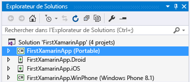
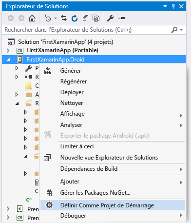
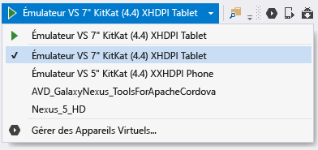
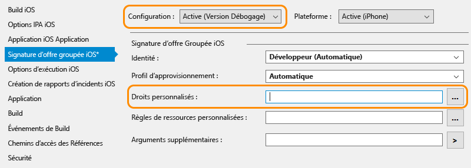

# Vérifier votre environnement Xamarin
À la fin de l’exécution des programmes d’installation (consultez [Configurer et installer](../cross-platform/setup-and-install.md)), passez quelques minutes à vérifier que tout est prêt pour expérimenter le développement Xamarin.  
  
 Une fois ces vérifications effectuées, vous pouvez effectuer l’une des procédures suivantes, ou les deux :  
  
-   [Principes fondamentaux de la création d’applications avec Xamarin.Forms dans Visual Studio](../cross-platform/learn-app-building-basics-with-xamarin-forms-in-visual-studio.md)  
  
-   [Générer des applications Xamarin avec une interface utilisateur native dans Visual Studio](../cross-platform/build-apps-with-native-ui-using-xamarin-in-visual-studio.md)  
  
## Toutes les plateformes  
 Tout d’abord, sélectionnez **Outils > Options**, développez **Xamarin > Autre**, puis cliquez sur le lien **Vérifier maintenant** pour les mises à jour. Vous devez utiliser Xamarin 4.0.3.214 ou une version ultérieure pour éviter les problèmes de licence précédents.  
  
 Créez ensuite une solution Xamarin dans Visual Studio via **Fichier > Nouveau projet** puis, dans la boîte de dialogue, développez **Modèles > Autres langages > Visual C# > Multiplateforme**, sélectionnez **Application vide (Portable native)**, puis cliquez sur OK. Ceci crée une solution avec un projet de bibliothèque de classes portable partagée et des projets individuels pour Android, iOS et Windows :  
  
   
  
> [!NOTE]
>  Si les modèles n'y figurent pas, consultez [Procédure à suivre si les modèles de projet Xamarin Essayez ceci](#missing) au bas de cette page.  
  
## Android  
  
1. Vérifiez que les derniers outils du kit Android SDK sont installés en accédant à **Outils > Android > Gestionnaire Android SDK** et en installant la dernière version des composants Outils Android SDK, Outils de plateforme Android SDK et Outils de build Android SDK. Notez qu’il n’est pas toujours nécessaire d’installer le dernier niveau d’API Android. L’API dont vous avez besoin dépend du niveau de plateforme que vous souhaitez cibler. En général, l’installation de Xamarin entraîne l’installation du niveau de plateforme nécessaire.  

2.  Vérifiez Android Designer : dans le projet Android, dans l’Explorateur de solutions, ouvrez le fichier **Ressources > Disposition > Main.axml**. (Si vous ne voyez pas ce fichier directement, effectuez une recherche dans l’Explorateur de solutions ; ce fichier existe uniquement dans le projet Android, pas dans le projet iOS.)  
  
    - Si vous recevez un message d’erreur vous informant que la version installée du kit Android SDK est trop ancienne, cliquez dans ce message sur **Ouvrir le kit Android SDK** pour sélectionner et installer les outils de la dernière version du kit SDK, comme indiqué à l’étape 1 ci-dessus. 
  
3.  Vérifiez la génération et le débogage dans l’émulateur (ou l’appareil) :  
  
    -   Cliquez avec le bouton droit sur le projet Android dans l’Explorateur de solutions et sélectionnez **Définir comme projet de démarrage**.  
  
           
  
    -   Sélectionnez un émulateur approprié pour votre version Android cible. Si un appareil de développement Android est attaché à votre ordinateur, il est également listé ici avec les émulateurs :  
  
        -   Windows 8+ : sélectionnez une cible **Émulateur Visual Studio** dans le menu déroulant de débogage de Visual Studio comme illustré ci-dessous, et démarrez le débogueur en appuyant sur **F5**. Pour plus d’informations, consultez [Introducing Visual Studio’s Emulator for Android](http://blogs.msdn.com/b/visualstudioalm/archive/2014/11/12/introducing-visual-studio-s-emulator-for-android.aspx) (blog ALM Visual Studio). Si vous avez des difficultés à faire fonctionner l’émulateur, consultez [Troubleshooting the Visual Studio Emulator for Android](../cross-platform/troubleshooting-the-visual-studio-emulator-for-android.md). Vous pouvez aussi créer des profils d’appareil pour l’émulateur en sélectionnant **Outils > Émulateur Visual Studio pour Android**.  
  
               
  
             Remarque : Si vous ne voyez pas l’option de menu **Outils > Émulateur Visual Studio pour Android**, cela peut signifier que l’émulateur n’est pas installé. Accédez à **Panneau de configuration > Programmes et fonctionnalités**, sélectionnez **Microsoft Visual Studio**, puis cliquez sur **Modifier** pour réexécuter le programme d’installation. Dans le programme d’installation, cliquez sur **Modifier**, cochez la case correspondant à **Développement multiplateforme pour appareils mobiles > Émulateur Microsoft Visual Studio pour Android**, puis cliquez sur **Mettre à jour**.  
  
        -   Pour Windows 7 et antérieur : sélectionnez à la place Xamarin Player pour Android dans la liste déroulante et appuyez sur F5 pour exécuter. Pour plus d’informations sur le lecteur Xamarin Player, son gestionnaire d’appareils et son dépannage, consultez [Xamarin Android Player](http://developer.xamarin.com/guides/android/getting_started/installation/android-player/) (xamarin.com).  
  
> [!NOTE]
>  Dans Visual Studio, vous pouvez remarquer la présence du bouton Gestionnaire d'émulateur Android (AVD) dans la barre d’outils (illustrée ci-dessous). Ce bouton permet d’ouvrir le Gestionnaire d’appareils qui s’utilise en particulier pour configurer l’émulateur Android de Google.  Cela n’a aucun impact sur l’émulateur Visual Studio pour Android ou le lecteur Xamarin Player, chacun utilisant son propre gestionnaire d’appareils pour configurer des profils.  Pour plus d’informations, consultez [Introducing Visual Studio’s Emulator for Android](http://blogs.msdn.com/b/visualstudioalm/archive/2014/11/12/introducing-visual-studio-s-emulator-for-android.aspx) (blog ALM Visual Studio) et [Xamarin Android Player](http://developer.xamarin.com/guides/android/getting_started/installation/android-player/) (xamarin.com).  
>   
  
## Windows Phone  
  
1.  Vérifiez le concepteur Windows Phone : dans le projet Windows Phone, dans l’Explorateur de solutions, ouvrez le fichier **MainPage.xaml** .  
  
2.  Vérifiez la création et le débogage dans l’émulateur ou sur un appareil (remarque : pour cette étape, vous devez avoir installé l’émulateur Windows Phone via le programme d’installation de Visual Studio, ou disposer d’un appareil attaché) :  
  
    -   Cliquez avec le bouton droit sur le projet Windows Phone dans l’Explorateur de solutions et sélectionnez **Définir comme projet de démarrage**.  
  
    -   Sélectionnez une cible **Émulateur 8.1** ou un appareil attaché dans le menu déroulant du débogage de Visual Studio comme illustré ci-dessous, et démarrez le débogueur en appuyant sur F5.  
  
           
  
    -   Si vous avez des difficultés à faire fonctionner l’émulateur, consultez [Dépannage de l’émulateur Windows Phone 8](/previous-versions/windows/apps/jj681694\(v%3dvs.105\)).  
  
## iOS  
  
1.  Assurez-vous que votre Mac est disponible sur le réseau et apparié à Visual Studio, comme décrit dans [Connecting to the Mac](http://developer.xamarin.com/guides/ios/getting_started/installation/windows/xamarin-mac-agent/) (xamarin.com).  
  
2.  Vérifiez le concepteur de plan conceptuel : dans le projet iOS, dans l’Explorateur de solutions, ouvrez le fichier **Main.storyboard** . Ici, Visual Studio héberge le concepteur qui s’exécute à distance sur le Mac.  
  
3.  Vérifiez la génération et le débogage :  
  
    1.  Cliquez avec le bouton droit sur le projet iOS dans l’Explorateur de solutions et sélectionnez **Définir comme projet de démarrage**.  
  
    2.  Sélectionnez la cible **iPhoneSimulator** dans la liste déroulante des builds de Visual Studio, comme illustré ci-dessous, ou la cible **iPhone** si vous utilisez un appareil attaché. Si aucun simulateur ne figure dans la liste, lancez Xcode sur votre Mac, sélectionnez **Xcode->Préférences**, puis cliquez sur **Télécharger**. Sous **Components** , vous devez voir les versions de simulateur qui sont disponibles en téléchargement. Vous trouverez des instructions supplémentaires pour le débogage dans la page [Debugging](https://developer.xamarin.com/guides/ios/deployment,_testing,_and_metrics/debugging_in_xamarin_ios/#Debugging_on_the_Simulator) de Xamarin (xamarin.com).  
  
           
  
    3.  Sélectionnez une cible iPhone dans le menu déroulant du débogage de Visual Studio comme illustré ci-dessous, puis démarrez le débogueur en appuyant sur F5. Ceci lance le simulateur sur le Mac, où vous allez interagir avec l’application, alors que le débogage se fait dans Visual Studio. Si vous avez un iPhone ou iPad physique connecté au Mac, il apparaît ici. Vous pouvez le sélectionner à la place. Si aucun appareil ou simulateur ne figure dans la liste, vérifiez la connexion au Mac en consultant la rubrique liée à l’étape 1 ci-dessus, ou en accédant à **Outils** >**iOS** >**Xamarin Mac Agent**  
  
           
  
    4.  Si vous rencontrez des problèmes pour vous connecter au Mac, consultez [Connection Troubleshooting](http://developer.xamarin.com/guides/ios/getting_started/installation/windows/xamarin-mac-agent/xma-troubleshooting/) (xamarin.com).  
  
    5.  Si vous recevez un message d’erreur indiquant qu’aucun profil de configuration installé ne correspond aux clés de signature iOS installées, procédez comme suit :  
  
        -   Vérifiez que votre compte ID Apple est ajouté à Xcode sur votre Mac, comme décrit dans [Adding Your Account to Xcode](https://developer.apple.com/library/content/documentation/IDEs/Conceptual/AppStoreDistributionTutorial/AddingYourAccounttoXcode/AddingYourAccounttoXcode.html#//apple_ref/doc/uid/TP40013839-CH40-SW1) (apple.com).  Si vous ajoutez votre compte, redémarrez ensuite Visual Studio et Xcode.  
  
               
  
        -   Vérifiez que, dans les propriétés de votre projet iOS, sous l’onglet Signature d’ensemble d’applications iOS, le champ Droits personnalisés est vide pour la configuration Debug activée.  Remarque : Vous pouvez essayer de supprimer ce paramètre uniquement si vous avez rencontré le message d’erreur ci-dessus.  
  
##   Procédure à suivre si les modèles de projet Xamarin sont manquants  
 Il peut manquer certains modèles si vous installez Xamarin directement depuis le site web de Xamarin, et si Visual Studio 2013 et Visual Studio 2015 sont installés côte à côte. C’est cependant facile à résoudre : activez simplement la fonctionnalité **Xamarin for Visual Studio 2015** dans le programme d’installation de Xamarin.  
  
1.  Dans le Panneau de configuration, ouvrez **Programmes et fonctionnalités**, sélectionnez l’élément **Xamarin** et cliquez sur **Modifier**.  
  
2.  Dans l’Assistant Installation pour Xamarin qui s’affiche, cliquez sur **Suivant** , puis sur **Modifier**.  
  
3.  Dans la liste des fonctionnalités facultatives à installer, développez **Xamarin for Visual Studio 2015**, choisissez **will be installed on local drive**, puis cliquez sur **Suivant** pour procéder à l’ajout de la fonctionnalité.