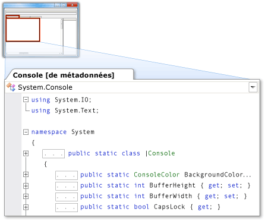

# M&#233;tadonn&#233;es en tant que source
[!INCLUDE[vs2017banner](../code-quality/includes/vs2017banner.md)]

Métadonnées en tant que source vous permet d’afficher les métadonnées qui apparaissent sous forme de code source C\# dans une mémoire tampon en lecture seule. Ceci active une vue des déclarations des types et des membres \(sans les implémentations\). Vous pouvez afficher des métadonnées en tant que source en exécutant la commande **Atteindre la définition** pour les types ou les membres dont le code source n’est pas disponible à partir de votre projet ou de votre solution.  
  
> [!NOTE]
>  Quand vous essayez d’exécuter la commande **Atteindre la définition** pour des types ou des membres marqués comme internes, l’environnement de développement intégré \(IDE\) n’affiche pas leurs métadonnées en tant que source, que l’assembly de référence soit ou non un assembly Friend.  
  
 Vous pouvez afficher des métadonnées en tant que source dans l’éditeur de code ou dans la fenêtre **Définition de code**.  
  
## Affichage des métadonnées en tant que source dans l’éditeur de code  
 Quand vous exécutez la commande **Atteindre la définition** pour un élément dont le code source n’est pas disponible, un document à onglets qui contient une vue des métadonnées de cet élément affichées en tant que source apparaissent dans l’éditeur de code. Le nom du type, suivi de **\[à partir des métadonnées\]**, apparaît sur l’onglet du document.  
  
 Par exemple, si vous exécutez la commande **Atteindre la définition** pour <xref:System.Console>, les métadonnées de <xref:System.Console> apparaissent dans l’éditeur de code en tant que code source C\# qui ressemble à sa déclaration, mais sans implémentation.  
  
   
  
## Affichage des métadonnées en tant que source dans la fenêtre Définition de code  
 Quand la fenêtre **Définition de code** est active ou visible, l’IDE exécute automatiquement la commande **Atteindre la définition** pour les éléments qui se trouvent sous le curseur dans l’éditeur de code et pour les éléments qui sont sélectionnés dans l’**Affichage de classes** ou dans l’**Explorateur d’objets**. Si le code source n’est pas disponible pour cet élément, l’IDE affiche les métadonnées de l’élément en tant que source dans la fenêtre **Définition de code**.  
  
 Par exemple, si vous placez votre curseur à l’intérieur du mot <xref:System.Console> dans l’éditeur de code, les métadonnées pour <xref:System.Console> apparaissent en tant que source dans la fenêtre **Définition de code**. La source ressemble à la déclaration de <xref:System.Console>, mais sans implémentation.  
  
 Si vous voulez consulter la déclaration d’un élément qui apparaît dans la fenêtre **Définition de code**, cliquez sur l’élément, puis cliquez sur **Atteindre la définition**.