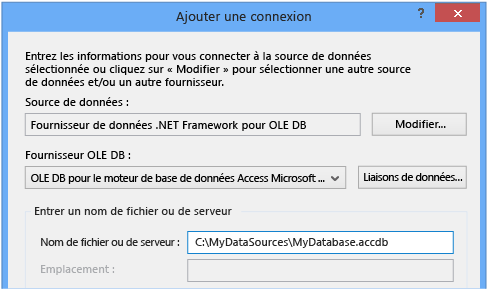
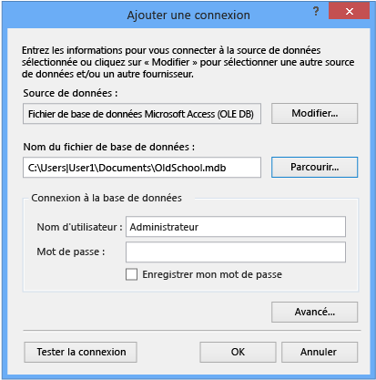

# Se connecter à des données dans une base de données Access (Windows Forms)
Vous pouvez vous connecter à une base de données Access (un fichier .mdf ou un fichier .accdb) à l’aide de Visual Studio. Après avoir défini la connexion, les données apparaissent dans le **des Sources de données** fenêtre. De là, vous pouvez faire glisser des tables ou des vues sur vos formulaires.

## Prérequis
 Pour utiliser ces procédures, vous avez besoin d’un projet d’application Windows Forms et une base de données Access (fichier .accdb) ou une base de données Access 2000-2003 (fichier .mdb). Suivez la procédure qui correspond à votre type de fichier.

## Création du dataset pour un fichier .accdb
 Vous pouvez vous connecter aux bases de données créées par Access 2013, Office 365, Access 2010 ou Access 2007 à l’aide de la procédure suivante.

#### Pour créer le groupe de données

1.  Ouvrez l’application Windows Forms à laquelle vous souhaitez vous connecter des données.

2.  Sur le **vue** menu, sélectionnez **autres fenêtres** > **des Sources de données**.

     

3.  Dans la fenêtre **Sources de données** , cliquez sur **Ajouter une nouvelle source de données**.

     Le **Assistant de Configuration de Source de données** s’ouvre.

4.  Sélectionnez **base de données** sur la **choisir un Type de Source de données** page, puis sélectionnez **suivant**.

5.  Sélectionnez **Dataset** sur la **choisir un modèle de base de données** page, puis sélectionnez **suivant**.

6.  Sur le **choisir votre connexion de données** page, sélectionnez **nouvelle connexion** pour configurer une connexion de données.

     Le **ajouter une connexion** boîte de dialogue s’ouvre.

7.  Sélectionnez le **modification** situé en regard du **source de données** zone de texte.

     Le **modifier la Source de données** boîte de dialogue s’ouvre.

8.  Dans la liste des sources de données, choisissez  **\<autres\>**. Dans le **fournisseur de données** liste déroulante, sélectionnez **fournisseur de données .NET Framework pour OLE DB**, puis choisissez **OK**.

9. Dans le **ajouter une connexion** boîte de dialogue, sélectionnez **Microsoft Office 12.0 accès de base de données du moteur fournisseur OLE DB** à partir de la **fournisseur OLE DB** liste déroulante.

     

     > [!NOTE]
     >  Si vous ne voyez pas **Microsoft Office 12.0 accès de base de données du moteur fournisseur OLE DB** dans la liste déroulante du fournisseur OLE DB, vous devez installer le [pilote Office System 2007 : composants de connectivité de données](https://www.microsoft.com/download/confirmation.aspx?id=23734).

9. Dans le **serveur ou nom de fichier** zone de texte, spécifiez le chemin d’accès et de fichier nom du fichier .accdb que vous souhaitez vous connecter, puis sélectionnez **OK**. (Si le fichier de base de données a un nom d’utilisateur et un mot de passe, indiquez-les avant de sélectionner **OK**.)

10. Sélectionnez **suivant** sur la **choisir votre connexion de données** page.

     Vous pouvez obtenir une boîte de dialogue qui vous indique que le fichier de données n’est pas dans votre projet actuel. Sélectionnez **Oui** ou **Non**.

11. Sélectionnez **suivant** sur la **enregistrer la chaîne de connexion dans le fichier de Configuration de l’Application** page.

12. Développez le **Tables** nœud sur le **choisir vos objets de base de données** page.

13. Sélectionnez les tables ou les vues vous souhaitez dans votre jeu de données, puis sélectionnez **Terminer**.

     Le jeu de données est ajouté à votre projet et les tables et vues s’affichent dans le **des Sources de données** fenêtre.

## Création du dataset pour un fichier .mdb
 Vous créez le jeu de données en exécutant la **Assistant de Configuration de Source de données**.

#### Pour créer le groupe de données

1.  Ouvrez l’application Windows Forms à laquelle vous souhaitez vous connecter des données.

2.  Sur le **vue** menu, sélectionnez **autres fenêtres** > **des Sources de données**.

     

3.  Dans la fenêtre **Sources de données** , cliquez sur **Ajouter une nouvelle source de données**.

     Le **Assistant de Configuration de Source de données** s’ouvre.

4.  Sélectionnez **base de données** sur la **choisir un Type de Source de données** page, puis sélectionnez **suivant**.

5.  Sélectionnez **Dataset** sur la **choisir un modèle de base de données** page, puis sélectionnez **suivant**.

6.  Sur le **choisir votre connexion de données** page, sélectionnez **nouvelle connexion** pour configurer une connexion de données.

7.  Si la source de données n’est pas **du fichier de base de données Microsoft Access (OLE DB)**, sélectionnez **modification** pour ouvrir le **modifier la Source de données** boîte de dialogue et sélectionnez **Microsoft Accès au fichier de base de données**, puis sélectionnez **OK**.

8.  Dans le **nom de fichier de base de données**, spécifiez le chemin d’accès et le nom du fichier .mdb que vous souhaitez vous connecter à, puis sélectionnez **OK**.

     

9. Sélectionnez **suivant** sur la **choisir votre connexion de données** page.

10. Sélectionnez **suivant** sur la **enregistrer la chaîne de connexion dans le fichier de Configuration de l’Application** page.

11. Développez le **Tables** nœud sur le **choisir vos objets de base de données** page.

12. Sélectionnez les tables ou les vues vous souhaitez dans votre jeu de données, puis sélectionnez **Terminer**.

     Le jeu de données est ajouté à votre projet et les tables et vues s’affichent dans le **des Sources de données** fenêtre.

## Sécurité
 Le stockage d'informations sensibles (telles qu'un mot de passe) peut affecter la sécurité de votre application. L'utilisation de l'authentification Windows (également appelée sécurité intégrée) offre un moyen plus sûr de contrôler l'accès à une base de données. Pour plus d’informations, consultez [Protection des informations de connexion](/dotnet/framework/data/adonet/protecting-connection-information).

## Étapes suivantes
 Le jeu de données que vous venez de créer est maintenant disponible dans le **des Sources de données** fenêtre. Vous pouvez désormais effectuer les tâches suivantes :

-   Sélectionnez des éléments dans le **des Sources de données** fenêtre et faites-les glisser vers votre formulaire (consultez [des contrôles de lier des Windows Forms à des données dans Visual Studio](../data-tools/bind-windows-forms-controls-to-data-in-visual-studio.md)).

-   Ouvrez la source de données dans le **Concepteur de Dataset** pour ajouter ou modifier les objets qui composent le jeu de données.

-   Ajouter une logique de validation pour le <xref:System.Data.DataTable.ColumnChanging> ou <xref:System.Data.DataTable.RowChanging> événement les tables de données dans le jeu de données (voir [valider des données dans les jeux de données](../data-tools/validate-data-in-datasets.md)).

## Voir aussi

- [Ajouter des connexions](../data-tools/add-new-connections.md)