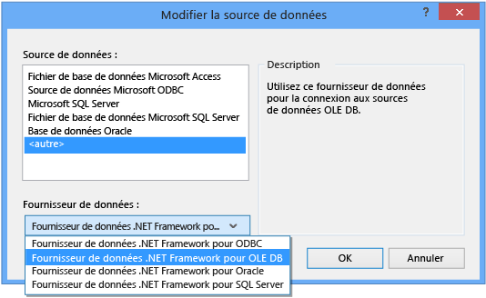

# Proc&#233;dure pas &#224; pas&#160;: connexion &#224; des donn&#233;es dans une base de donn&#233;es Access (Windows Forms)
Vous pouvez vous connecter à une base de données Access \(un fichier .mdf ou un fichier de .accdb\) à l'aide de Visual Studio.  Après avoir défini la connexion, les données s'affichent dans la **fenêtre Sources de données**.  De là, vous pouvez faire glisser des tables ou des vues sur vos formulaires.  Si vous souhaitez savoir comment le système de projet dans Visual Studio gère ces bases de données locales, consultez [Comment : gérer des fichiers de données locaux dans votre projet](../data-tools/how-to-manage-local-data-files-in-your-project.md).  
  
## Composants requis  
 Pour utiliser ces procédures, vous avez besoin d'un projet d'application Windows Forms, et d'une base de données Access \(.accdb\) ou d'une base de données Access 2000\-2003 \(.mdb\).  Suivez la procédure qui correspond à votre type de fichier.  
  
## Créer le jeu de données pour un fichier .accdb  
 Vous pouvez vous connecter aux bases de données créées avec Access 2013, Office 365, Access 2010 ou Access 2007 à l'aide de la procédure suivante.  
  
#### Pour créer le groupe de données  
  
1.  Ouvrez l'application Windows Forms à laquelle vous voulez connecter des données.  
  
2.  Dans le menu **Afficher**, choisissez **Autres fenêtres** \> **Sources de données**.  
  
       
  
3.  Dans la fenêtre **Sources de données**, cliquez sur **Ajouter une nouvelle source de données**.  
  
       
  
4.  Sélectionnez **Base de données** dans la page **Choisir un type de source de données** puis choisissez **Suivant**.  
  
5.  Choisissez **DataSet** dans la page **Choisir un modèle de base de données**, puis choisissez **Suivant**.  
  
6.  Sur la page **Choisir votre connexion de données**, sélectionnez **Nouvelle connexion** pour configurer une nouvelle connexion de données.  
  
7.  Remplacez **Source de données** par **Fournisseur de données .NET Framework pour OLE DB**.  
  
       
  
    > [!IMPORTANT]
    >  Si une source de données **Fichier de base de données Microsoft Access \(OLE DB\)** peut sembler être le bon choix, vous utilisez le type de source de données uniquement pour fichiers de base de données .mdb.  
  
8.  Dans **Fournisseur OLE DB**, choisissez **Fournisseur OLE DB pour le moteur de base de données Microsoft Office Access 12.0**.  
  
       
  
9. Dans **Nom de fichier ou de serveur**, spécifiez le chemin d'accès et le nom du fichier .accdb auquel vous souhaitez vous connecter puis choisissez **OK**.  
  
    > [!NOTE]
    >  Si la base de données a un nom d'utilisateur et un mot de passe, indiquez\-les avant de choisir **OK**.  
  
10. Choisissez **Suivant** dans la page **Choisir votre connexion de données**.  
  
11. Choisissez sur **Suivant** dans la page **Enregistrer la chaîne de connexion dans le fichier de configuration de l'application**.  
  
12. Développez le nœud **Tables** dans la page **Choisir vos objets de base de données**.  
  
13. Choisissez n'importe quelles tables ou vues de votre choix dans votre jeu de données, puis choisissez **Terminer**.  
  
     Le jeu de données est ajouté à votre projet et les tables et vue s'affichent dans la fenêtre **Sources de données**.  
  
## Créer le jeu de données pour un fichier .mdb  
 Pour créer le groupe de données, exécutez l'**Assistant Configuration de source de données**.  
  
#### Pour créer le groupe de données  
  
1.  Ouvrez l'application Windows Forms à laquelle vous voulez connecter des données.  
  
2.  Dans le menu **Afficher**, choisissez **Autres fenêtres** \> **Sources de données**.  
  
       
  
3.  Dans la fenêtre **Sources de données**, cliquez sur **Ajouter une nouvelle source de données**.  
  
       
  
4.  Sélectionnez **Base de données** dans la page **Choisir un type de source de données** puis choisissez **Suivant**.  
  
5.  Choisissez **DataSet** dans la page **Choisir un modèle de base de données**, puis choisissez **Suivant**.  
  
6.  Sur la page **Choisir votre connexion de données**, sélectionnez **Nouvelle connexion** pour configurer une nouvelle connexion de données.  
  
7.  Si la **Source de données** n'est pas **Microsoft Access Database File \(OLE DB\)**, choisissez **Modifier** pour ouvrir la boîte de dialogue **Modifier la source de données**, choisissez **Fichier de base de données Microsoft Access**, puis **OK**.  
  
8.  Dans **Nom du fichier de base de données**, spécifiez le chemin d'accès et le nom du fichier .mdb auquel vous souhaitez vous connecter puis choisissez **OK**.  
  
       
  
9. Choisissez **Suivant** dans la page **Choisir votre connexion de données**.  
  
10. Choisissez sur **Suivant** dans la page **Enregistrer la chaîne de connexion dans le fichier de configuration de l'application**.  
  
11. Développez le nœud **Tables** dans la page **Choisir vos objets de base de données**.  
  
12. Choisissez n'importe quelles tables ou vues de votre choix dans votre jeu de données, puis choisissez **Terminer**.  
  
     Le jeu de données est ajouté à votre projet et les tables et vue s'affichent dans la fenêtre **Sources de données**.  
  
## Sécurité  
 Le stockage d'informations sensibles \(telles qu'un mot de passe\) peut affecter la sécurité de votre application.  L'utilisation de l'authentification Windows \(également appelée sécurité intégrée\) offre un moyen plus sûr de contrôler l'accès à une base de données.  Pour plus d'informations, consultez [Protection des informations de connexion](../Topic/Protecting%20Connection%20Information.md).  
  
## Étapes suivantes  
 Le groupe de données que vous venez de créer est maintenant disponible dans la fenêtre **Sources de données**.  Vous pouvez à présent effectuer l'une des tâches suivantes  
  
-   Sélectionnez des éléments dans la fenêtre **Sources de données** et faites\-les glisser jusqu'à votre formulaire \(voir [Liaison de contrôles Windows Forms à des données dans Visual Studio](../data-tools/bind-windows-forms-controls-to-data-in-visual-studio.md)\).  
  
-   Ouvrez la source de données dans le [Concepteur de DataSet](../data-tools/creating-and-editing-typed-datasets.md) pour ajouter ou modifier les objets qui composent le groupe de données.  
  
-   Ajoutez une logique de validation à l'événement <xref:System.Data.DataTable.ColumnChanging> ou <xref:System.Data.DataTable.RowChanging> des tables de données dans le jeu de données \(voir [Validation de données dans des groupes de données](../data-tools/validate-data-in-datasets.md)\).  
  
## Voir aussi  
 [Connexion aux données dans Visual Studio](../data-tools/connecting-to-data-in-visual-studio.md)   
 [Préparation de votre application pour recevoir des données](../Topic/Preparing%20Your%20Application%20to%20Receive%20Data.md)   
 [Extraction de données dans votre application](../data-tools/fetching-data-into-your-application.md)   
 [Liaison de contrôles à des données dans Visual Studio](../data-tools/bind-controls-to-data-in-visual-studio.md)   
 [Modification des données dans votre application](../data-tools/editing-data-in-your-application.md)   
 [Validation des données](../Topic/Validating%20Data.md)   
 [Enregistrement des données](../data-tools/saving-data.md)   
 [Procédures pas à pas relatives aux données](../Topic/Data%20Walkthroughs.md)