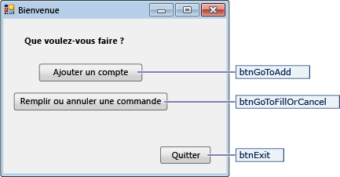
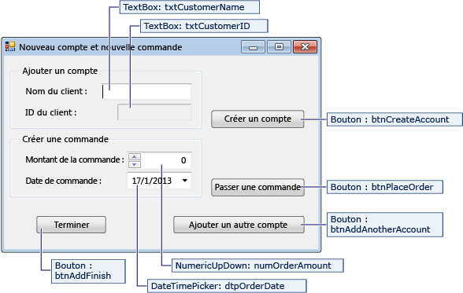

# <a name="create-a-simple-data-application-by-using-adonet"></a>Créer une application de données simple à l’aide d’ADO.NET

Quand vous créez une application qui manipule les données d’une base de données, vous effectuez des tâches élémentaires, comme définir les chaînes de connexion, insérer les données et exécuter les procédures stockées. En suivant cette rubrique, vous pouvez découvrir comment interagir avec une base de données à partir d’une application de « formulaires de données » de Windows Forms simple à l’aide de Visual c# ou Visual Basic et ADO.NET.  Toutes les technologies de données .NET, y compris les datasets, LINQ to SQL et Entity Framework — finalement les étapes qui sont très similaires à celles présentées dans cet article.

Cet article montre un moyen simple d’obtenir des données en dehors d’une base de données de manière rapide. Si votre application a besoin de modifier les données de manières non triviale et mettre à jour de la base de données, vous devez envisager l’utilisation de Entity Framework et à l’aide de la liaison de données à synchroniser automatiquement les contrôles d’interface utilisateur pour les modifications dans les données sous-jacentes.

> [!IMPORTANT]
> Pour que le code reste simple, il n’inclut pas la gestion des exceptions prête à la production.

## <a name="prerequisites"></a>Prérequis

Pour créer l'application, vous aurez besoin des éléments suivants :

- Visual Studio.

- SQL Server Express LocalDB. Si vous n’avez pas SQL Server Express LocalDB, vous pouvez l’installer à partir de la [page de téléchargement de SQL Server Express](https://www.microsoft.com/sql-server/sql-server-editions-express).

Cette rubrique suppose que vous êtes familiarisé avec les fonctionnalités de base de l’IDE Visual Studio et pourrez créer une application Windows Forms, ajouter des formulaires pour le projet, placer des boutons et autres contrôles sur les formulaires, définir les propriétés des contrôles et coder des événements simples. Si vous n’êtes pas familiarisé avec ces tâches, nous vous suggérons d’effectuer la [mise en route avec Visual c# et Visual Basic](../ide/quickstart-visual-basic-console.md) rubrique avant de commencer cette procédure pas à pas.

## <a name="set-up-the-sample-database"></a>Installer l'exemple de base de données

Créer la base de données en suivant ces étapes :

1. Dans Visual Studio, ouvrez le **Explorateur de serveurs** fenêtre.

2. Avec le bouton droit sur **des connexions de données** et choisissez **créer une nouvelle base de données SQL Server**.

3. Dans le **nom du serveur** texte, entrez **(localdb) \mssqllocaldb**.

4. Dans le **nouveau nom de base de données** texte, entrez **Sales**, puis choisissez **OK**.

     Vide **Sales** base de données est créé et ajouté au nœud Connexions de données dans l’Explorateur de serveurs.

5. Avec le bouton droit sur le **Sales** connexion de données, puis sélectionnez **nouvelle requête**.

     Une fenêtre d’éditeur de requête s’ouvre.

6. Copie le [script Transact-SQL de ventes](https://github.com/MicrosoftDocs/visualstudio-docs/raw/master/docs/data-tools/samples/sales.sql) dans votre Presse-papiers.

7. Collez le script T-SQL dans l’éditeur de requête, puis choisissez le **Execute** bouton.

     Après une courte période, la requête est terminée en cours d’exécution et les objets de base de données sont créés. La base de données contient deux tables : Client et les commandes. Ces tables contiennent pas de données initialement, mais vous pouvez ajouter des données lorsque vous exécutez l’application que vous allez créer. La base de données contient également quatre procédures stockées simples.

## <a name="create-the-forms-and-add-controls"></a>Créer les formulaires et ajouter les contrôles

1. Créez un projet pour une application Windows Forms, puis nommez-le **SimpleDataApp**.

    Visual Studio crée le projet et plusieurs fichiers, dont un formulaire Windows vide nommé **Form1**.

2. Ajoutez deux formulaires Windows à votre projet afin qu’il comporte trois formulaires, puis attribuez-leur les noms suivants :

   - **Navigation**

   - **NewCustomer**

   - **FillOrCancel**

3. Pour chaque formulaire, ajoutez les zones de texte, les boutons et les autres contrôles indiqués dans les illustrations suivantes. Pour chaque contrôle, définissez les propriétés que les tables décrivent.

   > [!NOTE]
   > La zone de groupe et les contrôles d'étiquette ajoutent de la clarté mais ne sont pas utilisés dans le code.

   **Formulaire Navigation**

   

|Contrôles du formulaire Navigation|Properties|
| - |----------------|
|Bouton|Name = btnGoToAdd|
|Bouton|Name = btnGoToFillOrCancel|
|Bouton|Name = btnExit|

 **Formulaire NewCustomer**

 

|Contrôles du formulaire NewCustomer|Properties|
| - |----------------|
|TextBox|Name = txtCustomerName|
|TextBox|Name = txtCustomerID<br /><br /> Readonly = True|
|Bouton|Name = btnCreateAccount|
|NumericUpdown|DecimalPlaces = 0<br /><br /> Maximum = 5000<br /><br /> Name = numOrderAmount|
|DateTimePicker|Format = Short<br /><br /> Name = dtpOrderDate|
|Bouton|Name = btnPlaceOrder|
|Bouton|Name = btnAddAnotherAccount|
|Bouton|Name = btnAddFinish|

 **Formulaire FillOrCancel**

 

|Contrôles du formulaire FillOrCancel|Properties|
| - |----------------|
|TextBox|Name = txtOrderID|
|Bouton|Name = btnFindByOrderID|
|DateTimePicker|Format = Short<br /><br /> Name = dtpFillDate|
|DataGridView|Name = dgvCustomerOrders<br /><br /> Readonly = True<br /><br /> RowHeadersVisible = False|
|Bouton|Name = btnCancelOrder|
|Bouton|Name = btnFillOrder|
|Bouton|Name = btnFinishUpdates|

## <a name="store-the-connection-string"></a>Stocker la chaîne de connexion
 Quand votre application tente d'ouvrir une connexion à la base de données, elle doit avoir accès à la chaîne de connexion. Pour éviter d’entrer la chaîne manuellement sur chaque formulaire, stocker la chaîne dans le *App.config* dans votre projet, puis créez une méthode qui retourne la chaîne lorsque la méthode est appelée à partir de n’importe quel formulaire de votre application.

 Vous pouvez trouver la chaîne de connexion en cliquant sur le **Sales** connexion de données dans **Explorateur de serveurs** et en choisissant **propriétés**. Recherchez le **ConnectionString** propriété, puis utilisez **Ctrl**+**A**, **Ctrl**+**C**  pour sélectionner et copier la chaîne dans le Presse-papiers.

1. Si vous utilisez c#, dans **l’Explorateur de solutions**, développez le **propriétés** nœud sous le projet et ouvrez le **Settings.settings** fichier.
    Si vous utilisez Visual Basic, dans **l’Explorateur de solutions**, cliquez sur **afficher tous les fichiers**, développez le **mon projet** nœud, puis ouvrez le **Settings.settings** fichier.

2. Dans le **nom** colonne, entrez `connString`.

3. Dans le **Type** liste, sélectionnez **(chaîne de connexion)**.

4. Dans le **étendue** liste, sélectionnez **Application**.

5. Dans le **valeur** colonne, entrez votre chaîne de connexion (sans les guillemets à l’extérieur), puis enregistrez vos modifications.

> [!NOTE]
> Dans une application réelle, vous devez stocker en toute sécurité, comme décrit dans la chaîne de connexion [chaînes de connexion et les fichiers de configuration](/dotnet/framework/data/adonet/connection-strings-and-configuration-files).

## <a name="write-the-code-for-the-forms"></a>Écrire le code des formulaires

Cette section présentent brièvement ce que fait chaque formulaire. Il fournit également le code qui définit la logique sous-jacente de la suite d’un clic sur un bouton sur le formulaire.

### <a name="navigation-form"></a>Formulaire Navigation

Le formulaire Navigation s'ouvre quand vous exécutez l'application. Le bouton **Ajouter un compte** ouvre le formulaire NewCustomer. Le bouton **Remplir ou annuler les commandes** ouvre le formulaire FillOrCancel. Le bouton **Quitter** ferme l’application.

#### <a name="make-the-navigation-form-the-startup-form"></a>Faire du formulaire Navigation le formulaire de démarrage

Si vous utilisez C#, dans l’**Explorateur de solutions**, ouvrez **Program.cs**, puis remplacez la ligne `Application.Run` par `Application.Run(new Navigation());`

Si vous utilisez Visual Basic, dans **l’Explorateur de solutions**, ouvrez le **propriétés** fenêtre, sélectionnez le **Application** onglet, puis sélectionnez  **SimpleDataApp.Navigation** dans le **formulaire de démarrage** liste.

#### <a name="create-auto-generated-event-handlers"></a>Créer des gestionnaires d’événements générés automatiquement

Double-cliquez sur les trois boutons sur l’écran de Navigation pour créer des méthodes de gestionnaire d’événements vide. Double-cliquez sur les boutons ajoute également le code généré automatiquement dans le fichier de code du concepteur qui permet à un clic de bouton déclencher un événement.

#### <a name="add-code-for-the-navigation-form-logic"></a>Ajoutez du code pour la logique du formulaire Navigation

Dans la page de codes pour l’écran de Navigation, complète les corps de méthode pour le bouton de trois gestionnaires d’événements click comme indiqué dans le code suivant.

[!code-csharp[Navigation#1](../data-tools/codesnippet/CSharp/SimpleDataApp/Navigation.cs#1)]
[!code-vb[Navigation#1](../data-tools/codesnippet/VisualBasic/SimpleDataApp/Navigation.vb#1)]

### <a name="newcustomer-form"></a>Formulaire NewCustomer

Lorsque vous entrez un nom de client, puis sélectionnez le **créer un compte** bouton, le formulaire NewCustomer crée un compte client, et SQL Server retourne une valeur d’identité en tant que le nouvel ID de client. Vous pouvez ensuite passer une commande pour le nouveau compte en spécifiant une quantité et une date de commande et en sélectionnant le **passer une commande** bouton.

#### <a name="create-auto-generated-event-handlers"></a>Créer des gestionnaires d’événements générés automatiquement

Créer un vide, cliquez sur Gestionnaire d’événements pour chaque bouton sur le formulaire NewCustomer en double-cliquant sur chacun des quatre boutons. Double-cliquez sur les boutons ajoute également le code généré automatiquement dans le fichier de code du concepteur qui permet à un clic de bouton déclencher un événement.

#### <a name="add-code-for-the-newcustomer-form-logic"></a>Ajoutez du code pour la logique du formulaire NewCustomer

Pour terminer la logique du formulaire NewCustomer, procédez comme suit.

1. Mettre le `System.Data.SqlClient` dans la portée espace de noms afin que vous n’êtes pas obligé entièrement qualifier les noms de ses membres.

     ```csharp
     using System.Data.SqlClient;
     ```

     ```vb
     Imports System.Data.SqlClient
     ```

2. Ajoutez des variables et les méthodes d’assistance à la classe comme indiqué dans le code suivant.

     [!code-csharp[NewCustomer#1](../data-tools/codesnippet/CSharp/SimpleDataApp/NewCustomer.cs#1)]
     [!code-vb[NewCustomer#1](../data-tools/codesnippet/VisualBasic/SimpleDataApp/NewCustomer.vb#1)]

3. Complète les corps de méthode pour le bouton quatre gestionnaires d’événements click comme indiqué dans le code suivant.

     [!code-csharp[NewCustomer#2](../data-tools/codesnippet/CSharp/SimpleDataApp/NewCustomer.cs#2)]
     [!code-vb[NewCustomer#2](../data-tools/codesnippet/VisualBasic/SimpleDataApp/NewCustomer.vb#2)]

### <a name="fillorcancel-form"></a>Formulaire FillOrCancel

Le formulaire FillOrCancel exécute une requête pour retourner une commande lorsque vous entrez un ID de commande puis cliquez sur le **Find Order** bouton. La ligne retournée apparaît dans une grille de données en lecture seule. Vous pouvez marquer la commande comme annulée (X) si vous sélectionnez le **annuler une commande** bouton, ou vous pouvez marquer la commande comme remplie (F) si vous sélectionnez le **Fill Order** bouton. Si vous sélectionnez le **Find Order** bouton là encore, la ligne mise à jour s’affiche.

#### <a name="create-auto-generated-event-handlers"></a>Créer des gestionnaires d’événements générés automatiquement

Créer vide cliquez sur les gestionnaires d’événements pour les quatre boutons sur le formulaire FillOrCancel en double-cliquant sur les boutons. Double-cliquez sur les boutons ajoute également le code généré automatiquement dans le fichier de code du concepteur qui permet à un clic de bouton déclencher un événement.

#### <a name="add-code-for-the-fillorcancel-form-logic"></a>Ajoutez du code pour la logique du formulaire FillOrCancel

Pour terminer la logique du formulaire FillOrCancel, procédez comme suit.

1. Amener les deux espaces de noms dans la portée afin que vous n’êtes pas obligé de qualifier entièrement les noms de leurs membres.

     ```csharp
     using System.Data.SqlClient;
     using System.Text.RegularExpressions;
     ```

     ```vb
     Imports System.Data.SqlClient
     Imports System.Text.RegularExpressions
     ```

2. Ajoutez une méthode d’assistance et de la variable à la classe, comme indiqué dans le code suivant.

     [!code-csharp[FillOrCancel#1](../data-tools/codesnippet/CSharp/SimpleDataApp/FillOrCancel.cs#1)]
     [!code-vb[FillOrCancel#1](../data-tools/codesnippet/VisualBasic/SimpleDataApp/FillOrCancel.vb#1)]

3. Complète les corps de méthode pour le bouton quatre gestionnaires d’événements click comme indiqué dans le code suivant.

     [!code-csharp[FillOrCancel#2](../data-tools/codesnippet/CSharp/SimpleDataApp/FillOrCancel.cs#2)]
     [!code-vb[FillOrCancel#2](../data-tools/codesnippet/VisualBasic/SimpleDataApp/FillOrCancel.vb#2)]

## <a name="test-your-application"></a>Tester votre application

Sélectionnez la touche **F5** pour générer et tester votre application après avoir codé chaque gestionnaire d’événements Click et avoir terminé le codage.

## <a name="see-also"></a>Voir aussi

- [Outils de données Visual Studio pour .NET](../data-tools/visual-studio-data-tools-for-dotnet.md)
