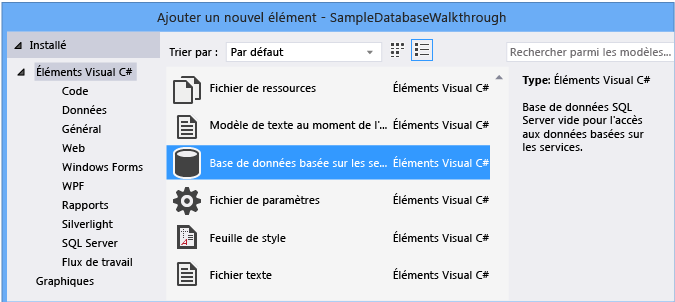

# <a name="create-a-database-and-add-tables-in-visual-studio"></a>Créer une base de données et ajouter des tables dans Visual Studio

Vous pouvez utiliser Visual Studio pour créer et mettre à jour un fichier de base de données local dans SQL Server Express base de données locale. Vous pouvez également créer une base de données en exécutant des instructions Transact-SQL dans la fenêtre outil **Explorateur d’objets SQL Server** dans Visual Studio. Dans cette rubrique, nous allons créer un fichier *. mdf* et ajouter des tables et des clés à l’aide de l’Concepteur de tables.

## <a name="prerequisites"></a>Prérequis

Pour effectuer cette procédure pas à pas, vous avez besoin des charges de travail de développement et de **stockage des données** **.net** et de traitement des données installées dans Visual Studio. Pour les installer, ouvrez **Visual Studio installer** et choisissez **modifier** (ou **plus**  >  **modifier**) en regard de la version de Visual Studio que vous souhaitez modifier.

> [!NOTE]
> Les procédures de cet article s’appliquent uniquement aux projets .NET Framework Windows Forms, et non aux projets Windows Forms .NET Core.

## <a name="create-a-project-and-a-local-database-file"></a>Créer un projet et un fichier de base de données local

1. Créez un projet d' **application de Windows Forms (.NET Framework)** et nommez-le **ProcédureExempleBaseDonnées**.

2. Dans la barre de menus, sélectionnez **projet**  >  **Ajouter un nouvel élément**.

3. Dans la liste des modèles d’élément, faites défiler vers le dessous et sélectionnez **base de données basée sur les services**.

   

4. Nommez la base de données **SampleDatabase**, puis cliquez sur **Ajouter**.

### <a name="add-a-data-source"></a>Ajouter une source de données

1. Si la fenêtre **sources de données** n’est pas ouverte, ouvrez-la en appuyant sur **MAJ** + **ALT** + **D** ou en sélectionnant **Afficher**  >    >  d’autres **sources de données** Windows dans la barre de menus.

1. Dans la fenêtre **sources de données** , sélectionnez Ajouter une **nouvelle source de données**.

   

   L' **Assistant Configuration de source de données** s’ouvre.

1. Dans la page **choisir un type de source de données** , choisissez **base de** données, puis cliquez sur **suivant**.

1. Dans la page **choisir un modèle de base de données** , choisissez **suivant** pour accepter la valeur par défaut (jeu de données).

1. Sur la page **choisir votre connexion de données** , sélectionnez le fichier **SampleDatabase. mdf** dans la liste déroulante, puis choisissez **suivant**.

1. Dans la page **enregistrer la chaîne de connexion dans le fichier de configuration de l’application** , choisissez **suivant**.

1. Dans la page **choisir vos objets de base de données** , vous verrez un message indiquant que la base de données ne contient aucun objet. Cliquez sur **Terminer**.

### <a name="view-properties-of-the-data-connection"></a>Afficher les propriétés de la connexion de données

Vous pouvez afficher la chaîne de connexion pour le fichier *SampleDatabase. mdf* en ouvrant le fenêtre Propriétés de la connexion de données :

- Sélectionnez **Afficher**  >  **Explorateur d’objets SQL Server** pour ouvrir la fenêtre **Explorateur d’objets SQL Server** . Développez   >  **bases de données**(\MSSQLLocalDB), puis cliquez avec le bouton droit sur *SampleDatabase. mdf* et sélectionnez **Propriétés**.

- Vous pouvez également sélectionner **Afficher**  >  **Explorateur de serveurs**, si cette fenêtre n’est pas déjà ouverte. Ouvrez le Fenêtre Propriétés en développant le nœud **connexions de données** , en cliquant avec le bouton droit sur *SampleDatabase. mdf*, puis en sélectionnant **Propriétés**.

  > [!TIP]
  > Si vous ne pouvez pas développer le nœud Connexions de données, ou si la connexion SampleDatabase. mdf ne figure pas dans la liste, sélectionnez le bouton **se connecter à la base de données** dans la barre d’outils Explorateur de serveurs. Dans la boîte de dialogue **Ajouter une connexion** , assurez-vous que **Microsoft SQL Server fichier de base de données** est sélectionné sous **source de données**, puis recherchez et sélectionnez le fichier SampleDatabase. mdf. Terminez l’ajout de la connexion en sélectionnant **OK**.

## <a name="create-tables-and-keys-by-using-table-designer"></a>Créer des tables et des clés à l’aide de Concepteur de tables

Dans cette section, vous allez créer deux tables, une clé primaire dans chaque table, et quelques lignes d’exemples de données. Vous allez également créer une clé étrangère pour spécifier comment les enregistrements d’une table correspondent aux enregistrements de l’autre table.

### <a name="create-the-customers-table"></a>Créer la table Customers

1. Dans **Explorateur de serveurs**, développez le nœud **connexions de données** , puis développez le nœud **SampleDatabase. mdf** .

   Si vous ne pouvez pas développer le nœud Connexions de données, ou si la connexion SampleDatabase. mdf ne figure pas dans la liste, sélectionnez le bouton **se connecter à la base de données** dans la barre d’outils Explorateur de serveurs. Dans la boîte de dialogue **Ajouter une connexion** , assurez-vous que **Microsoft SQL Server fichier de base de données** est sélectionné sous **source de données**, puis recherchez et sélectionnez le fichier SampleDatabase. mdf. Terminez l’ajout de la connexion en sélectionnant **OK**.

2. Cliquez avec le bouton droit sur **tables** , puis sélectionnez **Ajouter une nouvelle table**.

   Le Concepteur de tables s'ouvre et affiche une grille avec une ligne par défaut, qui représente une seule colonne de la table que vous créez. En ajoutant des lignes à la grille, vous définissez des colonnes supplémentaires dans la table.

3. Dans la grille, ajoutez une ligne pour chaque entrée suivante :

   |Nom de la colonne|Type de données|Null autorisé|
   |-----------------|---------------|-----------------|
   |`CustomerID`|`nchar(5)`|False (désactivé)|
   |`CompanyName`|`nvarchar(50)`|False (désactivé)|
   |`ContactName`|`nvarchar (50)`|True (sélectionné)|
   |`Phone`|`nvarchar (24)`|True (sélectionné)|

4. Cliquez avec le bouton droit sur la `CustomerID` ligne, puis sélectionnez **définir la clé primaire**.

5. Cliquez avec le bouton droit sur la ligne par défaut ( `Id` ), puis sélectionnez **supprimer**.

6. Nommez la table Customers en mettant à jour la première ligne du volet de script afin qu'elle corresponde à l'exemple suivant :

   ```sql
   CREATE TABLE [dbo].[Customers]
   ```

   Un résultat semblable à celui-ci doit s’afficher :

   

7. Dans le coin supérieur gauche de **Concepteur de tables**, sélectionnez **mettre à jour**.

8. Dans la boîte de dialogue **aperçu des mises à jour de la base de données** , sélectionnez **mettre à jour la base de données**.

   La table Customers est créée dans le fichier de base de données local.

### <a name="create-the-orders-table"></a>Créer la table Orders

1. Ajoutez une table, puis ajoutez une ligne pour chaque entrée dans le tableau suivant :

   |Nom de la colonne|Type de données|Null autorisé|
   |-----------------|---------------|-----------------|
   |`OrderID`|`int`|False (désactivé)|
   |`CustomerID`|`nchar(5)`|False (désactivé)|
   |`OrderDate`|`datetime`|True (sélectionné)|
   |`OrderQuantity`|`int`|True (sélectionné)|

2. Définissez **OrderID** comme clé primaire, puis supprimez la ligne par défaut.

3. Nommez la table Orders en mettant à jour la première ligne du volet de script afin qu'elle corresponde à l'exemple suivant :

   ```sql
   CREATE TABLE [dbo].[Orders]
   ```

4. Dans l’angle supérieur gauche de la **Concepteur de tables**, sélectionnez **mettre à jour**.

5. Dans la boîte de dialogue **aperçu des mises à jour de la base de données** , sélectionnez **mettre à jour la base de données**.

   La table Orders est créée dans le fichier de base de données local. Si vous développez le nœud **tables** dans Explorateur de serveurs, les deux tables suivantes s’affichent :

   

### <a name="create-a-foreign-key"></a>Créer une clé étrangère

1. Dans le volet contextuel à droite de la grille de Concepteur de tables pour la table Orders, cliquez avec le bouton droit sur **clés étrangères** et sélectionnez **Ajouter une nouvelle clé étrangère**.

   

2. Dans la zone de texte qui s’affiche, remplacez le texte **ToTable** par **Customers**.

3. Dans le volet T-SQL, mettez à jour la dernière ligne pour qu’elle corresponde à l’exemple suivant :

   ```sql
   CONSTRAINT [FK_Orders_Customers] FOREIGN KEY ([CustomerID]) REFERENCES [Customers]([CustomerID])
   ```

4. Dans l’angle supérieur gauche de la **Concepteur de tables**, sélectionnez **mettre à jour**.

5. Dans la boîte de dialogue **aperçu des mises à jour de la base de données** , sélectionnez **mettre à jour la base de données**.

   La clé étrangère est créée.

## <a name="populate-the-tables-with-data"></a>Remplir les tables avec des données

1. Dans **Explorateur de serveurs** ou **Explorateur d’objets SQL Server**, développez le nœud de l’exemple de base de données.

2. Ouvrez le menu contextuel du nœud **tables** , sélectionnez **Actualiser**, puis développez le nœud **tables** .

3. Ouvrez le menu contextuel de la table Customers, puis sélectionnez **afficher les données** de la table.

4. Ajoutez toutes les données que vous souhaitez pour certains clients.

    Vous pouvez spécifier cinq caractères de votre choix comme ID de client, mais choisissez-en au moins un que vous pouvez mémoriser pour l'utiliser ultérieurement dans cette procédure.

5. Ouvrez le menu contextuel de la table Orders, puis sélectionnez **afficher les données** de la table.

6. Ajoutez des données pour certaines commandes.

    > [!IMPORTANT]
    > Assurez-vous que tous les ID de commande et les quantités commandées sont des entiers et que chaque ID client correspond à une valeur que vous avez spécifiée dans la colonne **CustomerID** de la table Customers.

7. Dans la barre de menus, sélectionnez **fichier**  >  **enregistrer tout**.

## <a name="see-also"></a>Voir aussi

- [Accès aux données dans Visual Studio](accessing-data-in-visual-studio.md)
