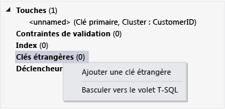

# <a name="create-a-database-and-add-tables-in-visual-studio"></a>Créer une base de données et ajouter des tables dans Visual Studio

Vous pouvez utiliser Visual Studio pour créer et mettre à jour un fichier de base de données locale dans SQL Server Express LocalDB. Vous pouvez également créer une base de données en exécutant les instructions Transact-SQL dans le **Explorateur d’objets SQL Server** fenêtre outil dans Visual Studio. Dans cette rubrique, nous allons créer un *.mdf* fichier, puis ajoutez les tables et les clés à l’aide du Concepteur de tables.

## <a name="prerequisites"></a>Prérequis

Pour effectuer cette procédure pas à pas, vous devez avoir le paramètre facultatif **stockage de données et de traitement** charge de travail installée dans Visual Studio. Pour l’installer, ouvrez **le programme d’installation de Visual Studio** et choisissez le **charges de travail** onglet. Sous **Web & Cloud**, choisissez **stockage de données et de traitement**. Choisissez le **modifier** pour ajouter la charge de travail pour Visual Studio.

## <a name="create-a-project-and-a-local-database-file"></a>Créer un projet et un fichier de base de données local

1. Créez un projet Windows Forms nommé **SampleDatabaseWalkthrough**.

2. Dans la barre de menus, sélectionnez **projet** > **ajouter un nouvel élément**.

3. Dans la liste des modèles d’élément, faites défiler vers le bas et sélectionnez **base de données basée sur le Service**.

     

4. Nom de la base de données **SampleDatabase**, puis sélectionnez le **ajouter** bouton.

### <a name="add-a-data-source"></a>Ajouter une source de données

1. Si le **des Sources de données** fenêtre n’est pas ouverte, ouvrez-le en appuyant sur **MAJ**+**Alt**+**D** ou en sélectionnant **Vue** > **Windows autres** > **des Sources de données** sur la barre de menus.

1. Dans le **des Sources de données** fenêtre, sélectionnez le **ajouter une nouvelle Source de données** lien.

   L’Assistant **Configuration de source de données** s’ouvre.

1. Sur le **choisir un Type de Source de données** page, choisissez **base de données** , puis **suivant**.

1. Sur le **choisir un modèle de base de données** page, choisissez **suivant** pour accepter la valeur par défaut (jeu de données).

1. Sur le **choisir votre connexion de données** page, sélectionnez le **SampleDatabase.mdf** de fichiers dans la liste déroulante, puis choisissez **suivant**.

1. Sur le **enregistrer la chaîne de connexion au fichier de Configuration de l’Application** page, choisissez **suivant**.

1. Un seul le **choisir vos objets de base de données** page, vous verrez un message indiquant que la base de données ne contient pas tous les objets. Choisissez **Terminer**.

### <a name="view-properties-of-the-data-connection"></a>Afficher les propriétés de la connexion de données

Vous pouvez afficher la chaîne de connexion pour le *SampleDatabase.mdf* fichier en ouvrant la fenêtre Propriétés de la connexion de données :

- Dans Visual Studio, sélectionnez **vue** > **Explorateur d’objets SQL Server** si cette fenêtre n’est pas déjà ouverte. Ouvrez la fenêtre Propriétés en développant le **des connexions de données** nœud, en ouvrant le menu contextuel pour *SampleDatabase.mdf*, puis en sélectionnant **propriétés**.

- Vous pouvez également sélectionner **vue** > **Explorateur de serveurs**, si cette fenêtre n’est pas déjà ouverte. Ouvrez la fenêtre Propriétés en développant le **des connexions de données** nœud. Ouvrez le menu contextuel pour *SampleDatabase.mdf*, puis sélectionnez **propriétés**.

## <a name="create-tables-and-keys-by-using-table-designer"></a>Créer des tables et des clés à l’aide du Concepteur de tables

Dans cette section, vous allez créer deux tables, une clé primaire dans chaque table et quelques lignes d’exemples de données. Vous allez également créer une clé étrangère pour spécifier comment les enregistrements dans une table correspondent aux enregistrements dans l’autre table.

### <a name="create-the-customers-table"></a>Créer la table Customers

1. Dans **Explorateur de serveurs** ou **Explorateur d’objets SQL Server**, développez le **des connexions de données** nœud, puis développez le **SampleDatabase.mdf**nœud.

2. Ouvrez le menu contextuel pour **Tables**, puis sélectionnez **ajouter une nouvelle Table**.

     Le **Concepteur de tables** s’ouvre et affiche une grille avec une ligne par défaut, qui représente une seule colonne de la table que vous créez. En ajoutant des lignes à la grille, vous définissez des colonnes supplémentaires dans la table.

3. Dans la grille, ajoutez une ligne pour chaque entrée suivante :

    |Nom de la colonne|Type de données|Null autorisé|
    |-----------------|---------------|-----------------|
    |`CustomerID`|`nchar(5)`|False (désactivé)|
    |`CompanyName`|`nvarchar(50)`|False (désactivé)|
    |`ContactName`|`nvarchar (50)`|True (sélectionné)|
    |`Phone`|`nvarchar (24)`|True (sélectionné)|

4. Ouvrez le menu contextuel pour le `CustomerID` de ligne, puis sélectionnez **définir la clé primaire**.

5. Ouvrez le menu contextuel pour la ligne par défaut, puis sélectionnez **supprimer**.

6. Nommez la table Customers en mettant à jour la première ligne du volet de script afin qu'elle corresponde à l'exemple suivant :

    ```sql
    CREATE TABLE [dbo].[Customers]
    ```

    Vous devez voir quelque chose de similaire à :

    

7. Dans le coin supérieur gauche de la **Concepteur de tables**, sélectionnez le **mise à jour** bouton.

8. Dans le **mises à jour de la base de données aperçu** boîte de dialogue, sélectionnez le **mise à jour la base de données** bouton.

    Vos modifications sont enregistrées dans le fichier de base de données local.

### <a name="create-the-orders-table"></a>Créer la table Orders

1. Ajoutez une table, puis ajoutez une ligne pour chaque entrée dans le tableau suivant :

    |Nom de la colonne|Type de données|Null autorisé|
    |-----------------|---------------|-----------------|
    |`OrderID`|`int`|False (désactivé)|
    |`CustomerID`|`nchar(5)`|False (désactivé)|
    |`OrderDate`|`datetime`|True (sélectionné)|
    |`OrderQuantity`|`int`|True (sélectionné)|

2. Définissez **OrderID** comme clé primaire, puis supprimez la ligne par défaut.

3. Nommez la table Orders en mettant à jour la première ligne du volet de script afin qu'elle corresponde à l'exemple suivant :

    ```sql
    CREATE TABLE [dbo].[Orders]
    ```

4. Dans le coin supérieur gauche de la **Concepteur de tables**, sélectionnez le **mise à jour** bouton.

5. Dans le **mises à jour de la base de données aperçu** boîte de dialogue, sélectionnez le **mise à jour la base de données** bouton.

    Vos modifications sont enregistrées dans le fichier de base de données local.

### <a name="create-a-foreign-key"></a>Créer une clé étrangère

1. Dans le volet contextuel sur le côté droit de la grille, ouvrez le menu contextuel pour **clés étrangères**, puis sélectionnez **ajouter une nouvelle clé étrangère**, comme le montre l’illustration suivante.

     

2. Dans la zone de texte qui apparaît, remplacez **ToTable** par **Customers**.

3. Dans le volet T-SQL, mettez à jour la dernière ligne pour correspondre à l’exemple suivant :

    ```sql
    CONSTRAINT [FK_Orders_Customers] FOREIGN KEY ([CustomerID]) REFERENCES [Customers]([CustomerID])
    ```

4. Dans le coin supérieur gauche de la **Concepteur de tables**, sélectionnez le **mise à jour** bouton.

5. Dans le **mises à jour de la base de données aperçu** boîte de dialogue, sélectionnez le **mise à jour la base de données** bouton.

    Vos modifications sont enregistrées dans le fichier de base de données local.

## <a name="populate-the-tables-with-data"></a>Remplir les tables de données

1. Dans **Explorateur de serveurs** ou **Explorateur d’objets SQL Server**, développez le nœud de la base de données.

2. Ouvrez le menu contextuel pour le **Tables** nœud, sélectionnez **Actualiser**, puis développez le **Tables** nœud.

3. Ouvrez le menu contextuel pour la table Customers, puis sélectionnez **afficher les données de Table**.

4. Ajoutez les données voulues pour certains clients.

    Vous pouvez spécifier cinq caractères de votre choix comme ID de client, mais choisissez-en au moins un que vous pouvez mémoriser pour l'utiliser ultérieurement dans cette procédure.

5. Ouvrez le menu contextuel de la table Orders, puis sélectionnez **afficher les données de Table**.

6. Ajouter des données pour certaines commandes.

    > [!IMPORTANT]
    > Vérifiez que tous les ID de commande et quantités commandées sont des entiers et que chaque ID client correspond à une valeur que vous avez spécifiée dans la colonne **CustomerID** de la table Customers.

7. Dans la barre de menus, sélectionnez **fichier** > **Enregistrer tout**.

## <a name="see-also"></a>Voir aussi

- [Accès aux données dans Visual Studio](accessing-data-in-visual-studio.md)