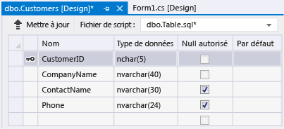

# Proc&#233;dure pas &#224; pas&#160;: cr&#233;ation d&#39;un fichier de base de donn&#233;es local dans Visual Studio
Vous pouvez exécuter des tâches de base, telles que l'ajout de tables et la définition de colonnes, en utilisant Visual Studio 2013 pour créer et mettre à jour un fichier de base de données locale dans SQL Server Express LocalDB, qui est décrit dans [Vue d'ensemble des données locales](../data-tools/local-data-overview.md).  Après avoir terminé cette procédure pas à pas, vous pouvez découvrir des fonctionnalités plus avancées en utilisant votre base de données locale comme point de départ d'autres procédures pas à pas qui en ont besoin.  
  
 Pour plus d'informations sur la création d'une base de données à l'aide de SQL Server Management Studio ou de Transact\-SQL, consultez [Create a Database](http://msdn.microsoft.com/fr-fr/4c4beea2-6cbc-4352-9db6-49ea8130bb64).  
  
 Au cours de cette procédure, vous exécuterez les tâches suivantes :  
  
-   [Création d'un projet et d'un fichier de base de données local](../data-tools/create-a-sql-database-by-using-a-designer.md#BKMK_CreateNewSQLDB).  
  
-   [Création de tables, de colonnes, de clés primaires et de clés étrangères](../data-tools/create-a-sql-database-by-using-a-designer.md#BKMK_CreateNewTbls).  
  
-   [Remplissage des tables avec des données](../data-tools/create-a-sql-database-by-using-a-designer.md#BKMK_Populating).  
  
## Composants requis  
 Pour effectuer cette procédure pas à pas, installez [!INCLUDE[vs_dev12_expwin](../data-tools/includes/vs_dev12_expwin_md.md)], Visual Studio Professional 2013, Visual Studio Premium 2013 ou Visual Studio Ultimate 2013.  Ces versions de Visual Studio incluent SQL Server Data Tools.  
  
##  <a name="BKMK_CreateNewSQLDB"></a> Création d'un projet et d'un fichier de base de données local  
  
#### Pour créer un projet et un fichier de base de données  
  
1.  Créez un projet Windows Forms nommé `ProcédureExempleBaseDonnées`.  
  
     Consultez [Création de projets et de solutions](../ide/creating-solutions-and-projects.md).  
  
2.  Dans la barre de menus, choisissez **Projet**, **Ajouter un nouvel élément**.  
  
     La boîte de dialogue **Ajouter un nouvel élément** s'affiche pour vous permettre d'ajouter des éléments appropriés dans un projet Windows Form.  
  
3.  Dans la liste de modèles d'élément, faites défiler jusqu'à ce que **Base de données basée sur les services** s'affiche, puis choisissez ce modèle.  
  
       
  
4.  Nommez la base de données SampleDatabase, puis choisissez le bouton **Ajouter**.  
  
5.  Si la fenêtre sources de données n'est pas ouverte, ouvrez \-la en appuyant sur Maj\+Alt\+D ou, dans la barre de menus, en sélectionnant **Affichage**, **Autres fenêtres**, **Sources de données**.  
  
6.  Dans la fenêtre Sources de données, choisissez le lien **Ajouter une nouvelle source de données**.  
  
7.  Dans **Assistant Configuration de source de données**, choisissez le bouton **Suivant** quatre fois pour accepter les paramètres par défaut, puis choisissez le bouton **Terminer**.  
  
 En ouvrant la fenêtre de propriétés pour la base de données, vous pouvez consulter la chaîne de connexion et l'emplacement du fichier principal .mdf.  
  
-   Dans Visual Studio Express, choisissez **Affichage**, **Autres fenêtres**, **Explorateur de bases de données** si cette fenêtre n'est pas déjà ouverte.  Ouvrez la fenêtre de propriétés en développant le nœud **Connexions de données**, en ouvrant le menu contextuel de SampleDatabase.mdf, puis en choisissant **Propriétés**.  
  
-   Dans les autres versions de Visual Studio, choisissez **Affichage**, **Explorateur de serveurs** si cette fenêtre n'est pas déjà ouverte.  Ouvrez la fenêtre de propriétés en développant le nœud **Connexions de données**, en ouvrant le menu contextuel de SampleDatabase.mdf, puis en choisissant **Propriétés**.  
  
##  <a name="BKMK_CreateNewTbls"></a> Création de tables, de colonnes, de clés primaires et de clés étrangères  
 Dans cette section, vous créerez des tables, une clé primaire dans chaque table, et quelques lignes d'exemples de données.  La procédure suivante vous donnera une idée de la façon dont ces informations peuvent apparaître dans une application.  Vous créerez également une clé étrangère pour spécifier comment les enregistrements d'une table peuvent correspondre aux enregistrements de l'autre table.  
  
#### Pour créer la table Customers  
  
1.  Dans **Explorateur de serveurs** ou **Explorateur de bases de données**, développez le nœud **Connexions de données**, puis le nœud **SampleDatabase.mdf**.  
  
     Si l'explorateur de votre version de Visual Studio n'est pas ouvert, choisissez **Afficher**, **Explorateur de serveurs** ou **Afficher**, **Autres fenêtres**, **Explorateur de bases de données** dans la barre de menus.  
  
2.  Ouvrez le menu contextuel de **Tables**, puis choisissez **Ajouter une nouvelle table**.  
  
     Le **Concepteur de tables** s'ouvre et affiche une grille avec une ligne par défaut, qui représente une seule colonne de la table que vous créez.  En ajoutant des lignes à la grille, vous définissez des colonnes supplémentaires dans la table.  
  
3.  Dans la grille, ajoutez une ligne pour chaque entrée suivante :  
  
    |Nom de la colonne|Type de données|Null autorisé|  
    |-----------------------|---------------------|-------------------|  
    |`CustomerID`|`nchar(5)`|False \(désactivé\)|  
    |`CompanyName`|`nvarchar(40)`|False \(désactivé\)|  
    |`ContactName`|`nvarchar (30)`|True \(sélectionné\)|  
    |`Phone`|`nvarchar (24)`|True \(sélectionné\)|  
  
4.  Ouvrez le menu contextuel de la ligne `CustomerID`, puis choisissez **Définir la clé primaire**.  
  
5.  Ouvrez le menu contextuel de la ligne par défaut, puis choisissez **Supprimer**.  
  
6.  Nommez la table Customers en mettant à jour la première ligne du volet de script afin qu'elle corresponde à l'exemple suivant :  
  
    ```  
    CREATE TABLE [dbo].[Customers]  
    ```  
  
7.  Dans l'angle supérieur gauche du Concepteur de tables, choisissez le bouton **Mettre à jour**, comme le montre l'illustration ci\-dessous.  
  
       
  
8.  Dans la boîte de dialogue **Aperçu des mises à jour de la base de données**, choisissez le bouton **Mettre à jour la base de données**.  
  
     Vos modifications sont enregistrées dans le fichier de base de données local.  
  
#### Pour créer la table Orders  
  
1.  Ajoutez une table, puis ajoutez une ligne pour chaque entrée dans le tableau suivant :  
  
    |Nom de la colonne|Type de données|Null autorisé|  
    |-----------------------|---------------------|-------------------|  
    |`OrderID`|`int`|False \(désactivé\)|  
    |`CustomerID`|`nchar(5)`|False \(désactivé\)|  
    |`OrderDate`|`datetime`|True \(sélectionné\)|  
    |`OrderQuantity`|`int`|True \(sélectionné\)|  
  
2.  Définissez **OrderID** comme clé primaire, puis supprimez la ligne par défaut.  
  
3.  Nommez la table Orders en mettant à jour la première ligne du volet de script afin qu'elle corresponde à l'exemple suivant :  
  
    ```  
    CREATE TABLE [dbo].[Orders]  
    ```  
  
4.  Dans l'angle supérieur gauche du Concepteur de tables, choisissez le bouton **Mettre à jour**.  
  
5.  Dans la boîte de dialogue **Aperçu des mises à jour de la base de données**, choisissez le bouton **Mettre à jour la base de données**.  
  
     Vos modifications sont enregistrées dans le fichier de base de données local.  
  
#### Pour créer une clé étrangère  
  
1.  Dans le volet contextuel à droite de la grille, ouvrez le menu contextuel de **Clés étrangères**, puis choisissez **Ajouter une nouvelle clé étrangère**, comme dans l'illustration ci\-dessous.  
  
       
  
2.  Dans la zone de texte qui apparaît, remplacez **ToTable** par `Clients`.  
  
3.  Dans le volet de script, mettez la dernière ligne à jour pour qu'elle corresponde à l'exemple suivant :  
  
    ```  
    CONSTRAINT [FK_Orders_Customers] FOREIGN KEY ([CustomerID]) REFERENCES [Customers]([CustomerID])  
    ```  
  
4.  Dans l'angle supérieur gauche du Concepteur de tables, choisissez le bouton **Mettre à jour**.  
  
5.  Dans la boîte de dialogue **Aperçu des mises à jour de la base de données**, choisissez le bouton **Mettre à jour la base de données**.  
  
     Vos modifications sont enregistrées dans le fichier de base de données local.  
  
##  <a name="BKMK_Populating"></a> Remplissage des tables avec des données  
  
#### Pour remplir les tables avec des données  
  
1.  Dans l'**Explorateur de serveurs** ou l'**Explorateur de bases de données**, développez le nœud de l'exemple de la base de données.  
  
2.  Ouvrez le menu contextuel du nœud Tables, choisissez **Actualiser**, puis développez le nœud Tables.  
  
3.  Ouvrez le menu contextuel de la table Customers, puis choisissez **Afficher les données de la table**.  
  
4.  Ajoutez les données voulues pour au moins trois clients.  
  
     Vous pouvez spécifier cinq caractères de votre choix comme ID de client, mais choisissez\-en au moins un que vous pouvez mémoriser pour l'utiliser ultérieurement dans cette procédure.  
  
5.  Ouvrez le menu contextuel de la table Orders, puis choisissez **Afficher les données de la table**.  
  
6.  Ajoutez des données pour au moins trois commandes.  
  
    > [!IMPORTANT]
    >  Vérifiez que tous les ID de commande et quantités commandées sont des entiers et que chaque ID client correspond à une valeur que vous avez spécifiée dans la colonne CustomerID de la table Customers.  
  
7.  Dans la barre de menus, sélectionnez **Fichier**, **Enregistrer tout**.  
  
8.  Dans la barre de menus, choisissez **Fichier**, **Fermer la solution**.  
  
    > [!NOTE]
    >  Il est recommandé de sauvegarder le fichier de base de données que vous venez de créer en copiant et en collant la copie dans un autre emplacement ou en renommant la copie.  
  
## Étapes suivantes  
 Maintenant que vous avez un fichier de base de données local avec quelques exemples de données, vous pouvez consulter [Procédure pas à pas : connexion à des données dans un fichier de base de données local \(Windows Forms\)](../Topic/Walkthrough:%20Connecting%20to%20Data%20in%20a%20Local%20Database%20File%20\(Windows%20Forms\).md), ainsi que les autres procédures pas à pas qui illustrent les tâches de base de données.  
  
## Voir aussi  
 [Comment : gérer des fichiers de données locaux dans votre projet](../data-tools/how-to-manage-local-data-files-in-your-project.md)   
 [Vue d'ensemble des données locales](../data-tools/local-data-overview.md)   
 [Liaison de contrôles Windows Forms à des données dans Visual Studio](../data-tools/bind-windows-forms-controls-to-data-in-visual-studio.md)   
 [Vue d'ensemble d'applications de données dans Visual Studio](../data-tools/overview-of-data-applications-in-visual-studio.md)   
 [Connexion aux données dans Visual Studio](../data-tools/connecting-to-data-in-visual-studio.md)   
 [Préparation de votre application pour recevoir des données](../Topic/Preparing%20Your%20Application%20to%20Receive%20Data.md)   
 [Extraction de données dans votre application](../data-tools/fetching-data-into-your-application.md)   
 [Liaison de contrôles à des données dans Visual Studio](../data-tools/bind-controls-to-data-in-visual-studio.md)   
 [Modification des données dans votre application](../data-tools/editing-data-in-your-application.md)   
 [Validation des données](../Topic/Validating%20Data.md)   
 [Enregistrement des données](../data-tools/saving-data.md)