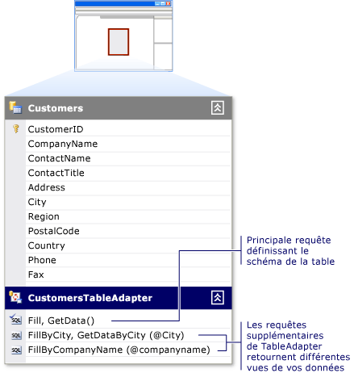

# Créer et configurer des TableAdapters

Les TableAdapters fournissent la communication entre votre application et une base de données. Ils se connectent à la base de données, exécuter des requêtes ou de procédures stockées et renvoient les nouvelles données de table ou de remplir un existant <xref:System.Data.DataTable> avec les données retournées. Les TableAdapters peuvent également envoyer des données mises à jour à partir de votre application dans la base de données.

Les TableAdapters sont créés pour vous lorsque vous effectuez l’une des actions suivantes :

- Faire glisser des objets de base de données à partir de **Explorateur de serveurs** dans le **Concepteur de Dataset**.

- Exécutez l’Assistant de Configuration de Source de données, puis sélectionnez soit le **base de données** ou **Service Web** type de source de données.

   

Vous pouvez également créer un nouveau TableAdapter et configurez-le avec une source de données en faisant glisser un TableAdapter à partir de la **boîte à outils** une zone vide dans le **Concepteur de Dataset** surface.

Pour une introduction aux TableAdapters, consultez [remplir des jeux de données à l’aide de TableAdapters](../data-tools/fill-datasets-by-using-tableadapters.md).

[!INCLUDE[note_settings_general](../data-tools/includes/note_settings_general_md.md)]

## Utilisez l’Assistant Configuration de TableAdapter

Exécutez le **Assistant Configuration de TableAdapter** pour créer ou modifier des TableAdapters et leurs DataTables associés. Vous pouvez configurer un TableAdapter existant en cliquant dessus dans le **Concepteur de Dataset**.

Si vous faites glisser un TableAdapter à partir de la boîte à outils lorsque le **Concepteur de Dataset** est en cours se concentrent, l’Assistant démarre et invites vous permettent de spécifier les données source le TableAdapter doivent se connecter. Sur la page suivante, l’Assistant vous demande quel type de commandes, il doit utiliser pour communiquer avec la base de données, des instructions SQL ou procédures stockées. (Vous ne voyez pas cela si vous configurez un TableAdapter est déjà associé à une source de données.)

- Vous avez la possibilité de créer une nouvelle procédure stockée dans la base de données sous-jacent, si vous avez les autorisations appropriées pour la base de données. Si vous n’avez pas ces autorisations, ce ne sera pas une option.

- Vous pouvez également choisir d’exécuter des procédures stockées existantes pour le **sélectionnez**, **insérer**, **mise à jour**, et **supprimer** commandes de la TableAdapter. La procédure stockée qui est affectée à la **mise à jour** commande, par exemple, est exécutée lorsque la `TableAdapter.Update()` méthode est appelée.

Mappez les paramètres de la procédure stockée sélectionnée aux colonnes correspondantes de la table de données. Par exemple, si votre procédure stockée accepte un paramètre nommé `@CompanyName` qu’il transmet à la `CompanyName` jeu de colonnes dans la table, le **colonne Source** de la `@CompanyName` paramètre à `CompanyName`.

> [!NOTE]
> La procédure stockée qui est affectée à la commande SELECT est exécutée en appelant la méthode du TableAdapter que vous nommez dans l’étape suivante de l’Assistant. La méthode par défaut est `Fill`, de sorte que le code qui est généralement utilisé pour exécuter la procédure SELECT est `TableAdapter.Fill(tableName)`. Si vous modifiez le nom par défaut à partir de `Fill`, remplacez `Fill` avec le nom vous affecter et remplacez « TableAdapter » par le nom réel du TableAdapter (par exemple, `CustomersTableAdapter`).

- En sélectionnant le **créer des méthodes pour envoyer des mises à jour directement à la base de données** option revient à affecter la `GenerateDBDirectMethods` true à la propriété. L’option n’est pas disponible lorsque l’instruction SQL d’origine ne fournit pas de suffisamment d’informations ou de la requête n’est pas une requête modifiable. Cette situation peut se produire, par exemple, dans **joindre** requêtes et les requêtes qui retournent une valeur (scalaire) unique.

Le **Options avancées** dans l’Assistant permettent :

- Générer des instructions INSERT, UPDATE et DELETE en fonction de l’instruction SELECT qui est définie sur le **générer les instructions SQL** page
- Utiliser l'accès concurrentiel optimiste
- Spécifiez s’il faut actualiser la table de données après insertion et exécutent des instructions de mise à jour

## Configurer la méthode de remplissage d’un TableAdapter

Parfois, vous souhaiterez modifier le schéma de table du TableAdapter. Pour ce faire, vous modifiez les principaux du TableAdapter `Fill` (méthode). Les TableAdapters sont créés avec un réplica principal `Fill` la méthode qui définit le schéma de la table de données associée. Le réplica principal `Fill` méthode est basée sur la requête ou la procédure stockée que vous avez entré lorsque vous avez configuré à l’origine du TableAdapter. Il est la première méthode (plus élevée) sous la table de données dans le Concepteur de DataSet.

Principale de toutes les modifications que vous apportez au TableAdapter `Fill` méthode sont reflétées dans le schéma de la table de données associée. Par exemple, suppression d’une colonne à partir de la requête dans le principal `Fill` méthode supprime également la colonne de la table de données associée. En outre, suppression de la colonne à partir de la main `Fill` méthode supprime la colonne de toutes les requêtes supplémentaires pour ce TableAdapter.

Vous pouvez utiliser l’Assistant Configuration de requête TableAdapter pour créer et modifier des requêtes supplémentaires du TableAdapter. Ces requêtes supplémentaires doivent être conformes au schéma de table, sauf si elles retournent une valeur scalaire.  Chaque requête supplémentaire a un nom que vous spécifiez.

L’exemple suivant vous montre comment appeler une requête supplémentaire nommée `FillByCity`:

`CustomersTableAdapter.FillByCity(NorthwindDataSet.Customers, "Seattle")`

### Pour démarrer l’Assistant Configuration de requêtes TableAdapter avec une nouvelle requête

1.  Ouvrez votre jeu de données dans le **Concepteur de Dataset**.

2.  Si vous créez une nouvelle requête, faites glisser un **requête** de l’objet à partir de la **DataSet** onglet de la **boîte à outils** sur un <xref:System.Data.DataTable>, ou sélectionnez **ajouter une requête**à partir du menu contextuel du TableAdapter. Vous pouvez également faire glisser un **requête** objet dans une zone vide de la **Concepteur de Dataset**, ce qui crée un TableAdapter sans associé à un <xref:System.Data.DataTable>. Ces requêtes peuvent uniquement retourner des valeurs (scalaires) uniques, ou exécutez UPDATE, INSERT, ou supprimer des commandes sur la base de données.

3.  Sur le **choisir votre connexion de données** écran, sélectionnez ou créez la connexion que la requête va utiliser.

    > [!NOTE]
    > Cet écran s’affiche uniquement lorsque le concepteur ne peut pas déterminer la connexion appropriée à utiliser, ou lorsqu’aucune connexion n’est disponible.

4.  Sur le **choisir un Type de commande** s’affiche, sélectionnez parmi les méthodes d’extraction de données à partir de la base de données suivantes :

    - **Utiliser des instructions SQL** vous permet de taper une instruction SQL pour sélectionner les données à partir de votre base de données.

    - **Créer la nouvelle procédure stockée** vous permet de l’Assistant créer une nouvelle procédure stockée (dans la base de données) en fonction de l’instruction SELECT spécifiée.

    - **Utiliser des procédures stockées existantes** vous permet d’exécuter une procédure stockée existante lors de l’exécution de la requête.

### Pour démarrer l’Assistant Configuration de requête TableAdapter sur une requête existante

- Si vous modifiez une requête TableAdapter existante, avec le bouton droit de la requête, puis choisissez **configurer** dans le menu contextuel.

    > [!NOTE]
    > Clic droit sur la requête principale d’un TableAdapter reconfigure le TableAdapter et <xref:System.Data.DataTable> schéma. Clic droit sur une requête supplémentaire sur un TableAdapter, cependant, configure la requête sélectionnée uniquement. Le **Assistant Configuration de TableAdapter** reconfigure la définition du TableAdapter, tandis que le **Assistant Configuration de requêtes TableAdapter** reconfigure uniquement la requête sélectionnée.

### Pour ajouter une requête globale à un TableAdapter

- Requêtes globales sont des requêtes SQL qui retournent une valeur (scalaire) unique ou aucune valeur. En règle générale, les fonctions globales effectuent des opérations de base de données telles que des insertions, mises à jour et suppressions. Ils regroupent également des informations, telles qu’un nombre de clients dans une table ou le total des frais pour tous les éléments dans un ordre particulier.

     Vous ajoutez des requêtes globales en faisant glisser un **requête** à partir de l’objet le **DataSet** onglet de la **boîte à outils** dans une zone vide de la **Concepteur de Dataset**.

- Fournir une requête qui effectue la tâche souhaitée, par exemple, `SELECT COUNT(*) AS CustomerCount FROM Customers`.

    > [!NOTE]
    > En faisant glisser un **requête** objet directement sur le **Concepteur de Dataset** crée une méthode qui retourne uniquement une valeur scalaire (unique). Alors que la requête ou la procédure stockée que vous sélectionnez peut-être retourner plus de valeur unique, la méthode qui est créée par l’Assistant retourne uniquement une valeur unique. Par exemple, la requête peut retourner la première colonne de la première ligne des données retournées.

## Voir aussi

- [Remplir des datasets à l’aide de TableAdapters](../data-tools/fill-datasets-by-using-tableadapters.md)