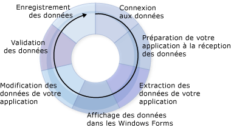

# Cr&#233;ation d&#39;applications de donn&#233;es
Visual Studio fournit de nombreux outils de conception pour vous aider à créer des applications qui accèdent aux données.  Cette introduction présente une vue d'ensemble des processus de base impliqués dans la création d'applications qui utilisent des données.  Les informations de cette section ignorent délibérément de nombreux détails et constituent une source d'informations et un point de départ vers les nombreuses pages d'aide relatives à la création d'une application de données.  
  
 Au fur et à mesure que vous développerez des applications d'accès aux données dans [!INCLUDE[vsprvs](../code-quality/includes/vsprvs_md.md)], vos spécifications seront différentes.  Dans certains cas, vous voudrez simplement afficher des données dans un formulaire.  Dans d'autres, vous devrez imaginer un moyen de partager des informations avec d'autres applications ou processus.  
  
 Quelles que soient les opérations que vous exécutez avec les données, il est important de comprendre certains concepts fondamentaux.  Vous n'aurez probablement jamais besoin de connaître certains détails de la gestion des données — vous n'aurez, par exemple, probablement jamais besoin de créer une base de données par programmation — mais il est très utile de comprendre les concepts de données de base, ainsi que les outils de données \(Assistants et concepteurs\) disponibles dans [!INCLUDE[vsprvs](../code-quality/includes/vsprvs_md.md)].  
  
 Une application de données standard utilise la plupart des processus illustrés dans le diagramme suivant :  
  
   
Cycle des données  
  
 Au fur et à mesure que vous créez votre application, pensez à la tâche que vous essayez d'accomplir.  Utilisez les sections suivantes pour vous aider à rechercher les outils [!INCLUDE[vsprvs](../code-quality/includes/vsprvs_md.md)] et les objets qui sont mis à votre disposition.  
  
> [!NOTE]
>  [!INCLUDE[vsprvs](../code-quality/includes/vsprvs_md.md)] fournit des Assistants pour simplifier plusieurs processus affichés dans le diagramme précédent.  Par exemple, l'exécution de l'**Assistant Configuration de source de données** fournit à votre application suffisamment d'informations pour se connecter aux données, créer un groupe de données typé afin de recevoir les données et importer les données dans votre application.  
  
 Pour obtenir un aperçu de la manière dont [!INCLUDE[vsprvs](../code-quality/includes/vsprvs_md.md)] vous aide à développer des applications de données, consultez [Procédure pas à pas : création d'une application de données simple](../Topic/Walkthrough:%20Creating%20a%20Simple%20Data%20Application.md).  
  
## Connexion aux données  
 Pour importer des données dans votre application \(et renvoyer les modifications à la source de données\), une certaine communication bidirectionnelle doit être établie.  Cette communication bidirectionnelle est généralement contrôlée par les objets dans votre modèle de données.  
  
 Par exemple, `TableAdapter` connecte les applications qui utilisent des groupes de données à une base de données et <xref:System.Data.Objects.ObjectContext> connecte des entités du Entity Framework à une base de données.  [!INCLUDE[vsprvs](../code-quality/includes/vsprvs_md.md)] fournit plusieurs outils pour vous aider à créer des connexions qui peuvent être utilisées par votre application.  Pour plus d'informations sur la connexion de votre application aux données, consultez [Connexion aux données dans Visual Studio](../data-tools/connecting-to-data-in-visual-studio.md).  
  
 Pour savoir comment utiliser des groupes de données pour connecter votre application aux données dans une base de données, consultez [Procédure pas à pas : connexion à des données dans une base de données \(Windows Forms\)](../Topic/Walkthrough:%20Connecting%20to%20Data%20in%20a%20Database%20\(Windows%20Forms\).md).  
  
## Préparation de votre application pour recevoir des données  
 Si votre application utilise un modèle de données déconnecté, vous devez stocker temporairement les données dans votre application pendant que vous utilisez ce modèle.  Visual Studio propose des outils pour vous aider à créer les objets que votre application utilise pour stocker des données temporairement : groupes de données, entités et objets [!INCLUDE[vbtecdlinq](../data-tools/includes/vbtecdlinq_md.md)].  
  
> [!NOTE]
>  Une application qui utilise un modèle de données déconnecté se connecte généralement à une base de données, exécute une requête qui importe des données dans l'application, se déconnecte de la base de données, puis manipule les données hors connexion avant de se reconnecter et de mettre à jour la base de données.  
  
 Pour plus d'informations sur la création de groupes de données typés dans votre application, consultez [Préparation de votre application pour recevoir des données](../Topic/Preparing%20Your%20Application%20to%20Receive%20Data.md).  Pour plus informations sur l'utilisation de groupes de données dans les applications multicouches, consultez [Comment : séparer les Datasets et les TableAdapters dans différents projets](../data-tools/separate-datasets-and-tableadapters-into-different-projects.md).  
  
 Pour savoir comment créer un groupe de données, exécutez les procédures décrites dans la rubrique [Procédure pas à pas : création d'un groupe de données avec le Concepteur de DataSet](../data-tools/walkthrough-creating-a-dataset-with-the-dataset-designer.md).  
  
 Pour savoir comment créer des objets [!INCLUDE[vbtecdlinq](../data-tools/includes/vbtecdlinq_md.md)], exécutez les procédures décrites dans [Procédure pas à pas : création de classes LINQ to SQL \(Concepteur O\/R\)](../Topic/Walkthrough:%20Creating%20LINQ%20to%20SQL%20Classes%20\(O-R%20Designer\).md).  
  
## Extraction de données dans votre application  
 Que votre application utilise ou non un modèle de données déconnecté, vous devez être capable d'extraire des données dans votre application.  Pour importer des données dans votre application, vous devez exécuter des requêtes ou des procédures stockées sur une base de données.  Les applications qui stockent des données dans les groupes de données exécutent des requêtes et des procédures stockées à l'aide de `TableAdapter`, tandis que les applications qui stockent les données dans les entités exécutent des requêtes à l'aide de [LINQ to Entities](../Topic/LINQ%20to%20Entities.md) ou en connectant des entités directement aux procédures stockées.  Pour plus d'informations sur la création et la modification des requêtes qui utilisent des TableAdapters, consultez [Comment : créer des requêtes TableAdapter](../data-tools/how-to-create-tableadapter-queries.md) et [Comment : modifier des requêtes TableAdapter](../data-tools/how-to-edit-tableadapter-queries.md).  
  
 Pour plus d'informations sur le chargement des données dans des groupes de données et sur l'exécution des requêtes et des procédures stockées, consultez [Extraction de données dans votre application](../data-tools/fetching-data-into-your-application.md).  
  
 Pour savoir comment charger des données dans un groupe de données, exécutez les procédures décrites dans la rubrique [Procédure pas à pas : affichage de données sur un Windows Form](../data-tools/walkthrough-displaying-data-on-a-windows-form.md) et examinez le code dans le gestionnaire d'événements de chargement de formulaire.  
  
 Pour savoir comment charger des données dans des objets [!INCLUDE[vbtecdlinq](../data-tools/includes/vbtecdlinq_md.md)], exécutez les procédures décrites dans [Procédure pas à pas : création de classes LINQ to SQL \(Concepteur O\/R\)](../Topic/Walkthrough:%20Creating%20LINQ%20to%20SQL%20Classes%20\(O-R%20Designer\).md).  
  
 Pour savoir comment créer et exécuter une requête SQL, consultez [Comment : créer et exécuter une instruction SQL qui retourne des lignes](../Topic/How%20to:%20Create%20and%20Execute%20an%20SQL%20Statement%20that%20Returns%20Rows.md).  
  
 Pour savoir comment exécuter une procédure stockée, consultez [Comment : exécuter une procédure stockée qui retourne des lignes](../Topic/How%20to:%20Execute%20a%20Stored%20Procedure%20that%20Returns%20Rows.md).  
  
## Affichage des données dans les formulaires  
 Après avoir ajouté des données dans votre application, vous les affichez généralement dans un formulaire afin que les utilisateurs puissent les voir ou les modifier.  [!INCLUDE[vsprvs](../code-quality/includes/vsprvs_md.md)] fournit la [Sources de données \(fenêtre\)](../Topic/Data%20Sources%20Window.md), à partir de laquelle vous pouvez faire glisser des éléments sur les formulaires afin de créer automatiquement des contrôles liés aux données qui affichent des données.  Pour plus d'informations sur la liaison de données et l'affichage des données pour les utilisateurs, consultez [Liaison de contrôles à des données dans Visual Studio](../data-tools/bind-controls-to-data-in-visual-studio.md).  
  
 Pour apprendre comment présenter des données pour les utilisateurs, effectuez les étapes des procédures pas à pas suivantes \(en faisant particulièrement attention au processus consistant à faire glisser les éléments à partir de la fenêtre **Sources de données**\) :  
  
-   [Procédure pas à pas : affichage de données sur un Windows Form](../data-tools/walkthrough-displaying-data-on-a-windows-form.md).  
  
-   [Procédure pas à pas : liaisons de contrôles WPF à un service de données WCF](../data-tools/bind-wpf-controls-to-a-wcf-data-service.md)  
  
-   [Procédure pas à pas : liaisons de contrôles Silverlight à un service de données WCF](../Topic/Walkthrough:%20Binding%20Silverlight%20Controls%20to%20a%20WCF%20Data%20Service.md)  
  
## Modification des données dans votre application  
 Une fois les données présentées à vos utilisateurs, ils souhaiteront probablement les modifier en ajoutant de nouveaux enregistrements ainsi qu'en modifiant et en supprimant des enregistrements avant de renvoyer les données à la base de données.  
  
 Pour plus d'informations sur l'utilisation des données après leur chargement dans votre groupe de données, consultez [Modification des données dans votre application](../data-tools/editing-data-in-your-application.md).  
  
## Validation des données  
 Lorsque vous modifiez des données, vous souhaitez généralement vérifier les modifications avant d'autoriser l'acceptation des valeurs dans le groupe de données ou leur écriture dans la base de données.  La *validation* est le nom du processus qui consiste à vérifier que ces nouvelles valeurs sont acceptables par rapport aux exigences de votre application.  Vous pouvez ajouter une logique pour vérifier les valeurs dans votre application au fur et à mesure de leur modification.  Visual Studio propose des outils pour vous aider à ajouter du code qui valide les données pendant la modification des colonnes et des lignes.  Pour plus d'informations, consultez [Validation des données](../Topic/Validating%20Data.md).  
  
 Pour savoir comment ajouter la validation des données à votre application, consultez [Procédure pas à pas : ajout d'une validation à un groupe de données](../Topic/Walkthrough:%20Adding%20Validation%20to%20a%20Dataset.md).  
  
 Pour savoir comment ajouter la validation à un groupe de données séparé dans une application multicouche, consultez [Comment : ajouter la validation à un groupe de données multicouche](../data-tools/add-validation-to-an-n-tier-dataset.md).  
  
## Enregistrement des données  
 Lorsque vous avez apporté des modifications à votre application \(et que vous les avez validées\), vous souhaitez généralement les renvoyer à la base de données.  Les applications qui stockent des données dans les groupes de données utilisent en général un TableAdapterManager pour enregistrer les données.  Pour plus d'informations, consultez [Vue d'ensemble de TableAdapterManager](../Topic/TableAdapterManager%20Overview.md).  Les applications Entity Framework utilisent la méthode <xref:System.Data.Objects.ObjectContext.SaveChanges%2A> pour enregistrer les données.  
  
 Pour plus d'informations sur le renvoi des données mises à jour vers une base de données, consultez [Enregistrement des données](../data-tools/saving-data.md).  
  
 Pour savoir comment envoyer des données mises à jour d'un groupe de données à une base de données, exécutez les procédures décrites dans la rubrique [Procédure pas à pas : enregistrement des données de tables de données connexes \(Mise à jour hiérarchique\)](../Topic/Walkthrough:%20Saving%20Data%20from%20Related%20Data%20Tables%20\(Hierarchical%20Update\).md).  
  
## Rubriques connexes  
 [Vue d'ensemble d'applications de données dans Visual Studio](../data-tools/overview-of-data-applications-in-visual-studio.md)  
 Fournit des liens vers les rubriques qui expliquent comment créer des applications qui utilisent les données.  
  
 [Connexion aux données dans Visual Studio](../data-tools/connecting-to-data-in-visual-studio.md)  
 Fournit des liens vers les rubriques qui expliquent comment utiliser [!INCLUDE[vsprvs](../code-quality/includes/vsprvs_md.md)] pour connecter votre application aux données et créer des sources de données pour vos applications.  
  
 [Préparation de votre application pour recevoir des données](../Topic/Preparing%20Your%20Application%20to%20Receive%20Data.md)  
 Fournit des liens vers les rubriques qui expliquent comment utiliser des modèles de données dans votre application, notamment les groupes de données et les Entity Data Models.  
  
 [Extraction de données dans votre application](../data-tools/fetching-data-into-your-application.md)  
 Fournit des liens vers les rubriques qui expliquent comment charger des données dans votre application.  
  
 [Liaison de contrôles à des données dans Visual Studio](../data-tools/bind-controls-to-data-in-visual-studio.md)  
 Fournit des liens vers les rubriques qui expliquent comment lier des contrôles Windows Forms, WPF et Silverlight aux sources de données.  
  
 [Modification des données dans votre application](../data-tools/editing-data-in-your-application.md)  
 Fournit des liens vers les rubriques qui décrivent comment modifier des données dans votre application.  
  
 [Validation des données](../Topic/Validating%20Data.md)  
 Fournit des liens vers les rubriques qui décrivent comment ajouter la validation aux modifications de données.  
  
 [Enregistrement des données](../data-tools/saving-data.md)  
 Fournit des liens vers les rubriques qui expliquent comment envoyer des données mises à jour de votre application vers une base de données, ou comment les enregistrer dans d'autres formats tel que le format XML.  
  
 [Outils permettant d'utiliser des sources de données dans Visual Studio](../Topic/Tools%20for%20Working%20with%20Data%20Sources%20in%20Visual%20Studio.md)  
 Fournit des liens vers les rubriques traitant des outils que vous pouvez utiliser avec des sources de données dans Visual Studio, tels que la fenêtre **Sources de données** et l'ADO.NET Entity Data Model Designer.