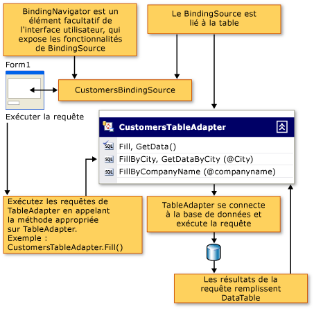

# Remplir des datasets à l’aide de TableAdapters

Un composant TableAdapter remplit un DataSet avec des données de la base de données, en fonction d’une ou de plusieurs requêtes ou procédures stockées que vous spécifiez. Les TableAdapters peuvent également effectuer des ajouts, des mises à jour et des suppressions dans la base de données pour conserver les modifications que vous apportez au DataSet. Vous pouvez également émettre des commandes globales qui ne sont pas liées à une table spécifique.

> [!NOTE]
> Les TableAdapters sont générés par les concepteurs Visual Studio. Si vous créez des jeux de données par programme, utilisez DataAdapter, qui est une classe .NET.

Pour plus d’informations sur les opérations TableAdapter, vous pouvez passer directement à l’une des rubriques suivantes :

|Rubrique|Description|
|-----------|-----------------|
|[Créer et configurer des TableAdapters](../data-tools/create-and-configure-tableadapters.md)|Comment utiliser les concepteurs pour créer et configurer des TableAdapters|
|[Créer des requêtes TableAdapter paramétrées](../data-tools/create-parameterized-tableadapter-queries.md)|Comment permettre aux utilisateurs de fournir des arguments à des procédures ou des requêtes TableAdapter|
|[Accéder directement à la base de données avec un TableAdapter](../data-tools/directly-access-the-database-with-a-tableadapter.md)|Comment utiliser les méthodes DBDirect des TableAdapters|
|[Désactiver les contraintes pendant le remplissage d’un dataset](../data-tools/turn-off-constraints-while-filling-a-dataset.md)|Comment utiliser des contraintes de clé étrangère lors de la mise à jour de données|
|[Guide pratique pour étendre les fonctionnalités d’un TableAdapter](../data-tools/fill-datasets-by-using-tableadapters.md)|Comment ajouter du code personnalisé à des TableAdapters|
|[Lire les données XML dans un dataset](../data-tools/read-xml-data-into-a-dataset.md)|Utilisation de XML|

## Vue d’ensemble de TableAdapter

Les TableAdapters sont des composants générés par le concepteur qui se connectent à une base de données, exécutent des requêtes ou des procédures stockées et remplissent leur DataTable avec les données retournées. Les TableAdapters renvoient également les données mises à jour de votre application à la base de données. Vous pouvez exécuter autant de requêtes que vous le souhaitez sur un TableAdapter tant qu’elles retournent des données qui se conforment au schéma de la table à laquelle le TableAdapter est associé. Le diagramme suivant montre comment les TableAdapters interagissent avec les bases de données et d’autres objets en mémoire :

Alors que les TableAdapters sont conçus avec l' **Concepteur de DataSet**, les classes TableAdapter ne sont pas générées en tant que classes imbriquées de  <xref:System.Data.DataSet> . Ils se trouvent dans des espaces de noms distincts qui sont spécifiques à chaque jeu de données. Par exemple, si vous avez un dataset nommé `NorthwindDataSet` , les TableAdapters qui sont associés à des  <xref:System.Data.DataTable> dans le sont `NorthwindDataSet` dans l' `NorthwindDataSetTableAdapters` espace de noms. Pour accéder à un TableAdapter particulier par programme, vous devez déclarer une nouvelle instance du TableAdapter. Par exemple :

:::code language="csharp" source="../snippets/csharp/VS_Snippets_VBCSharp/VbRaddataTableAdapters/CS/Class1.cs" id="Snippet7":::
:::code language="vb" source="../snippets/visualbasic/VS_Snippets_VBCSharp/VbRaddataTableAdapters/VB/Class1.vb" id="Snippet7":::

## Schéma DataTable associé

Lorsque vous créez un TableAdapter, vous utilisez la requête ou la procédure stockée initiale pour définir le schéma du TableAdapter associé <xref:System.Data.DataTable> . Vous exécutez cette requête ou procédure stockée initiale en appelant la méthode du TableAdapter `Fill` (qui remplit le TableAdapter associé <xref:System.Data.DataTable> ). Toutes les modifications apportées à la requête principale du TableAdapter sont reflétées dans le schéma de la table de données associée. Par exemple, la suppression d’une colonne de la requête principale supprime également la colonne de la table de données associée. Si des requêtes supplémentaires sur le TableAdapter utilisent des instructions SQL qui retournent des colonnes qui ne sont pas dans la requête principale, le concepteur tente de synchroniser les modifications de colonne entre la requête principale et les requêtes supplémentaires.

## Commandes de mise à jour de TableAdapter

La fonctionnalité de mise à jour d’un TableAdapter dépend de la quantité d’informations disponibles dans la requête principale de l' **Assistant TableAdapter**. Par exemple, les TableAdapters qui sont configurés pour extraire des valeurs de plusieurs tables (à l’aide de `JOIN` ), des valeurs scalaires, des vues ou les résultats de fonctions d’agrégation ne sont pas créés initialement avec la possibilité d’envoyer des mises à jour à la base de données sous-jacente. Toutefois, vous pouvez configurer les `INSERT` `UPDATE` commandes, et `DELETE` manuellement dans la fenêtre **Propriétés** .

## requêtes TableAdapter

Les TableAdapters peuvent contenir plusieurs requêtes pour remplir les tables de données qui leur sont associées. Vous pouvez définir autant de requêtes pour un TableAdapter que votre application le requiert, à condition que chaque requête retourne des données qui se conforment au même schéma que la table de données qui lui est associée. Cette fonctionnalité permet à un TableAdapter de charger différents résultats en fonction de critères différents.

Par exemple, si votre application contient une table avec des noms de clients, vous pouvez créer une requête qui remplit la table avec chaque nom de client qui commence par une certaine lettre, et une autre qui remplit la table avec tous les clients qui se trouvent dans le même État. Pour remplir une `Customers` table avec des clients dans un État donné, vous pouvez créer une `FillByState` requête qui accepte un paramètre pour la valeur d’État comme suit : `SELECT * FROM Customers WHERE State = @State` . Vous exécutez la requête en appelant la `FillByState` méthode et en passant la valeur de paramètre comme suit : `CustomerTableAdapter.FillByState("WA")` .

En plus d’ajouter des requêtes qui retournent des données du même schéma que la table de données du TableAdapter, vous pouvez ajouter des requêtes qui retournent des valeurs scalaires (uniques). Par exemple, une requête qui retourne le nombre de clients ( `SELECT Count(*) From Customers` ) est valide pour un `CustomersTableAdapter,` même si les données retournées ne sont pas conformes au schéma de la table.

## Propriété ClearBeforeFill

Par défaut, chaque fois que vous exécutez une requête pour remplir la table de données d’un TableAdapter, les données existantes sont effacées et seuls les résultats de la requête sont chargés dans la table. Affectez à la propriété du TableAdapter la valeur `ClearBeforeFill` `false` si vous souhaitez ajouter ou fusionner les données retournées par une requête aux données existantes dans une table de données. Que vous effaciez ou non les données, vous devez envoyer explicitement des mises à jour à la base de données, si vous souhaitez les rendre persistantes. N’oubliez pas d’enregistrer les modifications apportées aux données de la table avant d’exécuter une autre requête qui remplit la table. Pour plus d’informations, consultez [mettre à jour des données à l’aide d’un TableAdapter](../data-tools/update-data-by-using-a-tableadapter.md).

## Héritage de TableAdapter

Les TableAdapters étendent les fonctionnalités des adaptateurs de données standard en encapsulant une classe configurée <xref:System.Data.Common.DataAdapter> . Par défaut, le TableAdapter hérite de la <xref:System.ComponentModel.Component> classe et ne peut pas être casté en <xref:System.Data.Common.DataAdapter> classe. Le cast d’un TableAdapter en <xref:System.Data.Common.DataAdapter> classe génère une <xref:System.InvalidCastException> erreur. Pour modifier la classe de base d’un TableAdapter, vous pouvez spécifier une classe qui dérive de <xref:System.ComponentModel.Component> dans la propriété de **classe de base** du tableadapter dans l' **Concepteur de DataSet**.

## Méthodes et propriétés TableAdapter

La classe TableAdapter n’est pas un type .NET. Cela signifie que vous ne pouvez pas le Rechercher dans la documentation ou dans l' **Explorateur d’objets**. Il est créé au moment de la conception lorsque vous utilisez l’un des assistants mentionnés précédemment. Le nom assigné à un TableAdapter lorsque vous le créez est basé sur le nom de la table que vous utilisez. Par exemple, lorsque vous créez un TableAdapter basé sur une table dans une base de données nommée `Orders` , le TableAdapter est nommé `OrdersTableAdapter` . Le nom de classe du TableAdapter peut être modifié à l’aide de la propriété **Name** dans l' **Concepteur de DataSet**.

Voici les méthodes et propriétés couramment utilisées des TableAdapters :

|Membre|Description|
|------------|-----------------|
|`TableAdapter.Fill`|Remplit la table de données associée du TableAdapter avec les résultats de la commande du TableAdapter `SELECT` .|
|`TableAdapter.Update`|Renvoie les modifications à la base de données et retourne un entier qui représente le nombre de lignes affectées par la mise à jour. Pour plus d’informations, consultez [mettre à jour des données à l’aide d’un TableAdapter](../data-tools/update-data-by-using-a-tableadapter.md).|
|`TableAdapter.GetData`|Retourne un nouveau <xref:System.Data.DataTable> qui est rempli avec les données.|
|`TableAdapter.Insert`|Crée une nouvelle ligne dans la table de données. Pour plus d’informations, consultez [Insérer de nouveaux enregistrements dans une base de données](../data-tools/insert-new-records-into-a-database.md).|
|`TableAdapter.ClearBeforeFill`|Détermine si une table de données est vidée avant d’appeler l’une des `Fill` méthodes.|

## Méthode de mise à jour de TableAdapter

Les TableAdapters utilisent des commandes de données pour lire et écrire à partir de la base de données. Utilisez la `Fill` requête initiale (principale) du TableAdapter comme base pour créer le schéma de la table de données associée, ainsi que les `InsertCommand` commandes, `UpdateCommand` et `DeleteCommand` associées à la `TableAdapter.Update` méthode. L’appel de la méthode d’un TableAdapter `Update` exécute les instructions qui ont été créées lors de la configuration initiale du TableAdapter, pas l’une des requêtes supplémentaires que vous avez ajoutées à l’aide de l' **Assistant Configuration de requêtes TableAdapter**.

Quand vous utilisez un TableAdapter, il effectue les mêmes opérations avec les commandes que vous exécutez généralement. Par exemple, lorsque vous appelez la méthode de l’adaptateur `Fill` , l’adaptateur exécute la commande de données dans sa `SelectCommand` propriété et utilise un lecteur de données (par exemple, <xref:System.Data.SqlClient.SqlDataReader> ) pour charger le jeu de résultats dans la table de données. De même, lorsque vous appelez la méthode de l’adaptateur `Update` , il exécute la commande appropriée (dans `UpdateCommand` les `InsertCommand` Propriétés, et `DeleteCommand` ) pour chaque enregistrement modifié dans la table de données.

> [!NOTE]
> S’il y a suffisamment d’informations dans la requête principale, les `InsertCommand` `UpdateCommand` commandes, et `DeleteCommand` sont créées par défaut lors de la génération du TableAdapter. Si la requête principale du TableAdapter est plus qu’une instruction de table unique `SELECT` , il est possible que le concepteur ne soit pas en mesure de générer `InsertCommand` , `UpdateCommand` et `DeleteCommand` . Si ces commandes ne sont pas générées, vous risquez de recevoir une erreur lors de l’exécution de la `TableAdapter.Update` méthode.

## GenerateDbDirectMethods de TableAdapter

En plus de `InsertCommand` , `UpdateCommand` et `DeleteCommand` , les TableAdapters sont créés avec des méthodes que vous pouvez exécuter directement sur la base de données. Vous pouvez appeler ces méthodes ( `TableAdapter.Insert` , `TableAdapter.Update` et `TableAdapter.Delete` ) directement pour manipuler les données dans la base de données. Cela signifie que vous pouvez appeler ces méthodes individuelles à partir de votre code au lieu d’appeler `TableAdapter.Update` pour gérer les insertions, les mises à jour et les suppressions en attente pour la table de données associée.

Si vous ne souhaitez pas créer ces méthodes directes, affectez à la propriété **GenerateDBDirectMethods** du TableAdapter la valeur `false` (dans la fenêtre **Propriétés** ). Les requêtes supplémentaires ajoutées au TableAdapter sont des requêtes autonomes, elles ne génèrent pas ces méthodes.

## Prise en charge de TableAdapter pour les types Nullable

Les TableAdapters prennent en charge les types Nullable `Nullable(Of T)` et `T?` . Pour plus d’informations sur les types Nullable dans Visual Basic, consultez [Types valeur Nullable](/dotnet/visual-basic/programming-guide/language-features/data-types/nullable-value-types). Pour plus d’informations sur les types Nullable en C#, consultez [utilisation de types Nullable](/dotnet/csharp/programming-guide/nullable-types/using-nullable-types).

## Référence TableAdapterManager

Par défaut, une classe TableAdapterManager est générée lorsque vous créez un DataSet qui contient des tables associées. Pour empêcher la génération de la classe, remplacez la valeur de la `Hierarchical Update` propriété du jeu de données par false. Quand vous faites glisser une table qui a une relation sur l’aire de conception d’un Windows Form ou d’une page WPF, Visual Studio déclare une variable membre de la classe. Si vous n’utilisez pas DataBinding, vous devez déclarer la variable manuellement.

La classe TableAdapterManager n’est pas un type .NET. Par conséquent, vous ne pouvez pas le Rechercher dans la documentation. Il est créé au moment du design dans le cadre du processus de création du jeu de données.

Voici les méthodes et les propriétés fréquemment utilisées de la `TableAdapterManager` classe :

|Membre|Description|
|------------|-----------------|
|Méthode `UpdateAll`|Enregistre toutes les données de toutes les tables de données.|
|Propriété`BackUpDataSetBeforeUpdate`|Détermine si une copie de sauvegarde du DataSet doit être créée avant l’exécution de la `TableAdapterManager.UpdateAll` méthode. Expression.|
|*TableName* `TableAdapter` propriété|Représente un TableAdapter. Le TableAdapterManager généré contient une propriété pour chaque `TableAdapter` qu’il gère. Par exemple, un jeu de données avec une table Customers et Orders génère avec un TableAdapterManager qui contient `CustomersTableAdapter` les `OrdersTableAdapter` Propriétés et.|
|Propriété`UpdateOrder`|Contrôle l’ordre des commandes INSERT, Update et DELETE individuelles. Affectez-lui l’une des valeurs de l' `TableAdapterManager.UpdateOrderOption` énumération.   Par défaut, `UpdateOrder` est défini sur **InsertUpdateDelete**. Cela signifie que les insertions, les mises à jour, puis les suppressions sont effectuées pour toutes les tables du DataSet.|

## Sécurité

Quand vous utilisez des commandes de données avec une propriété CommandType définie sur <xref:System.Data.CommandType.Text> , vérifiez attentivement les informations envoyées à partir d’un client avant de les transmettre à votre base de données. Des utilisateurs malveillants peuvent tenter d’envoyer (injecter) des instructions SQL modifiées ou supplémentaires afin d’accéder à la base de données ou de l’endommager. Avant de transférer une entrée d’utilisateur à une base de données, vérifiez toujours que les informations sont valides. Une meilleure pratique consiste à toujours utiliser des requêtes paramétrables ou des procédures stockées lorsque cela est possible.

## Voir aussi

- [Outils de DataSet](../data-tools/dataset-tools-in-visual-studio.md)
