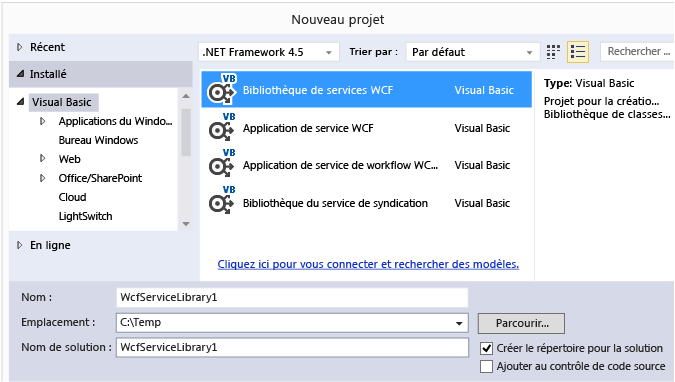

# Walkthrough: Creating and Accessing WCF Services
Cette procédure pas à pas montre comment créer un simple service [!INCLUDE[vsindigo](../data-tools/includes/vsindigo_md.md)], le tester et y accéder à partir d'une application Windows Forms.  
  
 [!INCLUDE[note_settings_general](../data-tools/includes/note_settings_general_md.md)]  
  
## Création du service  
  
#### Pour créer un service WCF  
  
1.  Dans le menu **Fichier**, pointez sur **Nouveau**, puis cliquez sur **Projet**.  
  
2.  Dans la boîte de dialogue **Nouveau projet**, développez le nœud **Visual Basic** ou **Visual C\#**, puis cliquez sur **WCF**, puis sur **Bibliothèque du service WCF**.  Cliquez sur **OK** pour ouvrir le projet.  
  
       
  
    > [!NOTE]
    >  Un service actif est créé, qui peut être testé et est accessible.  Les deux étapes suivantes montrent comment vous pouvez modifier la méthode par défaut pour utiliser un autre type de données.  Dans une application réelle, vous ajouteriez également vos propres fonctions au service.  
  
3.    
  
     Dans l'**Explorateur de solutions**, double\-cliquez sur IService1.vb ou IService1.cs, et recherchez la ligne suivante :  
  
     [!code-cs[WCFWalkthrough#4](../data-tools/codesnippet/CSharp/walkthrough-creating-a-simple-wcf-service-in-windows-forms_1.cs)]
     [!code-vb[WCFWalkthrough#4](../data-tools/codesnippet/VisualBasic/walkthrough-creating-a-simple-wcf-service-in-windows-forms_1.vb)]  
  
     Modifiez le type du paramètre `value` en `String` :  
  
     [!code-cs[WCFWalkthrough#1](../data-tools/codesnippet/CSharp/walkthrough-creating-a-simple-wcf-service-in-windows-forms_2.cs)]
     [!code-vb[WCFWalkthrough#1](../data-tools/codesnippet/VisualBasic/walkthrough-creating-a-simple-wcf-service-in-windows-forms_2.vb)]  
  
     Dans le code ci\-dessus, notez les attributs `<OperationContract()>` ou `[OperationContract]`.  Ces attributs sont obligatoires pour toute méthode exposée par le service.  
  
4.    
  
     Dans l'**Explorateur de solutions**, double\-cliquez sur Service1.vb ou Service1.cs, puis recherchez la ligne suivante :  
  
     [!code-vb[WCFWalkthrough#5](../data-tools/codesnippet/VisualBasic/walkthrough-creating-a-simple-wcf-service-in-windows-forms_3.vb)]
     [!code-cs[WCFWalkthrough#5](../data-tools/codesnippet/CSharp/walkthrough-creating-a-simple-wcf-service-in-windows-forms_3.cs)]  
  
     Modifiez le type du paramètre value en `String` :  
  
     [!code-cs[WCFWalkthrough#2](../data-tools/codesnippet/CSharp/walkthrough-creating-a-simple-wcf-service-in-windows-forms_4.cs)]
     [!code-vb[WCFWalkthrough#2](../data-tools/codesnippet/VisualBasic/walkthrough-creating-a-simple-wcf-service-in-windows-forms_4.vb)]  
  
## Test du service  
  
#### Pour tester un service WCF  
  
1.  Appuyez sur **F5** pour exécuter le service.  Un formulaire **Client test WCF** s'affiche et charge le service.  
  
2.  Dans le formulaire **Client test WCF**, double\-cliquez sur la méthode **GetData\(\)** sous **IService1**.  L'onglet **GetData** s'affiche.  
  
       
  
3.  Dans la zone **Demande** box, sélectionnez le champ **Valeur** et entrez `Hello`.  
  
       
  
4.  Cliquez sur le bouton **Appeler**.  Si une boîte de dialogue **Avertissement de sécurité** s'affiche, cliquez sur **OK**.  Les résultats s'affichent dans la zone **Réponse**.  
  
       
  
5.  Dans le menu **Fichier**, cliquez sur **Quitter** pour fermer le formulaire de test.  
  
## Accès au service  
  
#### Pour faire référence à un service WCF  
  
1.  Dans le menu **Fichier**, pointez sur **Ajouter**, puis cliquez sur **Nouveau projet**.  
  
2.  Dans la boîte de dialogue **Nouveau projet**, développez le nœud **Visual Basic** ou **Visual C\#**, et sélectionnez **Windows**, puis **Application Windows Forms**.  Cliquez sur **OK** pour ouvrir le projet.  
  
       
  
3.  Cliquez avec le bouton droit sur **WindowsApplication1**, puis cliquez sur **Ajouter une référence de service**.  La boîte de dialogue **Ajouter une référence de service** s'affiche.  
  
4.  Dans la boîte de dialogue **Ajouter une référence de service**, cliquez sur **Découvrir**.  
  
       
  
     **Service1** s'affiche dans le volet **Services**.  
  
5.  Cliquez sur **OK** pour ajouter la référence de service.  
  
#### Pour générer une application cliente  
  
1.  Dans l'**Explorateur de solutions**, double\-cliquez sur **Form1.vb** ou **Form1.cs** pour ouvrir le Concepteur Windows Forms, s'il ne l'est déjà.  
  
2.  À partir de la **boîte à outils**, faites glisser vers le formulaire un contrôle `TextBox`, un contrôle `Label` et un contrôle `Button`.  
  
       
  
3.  Double\-cliquez sur le contrôle `Button`, puis ajoutez le code suivant au gestionnaire d'événements `Click` :  
  
     [!code-cs[WCFWalkthrough#3](../data-tools/codesnippet/CSharp/walkthrough-creating-a-simple-wcf-service-in-windows-forms_5.cs)]
     [!code-vb[WCFWalkthrough#3](../data-tools/codesnippet/VisualBasic/walkthrough-creating-a-simple-wcf-service-in-windows-forms_5.vb)]  
  
4.  Dans l'**Explorateur de solutions**, cliquez avec le bouton droit sur **WindowsApplication1**, puis cliquez sur **Définir comme projet de démarrage**.  
  
5.  Appuyez sur **F5** pour exécuter le projet.  Entrez un texte et cliquez sur le bouton.  Le message « Vous avez entré : » s'affichera, suivi du texte que vous avez entré.  
  
       
  
## Voir aussi  
 [Exemple de consommation des services ASMX et WCF](http://msdn.microsoft.com/fr-fr/788ddf2c-2ac1-416b-8789-2fbb1e29b8fe)