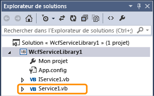
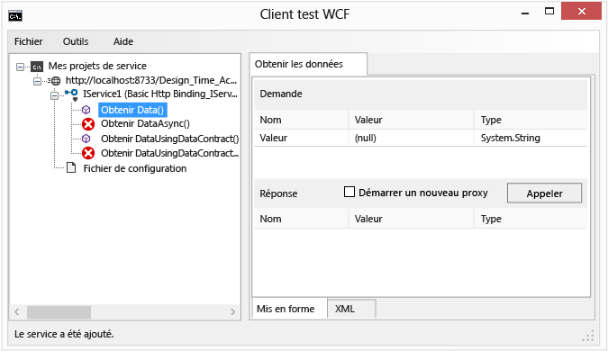
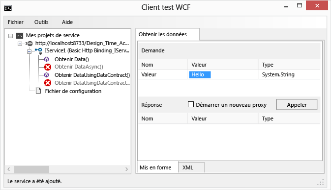
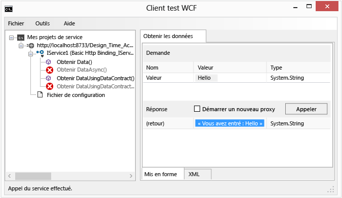
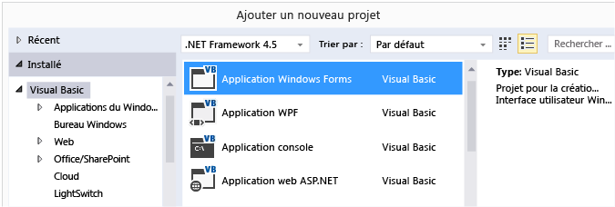
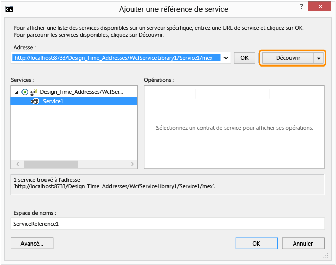
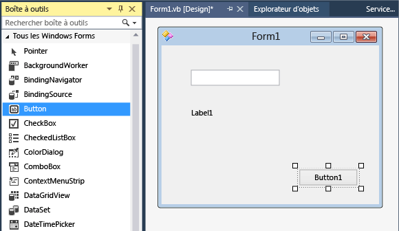

# Procédure pas à pas : création d’un service WCF simple dans Windows Forms

Cette procédure pas à pas montre comment créer un service simple Windows Communication Foundation (WCF), le tester, puis y accéder à partir d’une application Windows Forms.

[!INCLUDE[note_settings_general](../data-tools/includes/note_settings_general_md.md)]

## Créer un service

1. Ouvrez Visual Studio.

::: moniker range="vs-2017"

2. Dans le menu **Fichier**, choisissez **Nouveau** > **Projet**.

3. Dans la boîte de dialogue **nouveau projet** , développez le nœud **Visual Basic** ou **Visual C#** , puis choisissez **WCF**, puis **bibliothèque de services WCF**.

4. Cliquez sur **OK** pour créer le projet.

   

::: moniker-end

::: moniker range=">=vs-2019"

2. Dans la fenêtre Démarrer, choisissez **créer un nouveau projet**.

3. Tapez **bibliothèque de services WCF** dans la zone de recherche de la page **créer un nouveau projet** . Sélectionnez le modèle C# ou Visual Basic pour la **bibliothèque de services WCF**, puis cliquez sur **suivant**.

   

   > [!TIP]
   > Si vous ne voyez aucun modèle, vous devrez peut-être installer le composant **Windows Communication Foundation** de Visual Studio. Choisissez **installer d’autres outils et fonctionnalités** pour ouvrir Visual Studio installer. Choisissez l’onglet **composants individuels** , faites défiler jusqu’à **activités de développement**, puis sélectionnez **Windows Communication Foundation**. Cliquez sur **Modifier**.

4. Dans la page **configurer votre nouveau projet** , cliquez sur **créer**.

::: moniker-end

   > [!NOTE]
   > Un service actif est créé, qui peut être testé et est accessible. Les deux étapes suivantes montrent comment vous pouvez modifier la méthode par défaut pour utiliser un autre type de données. Dans une application réelle, vous ajouteriez également vos propres fonctions au service.

5. Dans **Explorateur de solutions**, double-cliquez sur **IService1. vb** ou **IService1.cs**.

   

   Recherchez la ligne suivante :

   [!code-csharp[WCFWalkthrough#4](../data-tools/codesnippet/CSharp/walkthrough-creating-a-simple-wcf-service-in-windows-forms_1.cs)]
   [!code-vb[WCFWalkthrough#4](../data-tools/codesnippet/VisualBasic/walkthrough-creating-a-simple-wcf-service-in-windows-forms_1.vb)]

   Remplacez le type du `value` paramètre par String :

   [!code-csharp[WCFWalkthrough#1](../data-tools/codesnippet/CSharp/walkthrough-creating-a-simple-wcf-service-in-windows-forms_2.cs)]
   [!code-vb[WCFWalkthrough#1](../data-tools/codesnippet/VisualBasic/walkthrough-creating-a-simple-wcf-service-in-windows-forms_2.vb)]

   Dans le code ci-dessus, notez les attributs `<OperationContract()>` ou `[OperationContract]`. Ces attributs sont obligatoires pour toute méthode exposée par le service.

6. Dans **Explorateur de solutions**, double-cliquez sur **Service1. vb** ou **Service1.cs**.

   

   Recherchez la ligne suivante :

   [!code-vb[WCFWalkthrough#5](../data-tools/codesnippet/VisualBasic/walkthrough-creating-a-simple-wcf-service-in-windows-forms_3.vb)]
   [!code-csharp[WCFWalkthrough#5](../data-tools/codesnippet/CSharp/walkthrough-creating-a-simple-wcf-service-in-windows-forms_3.cs)]

   Remplacez le type du `value` paramètre par String :

   [!code-csharp[WCFWalkthrough#2](../data-tools/codesnippet/CSharp/walkthrough-creating-a-simple-wcf-service-in-windows-forms_4.cs)]
   [!code-vb[WCFWalkthrough#2](../data-tools/codesnippet/VisualBasic/walkthrough-creating-a-simple-wcf-service-in-windows-forms_4.vb)]

## Testez le service

1. Appuyez sur **F5** pour exécuter le service. Un formulaire de **client test WCF** s’affiche et charge le service.

2. Dans le formulaire **Client test WCF**, double-cliquez sur la méthode **GetData()** sous **IService1**. L’onglet **GetData** s’affiche.

     

3. Dans la zone **Demande**, sélectionnez le champ **Valeur** et tapez `Hello`.

     

4. Cliquez sur le bouton **Appeler**. Si une boîte de dialogue d' **avertissement de sécurité** s’affiche, cliquez sur **OK**. Le résultat s’affiche dans la zone **réponse** .

     

5. Dans le menu **Fichier**, cliquez sur **Quitter** pour fermer le formulaire de test.

## Accéder au service

### Référencer le service WCF

1. Dans le menu **fichier** , pointez sur **Ajouter** , puis cliquez sur **nouveau projet**.

2. Dans la boîte de dialogue **nouveau projet** , développez le nœud **Visual Basic** ou **Visual C#** , sélectionnez **Windows**, puis sélectionnez **Windows Forms application**. Cliquez sur **OK** pour ouvrir le projet.

     

3. Cliquez avec le bouton droit sur **WindowsApplication1**, puis cliquez sur **Ajouter une référence de service**. **La boîte de dialogue **Ajouter une référence de service s'affiche.

4. Dans la boîte de dialogue **Ajouter une référence de service**, cliquez sur **Découvrir**.

     

     **Service1** s’affiche dans le volet **services** .

5. Cliquez sur **OK** pour ajouter la référence de service.

### Création d'une application cliente

1. Dans l’**Explorateur de solutions**, double-cliquez sur **Form1.vb** ou **Form1.cs** pour ouvrir le Concepteur Windows Forms, s’il ne l’est pas déjà.

2. À partir de la **boîte à outils**, faites glisser vers le formulaire un contrôle `TextBox`, un contrôle `Label` et un contrôle `Button`.

     

3. Double-cliquez sur le contrôle `Button`, puis ajoutez le code suivant au gestionnaire d'événements `Click` :

     [!code-csharp[WCFWalkthrough#3](../data-tools/codesnippet/CSharp/walkthrough-creating-a-simple-wcf-service-in-windows-forms_5.cs)]
     [!code-vb[WCFWalkthrough#3](../data-tools/codesnippet/VisualBasic/walkthrough-creating-a-simple-wcf-service-in-windows-forms_5.vb)]

4. Dans l’**Explorateur de solutions**, cliquez avec le bouton droit sur **WindowsApplication1**, puis cliquez sur **Définir comme projet de démarrage**.

5. Appuyez sur **F5** pour exécuter le projet. Entrez un texte et cliquez sur le bouton. L’étiquette affiche « vous avez entré : » et affiche le texte que vous avez entré.

     

## Voir aussi

- [Services Windows Communication Foundation et services de données WCF dans Visual Studio](../data-tools/windows-communication-foundation-services-and-wcf-data-services-in-visual-studio.md)
