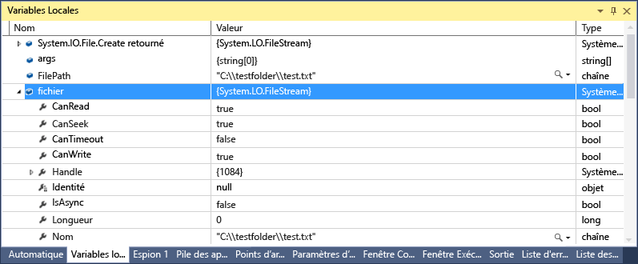
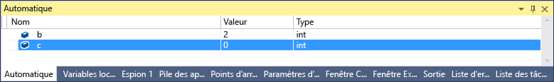
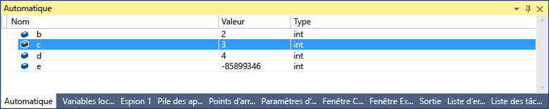
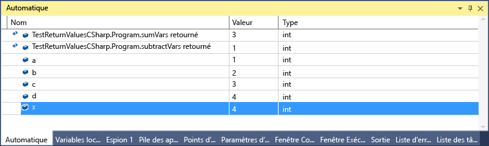

# <a name="inspect-variables-in-the-autos-and-locals-windows"></a>Inspecter les variables dans les fenêtres automatique et variables locales

Les fenêtres **automatique** et **variables locales** affichent des valeurs de variables pendant le débogage. Les fenêtres sont uniquement disponibles pendant une session de débogage. La fenêtre **automatique** affiche les variables utilisées autour du point d’arrêt actuel. La fenêtre variables **locales** affiche les variables définies dans la portée locale, qui est généralement la fonction ou la méthode actuelle.

> [!NOTE]
> S’il s’agit de la première fois que vous essayez de déboguer du code, vous souhaiterez peut-être lire le [débogage pour les débutants](../debugger/debugging-absolute-beginners.md) et les [techniques de débogage et les outils de débogage](../debugger/write-better-code-with-visual-studio.md) avant de passer en revue cet article.

 La fenêtre **automatique** est disponible pour le code C#, Visual Basic, C++ et Python, mais pas pour JavaScript ni F #.

Pour ouvrir la fenêtre **automatique** , pendant le débogage, sélectionnez **Déboguer**  >  **Windows**  >  **automatique**, ou appuyez sur **CTRL** + **ALT** + **V**  >  **A**.

Pour ouvrir la fenêtre **variables locales** , pendant le débogage, sélectionnez **Déboguer** les  >    >  **paramètres régionaux** Windows ou appuyez sur **ALT** + **4**.

> [!NOTE]
> Cette rubrique s’applique à Visual Studio sur Windows. Pour Visual Studio pour Mac, consultez [visualisations de données dans Visual Studio pour Mac](/visualstudio/mac/data-visualizations).

## <a name="use-the-autos-and-locals-windows"></a>Utiliser les fenêtres automatique et variables locales

Les tableaux et les objets apparaissent dans les fenêtres **automatique** et **variables locales** sous la forme de contrôles d’arborescence. Sélectionnez la flèche à gauche d’un nom de variable pour développer la vue et afficher les champs et les propriétés. Voici un exemple d' <xref:System.IO.FileStream?displayProperty=fullName> objet dans la fenêtre **variables locales** :



Une valeur rouge dans la fenêtre **variables locales** ou **automatique** signifie que la valeur a changé depuis la dernière évaluation. La modification peut provenir d’une précédente session de débogage ou parce que vous avez modifié la valeur dans la fenêtre.

Le format numérique par défaut dans les fenêtres du débogueur est décimal. Pour le remplacer par une valeur hexadécimale, cliquez avec le bouton droit dans la fenêtre **variables locales** ou **automatique** et sélectionnez **affichage hexadécimal**. Cette modification affecte toutes les fenêtres du débogueur.

## <a name="edit-variable-values-in-the-autos-or-locals-window"></a>Modifier les valeurs des variables dans la fenêtre automatique ou variables locales

Pour modifier les valeurs de la plupart des variables dans les fenêtres **automatique** ou variables **locales** , double-cliquez sur la valeur et entrez la nouvelle valeur.

Vous pouvez entrer une expression pour une valeur, par exemple `a + b`. Le débogueur accepte la plupart des expressions de langage valides.

Dans le code C++ natif, vous devrez peut-être qualifier le contexte d’un nom de variable. Pour plus d’informations, consultez [opérateur de contexte (C++)](../debugger/context-operator-cpp.md).

>[!CAUTION]
>Assurez-vous que vous comprenez les conséquences avant de modifier des valeurs et des expressions. Voici quelques problèmes possibles :
>
>- Évaluer certaines expressions peut modifier la valeur d’une variable ou affecter d’une manière ou d’une autre l’état de votre programme. Par exemple, `var1 = ++var2` l’évaluation de modifie la valeur de `var1` et de `var2` . Ces expressions sont réputées avoir des [effets secondaires](https://en.wikipedia.org/wiki/Side_effect_\(computer_science\)). Les effets secondaires peuvent entraîner des résultats inattendus si vous n’en avez pas conscience.
>
>- Modifier des valeurs à virgule flottante risque d’entraîner quelques légères imprécisions, dues à la conversion en binaire de la partie décimale des composants fractionnaires. Même une modification apparemment anodine peut entraîner des modifications de certains bits dans la variable à virgule flottante.

::: moniker range=">= vs-2019" 
## <a name="search-in-the-autos-or-locals-window"></a>Rechercher dans la fenêtre automatique ou variables locales

Vous pouvez rechercher des mots clés dans les colonnes nom, valeur et type de la fenêtre **automatique** ou **variables locales** à l’aide de la barre de recherche au-dessus de chaque fenêtre. Appuyez sur entrée ou sélectionnez l’une des flèches pour exécuter une recherche. Pour annuler une recherche en cours, sélectionnez l’icône « x » dans la barre de recherche.

Utilisez les flèches gauche et droite (Maj + F3 et F3, respectivement) pour naviguer entre les correspondances trouvées.


Pour rendre votre recherche plus ou moins complète, utilisez la liste déroulante de **recherche plus approfondie** en haut de la fenêtre **automatique** ou **variables locales** pour sélectionner le nombre de niveaux que vous souhaitez rechercher dans les objets imbriqués. 

## <a name="pin-properties-in-the-autos-or-locals-window"></a>Épingler les propriétés dans la fenêtre automatique ou variables locales

> [!NOTE]
> Cette fonctionnalité est prise en charge pour .NET Core 3,0 ou version ultérieure.

Vous pouvez inspecter rapidement des objets en fonction de leurs propriétés dans les fenêtres automatique et variables locales avec l’outil **Propriétés de regroupement** .  Pour utiliser cet outil, pointez sur une propriété et sélectionnez l’icône d’épingle qui s’affiche ou cliquez avec le bouton droit et sélectionnez l’option **épingler le membre en tant que favori** dans le menu contextuel résultant.  Cela propage cette propriété vers le haut de la liste de propriétés de l’objet, et le nom et la valeur de la propriété s’affichent dans la colonne **valeur** .  Pour désépingler une propriété, sélectionnez à nouveau l’icône d’épingle ou sélectionnez l’option **détacher le membre en tant que favori** dans le menu contextuel.


Vous pouvez également activer/désactiver les noms de propriété et exclure les propriétés non épinglées lorsque vous affichez la liste des propriétés de l’objet dans les fenêtres automatique ou variables locales.  Vous pouvez accéder à chaque option en sélectionnant les boutons de la barre d’outils au-dessus des fenêtres automatique ou variables locales.

 
 des favoris 

::: moniker-end

## <a name="change-the-context-for-the-autos-or-locals-window"></a>Modifier le contexte de la fenêtre automatique ou variables locales

Vous pouvez utiliser la barre d’outils **emplacement de débogage** pour sélectionner la fonction, le thread ou le processus souhaité, ce qui modifie le contexte des fenêtres **automatique** et **variables locales** .

Pour activer la barre d’outils **emplacement de débogage** , cliquez dans une partie vide de la zone de la barre d’outils et sélectionnez **emplacement de débogage** dans la liste déroulante, ou sélectionnez **Afficher** les  >  **barres d’outils**  >  **emplacement de débogage**.

Définissez un point d’arrêt et démarrez le débogage. Lorsque le point d’arrêt est atteint, l’exécution s’interrompt et vous pouvez voir l’emplacement dans la barre d’outils **emplacement de débogage** .


## <a name="variables-in-the-autos-window-c-c-visual-basic-python"></a><a name="bkmk_whatvariables"></a> Variables dans la fenêtre automatique (C#, C++, Visual Basic, Python)

Les différents langages de code affichent différentes variables dans la fenêtre **automatique** .

- En C# et en Visual Basic, la fenêtre **Automatique** affiche les variables utilisées sur la ligne actuelle ou précédente. Par exemple, en C# ou Visual Basic Code, déclarez les quatre variables suivantes :

   ```csharp
       public static void Main()
       {
          int a, b, c, d;
          a = 1;
          b = 2;
          c = 3;
          d = 4;
       }
   ```

   Définissez un point d’arrêt sur la ligne `c = 3;` et démarrez le débogueur. Lorsque l’exécution est suspendue, la fenêtre **automatique** affiche :

   

   La valeur de `c` est 0, car la ligne n' `c = 3` a pas encore été exécutée.

- En C++, la fenêtre **automatique** affiche les variables utilisées dans au moins trois lignes avant la ligne actuelle où l’exécution est suspendue. Par exemple, dans le code C++, déclarez six variables :

   ```C++
       void main() {
           int a, b, c, d, e, f;
           a = 1;
           b = 2;
           c = 3;
           d = 4;
           e = 5;
           f = 6;
       }
   ```

    Définissez un point d’arrêt sur la ligne `e = 5;` et exécutez le débogueur. Lorsque l’exécution s’arrête, la fenêtre **automatique** s’affiche :

    

    La variable `e` n’est pas initialisée, car la ligne n' `e = 5` a pas encore été exécutée.

## <a name="view-return-values-of-method-calls"></a><a name="bkmk_returnValue"></a> View return values of method calls
 Dans le code .NET et C++, vous pouvez examiner les valeurs de retour dans la fenêtre **automatique** lorsque vous exécutez un pas à pas principal ou hors d’un appel de méthode. L’affichage des valeurs de retour des appels de méthode peut s’avérer utile lorsqu’ils ne sont pas stockés dans des variables locales. Une méthode peut être utilisée en tant que paramètre, ou en tant que valeur de retour d’une autre méthode.

 Par exemple, le code C# suivant ajoute les valeurs de retour de deux fonctions :

```csharp
static void Main(string[] args)
{
    int a, b, c, d;
    a = 1;
    b = 2;
    c = 3;
    d = 4;
    int x = sumVars(a, b) + subtractVars(c, d);
}

private static int sumVars(int i, int j)
{
    return i + j;
}

private static int subtractVars(int i, int j)
{
    return j - i;
}
```

Pour afficher les valeurs de retour des `sumVars()` `subtractVars()` appels de méthode et dans la fenêtre automatique :

1. Définissez un point d’arrêt sur la ligne `int x = sumVars(a, b) + subtractVars(c, d);` .

1. Démarrez le débogage et, lorsque l’exécution s’interrompt au point d’arrêt, sélectionnez **pas à pas principal** ou appuyez sur **F10**. Les valeurs de retour suivantes doivent apparaître dans la fenêtre **automatique** :

  

## <a name="see-also"></a>Voir aussi

- [Qu’est-ce que le débogage ?](../debugger/what-is-debugging.md)
- [Techniques et outils de débogage](../debugger/write-better-code-with-visual-studio.md)
- [Premier aperçu du débogage](../debugger/debugger-feature-tour.md)
- [Fenêtres du débogueur](../debugger/debugger-windows.md)
