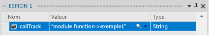
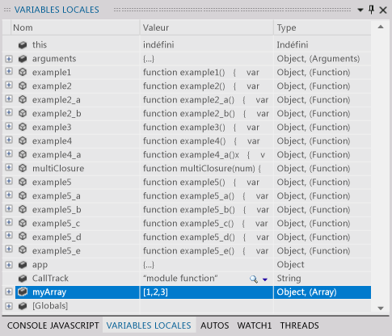
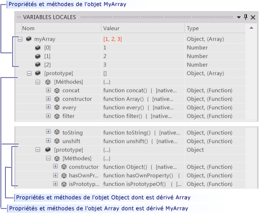
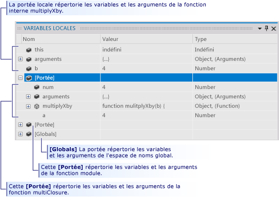

# Contrôler l’exécution d’une application UWP dans une session de débogage de Visual Studio (JavaScript)
Ce guide de démarrage rapide montre comment naviguer dans le débogueur Visual Studio, et comment afficher l’état du programme dans une session.  
  
 Ce guide de démarrage rapide s'adresse aux développeurs qui découvrent le débogage avec Visual Studio et aux développeurs qui souhaitent apprendre à naviguer dans une session de débogage Visual Studio. Il n'explique pas les techniques de débogage. Les fonctions figurant dans l'exemple de code sont destinées uniquement à illustrer les procédures de débogage décrites dans cette rubrique. Ces fonctions n'appliquent pas les meilleures pratiques en matière de conception d'application ou de fonction. En fait, vous allez rapidement découvrir que les méthodes et l’application elle-même font peu de choses.  
  
 Les sections de ce guide de démarrage rapide ont été conçues pour être aussi indépendantes que possible. Vous pouvez sauter les sections qui contiennent des informations avec lesquelles vous êtes déjà familiarisé. De plus, vous n'êtes pas obligé de créer un exemple d'application. Nous vous le conseillons cependant et nous avons fait en sorte que ce processus soit le plus simple possible.  
  
 **Raccourcis clavier du débogueur.** La navigation dans le débogueur Visual Studio est optimisée pour la souris et le clavier. Plusieurs étapes dans cette rubrique présentent l'accélérateur clavier ou la touche de raccourci dans une note entre parenthèses. Par exemple, (clavier : F5) indique que la touche F5 permet de démarrer ou de continuer l'exécution du débogueur.  
  
> [!NOTE]
>  **Le modèle Module**  
>   
>  Les applications UWP utilisent souvent le code JavaScript *modèle Module* pour encapsuler des données et des fonctions dans une page. Le modèle Module utilise une fermeture unique, anonyme et à exécution automatique pour séparer la fonctionnalité de page de l'espace de noms global. Dans cette rubrique, nous appelons cette fonction le *module*.  
  
## Dans cette rubrique  
 Vous allez apprendre à :  
  
 [Créer un exemple d'application](#BKMK_Create_the_sample_app)  
  
 [Définir et exécuter jusqu'à un point d'arrêt, effectuer un pas à pas détaillé dans une fonction et examiner les données de programme](#BKMK_Set_and_run_to_a_breakpoint__step_into_a_function__and_examine_program_data)  
  
 [Effectuer un pas à pas détaillé, principal et sortant](#BKMK_Step_into__over__and_out_of_functions)  
  
 [Définir un point d'arrêt conditionnel, exécuter le curseur et visualiser une variable](#BKMK_Set_a_conditional_breakpoint__run_to_the_cursor__and_visualize_a_variable)  
  
 [Afficher des données de variables dans la fenêtre Variables locales](#BKMK_View_variable_data_in_the_Locals_window)  
  
-   [Afficher des données de variables et la chaîne prototype d'un objet](#BKMK_View_variable_data_and_the_prototype_chain_of_an_object)  
  
-   [Examiner les données de chaîne de portée](#BKMK_Examine_scope_chain_data)  
  
 [Accéder au code à l'aide de la fenêtre Pile des appels](#BKMK_Navigate_to_code_by_using_the_Call_Stack_window)  
  
##   Créer un exemple d'application  
 Débogage concerne le code, par conséquent, l’exemple d’application utilise l’infrastructure de l’application UWP uniquement pour créer un fichier source dans lequel vous pouvez voir comment fonctionne la navigation dans une session de débogage et comment examiner l’état du programme. Tout le code que vous appellerez est appelé à partir de la fonction `module` du fichier default.js. Aucun contrôle n’est ajouté et aucun événement n’est géré.  
  
1.  **Créer une application JavaScript UWP vide.** Ouvrez Visual Studio. Sur la page d'accueil, cliquez sur le lien **Nouveau projet** . Sur le **nouveau projet** boîte de dialogue, choisissez **JavaScript** dans les **installé** liste, puis choisissez **Windows universel**. Dans la liste des modèles de projet, choisissez **application vide (Windows universel)**. Visual Studio crée une solution et un projet et affiche le fichier default.htm dans l'éditeur de code.  
  
     Notez les fichiers de script qui sont chargés dans la page.  
  
    -   Les fichiers `base.js` et `ui.js` créent la **Bibliothèque Windows pour JavaScript**. La bibliothèque Windows pour JavaScript est un ensemble de JavaScript et des fichiers CSS qui le rendent plus facile de créent des applications UWP à l’aide de JavaScript. Vous l’utilisez avec HTML, CSS et Windows Runtime pour créer votre application.  
  
    -   Votre code commence dans le fichier `default.js`  .  
  
2.  **Ouvrir le fichier source default.js.** Dans l’Explorateur de solutions, ouvrez le nœud **js** et choisissez `default.js`.  
  
3.  **Remplacer le contenu de la page par l’exemple de code.** Supprimez tout le contenu du fichier `default.js` . Suivez ce lien : [Debugger navigation sample code (JavaScript)](../debugger/debugger-navigation-sample-code-javascript.md), puis copiez le code de la section JavaScript dans le Presse-papiers. (Choisissez **dans** dans le navigateur ou la visionneuse d’aide pour revenir à cette page de démarrage rapide.) Dans l'éditeur Visual Studio, collez le code dans le fichier `default.js` maintenant vide. Appuyez sur **Ctrl+S** pour enregistrer le fichier.  
  
 Vous pouvez désormais vous référer aux exemples contenus dans cette rubrique.  
  
##   Définir et exécuter jusqu'à un point d'arrêt, effectuer un pas à pas détaillé dans une fonction et examiner les données de programme  
 L’approche la plus courante pour démarrer une session de débogage consiste à choisir **Démarrer le débogage** dans le menu **Déboguer** (clavier : F5). L’application démarre et continue de s’exécuter jusqu’à ce qu’un point d’arrêt soit atteint, que vous suspendiez manuellement l’exécution, qu’une exception se produise ou que l’application se termine.  
  
 Quand l’exécution est suspendue dans le débogueur, vous pouvez afficher la valeur d’une variable active dans une bulle d’informations en plaçant le pointeur de la souris au-dessus de la variable.  
  
 Une fois que vous avez interrompu l’exécution de l’application (opération également appelée « arrêt dans le débogueur »), vous contrôlez la façon dont le reste du code du programme s’exécute. Vous pouvez continuer ligne par ligne, en passant d'un appel de fonction à la fonction proprement dite, ou vous pouvez exécuter une fonction appelée en une seule étape. Ces procédures désignent une exécution pas à pas du code de l'application. Vous pouvez également reprendre l'exécution standard de l'application, poursuivre l'exécution jusqu'au point d'arrêt que vous avez défini ou jusqu'à la ligne où vous avez positionné votre curseur. Vous pouvez arrêter la session de débogage à tout moment. Le débogueur est conçu pour effectuer les opérations de nettoyage et l'exécution de sortie nécessaires.  
  
###   Exemple 1  
 Dans cet exemple, vous définissez un point d’arrêt dans le corps de la fonction `module` dans `default.js` , là où elle appelle la première de nos instructions utilisateur. Vous effectuez ensuite un pas à pas détaillé dans la fonction, vous affichez les valeurs des variables dans des bulles d’informations, puis vous arrêtez le débogage.  
  
1.  **Définir un point d'arrêt.** Définissez un point d'arrêt au niveau de l'instruction `callTrack = "module function";` qui se produit juste après l'appel à `app.start()`. Sélectionnez la ligne dans la marge grisée de l’éditeur de code source (clavier : positionnez le curseur sur la ligne et appuyez sur la touche **F9** ).  
  
       
  
     L'icône du point d'arrêt apparaît dans la marge.  
  
2.  **Lancer l'exécution jusqu'au point d'arrêt.** Démarrez la session de débogage en choisissant **Démarrer le débogage** on the **Déboguer** (clavier : F5).  
  
     L'exécution de l'application démarre et est suspendue immédiatement avant l'instruction au niveau de laquelle vous avez défini le point d'arrêt. L'icône de la ligne en cours dans la marge identifie l'emplacement et l'instruction en cours est mise en surbrillance.  
  
       
  
     Vous êtes maintenant aux commandes de l'exécution de l'application et pouvez examiner l'état du programme lorsque vous exécutez pas-à-pas les instructions de programmation.  
  
3.  **Effectuer un pas à pas détaillé dans la fonction.** Dans la boîte de dialogue **Déboguer** , choisissez **Pas à pas détaillé** (clavier : **F11**).  
  
       
  
     Notez que le débogueur passe à la ligne suivante, qui est un appel à la fonction `example1` . Choisissez à nouveau **Pas à pas détaillé** . Le débogueur accède à la première ligne de code de la fonction `example1` . La ligne en surbrillance n’a pas été exécutée, mais la fonction a été chargée sur la pile des appels et la mémoire pour les variables locales a été allouée.  
  
4.  Lorsque vous effectuez une exécution pas-à-pas d'une ligne de code, le débogueur effectue l'une des opérations suivantes :  
  
    -   Si l'instruction suivante n'est pas un appel à une fonction dans votre solution, le débogueur exécute l'instruction, passe à l'instruction, puis suspend l'exécution.  
  
    -   Si l'instruction est un appel à une fonction dans votre solution, il passe à la première ligne de la fonction appelée, puis suspend l'exécution.  
  
     Continuez à parcourir les instructions de `example1` jusqu'à atteindre le point de sortie. Le débogueur met en surbrillance l'accolade fermante de la fonction.  
  
5.  **Afficher les valeurs des variables dans des bulles d’informations.** Continuez à parcourir les instructions de `example1` jusqu'à atteindre le point de sortie. Le débogueur met en surbrillance l'accolade fermante de la fonction. Quand vous placez la souris sur un nom de variable, le nom et la valeur de la variable sont affichés dans une bulle d’informations.  
  
       
  
6.  **Ajouter un espion pour la variable callTrack.** Les fichiers `callTrack` est utilisée tout au long de ce guide de démarrage rapide pour afficher les fonctions appelées dans les exemples. Pour faciliter l'affichage de la valeur de la variable, ajoutez-la à une fenêtre Espion. Sélectionnez le nom de la variable dans l’éditeur, puis choisissez **Ajouter un espion** dans le menu contextuel.  
  
       
  
     Examinez plusieurs variables dans une fenêtre Espion. Les valeurs des variables espionnées sont mises à jour chaque fois que l'exécution est suspendue, tout comme les valeurs qui figurent dans les fenêtres de bulles d'informations. Vos variables espionnées sont enregistrées d’une session de débogage à l’autre.  
  
7.  **Arrêter le débogage.** Dans la boîte de dialogue **Déboguer** , choisissez **Arrêter le débogage** (clavier : **Maj+F5**). La session de débogage se termine.  
  
##   Effectuer un pas à pas détaillé, principal et sortant  
 Contrairement au pas à pas détaillé dans une fonction appelée par une fonction parente, le pas à pas principal dans une fonction exécute la fonction enfant, puis suspend l’exécution dans la fonction appelante à la reprise du parent. Vous pouvez effectuer un pas à pas principal dans une fonction quand vous savez comment elle opère et que vous êtes certain que son exécution n'affectera pas le problème que vous examinez.  
  
 Le pas à pas principal d’une ligne de code qui ne contient pas d’appel de fonction exécute la ligne comme s’il s’agissait d’une exécution pas-à-pas de la ligne.  
  
 Le pas à pas en sortie d’une fonction enfant continue l’exécution de la fonction, puis suspend l’exécution une fois que la fonction retourne le contrôle à sa fonction appelante. Vous pouvez effectuer une sortie de code d'une longue fonction si vous pensez que le reste de la fonction n'a pas d'importance.  
  
 Le survol et la sortie de code d'une fonction permettent d'exécuter la fonction.  
  
   
  
###   Exemple 2  
 Dans cet exemple, vous effectuez un pas à pas détaillé, principal et sortant dans des fonctions.  
  
1.  **Appeler la fonction example2 dans la fonction module.** Éditez la fonction `module` et remplacez la ligne qui suit `var callTrack = "module function"` par `example2();`.  
  
       
  
2.  **Lancer l'exécution jusqu'au point d'arrêt.** Démarrez la session de débogage en choisissant **Démarrer le débogage** on the **Déboguer** (clavier : F5). Le débogueur interrompt l'exécution au point d'arrêt.  
  
3.  **Effectuer un survol de la ligne de code.** Dans la boîte de dialogue **Déboguer** , choisissez **Pas à pas principal** (clavier : F10). Le débogueur exécute l'instruction `var callTrack = "module function"` de la même manière que l'exécution pas-à-pas.  
  
4.  **Exécuter un pas à pas détaillé de example2 et example2_a.** Appuyez sur la touche **F11** pour effectuer un pas à pas détaillé dans la fonction `example2` . Continuez à parcourir les instructions `example2` jusqu'à atteindre la ligne `var x = example2_a();`. Là encore, effectuez un pas à pas détaillé sur cette ligne pour accéder au point d'entrée de `example2_a`. Continuez le pas à pas détaillé de chaque instruction de `example2_a` jusqu’à revenir à `example2`.  
  
       
  
5.  **Survol d'une fonction.** Notez que la ligne suivante dans `example2`, `var y = example2_a();` , est essentiellement identique à la ligne précédente. Vous pouvez effectuer sans risque le survol de cette ligne. Appuyez sur la touche **F10** pour passer de la reprise de `example2` à ce deuxième appel à `example2_a`. Notez que la chaîne `callTrack` indique que la fonction `example2_a` a été exécutée deux fois.  
  
6.  **Sortie de code d'une fonction.** Appuyez sur la touche **F11** pour effectuer un pas à pas détaillé dans la fonction `example2_b` . Notez que `example2_b` n'est pas très différent de `example2_a`. Pour sortir de la fonction, choisissez **Pas à pas sortant** dans le menu **Déboguer** (clavier : **Maj+F11**). Notez que la variable `callTrack` indique que `example2_b` a été exécutée et que le débogueur est revenu au point où `example2` reprend.  
  
7.  **Arrêter le débogage.** Dans la boîte de dialogue **Déboguer** , choisissez **Arrêter le débogage** (clavier : **Maj+F5**). La session de débogage se termine.  
  
##   Définir un point d'arrêt conditionnel, exécuter le curseur et visualiser une variable  
 Un point d'arrêt conditionnel désigne une condition qui entraîne la suspension de l'exécution par le débogueur. La condition est spécifiée par une expression de code qui peut être évaluée comme valeur true ou false. Par exemple, vous pouvez utiliser un point d’arrêt conditionnel pour examiner l’état du programme dans une fonction fréquemment appelée seulement si une variable atteint une certaine valeur.  
  
 L'exécution jusqu'au curseur revient à définir un point d'arrêt ponctuel. Lorsque l'exécution est suspendue, sélectionnez une ligne dans le code source et reprenez l'exécution jusqu'à la ligne sélectionnée. Par exemple, vous pouvez être en train d'effectuer un pas à pas détaillé dans une boucle dans une fonction et déterminer que le code de la boucle fonctionne correctement. Au lieu d'une exécution pas-à-pas pour chaque itération de la boucle, lancez l'exécution jusqu'au curseur qui est positionné après l'exécution de la boucle.  
  
 Il est parfois difficile d’afficher une valeur de variable dans la ligne de la bulle d’informations ou d’une autre fenêtre de données. Le débogueur peut afficher des chaînes, le code HTML et XML dans un visualiseur de texte qui présente une vue mise en forme de la valeur dans une fenêtre déroulante.  
  
###   Exemple 3  
 Dans cet exemple, vous définissez un point d'arrêt conditionnel pour s'arrêter au niveau d'une itération spécifique d'une boucle, puis vous lancez l'exécution jusqu'au curseur positionné après la boucle. Vous affichez également la valeur d'une variable dans un visualiseur de texte.  
  
1.  **Appeler la fonction example3 dans la fonction module.** Éditez la fonction `module` et remplacez la ligne qui suit `var callTrack = "module function";` par la ligne `example3();`.  
  
       
  
2.  **Lancer l'exécution jusqu'au point d'arrêt.** Démarrez la session de débogage en choisissant **Démarrer le débogage** on the **Déboguer** (clavier : **F5**). Le débogueur suspend l’exécution au point d’arrêt dans la fonction `module` .  
  
3.  **Effectuer un pas à pas détaillé dans la fonction example3.** Appuyez sur **Pas à pas détaillé** on the **Déboguer** (clavier : **F11**) pour atteindre le point d'entrée de la fonction `example3` . Continuez le pas à pas détaillé dans la fonction jusqu'à ce que vous ayez itéré une ou deux boucles du bloc `for` . Notez que l'exécution pas-à-pas de toutes les 1 000 itérations peut prendre du temps.  
  
4.  **Définir un point d'arrêt conditionnel.** Dans la marge gauche de la fenêtre code, cliquez sur la ligne `s += i.toString() + "\n";` , puis choisissez **Condition** dans le menu contextuel.  
  
     Cochez la case **Condition** , puis tapez `i == 500;` dans la zone de texte. Choisissez l'option **Est VRAI** , puis **OK**. Le point d'arrêt permet de vérifier la valeur à la 500 ème itération de la boucle `for` . Vous pouvez identifier une icône de point d'arrêt conditionnel par la croix blanche associée.  
  
       
  
5.  **Lancer l'exécution jusqu'au point d'arrêt.** Dans la boîte de dialogue **Déboguer** , choisissez **Continuer** (clavier : **F5**). Interrompez l'exécution au niveau du `i` pour confirmer que la valeur actuelle de `i` est 500. Notez également que la variable `s` est représentée comme une seule ligne et qu’elle est beaucoup plus longue que la fenêtre de bulle d’informations.  
  
6.  **Visualiser une variable de chaîne.** Cliquez sur l’icône de loupe dans la bulle d’informations du `s`.  
  
     La fenêtre du visualiseur de texte apparaît et la valeur de la chaîne est présentée comme chaîne multiligne.  
  
       
  
7.  **Lancer l'exécution jusqu'au curseur.** Sélectionnez la ligne `callTrack += "->example3";` , puis choisissez **Exécuter jusqu'au curseur** dans le menu contextuel (clavier : **Ctrl+F10**). Le débogueur exécute les itérations de boucle, puis suspend l'exécution au niveau de la ligne.  
  
8.  **Arrêter le débogage.** Dans la boîte de dialogue **Déboguer** , choisissez **Arrêter le débogage** (clavier : **Maj+F5**). La session de débogage se termine.  
  
###   Utiliser l'option Exécuter jusqu'au curseur pour revenir à votre code et supprimer un point d'arrêt  
 L’exécution jusqu’au curseur peut être très utile quand vous avez effectué un pas à pas détaillé dans du code de la bibliothèque Microsoft ou d’un tiers. Bien que le pas à pas détaillé dans du code de bibliothèque puisse fournir des informations précieuses, il peut souvent prendre beaucoup de temps. Et, en règle générale, votre propre code vous intéresse beaucoup plus. Cet exercice vous montre comment procéder.  
  
1.  **Définir un point d’arrêt au niveau de l’appel d’app.start.** In the `module` , définissez un point d’arrêt au niveau de la ligne `app.start()`  
  
2.  **Exécutez jusqu’au point d’arrêt et effectuez un pas à pas détaillé dans la fonction de la bibliothèque.**  
  
     Quand vous effectuez un pas à pas détaillé dans `app.start()`, l'éditeur affiche le code dans `base.js`. Exécutez un pas à pas détaillé de quelques lignes de plus.  
  
3.  **Effectuer un pas à pas principal et sortant dans des fonctions.** Quand vous effectuez un pas à pas principal (**F10**) et sortant (**SHIFT+F11**) dans le code de `base.js`, vous pouvez tirer comme conclusion que l’examen de la complexité et de la longueur de la fonction start n’est pas ce que vous voulez faire.  
  
4.  **Définir le curseur au niveau de votre code et exécuter jusqu’au curseur.** Revenez au fichier `default.js` dans l'éditeur de code. Sélectionnez la première ligne de code après `app.start()` (vous ne pouvez pas exécuter jusqu'à un commentaire ou une ligne vide). Choisissez **Exécuter jusqu'au curseur** dans le menu contextuel. Le débogueur continue l’exécution de la fonction app.start et suspend l’exécution au point d’arrêt.  
  
##   Afficher des données de variables dans la fenêtre Variables locales  
 La fenêtre Variables locales est une arborescence des paramètres et des variables dans la chaîne de portée de la fonction actuellement en cours d’exécution.  
  
###   Afficher des données de variables et la chaîne prototype d'un objet  
  
1.  **Ajouter un objet tableau à la fonction module.** Éditez la fonction `module` et remplacez la ligne qui suit `var callTrack = "module function"` par `var myArray = new Array(1, 2, 3);`  
  
       
  
2.  **Lancer l'exécution jusqu'au point d'arrêt.** Démarrez la session de débogage en choisissant **Démarrer le débogage** on the **Déboguer** (clavier : **F5**). Le débogueur interrompt l'exécution au point d'arrêt. Effectuez un pas à pas détaillé jusqu’à la ligne.  
  
3.  **Ouvrir la fenêtre Variables locales.** Dans la boîte de dialogue **Déboguer** , pointez sur **Fenêtres**, puis choisissez **Variables locales**. (clavier : Alt+4).  
  
4.  **Examiner les variables locales de la fonction module** La fenêtre Variables locales montre les variables de la fonction actuellement en cours d’exécution (la fonction `module` ) comme nœuds du plus haut niveau de l’arborescence. Quand vous accédez à une fonction, JavaScript crée toutes les variables et leur donne la valeur `undefined`. Les fonctions qui sont définies dans la fonction ont leur texte comme valeur.  
  
       
  
5.  **Effectuer un pas à pas détaillé dans les définitions de callTrack et de myArray.** Recherchez les variables callTrack et myArray dans la fenêtre Variables locales. Effectuez un pas à pas principal (**F10**) dans les deux définitions et notez que les champs **Valeur** et **Type** sont modifiés. La fenêtre Variables locales met en évidence les valeurs des variables qui ont changé depuis le dernier arrêt.  
  
6.  **Examiner l’objet myArray** Développez la variable `myArray` . Chaque élément du tableau est répertorié. Le nœud **[prototype]** contient la hiérarchie d'héritage de l'objet `Array` . Développez ce nœud.  
  
       
  
    -   Le nœud **Méthodes** répertorie toutes les méthodes de l’objet `Array` .  
  
    -   Le nœud **[prototype]** contient le prototype de l’objet `Object` à partir duquel `Array` est dérivé. Les nœuds**[prototype]** peuvent être récursifs. Chaque objet parent d’une hiérarchie d’objets est décrit dans le nœud **[prototype]** de ses enfants.  
  
7.  **Arrêter le débogage.** On the **Déboguer** , choisissez **Arrêter le débogage** (clavier : Maj+F5). La session de débogage se termine.  
  
##   Examiner les données de chaîne de portée  
 La *chaîne de portée* d’une fonction comprend toutes les variables qui sont actives et accessibles par la fonction. Les variables globales font partie de la chaîne de portée, tout comme les objets (y compris les fonctions) qui sont définis dans la fonction qui définit la fonction en cours d'exécution. Par exemple, la variable `callTrack` définie dans la fonction `module` de `default.js` est accessible par n'importe quelle fonction qui est définie dans la fonction `module` . Chaque portée figure séparément dans la fenêtre Variables locales.  
  
-   Les variables de la fonction en cours d'exécution sont répertoriées en haut de la fenêtre.  
  
-   Les variables de chaque portée de fonction dans la chaîne de portée sont répertoriées sous un nœud **[Portée]** pour la fonction. Les fonctions de la portée sont répertoriées selon leur ordre dans la chaîne, depuis la fonction qui définit la fonction actuelle jusqu’à la fonction la plus aux limites de la chaîne.  
  
-   Le nœud **[Variables globales]** répertorie les objets globaux qui sont définis en dehors des fonctions.  
  
 Les chaînes de portée pouvant prêter à confusion, il vaut mieux les illustrer par un exemple. Dans l’exemple suivant, vous pouvez voir comment la fonction `module` crée sa propre portée, et comment il est possible de créer un autre niveau de portée en créant une fermeture.  
  
###   Exemple 4  
  
1.  **Appeler la fonction example4 à partir de la fonction module.** Éditez la fonction `module` et remplacez la ligne qui suit `var callTrack = "module function"` par `example4()`:  
  
       
  
2.  **Lancer l'exécution jusqu'au point d'arrêt.** Démarrez la session de débogage en choisissant **Démarrer le débogage** on the **Déboguer** (clavier : **F5**). Le débogueur interrompt l'exécution au point d'arrêt.  
  
3.  **Ouvrir la fenêtre Variables locales.** Si nécessaire, dans le menu **Déboguer** , pointez sur **Fenêtres**, puis choisissez **Variables locales**. (Clavier : **Alt+4**). Notez que la fenêtre répertorie toutes les variables et fonctions de la fonction `module` , et qu’elle contient aussi un nœud **[Variables globales]** .  
  
4.  **Examiner les variables globales.** Développez la variable **[Variables globales]** . Les objets et les variables dans Variables globales ont été définis par la Bibliothèque Windows pour JavaScript. Vous pouvez ajouter vos propres variables à la portée globale.  
  
5.  **Effectuer un pas à pas détaillé dans example4 et examiner ses variables locales et de portée** Effectuez un pas à pas détaillé (clavier : **F11**) dans la fonction `example4` . Étant donné que `example4` est définie dans la fonction `module` , la fonction `module` devient la portée parente. `example4` peut appeler n’importe quelle fonction de la fonction `module` et accéder à ses variables. Développez le nœud **[Portée]** dans la fenêtre Variables locales ; notez qu’il contient les mêmes variables que la fonction `module` .  
  
       
  
6.  **Effectuer un pas à pas détaillé dans example4_a et examiner ses variables locales et de portée** Continuez le pas à pas détaillé dans `example4` et dans l’appel à `example4_a`. Notez que les variables locales sont maintenant tirées de `example4_a`et que le nœud **[Portée]** continue à contenir les variables de la fonction `module` . Même si les variables de `example4` sont actives, elles ne sont pas accessibles par `example4_a` et ne font plus partie de la chaîne de portée.  
  
7.  **Effectuer un pas à pas détaillé dans multipyByA et examiner ses variables locales et de portée** Effectuez un pas à pas dans le reste de `example4_a` et dans la ligne `var x = multilpyByA(b);`.  
  
     La variable de la fonction `multipyByA` a été définie sur la fonction `multiplyClosure` qui est une *fermeture*. `multipyClosure` définit et retourne une fonction interne, `mulitplyXby`, et capture (se ferme sur) son paramètre et sa variable. Dans une fermeture, la fonction interne retournée a accès aux données de la fonction externe. Elle crée donc son propre niveau de portée.  
  
     Quand vous effectuez un pas à pas détaillé dans `var x = multilpyByA(b);`, vous accédez à la ligne `return a * b;` de la fonction interne `mulitplyXby` .  
  
8.  Dans la fenêtre Variables locales, seul le paramètre `b` est répertorié comme une variable locale dans `multiplyXby`, mais un nouveau niveau **[Portée]** a été ajouté. Si vous développez ce nœud, vous constatez qu'il contient les paramètres, les fonctions et les variables de `multiplyClosure`, y compris la variable `a` appelée sur la première ligne de `multiplyXby`. Une vérification rapide du second nœud **[Portée]** révèle les variables de la fonction module, auxquelles `multiplyXby` accède sur sa ligne suivante.  
  
       
  
9. **Arrêter le débogage.** Dans la boîte de dialogue **Déboguer** , choisissez **Arrêter le débogage** (clavier : **Maj+F5**). La session de débogage se termine.  
  
##   Accéder au code à l'aide de la fenêtre Pile des appels  
 La pile des appels est une structure de données qui contient des informations sur les fonctions qui sont en cours d’exécution dans le thread actuel de l’application. Quand vous atteignez un point d'arrêt, la fenêtre Pile des appels affiche une liste de toutes les fonctions qui sont actives sur la pile. La fonction en cours d'exécution figure en haut de la liste de la fenêtre Pile des appels. La fonction qui initie le thread figure en bas de la liste. Les fonctions intermédiaires montrent le chemin d'appel de la fonction initiale à la fonction actuelle.  
  
 En plus d’afficher le chemin de l’appel à la fonction en cours d’exécution, vous pouvez utiliser la fenêtre Pile des appels pour accéder au code dans l’éditeur de code. Cette fonctionnalité peut être utile quand vous travaillez avec plusieurs fichiers et que vous souhaitez accéder rapidement à une fonction particulière.  
  
###   Exemple 5  
 Dans cet exemple, vous effectuez un pas à pas détaillé dans un chemin d'appel qui contient cinq fonctions définies par l'utilisateur.  
  
1.  **Appeler la fonction example5 dans la fonction module.** Éditez la fonction `module` et remplacez la ligne qui suit `var callTrack = "module function";` par la ligne `example5();`.  
  
       
  
2.  **Lancer l'exécution jusqu'au point d'arrêt.** Démarrez la session de débogage en choisissant **Démarrer le débogage** on the **Déboguer** (clavier : **F5**). Le débogueur suspend l’exécution au point d’arrêt dans la fonction module.  
  
3.  **Ouvrir la fenêtre Pile des appels.** Dans la boîte de dialogue **Déboguer** , choisissez **Fenêtres**, puis choisissez **Pile des appels** (clavier : Alt+7). Notez que la fenêtre Pile des appels montre deux fonctions :  
  
    -   **Code global** est le point d’entrée de la fonction `module` dans le bas de la pile des appels.  
  
    -   **Fonction anonyme** montre la ligne de la fonction `module` où l’exécution est suspendue. Il s’agit du haut de la pile des appels.  
  
4.  **Effectuer un pas à pas détaillé dans les fonctions pour atteindre la fonction example5_d.** Appuyez sur **Pas à pas détaillé** on the **Déboguer** (clavier : **F11**) pour exécuter les appels dans le chemin d'appel jusqu'à atteindre le point d'entrée de la fonction example5_d. Notez que chaque fois qu'une fonction appelle une fonction, le numéro de ligne de la fonction appelante est enregistré et la fonction appelée est placée en haut de la pile. Le numéro de ligne de la fonction appelante est le point auquel elle a interrompu l'exécution. Une flèche jaune pointe vers la fonction actuellement en cours d’exécution.  
  
       
  
5.  **Utiliser la fenêtre Pile des appels pour accéder au code de example5_a et définir un point d’arrêt.** Dans la fenêtre Pile des appels, sélectionnez l'élément de liste `example5_a` , puis choisissez **Atteindre la source** dans le menu contextuel. L'éditeur de code définit son curseur sur la ligne de retour de la fonction. Définissez un point d'arrêt sur cette ligne. Notez que la ligne d'exécution active n'est pas modifiée. Seul le curseur de l’éditeur a été déplacé.  
  
6.  **Effectuer un pas à pas détaillé dans les fonctions, puis exécuter jusqu’au point d’arrêt.** Continuez à parcourir `example5_d`. Notez que quand vous quittez la fonction, elle est supprimée de la pile d'appels. Appuyez sur **F5** pour poursuivre l'exécution du programme. Vous arrêtez l’exécution au point d’arrêt créé à l’étape précédente.  
  
7.  **Arrêter le débogage.** Dans la boîte de dialogue **Déboguer** , choisissez **Arrêter le débogage** (clavier : **Maj+F5**). La session de débogage se termine.  
  
## Voir aussi  
 [Démarrer une session de débogage (JavaScript)](../debugger/start-a-debugging-session-for-store-apps-in-visual-studio-javascript.md)   
 [Démarrage rapide : Navigation dans le débogueur (JavaScript)](../debugger/control-execution-of-a-store-app-in-a-visual-studio-debug-session-for-windows-store-apps-javascript.md)   
 [Démarrage rapide : Déboguer du code HTML et CSS](../debugger/quickstart-debug-html-and-css.md)   
 [Déclencher suspendre, reprendre, événements et d’arrière-plan pour les applications UWP)](../debugger/how-to-trigger-suspend-resume-and-background-events-for-windows-store-apps-in-visual-studio.md)   
 [Déboguer des applications dans Visual Studio](../debugger/debug-store-apps-in-visual-studio.md)
