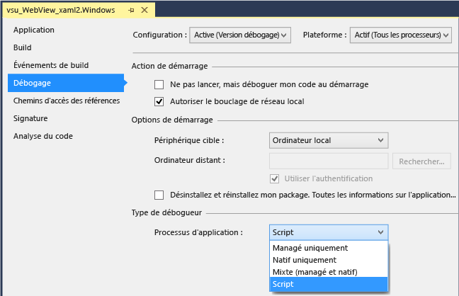
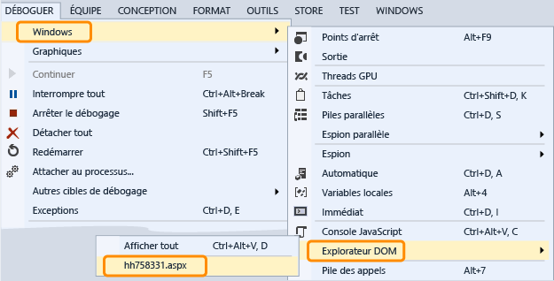

# Déboguer un contrôle WebView dans une application UWP
  
 Pour inspecter et déboguer des contrôles `WebView` dans une application Windows Runtime, vous pouvez configurer Visual Studio de sorte à attacher le débogueur de scripts au démarrage de l'application. Vous avez deux moyens d’interagir avec `WebView` contrôle à l’aide du débogueur :  
  
-   Ouvrez le [l’Explorateur DOM](../debugger/quickstart-debug-html-and-css.md) pour un `WebView` de l’instance, inspectez les éléments DOM, examinez les problèmes de style CSS et tester les modifications de rendu dynamiquement aux styles.  
  
-   Sélectionnez la page Web ou `iFrame` affichées dans le `WebView` instance en tant que cible dans le [JavaScript Console](../debugger/javascript-console-commands.md) fenêtre et pour interagir avec la page Web à l’aide des commandes de la console. La console fournit un accès au contexte actuel d'exécution du script.  
  
### Attacher le débogueur (C#, Visual Basic, C++)  
  
1.  Dans Visual Studio, ajoutez un contrôle `WebView` à votre application Windows Runtime.  
  
2.  Dans l’Explorateur de solutions, ouvrez les propriétés pour le projet en choisissant **propriétés** dans le menu contextuel du projet.  
  
3.  Choisissez **déboguer**. Dans le **processus d’Application** , choisissez **Script**.  
  
       
  
4.  (Facultatif) Pour les versions non Express de Visual Studio, désactivez le débogage juste-à-temps (JIT) en choisissant **Outils > Options > Débogage > juste-à-temps**, et puis JIT en désactivant le débogage de Script.  
  
    > [!NOTE]
    >  En désactivant le débogage juste-à-temps, vous pouvez masquer les boîtes de dialogue pour les exceptions non prises en charge qui se produisent sur certaines pages web. Dans Visual Studio Express, le débogage juste-à-temps est toujours désactivé.  
  
5.  Appuyez sur F5 pour démarrer le débogage.  
  
### Utiliser l'Explorateur DOM pour inspecter et déboguer un contrôle WebView  
  
1.  (C#, Visual Basic, C++) Attachez le débogueur de script à votre application. Voir la première section pour des instructions.  
  
2.  Si vous ne l'avez pas déjà fait, ajoutez un contrôle `WebView` à votre application et appuyez sur F5 pour commencer le débogage.  
  
3.  Naviguez jusqu'à la page contenant le ou les contrôles `Webview`.  
  
4.  Ouvrir la fenêtre de l’Explorateur DOM pour le `WebView` contrôle en choisissant **déboguer**, **Windows**, **l’Explorateur DOM**, puis choisissez l’URL de la `WebView` que vous avez vous voulez inspecter.  
  
       
  
     L'Explorateur DOM associé au `WebView` apparaît sous forme d'un nouvel onglet dans Visual Studio.  
  
5.  Afficher et modifier des éléments DOM en direct et les styles CSS, comme décrit dans [les styles CSS de déboguer à l’aide de l’Explorateur DOM](../debugger/debug-css-styles-using-dom-explorer.md).  
  
### Utiliser la fenêtre de la console JavaScript pour inspecter et déboguer un contrôle WebView  
  
1.  (C#, Visual Basic, C++) Attachez le débogueur de script à votre application. Voir la première section pour des instructions.  
  
2.  Si vous ne l'avez pas déjà fait, ajoutez un contrôle `WebView` à votre application et appuyez sur F5 pour commencer le débogage.  
  
3.  Ouvrez la fenêtre de JavaScript Console pour le `WebView` contrôle en choisissant **déboguer**, **Windows**, **JavaScript Console**.  
  
     La fenêtre de la console JavaScript s'ouvre.  
  
4.  Naviguez jusqu'à la page contenant le ou les contrôles `Webview`.  
  
5.  Dans la fenêtre de Console, sélectionnez la page Web ou un `iFrame` affiché par le `WebView` contrôler dans le **cible** liste.  
  
       
  
    > [!NOTE]
    >  À l'aide de la console, vous pouvez interagir avec un seul `WebView`, `iFrame`, contrat de partage ou traitement web à la fois. Chaque élément requiert une instance distincte de l'hôte de plateforme web (WWAHost.exe). Vous pouvez interagir avec un seul hôte à la fois.  
  
6.  Afficher et modifier les variables dans votre application ou utilisez les commandes de la console, comme décrit dans [démarrage rapide : débogage de JavaScript](../debugger/quickstart-debug-javascript-using-the-console.md) et [des commandes de JavaScript Console](../debugger/javascript-console-commands.md).  
  
## Voir aussi  
 [Démarrage rapide : déboguer du code HTML et CSS](../debugger/quickstart-debug-html-and-css.md)