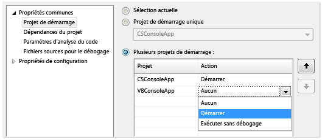
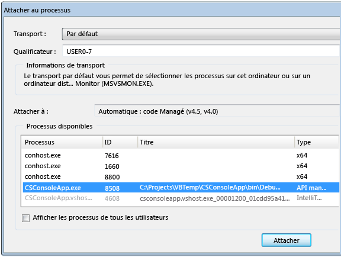
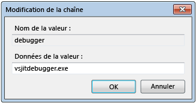
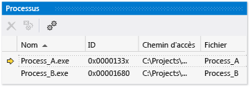

# Déboguer plusieurs processus (C#, Visual Basic, C++)

Visual Studio peut déboguer une solution qui a plusieurs processus. Vous pouvez démarrer et basculer entre les processus, interrompre, continuer et parcourir le code source, arrêter le débogage et end ou détacher des processus individuels.

## Démarrer le débogage avec plusieurs processus

Lorsque plusieurs projets dans une solution Visual Studio peuvent s’exécuter indépendamment, vous pouvez sélectionner le projet auquel le débogueur démarre. Le projet de démarrage actuel s’affiche en gras dans **l’Explorateur de solutions**.

Pour modifier le projet de démarrage dans **l’Explorateur de solutions**, cliquez sur un autre projet et sélectionnez **définir comme projet de démarrage**.

Pour démarrer le débogage d’un projet à partir de **l’Explorateur de solutions** sans le rendre le projet de démarrage, cliquez sur le projet et sélectionnez **déboguer** > **démarrer une nouvelle instance** ou **détaillé de la nouvelle instance**.

**Pour définir le projet de démarrage ou de plusieurs projets à partir des propriétés de solution :**

1. Sélectionnez la solution dans **l’Explorateur de solutions** , puis sélectionnez le **propriétés** icône dans la barre d’outils, ou la solution de clic droit et sélectionnez **propriétés**.

1. Sur le **propriétés** page, sélectionnez **propriétés communes** > **projet de démarrage**.

   

1. Sélectionnez **sélection actuelle**, **projet de démarrage unique** et un fichier projet, ou **plusieurs projets de démarrage**.

   Si vous sélectionnez **plusieurs projets de démarrage**, vous pouvez modifier l’ordre de démarrage et l’action à entreprendre pour chaque projet : **Démarrer**, **démarrer sans débogage**, ou **aucun**.

1. Sélectionnez **appliquer**, ou **OK** pour appliquer et fermer la boîte de dialogue.

###  Attacher à un processus

Le débogueur peut également *attacher* pour les applications qui s’exécutent dans des processus en dehors de Visual Studio, y compris sur des appareils distants. Une fois que vous attachez à une application, vous pouvez utiliser le débogueur Visual Studio. Fonctionnalités de débogage peuvent être limitée. Cela dépend si l’application a été générée avec les informations de débogage, si vous avez accès au code source de l’application, et si le compilateur JIT effectue le suivi des informations de débogage.

Pour plus d’informations, consultez [attacher au processus en cours d’exécution](../debugger/attach-to-running-processes-with-the-visual-studio-debugger.md).

**Pour établir un attachement à un processus en cours d’exécution :**

1. Avec l’application en cours d’exécution, sélectionnez **déboguer** > **attacher au processus**.

   

1. Dans le **attacher au processus** boîte de dialogue, sélectionnez le processus à partir de la **processus disponibles** liste, puis sélectionnez **attacher**.

>[!NOTE]
>Le débogueur n'effectue pas un attachement automatique à un processus enfant démarré par un processus débogué, même si le projet enfant se trouve dans la même solution. Pour déboguer un processus enfant, attacher au processus enfant après son démarrage, ou configurer l’Éditeur du Registre Windows pour démarrer le processus enfant dans une nouvelle instance de débogueur.

###  Utilisez l’Éditeur du Registre pour démarrer automatiquement un processus dans le débogueur

Parfois, vous devrez peut-être déboguer le code de démarrage d’une application est lancée par un autre processus. C'est le cas des services et des actions d'installation personnalisée. Vous pouvez avoir le débogueur lancer et joindre automatiquement à l’application.

1. Démarrez l’Éditeur du Registre Windows en exécutant *regedit.exe*.

1. Dans l’Éditeur du Registre, accédez à **HKEY_LOCAL_MACHINE\Software\Microsoft\Windows NT\CurrentVersion\Image File Execution Options**.

1. Sélectionnez le dossier de l’application à démarrer dans le débogueur.

   Si l’application n’est pas répertoriée comme un dossier enfant, cliquez sur **Image File Execution Options**, sélectionnez **New** > **clé**, puis tapez le nom de l’application. Ou, avec le bouton droit de la nouvelle clé dans l’arborescence, sélectionnez **renommer**, puis entrez le nom de l’application.

1. Avec le bouton droit de la nouvelle clé dans l’arborescence, puis sélectionnez **New** > **valeur de chaîne**.

1. Modifier le nom de la nouvelle valeur à partir de **New Value #1** à `debugger`.

1. Avec le bouton droit **débogueur** et sélectionnez **modifier**.

   

1. Dans le **modification de la chaîne** boîte de dialogue, tapez `vsjitdebugger.exe` dans le **données de la valeur** zone, puis sélectionnez **OK**.

   

##  Déboguer avec plusieurs processus

Lorsque vous déboguez une application avec plusieurs processus, les commandes de débogueur avec rupture, exécution pas à pas et poursuite de l’opération affectent tous les processus par défaut. Par exemple, lorsqu’un processus est interrompu à un point d’arrêt, l’exécution de tous les autres processus est également interrompue. Vous pouvez changer ce comportement par défaut pour mieux contrôler les cibles des commandes d’exécution.

**Pour modifier si tous les processus sont suspendus quand un processus s’arrête :**

- Sous **outils** (ou **déboguer**) > **Options** > **débogage** > **général**, activez ou désactivez le **arrêter tous les processus lorsqu’un processus s’arrête** case à cocher.

###  Commandes Arrêter, Exécuter pas à pas et Continuer

Le tableau suivant décrit les comportements de débogage commandes lorsque le **arrêter tous les processus lorsqu’un processus s’arrête** case à cocher est sélectionné ou désélectionné :

|**Commande**|Selected|Désélectionné|
|-|-|-|
|**Déboguer**  > **interrompre tout**|Tous les processus s'arrêtent.|Tous les processus s'arrêtent.|
|**Déboguer** > **continuer**|Tout les processus reprennent.|Tous les processus suspendus reprennent.|
|**Déboguer** > **pas à pas détaillé**, **pas à pas principal**, ou **pas à pas sortant**|Tous les processus s'exécutent pendant les étapes de processus actuelles.  Puis, tous les processus s'arrêtent.|Étapes de processus actuel.  Les processus suspendus reprennent.  Les processus en cours d'exécution se poursuivent.|
|**Déboguer** > **pas à pas détaillé des processus en cours**, **pas à pas principal des processus en cours**, ou **pas à pas sortant des processus en cours**|N/A|Étapes de processus actuel. D'autres processus conservent leur état existant (Suspendu ou En cours d'exécution).|
|Fenêtre source **point d’arrêt**|Tous les processus s'arrêtent.|Seul le processus de fenêtre source est rompu.|
|Fenêtre source **exécuter jusqu’au curseur** La fenêtre source doit figurer dans le processus actuel.|Tous les processus s'exécutent pendant que le processus de fenêtre source s'exécute jusqu'au curseur puis s'arrête. Puis, tous les autres processus s'arrêtent.|Le processus de fenêtre source s'exécute sur le curseur. D'autres processus conservent leur état existant (Suspendu ou En cours d'exécution).|
|**Processus** fenêtre > **arrêter le processus**|N/A|Le processus sélectionné s'interrompt. D'autres processus conservent leur état existant (Suspendu ou En cours d'exécution).|
|**Processus** fenêtre > **continuer le processus**|N/A|Le processus sélectionné reprend. D'autres processus conservent leur état existant (Suspendu ou En cours d'exécution).|

###  Rechercher les fichiers sources et de symboles (.pdb)
Pour naviguer dans le code source d’un processus, le débogueur doit accéder à ses fichiers sources et les fichiers de symboles. Pour plus d’informations, consultez [Spécifier les fichiers de symboles (.pdb) et les fichiers sources](../debugger/specify-symbol-dot-pdb-and-source-files-in-the-visual-studio-debugger.md).

Si vous ne pouvez pas accéder aux fichiers d’un processus, vous pouvez accéder à l’aide de la **désassemblage** fenêtre. Pour plus d'informations, voir [Procédure : Utiliser la fenêtre Code Machine](../debugger/how-to-use-the-disassembly-window.md).

###  Basculer entre processus

Vous pouvez attacher plusieurs processus lorsque vous déboguez, mais seul un processus est actif dans le débogueur à un moment donné. Vous pouvez définir le processus actif ou *actuel* dans la barre d’outils **Emplacement de débogage** ou dans la fenêtre **Processus**. Pour basculer entre les processus, les deux processus doivent être en mode arrêt.

**Pour définir le processus actuel à partir de la barre d’outils emplacement de débogage :**

1. Pour ouvrir le **emplacement de débogage** barre d’outils, sélectionnez **vue** > **barres d’outils** > **emplacement de débogage**.

1. Pendant le débogage, dans le **emplacement de débogage** barre d’outils, sélectionnez le processus que vous souhaitez définir en tant que le processus en cours à partir de la **processus** liste déroulante.

   

**Pour définir le processus actuel à partir de la fenêtre processus :**

1. Pour ouvrir le **processus** fenêtre, pendant le débogage, sélectionnez **déboguer** > **Windows** > **processus**.

1. Dans le **processus** fenêtre, le processus en cours est marquée par une flèche jaune. Double-cliquez sur le processus que vous souhaitez définir en tant que le processus en cours.

   

Basculer vers un processus définit comme le processus en cours pour le débogage. Fenêtres du débogueur affichent l’état du processus en cours, et pas à pas de commandes affectent uniquement le processus en cours.

## Arrêter le débogage avec plusieurs processus

Par défaut, lorsque vous sélectionnez **déboguer** > **arrêter le débogage**, le débogueur se termine ou se détache de tous les processus.

- Si le processus en cours a été lancé dans le débogueur, le processus est terminé.

- Si vous avez attaché le débogueur au processus actuel, le débogueur se détache du processus et le conserve.

Si vous démarrez le débogage d’un processus à partir d’une solution Visual Studio, puis attachez à un autre processus est déjà en cours d’exécution, puis choisissez **arrêter le débogage**, la fin de la session de débogage. Le processus qui a été démarré dans Visual Studio se termine, alors que le processus que vous avez attaché à continue à s’exécuter.

Pour contrôler la façon qui **arrêter le débogage** affecte un processus individuel, dans le **processus** fenêtre, avec le bouton droit à un processus, puis activez ou désactivez le **détacher lorsque le débogage est arrêté** case à cocher.

>[!NOTE]
>Le **arrêter tous les processus lorsqu’un processus s’arrête** option du débogueur n’affecte pas l’arrêt, arrêt ou se détache de processus.

### Commandes Arrêter, Terminer et Détacher

Le tableau suivant décrit les comportements de l’arrêt du débogueur, terminer et détacher des commandes avec plusieurs processus :

|**Commande**|**Description**|
|-|-|
|**Déboguer** > **arrêter le débogage**|À moins que le comportement est modifié dans le **processus** fenêtre, processus démarrés par le débogueur sont terminent et processus attachés sont détachés.|
|**Déboguer** > **tout arrêter**|Tous les processus sont terminés.|
|**Déboguer** > **Détacher tout**|Le débogueur se détache de tous les processus.|
|**Processus** fenêtre > **détacher le processus**|Le débogueur se détache du processus sélectionné. D'autres processus conservent leur état existant (Suspendu ou En cours d'exécution).|
|**Processus** fenêtre > **terminer le processus**|Le processus sélectionné est terminé. D'autres processus conservent leur état existant (Suspendu ou En cours d'exécution).|
|**Processus** fenêtre > **détacher lorsque le débogage s’arrête**|Si sélectionné, **déboguer** > **arrêter le débogage** se détache du processus sélectionné.  Si ne pas sélectionnée, **déboguer** > **arrêter le débogage** se termine le processus sélectionné. |

## Voir aussi

- [Spécifier les fichiers de symbole (.pdb) et les fichiers sources](../debugger/specify-symbol-dot-pdb-and-source-files-in-the-visual-studio-debugger.md)
- [Attacher à des processus en cours d’exécution](../debugger/attach-to-running-processes-with-the-visual-studio-debugger.md)
- [Naviguer dans le code avec le débogueur](../debugger/navigating-through-code-with-the-debugger.md)
- [Débogage juste-à-temps](../debugger/just-in-time-debugging-in-visual-studio.md)
- [Déboguer les applications multithread](../debugger/debug-multithreaded-applications-in-visual-studio.md)