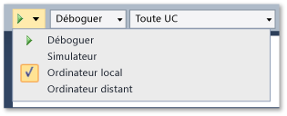
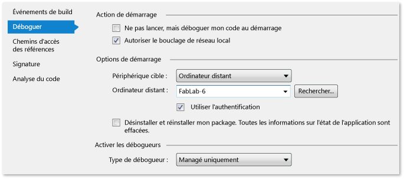

# Déployer des applications UWP à partir de Visual Studio

La fonctionnalité de déploiement de Visual Studio génère et enregistre les applications UWP créées avec Visual Studio sur un appareil cible. La façon dont l'application est exactement enregistrée varie selon que le périphérique cible est local ou distant :

- Lorsque la cible est l'ordinateur Visual Studio local, Visual Studio enregistre l'application depuis son dossier de génération.

- Lorsque la cible est un périphérique distant, Visual Studio copie les fichiers requis sur l'ordinateur distant et enregistre l'appareil sur ce périphérique.

Le déploiement est automatique quand vous déboguez votre application à partir de Visual Studio à l’aide de l’option **Démarrer le débogage** (touche F5) ou de l’option **Exécuter sans débogage** (touches CTRL+F5). Vous pouvez aussi déployer votre application manuellement. Le déploiement manuel est utile dans les scénarios suivants :

- Test ad hoc sur un ordinateur local ou distant.

- Déploiement d'une application qui démarre une autre application que vous voulez déboguer.

- Déploiement d'une application qui est déboguée quand elle est démarrée par une autre application ou méthode.

##  Comment déployer une application UWP
 Le déploiement manuel d'une application obéit à une procédure simple :

1. Si le déploiement s'effectue sur un périphérique distant, spécifiez le nom ou l'adresse IP du périphérique dans la page des propriétés du projet du projet de démarrage de l'application. (Les étapes associées sont répertoriées plus bas dans cette rubrique.)

2. Dans la barre d'outils Déboguer de Visual Studio, choisissez la cible de déploiement dans la liste déroulante située à côté du bouton **Démarrer le débogage** .

     

3. Dans le menu **Générer** , choisissez **Déployer**.

##  Comment spécifier un périphérique distant

**Composants requis**

Sur un appareil distant Windows 10, vous devez activer le [mode développeur](/windows/uwp/get-started/enable-your-device-for-development). Sur les appareils Windows 10 qui exécutent la mise à jour du créateur ou une version ultérieure, les outils de contrôle à distance sont installés automatiquement lorsque vous déployez votre application. Pour plus d’informations, consultez [Déboguer un package d’application installé](../debugger/debug-installed-app-package.md).

> [!NOTE]
> Sur les versions de mise à jour du pré-créateur de Windows 10, le Outils de contrôle à distance de Visual Studio doit être installé sur le périphérique distant, et le débogueur distant doit être en cours d’exécution.

Le déploiement utilise le canal réseau du débogueur distant pour envoyer les fichiers de l'application sur le périphérique distant.

#### Pour spécifier un périphérique distant

1. Dans la page de propriétés de débogage du projet de démarrage, spécifiez le nom ou l'adresse IP d'une cible de déploiement distante.

2. Pour ouvrir la page de propriétés de débogage, sélectionnez le projet dans l'Explorateur de solutions, puis choisissez **Propriétés** dans le menu contextuel.

3. Sélectionnez ensuite le nœud **Déboguer** dans la fenêtre de la page de propriétés.

4. Pour **appareil cible**, sélectionnez **ordinateur distant**.

5. Sous **ordinateur distant**, cliquez sur **Rechercher**.

6. Vous pouvez taper le nom ou l’adresse IP du périphérique distant, ou vous pouvez choisir l’appareil à partir de la boîte de dialogue **connexion à distance** .

    

    La boîte de dialogue **connexion à distance** affiche les périphériques sur le sous-réseau du réseau local et tout périphérique qui est directement connecté à l’ordinateur Visual Studio à l’aide d’un câble Ethernet.

   **Spécification du périphérique distant dans une page de projet C++**

   

7. Choisissez **Remote Debugger** dans la liste **Débogueur à lancer** .

8. Entrez le nom du réseau du périphérique distant dans la zone **Nom de l'ordinateur** . Ou cliquez sur la flèche Bas de la zone pour sélectionner le périphérique dans la boîte de dialogue Sélectionner une connexion du débogueur distant.

   **Spécification du périphérique distant dans une page de projet Visual C# ou Visual Basic**

   

9. Choisissez **Ordinateur distant** dans la liste **Périphérique cible** .

10. Entrez le nom du réseau du périphérique distant dans la zone **Ordinateur distant** ou cliquez sur **Rechercher** pour sélectionner le périphérique dans la boîte de dialogue **Sélectionner une connexion du débogueur distant** .

##  Options de déploiement

Vous pouvez définir les options de déploiement suivantes sur la page de propriétés de débogage du projet de démarrage.

**Autoriser le bouclage de réseau**

Pour des raisons de sécurité, une application UWP ou une [!INCLUDE[win8_appname_long](../debugger/includes/win8_appname_long_md.md)] application installée en mode standard n’est pas autorisée à effectuer des appels réseau vers l’appareil sur lequel elle est installée. Par défaut, le déploiement de Visual Studio crée une exemption à cette règle pour l’application déployée. Cette exemption vous permet de tester les procédures de communication sur un seul et même ordinateur. Avant d'envoyer votre application au [!INCLUDE[win8_appstore_long](../debugger/includes/win8_appstore_long_md.md)], vous devez la tester sans l'exemption.

Pour supprimer l’exemption de bouclage réseau de l’application :

- Dans la page de propriétés C# et Visual Basic débogage, désactivez la case à cocher **autoriser le bouclage réseau** .

- Dans la page de propriétés de débogage C++, définissez la valeur **autoriser le bouclage réseau** sur **non**.

**Ne pas lancer, mais déboguer mon code au démarrage (C# et Visual Basic)/lancer l’application (C++)**

Pour configurer le déploiement afin de démarrer automatiquement une session de débogage au lancement de l’application :

- Dans la page de propriétés de débogage C# et Visual Basic, activez la case à cocher **ne pas lancer, mais déboguer mon code au démarrage** .

- Sur la page de propriétés de débogage C++, définissez la valeur de l' **application Launch** sur **Oui**.

## Voir aussi

- [Options avancées de déploiement distant](/windows/uwp/debug-test-perf/deploying-and-debugging-uwp-apps#advanced-remote-deployment-options)
- [Déboguer un package d’application installé](../debugger/debug-installed-app-package.md)
- [Exécuter des applications à partir de Visual Studio](debugging-windows-store-and-windows-universal-apps.md)
