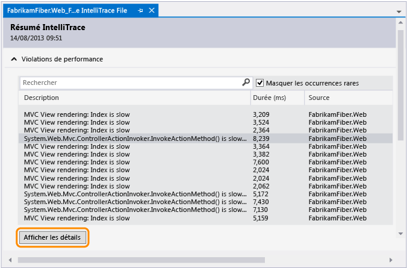
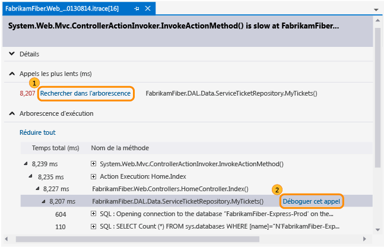
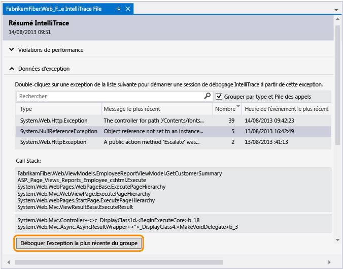
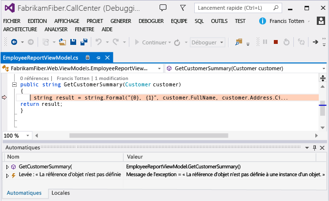

# <a name="diagnose-problems-after-deployment-using-intellitrace-c-visual-basic"></a>Diagnostiquer des problèmes après le déploiement à l’aide d’IntelliTrace (C#, Visual Basic)

Si vous souhaitez utiliser IntelliTrace pour diagnostiquer les problèmes dans votre application web ASP.NET après son déploiement, ajoutez les informations de build à votre version pour permettre à Visual Studio de trouver automatiquement les fichiers sources et fichiers de symboles correspondants nécessaires pour déboguer l’application à l’aide du journal IntelliTrace.

 Si vous utilisez Microsoft Monitoring Agent pour contrôler IntelliTrace, vous devez également configurer l’analyse des performances de l’application sur votre serveur web. Cela permet d’enregistrer des événements de diagnostic pendant l’exécution de votre application et d’enregistrer les événements dans un fichier journal IntelliTrace. Vous pouvez ensuite examiner les événements dans Visual Studio Enterprise (mais pas Professional ni Community), accéder au code où l’événement s’est produit, observer les valeurs enregistrées à cet instant donné, et avancer ou reculer dans le code qui a été exécuté. Après avoir identifié et corrigé le problème, répétez le cycle de génération, publication et surveillance de votre version, de sorte à pouvoir résoudre les éventuels problèmes futurs plus tôt et plus vite.

 

 **Vous devez disposer des éléments suivants :**

- Visual Studio, Azure DevOps ou Team Foundation Server 2017, 2015, 2013, 2012 ou 2010 pour paramétrer votre build

- Microsoft Monitoring Agent pour surveiller votre application et enregistrer les données de diagnostic

- Visual Studio Enterprise (mais pas Professional ni Community) pour vérifier les données de diagnostic et déboguer votre code avec IntelliTrace

## <a name="step-1-include-build-information-with-your-release"></a><a name="SetUpBuild"></a> Étape 1 : Ajouter les informations de build à votre version
 Paramétrez votre processus de génération de façon à créer un manifeste de build (fichier *BuildInfo.config*) pour votre projet web et ajoutez ce manifeste à votre version. Ce manifeste contient des informations sur le projet, le contrôle de code source et le système de génération utilisés pour créer une build spécifique. Ces informations aident Visual Studio à trouver la source et les symboles correspondants après ouverture du journal IntelliTrace pour examiner les événements enregistrés.

### <a name="create-the-build-manifest-for-an-automated-build-using-team-foundation-server"></a><a name="AutomatedBuild"></a> Créer le manifeste de build pour une génération automatique à l’aide de Team Foundation Server

 Procédez comme suit si vous utilisez le contrôle de version ou le fournisseur Git Team Foundation.

#### <a name="azure-devops-and-team-foundation-server-2017"></a><a name="TFS2017"></a> Azure DevOps et Team Foundation Server 2017

Visual Studio 2017 et les versions ultérieures n’incluent pas le fichier *BuildInfo.config* qui a été déconseillé, puis supprimé. Pour déboguer les applications web ASP.NET après le déploiement, utilisez l’une des méthodes suivantes :

* Pour le déploiement vers Azure, utilisez [Application Insights](/azure/application-insights/).

* Si vous devez utiliser IntelliTrace, ouvrez le projet dans Visual Studio et chargez les fichiers de symboles à partir de la build correspondante. Vous pouvez charger des fichiers de symboles à partir de la fenêtre **Modules** ou en configurant des symboles dans **Outils** > **Options** > **Débogage ** > **Symboles**.

#### <a name="team-foundation-server-2013"></a><a name="TFS2013"></a> Team Foundation Server 2013
 Paramétrez votre pipeline de build de sorte à ajouter l’emplacement de la source, de la génération et des symboles au manifeste de build (fichier BuildInfo.config). Team Foundation Build crée automatiquement ce fichier et le place dans le dossier de sortie de votre projet.

1. [Modifiez votre pipeline de build ou créez un pipeline de build.](/azure/devops/pipelines/get-started-designer?view=vsts&preserve-view=true)

     

2. Choisissez le modèle par défaut (TfvcTemplate.12.xaml) ou votre propre modèle personnalisé.

     

3. Spécifiez l’emplacement où enregistrer le fichier de symboles (PDB) de sorte que votre source soit indexée automatiquement.

     Si vous utilisez un modèle personnalisé, vérifiez que le modèle a une activité pour indexer votre source. Vous ajouterez plus tard un argument MSBuild pour spécifier l’emplacement où enregistrer les fichiers de symboles.

     

     Pour plus d’informations sur les symboles, consultez [Publier les données de symbole](/azure/devops/pipelines/tasks/build/index-sources-publish-symbols?view=vsts&preserve-view=true).

4. Ajoutez cet argument MSBuild pour inclure les emplacements de votre TFS et des symboles dans le fichier manifeste de la build :

     **/p:IncludeServerNameInBuildInfo=True**

     Toute personne pouvant accéder à votre serveur web peut consulter ces emplacements dans le manifeste de build. Vérifiez que votre serveur source est sécurisé.

5. Si vous utilisez un modèle personnalisé, ajoutez l’argument MSBuild suivant pour spécifier l’emplacement où enregistrer le fichier de symboles :

     **/p : BuildSymbolStorePath =**\<*path to symbols*>

     

     Ajoutez ces lignes à votre fichier projet web (.csproj, .vbproj) :

    ```xml
    <!-- Import the targets file. Change the folder location as necessary. -->
       <Import Project=""$(MSBuildExtensionsPath)\Microsoft\VisualStudio\v$(VisualStudioVersion)\BuildInfo\Microsoft.VisualStudio.ReleaseManagement.BuildInfo.targets" />

    ```

     Toute personne pouvant accéder à votre serveur web peut consulter ces emplacements dans le manifeste de build. Vérifiez que votre serveur source est sécurisé.

6. Exécutez une nouvelle build.

    Accédez à [étape 2 : publier votre application](#DeployRelease)

#### <a name="team-foundation-server-2012-or-2010"></a><a name="TFS2012_2010"></a> Team Foundation Server 2012 ou 2010
 Procédez comme suit pour créer automatiquement le manifeste de build (fichier BuildInfo.config) pour votre projet et le placer dans le dossier de sortie de votre projet. Le fichier s’affiche avec le nom «*Nom_projet*.BuildInfo.config » dans le dossier de sortie, mais est renommé en « BuildInfo.config » dans le dossier de déploiement une fois l’application publiée.

1. Installez Visual Studio 2013 (n’importe quelle édition) sur votre serveur Team Foundation Build.

2. Dans le pipeline de build, spécifiez où enregistrer les symboles afin que votre source soit indexée automatiquement.

     Si vous utilisez un modèle personnalisé, vérifiez que le modèle a une activité pour indexer votre source.

3. Ajoutez ces arguments MSBuild à votre pipeline de build :

    - **/p:VisualStudioVersion=12.0**

    - **/p:MSBuildAssemblyVersion=12.0**

    - **/tv:12.0**

    - **/p:IncludeServerNameInBuildInfo=True**

    - **/p : BuildSymbolStorePath =**\<*path to symbols*>

4. Exécutez une nouvelle build.

    Accédez à [étape 2 : publier votre application](#DeployRelease)

### <a name="create-the-build-manifest-for-a-manual-build-using-visual-studio"></a><a name="ManualBuild"></a> Créer le manifeste de build pour une génération manuelle à l’aide de Visual Studio
 Procédez comme suit pour créer automatiquement le manifeste de build (fichier BuildInfo.config) pour votre projet et le placer dans le dossier de sortie de votre projet. Le fichier s’affiche avec le nom «*Nom_projet*.BuildInfo.config » dans le dossier de sortie, mais est renommé en « BuildInfo.config » dans le dossier de déploiement une fois l’application publiée.

1. Dans l’ **Explorateur de solutions**, déchargez votre projet web.

2. Ouvrez le fichier projet (.csproj, .vbproj). Ajoutez les lignes suivantes :

    ```xml
    <!-- **************************************************** -->
    <!-- Build info -->
    <PropertyGroup>
       <!-- Generate the BuildInfo.config file -->
       <GenerateBuildInfoConfigFile>True</GenerateBuildInfoConfigFile>
       <!-- Include server name in build info -->
       <IncludeServerNameInBuildInfo>True</IncludeServerNameInBuildInfo>
       <!-- Include the symbols path so Visual Studio can find the matching deployed code when you start debugging. -->
       <BuildSymbolStorePath><path to symbols></BuildSymbolStorePath>
    </PropertyGroup>
    <!-- **************************************************** -->
    ```

3. Archivez le fichier projet mis à jour.

4. Exécutez une nouvelle build.

    Accédez à [étape 2 : publier votre application](#DeployRelease)

### <a name="create-the-build-manifest-for-a-manual-build-using-msbuildexe"></a><a name="MSBuild"></a> Créer le manifeste de build pour une génération manuelle à l’aide de MSBuild.exe
 Ajoutez les arguments de build suivants quand vous exécutez une build :

 **/p:GenerateBuildInfoConfigFile=True**

 **/p:IncludeServerNameInBuildInfo=True**

 **/p : BuildSymbolStorePath =**\<*path to symbols*>

## <a name="step-2-release-your-app"></a><a name="DeployRelease"></a> Étape 2 : Déployer votre application
 Si vous utilisez le [package Web.Deploy](/previous-versions/aspnet/dd394698(v=vs.110)) créé par votre processus de génération pour déployer votre application, le manifeste de build «*Nom_projet*.BuildInfo.config » est automatiquement renommé en « BuildInfo.config » et est placé dans le même dossier que le fichier Web.config de votre application sur votre serveur web.

 Si vous utilisez d’autres méthodes pour déployer votre application, assurez-vous que le manifeste de build «*Nom_projet*.BuildInfo.config » est renommé en « BuildInfo.config » et qu’il est placé dans le même dossier que le fichier Web.config de votre application sur le serveur web.

## <a name="step-3-monitor-your-app"></a>Étape 3 : Surveiller votre application
 Paramétrez la surveillance des performances de l’application sur votre serveur web de sorte à pouvoir surveiller si votre application rencontre des problèmes, enregistrer des événements de diagnostic et enregistrer ces événements dans un fichier journal IntelliTrace. Consultez [Surveiller votre version pour identifier les problèmes de déploiement](../debugger/using-the-intellitrace-stand-alone-collector.md).

## <a name="step-4-find-the-problem"></a><a name="InvestigateEvents"></a> Étape 4 : Identifier le problème
 Vous devez installer Visual Studio Enterprise sur votre ordinateur de développement ou un autre ordinateur pour examiner les événements enregistrés et déboguer votre code à l’aide d’IntelliTrace. Vous pouvez aussi utiliser des outils comme CodeLens, les cartes de débogueur et les cartes de code pour vous aider à diagnostiquer le problème.

### <a name="open-the-intellitrace-log-and-matching-solution"></a>Ouvrir le journal IntelliTrace et la solution correspondante

1. Ouvrez le journal IntelliTrace (fichier .iTrace) dans Visual Studio Enterprise. Si Visual Studio Enterprise est installé sur le même ordinateur, il vous suffit de double-cliquer sur le fichier.

2. Choisissez **Ouvrir une solution** pour que Visual Studio ouvre automatiquement la solution ou le projet correspondant, si le projet n’a pas été généré dans le cadre d’une solution. [Q : le Journal IntelliTrace ne contient pas d’informations sur mon application déployée. Pourquoi cela s’est-il produit ? Que dois-je faire ?](#InvalidConfigFile)

     Visual Studio réserve automatiquement toutes les modifications en attente quand il ouvre la solution ou le projet correspondant. Pour obtenir plus de détails sur ce jeu de réservations, consultez la fenêtre **Sortie** ou **Team Explorer**.

     Avant d’effectuer des modifications, vérifiez que la source est correcte. Si vous utilisez la création de branche, vous travaillez peut-être dans une branche différente de celle dans laquelle Visual Studio trouve la source correspondante, comme votre branche de publication.

     

     Si un espace de travail existant est mappé à cette solution ou ce projet, Visual Studio le sélectionne pour y placer la source trouvée.

     

     Sinon, choisissez un autre espace de travail ou créez-en un. Visual Studio mappera la branche entière à cet espace de travail.

     

     Pour créer un espace de travail avec des mappages spécifiques ou un nom qui n’est pas celui de votre ordinateur, choisissez **Gérer**.

     [Q : Pourquoi Visual Studio indique que l’espace de travail que j’ai sélectionné est inéligible ?](#IneligibleWorkspace)

     [Q : pourquoi ne puis-je pas continuer jusqu’à ce que je choisisse une collection d’équipe ou une autre collection ?](#ChooseTeamProject)

### <a name="diagnose-a-performance-problem"></a>Diagnostiquer un problème de performance

1. Sous **Violations de performances**, examinez les événements de performance enregistrés, leurs durées totales d’exécution et les autres informations associées. Approfondissez ensuite les méthodes appelées pendant un événement de performance spécifique.

     

     Vous pouvez aussi uniquement double-cliquer sur l’événement.

2. Dans la page d’événement, examinez les durées d’exécution de ces appels. Recherchez un appel lent dans l’arborescence d’exécution.

     Les appels les plus lents s’affichent dans leur propre section quand vous avez plusieurs appels, imbriqués ou non.

     Développez cet appel pour examiner les appels imbriqués et les valeurs qui ont été enregistrés à ce moment précis. Démarrez ensuite le débogage à partir de cet appel.

     

     Vous pouvez aussi simplement double-cliquer sur l’appel.

     Si la méthode se trouve dans votre code d’application, Visual Studio y accède.

     

     Vous pouvez maintenant examiner d’autres valeurs enregistrées, la pile des appels, parcourir votre code ou utiliser la fenêtre **IntelliTrace** pour [remonter ou avancer « dans le temps » entre d’autres méthodes](../debugger/intellitrace.md) appelées pendant cet événement de performance.

    - [En quoi consistent tous les autres événements et informations du journal IntelliTrace ?](../debugger/using-saved-intellitrace-data.md)
    - [Que puis-je faire d’autre à partir d’ici ?](#WhatElse)
    - [Vous voulez plus d’informations sur les événements de performances ?](https://devblogs.microsoft.com/devops/performance-details-in-intellitrace/)

### <a name="diagnose-an-exception"></a>Diagnostiquer une exception

1. Sous **Données d’exception**, examinez les événements d’exception enregistrés, leurs types, leurs messages et à quel moment les exceptions se sont produites. Pour approfondir le code, démarrez le débogage à partir de l’événement le plus récent d’un groupe d’exceptions.

     

     Vous pouvez aussi uniquement double-cliquer sur l’événement.

     Si l’exception s’est produite dans votre code d’application, Visual Studio accède à l’emplacement où l’exception s’est produite.

     

     Vous pouvez maintenant examiner d’autres valeurs enregistrées, la pile des appels, ou utiliser la fenêtre **IntelliTrace** pour [remonter ou avancer « dans le temps » entre les autres événements enregistrés](../debugger/intellitrace.md), le code connexe et les valeurs enregistrées à ces moments précis.

     [En quoi consistent tous les autres événements et informations du journal IntelliTrace ?](../debugger/using-saved-intellitrace-data.md)

### <a name="what-else-can-i-do-from-here"></a><a name="WhatElse"></a> Que puis-je faire d’autre à partir d’ici ?

- [Obtenez plus d’informations sur ce code](../ide/find-code-changes-and-other-history-with-codelens.md). Pour trouver des références à ce code, son historique de modification, les bogues associés, les éléments de travail, les révisions du code ou les tests unitaires, le tout sans quitter l’éditeur, utilisez les indicateurs CodeLens de l’éditeur.

     

     

- [Mappez votre emplacement dans le code pendant le débogage.](../debugger/map-methods-on-the-call-stack-while-debugging-in-visual-studio.md) Pour suivre visuellement les méthodes appelées pendant votre session de débogage, mappez la pile des appels.

     

### <a name="q--a"></a><a name="FAQ"></a> Q & A

#### <a name="q-why-include-information-about-my-project-source-control-build-and-symbols-with-my-release"></a><a name="WhyInclude"></a>Q : Pourquoi ajouter des informations sur mon projet, le contrôle de code source, la build et les symboles à ma version ?
 Visual Studio utilise ces informations pour trouver la solution et la source correspondant à la version que vous tentez de déboguer. Après avoir ouvert le journal IntelliTrace et sélectionné un événement pour démarrer le débogage, Visual Studio utilise des symboles pour trouver et vous indiquer le code où l’événement s’est produit. Vous pouvez alors examiner les valeurs enregistrées et avancer ou reculer dans l’exécution de votre code.

 Si vous utilisez TFS et que ces informations ne figurent pas dans le manifeste de build (fichier BuildInfo.config), Visual Studio recherche la source et les symboles correspondants sur votre TFS actuellement connecté. Si Visual Studio ne peut pas trouver le TFS correct ou la source correspondante, vous êtes invité à choisir un autre TFS.

#### <a name="q-the-intellitrace-log-is-missing-information-about-my-deployed-app-why-did-this-happen-what-do-i-do"></a><a name="InvalidConfigFile"></a>Q : Le journal IntelliTrace ne comporte pas les informations relatives à mon application déployée. Comment est-ce possible ? Que faire ?
 Cela peut se produire quand vous déployez à partir de votre ordinateur de développement ou que vous n’êtes pas connecté à TFS pendant le déploiement.

1. Accédez au dossier de déploiement de votre projet.

2. Trouvez et ouvrez le manifeste de build (fichier BuildInfo.config).

3. Vérifiez que le fichier contient les informations requises :

- **Nom du projet**

   Nom de votre projet dans Visual Studio. Par exemple :

  ```xml
  <ProjectName>FabrikamFiber.Extranet.Web</ProjectName>
  ```

- **SourceControl**

- Informations sur votre système de contrôle de code source et les propriétés requises suivantes :

  - **TFS**

    - **ProjectCollectionUri**: URI de votre serveur Team Foundation Server et de la collection de projets

    - **ProjectItemSpec**: chemin d’accès au fichier projet de votre application (.csproj ou .vbproj)

    - **ProjectVersionSpec**: version de votre projet

      Par exemple :

    ```xml
    <SourceControl type="TFS">
       <TfsSourceControl>
          <ProjectCollectionUri>http://fabrikamfiber:8080/tfs/FabrikamFiber</ProjectCollectionUri>
          <ProjectItemSpec>$/WorkInProgress/FabrikamFiber/FabrikamFiber.CallCenter/FabrikamFiber.Web/FabrikamFiber.Web.csproj</ProjectItemSpec>
          <ProjectVersionSpec>LFabrikamFiber_BuildAndPublish_20130813@$/WorkInProgress</ProjectVersionSpec>
       </TfsSourceControl>
    </SourceControl>
    ```

  - **Git**

    - **GitSourceControl**: emplacement du schéma **GitSourceControl**

    - **RepositoryUrl**: URI de votre serveur Team Foundation Server, de la collection de projets et du référentiel Git

    - **ProjectPath**: chemin d’accès au fichier projet de votre application (.csproj ou .vbproj)

    - **CommitId**: ID de votre validation

      Par exemple :

    ```xml
    <SourceControl type="Git">
       <GitSourceControl xmlns="http://schemas.microsoft.com/visualstudio/deploymentevent_git/2013/09">
          <RepositoryUrl>http://gittf:8080/tfs/defaultcollection/_git/FabrikamFiber</RepositoryUrl>
          <ProjectPath>/FabrikamFiber.CallCenter/FabrikamFiber.Web/FabrikamFiber.Web.csproj</ProjectPath>
          <CommitId>50662c96502dddaae5cd5ced962d9f14ec5bc64d</CommitId>
       </GitSourceControl>
    </SourceControl>
    ```

- **Créer**

   Informations sur votre système de génération, `"TeamBuild"` ou `"MSBuild"`, et les propriétés requises suivantes :

  - **BuildLabel** (pour TeamBuild) : nom et numéro de votre build. Cette étiquette est également utilisée comme nom de l’événement de déploiement. Pour plus d’informations sur les numéros de build, consultez [Utiliser des numéros de build pour attribuer des noms pertinents aux builds terminées](/azure/devops/pipelines/build/options?view=vsts&preserve-view=true).

  - **SymbolPath** (recommandé) : liste des URI des emplacements de vos symboles (fichier PDB), séparés par des points-virgules. Les URI peuvent être des URL ou des chemins d’accès réseau (UNC). Il est alors plus facile pour Visual Studio de rechercher les symboles correspondants pour vous aider avec le débogage.

  - **BuildReportUrl** (pour TeamBuild) : emplacement du rapport de la build dans TFS

  - **BuildId** (pour TeamBuild) : URI des détails de votre build dans TFS. Cet URI est également utilisé comme ID de l’événement de déploiement. Cet ID doit être unique si vous n’utilisez pas TeamBuild.

  - **BuiltSolution**: chemin d’accès au fichier de la solution, utilisé par Visual Studio pour rechercher et ouvrir la solution correspondante. Contenu de la propriété MSBuild **SolutionPath** .

    Par exemple :

  - **TFS**

    ```xml
    <Build type="TeamBuild">
       <MsBuild>
          <BuildLabel kind="label">FabrikamFiber_BuildAndPublish_20130813.1</BuildLabel>
          <SymbolPath>\\fabrikamfiber\FabrikamFiber.CallCenter\Symbols</SymbolPath>
          <BuildReportUrl kind="informative, url" url="http://fabrikamfiber:8080/tfs/FabrikamFiber/_releasePipeline/FindRelease?buildUri=fabrikamfiber%3a%2f%2f%2fBuild%2fBuild%2f448">Build Report Url</BuildReportUrl>
          <BuildId kind="id">1c4444d2-518d-4673-a590-dce2773c7744,fabrikamfiber:///Build/Build/448</BuildId>
          <BuiltSolution>$/WorkInProgress/FabrikamFiber/FabrikamFiber.CallCenter/FabrikamFiber.CallCenter.sln</BuiltSolution>
       </MsBuild>
    </Build>
    ```

  - **Git**

    ```xml
    <Build type="MSBuild">
       <MSBuild>
          <SymbolPath>\\gittf\FabrikamFiber.CallCenter\Symbols</SymbolPath>
          <BuiltSolution>/FabrikamFiber.CallCenter/FabrikamFiber.CallCenter.sln</BuiltSolution>
       </MSBuild>
    </Build>
    ```

#### <a name="q-why-does-visual-studio-say-my-selected-workspace-is-ineligible"></a><a name="IneligibleWorkspace"></a> Q : pourquoi Visual Studio indique-t-il que mon espace de travail sélectionné est inéligible ?
 **R :** L’espace de travail sélectionné ne possède aucun mappage entre le dossier de contrôle de code source et un dossier local. Pour créer un mappage de cet espace de travail, choisissez **Gérer**. Sinon, choisissez un espace de travail déjà mappé ou créez-en un.

 

#### <a name="q-why-cant-i-continue-until-i-choose-a-team-collection-or-a-different-collection"></a><a name="ChooseTeamProject"></a>Q : Pourquoi je ne peux pas continuer jusqu’à ce que je choisisse une collection d’équipe ou une autre collection ?
 **R :** Cela peut se produire pour l’une des raisons suivantes :

- Visual Studio n’est pas connecté à TFS.

     

- Visual Studio n’a pas trouvé la solution ou le projet dans votre collection d’équipe actuelle.

     Quand le fichier manifeste de la build ( \<*ProjectName*>.BuildInfo.config) ne spécifie pas où Visual Studio peut trouver la source correspondante, Visual Studio utilise votre TFS actuellement connecté pour rechercher la solution ou le projet correspondant. Si votre collection d’équipe actuelle ne dispose pas de la source correspondante, Visual Studio vous invite à vous connecter à une autre collection d’équipe.

- Visual Studio n’a pas trouvé la solution ou le projet dans la collection spécifiée par le fichier manifeste de la build ( \<*ProjectName*>.BuildInfo.config).

     Il est possible que le TFS spécifié ne dispose plus de la source correspondante ou qu’il n’existe plus, par exemple si vous avez migré vers un nouveau TFS. Si le TFS spécifié n’existe pas, Visual Studio peut expirer après environ une minute et vous inviter à vous connecter à une autre collection. Pour continuer, connectez-vous au serveur TFS approprié.

     

#### <a name="q-whats-a-workspace"></a><a name="WhatWorkspace"></a> Q : Qu’est-ce qu’un espace de travail ?
 **R :** Votre [espace de travail stocke une copie de la source](/azure/devops/repos/tfvc/create-work-workspaces?view=vsts&preserve-view=true) pour que vous puissiez le développer et le tester séparément avant d’archiver votre travail. Si vous ne disposez pas déjà d’un espace de travail spécialement mappé à la solution ou au projet trouvé, Visual Studio vous invite à choisir un espace de travail disponible ou à en créer un avec le nom de votre ordinateur comme nom d’espace de travail par défaut.

#### <a name="q-why-do-i-get-this-message-about-untrusted-symbols"></a><a name="UntrustedSymbols"></a>Q : Pourquoi je reçois ce message sur les symboles non fiables ?
 

 **R :** Ce message apparaît lorsque le chemin d’accès aux symboles dans le fichier manifeste de la build ( \<*ProjectName*>.BuildInfo.config) n’est pas inclus dans la liste des chemins d’accès aux symboles approuvés. Vous pouvez ajouter le chemin d’accès à la liste des chemins de symboles dans les options du débogueur.