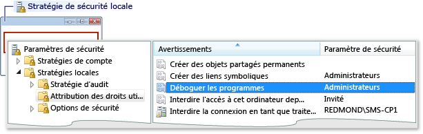
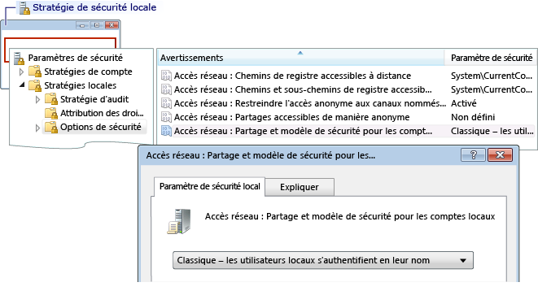

# Erreur : Échec d'ouverture de session à distance du groupe de travail
Cette erreur affiche le message suivant :  
  
 Échec d'ouverture de session : nom d'utilisateur inconnu ou mot de passe incorrect  
  
 **Cause**  
  
 Cette erreur peut se produire lorsque vous déboguez à partir d'un ordinateur au sein d'un groupe de travail et que vous tentez de vous connecter à un ordinateur distant. Plusieurs causes sont possibles :  
  
-   Il n'existe pas de compte avec le nom et le mot de passe correspondants sur l'ordinateur distant.  
  
-   Si l’ordinateur Visual Studio et l’ordinateur distant se trouvent sur des groupes de travail, cette erreur peut se produire en raison de la valeur par défaut **stratégie de sécurité locale** paramètre sur l’ordinateur distant. Le paramètre par défaut pour le **stratégie de sécurité locale** paramètre est **invité seul - les utilisateurs locaux s’authentifient en tant qu’invité**. Pour déboguer sur ce programme d’installation, vous devez modifier le paramètre sur l’ordinateur distant à **classique - les utilisateurs locaux s’authentifient eux-mêmes**.  
  
> [!NOTE]
>  Vous devez être administrateur pour exécuter les tâches suivantes.  
  
### Pour ouvrir la fenêtre Stratégie de sécurité locale  
  
1.  Démarrer le **secpol.msc** le composant logiciel enfichable Microsoft Management Console. Tapez secpol.msc dans la zone de recherche Windows, dans la zone Exécuter de Windows, ou dans une invite de commandes.  
  
### Pour ajouter des assignations de droits utilisateur  
  
1.  Ouvrez le **stratégie de sécurité locale** fenêtre.  
  
2.  Développez le **stratégies locales** dossier.  
  
3.  Cliquez sur **attribution des droits utilisateur**.  
  
4.  Dans le **stratégie** colonne, double-cliquez sur **déboguer des programmes** pour afficher les affectations de stratégie groupe local dans le **paramètre de stratégie de sécurité locale** boîte de dialogue.  
  
       
  
5.  Pour ajouter de nouveaux utilisateurs, cliquez sur le **ajouter un utilisateur ou groupe** bouton.  
  
### Pour modifier le modèle de partage et de sécurité  
  
1.  Ouvrez le **stratégie de sécurité locale** fenêtre.  
  
2.  Développez le **stratégies locales** dossier.  
  
3.  Cliquez sur **Options de sécurité**.  
  
4.  Dans le **stratégie** colonne, double-cliquez sur **accès réseau : modèle de partage et de sécurité pour les comptes locaux**.  
  
5.  Dans le **accès réseau : modèle de partage et de sécurité pour les comptes locaux** boîte de dialogue zone, remplacez la valeur par **classique - les utilisateurs locaux s’authentifient eux-mêmes** et cliquez sur le **appliquer**bouton.  
  
       
  
## Voir aussi  
 [Erreurs de débogage distant et dépannage](../debugger/remote-debugging-errors-and-troubleshooting.md)   
 [Débogage à distance](../debugger/remote-debugging.md)