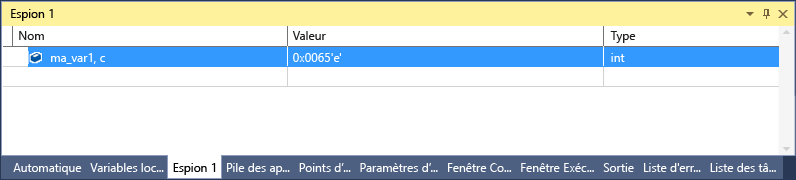

# <a name="format-specifiers-for-c-in-the-visual-studio-debugger"></a>Spécificateurs de format pour C++ dans le débogueur Visual Studio

Vous pouvez modifier le format dans lequel une valeur est affichée dans les fenêtres **Espion**, **automatique** et **variables locales** à l’aide de spécificateurs de format.

Vous pouvez également utiliser des spécificateurs de format dans la fenêtre **exécution** , la fenêtre **commande** , les points de [trace](../debugger/using-breakpoints.md#BKMK_Print_to_the_Output_window_with_tracepoints)et même dans les fenêtres sources. Si vous suspendez une expression dans ces fenêtres, le résultat apparaît dans un [DataTip](../debugger/view-data-values-in-data-tips-in-the-code-editor.md). L’affichage du DataTip reflète le spécificateur de format.

> [!NOTE]
> Lorsque le débogueur natif de Visual Studio est passé à un nouveau moteur de débogage, certains nouveaux spécificateurs de format ont été ajoutés et d’anciens ont été supprimés. Le débogueur plus ancien est toujours utilisé quand vous effectuez un débogage d’interopérabilité (native et managée à la fois) avec C++/CLI.

## <a name="set-format-specifiers"></a>Définir des spécificateurs de format

Nous allons utiliser l’exemple de code suivant :

```C++
int main() {
    int my_var1 = 0x0065;
    int my_var2 = 0x0066;
    int my_var3 = 0x0067;
}
```

Ajoutez la `my_var1` variable à la fenêtre **Espion** pendant le débogage, puis **déboguez**  >    >    >  **Espion 1**. Ensuite, cliquez avec le bouton droit sur la variable et sélectionnez **affichage hexadécimal**. À présent, la fenêtre **Espion** affiche la valeur 0x0065. Pour voir cette valeur exprimée sous la forme d’un caractère plutôt que d’un entier, cliquez d’abord avec le bouton droit et désélectionnez l' **affichage hexadécimal**. Ajoutez ensuite le spécificateur de format de caractère **, c** dans la colonne de **nom** après le nom de la variable. La colonne **valeur** affiche maintenant **101 'e'**.



::: moniker range=">= vs-2019" 
Vous pouvez afficher et sélectionner dans une liste de spécificateurs de format disponibles en ajoutant une virgule (,) à la valeur dans la fenêtre **Espion** . 


::: moniker-end

## <a name="format-specifiers"></a><a name="BKMK_Visual_Studio_2012_format_specifiers"></a> Spécificateurs de format

Les tableaux suivants décrivent les spécificateurs de format que vous pouvez utiliser dans Visual Studio. Les spécificateurs en gras sont pris en charge uniquement pour le nouveau débogueur, et non pour le débogage d’interopérabilité avec C++/CLI.

::: moniker range=">= vs-2019" 

|Spécificateur|Format|Valeur d’espion d’origine|Valeur affichée|
|---------------|------------|--------------------------|---------------------|
|d|entier décimal|0x00000066|102|
|o|entier octal non signé|0x00000066|000000000146|
|x<br /><br /> **h**|entier hexadécimal|102|0xcccccccc|
|X<br /><br /> **H**|entier hexadécimal|102|0xcccccccc|
|xb<br /><br /> **HB**|Entier hexadécimal (sans 0x au début)|102|cccccccc|
|Xb<br /><br /> **HB**|Entier hexadécimal (sans 0x au début)|102|CCCCCCCC|
|b|Entier binaire non signé|25|0b00000000000000000000000000011001|
|bb|entier binaire non signé (sans 0b au début)|25|00000000000000000000000000011001|
|e|Notation scientifique|25000000|2.500000 e + 07|
|g|Forme courte de la notation scientifique ou virgule flottante|25000000|2,5 e + 07|
|c|caractère unique|0x0065|101 ’e’|
|s|const char * chaîne (avec guillemets)|\<location> « Hello World »|« Hello World »|
|**aspirateur**|const char* chaîne (sans guillemets)|\<location> « Hello World »|hello world|
|s8|Chaîne UTF-8|\<location> « Il s’agit d’une tasse de café UTF-8 ̃ • »|« Il s’agit d’une ☕ de café UTF-8 »|
|**s8b**|chaîne UTF-8 (sans guillemets)|\<location> « Hello World »|hello world|
|su|Chaîne Unicode (encodage UTF-16) (avec guillemets)|\<location> L "Hello World"|L"hello world"<br /><br /> u"hello world"|
|sub|chaîne Unicode (encodage UTF-16) (sans guillemets)|\<location> L "Hello World"|hello world|
|bstr|Chaîne binaire BSTR (avec guillemets)|\<location> L "Hello World"|L"hello world"|
|env|Bloc d’environnement (chaîne finissant par une double valeur null)|\<location>L "= :: = :: \\ \\ "|L "= :: = :: \\ \\ \\ 0 = c : = c : \\ \\ Windows \\ \\ system32 \\ 0ALLUSERSPROFILE =...|
|**s32**|Chaîne UTF-32 (avec guillemets)|\<location> U "Hello World"|u"hello world"|
|**s32b**|chaîne UTF-32 (sans guillemets)|\<location> U "Hello World"|hello world|
|**en**|enum|Saturday(6)|Samedi|
|**hv**|Type de pointeur : indique que la valeur de pointeur inspectée est le résultat de l’allocation de tas d’un tableau, par exemple, `new int[3]`.|\<location>{\<first member>}|\<location>{\<first member>, \<second member>, ...}|
|**na**|Supprime l’adresse mémoire d’un pointeur vers un objet.|\<location>, {Member = value...}|{membre=valeur…}|
|**Hercher**|Affiche uniquement les informations de classe de base, en ignorant les classes dérivées|`(Shape*) square` inclut les informations de classe de base et de classe dérivée|Affiche uniquement les informations de classe de base|
|heure(s)|HRESULT ou code d’erreur Win32. Ce spécificateur n’est plus nécessaire pour HRESULTs, car le débogueur les décode automatiquement.|S_OK|S_OK|
|wc|Indicateur de classe de fenêtre|0x0010|WC_DEFAULTCHAR|
|wm|Numéros de messages Windows|16|WM_CLOSE|
|nr|Supprimer l'élément « Affichage brut »|
|nvo|Afficher l’élément « affichage brut » pour les valeurs numériques uniquement|
|!|format brut, ignorant toutes les personnalisations d’affichage de type de données|\<customized representation>|4|
|traitée|Affiche des informations sur le handle Win32|0x000000000000009c| Affiche des informations utiles sur la poignée, comme l’ID de thread, etc. |

::: moniker-end

::: moniker range="vs-2017" 

|Spécificateur|Format|Valeur d’espion d’origine|Valeur affichée|
|---------------|------------|--------------------------|---------------------|
|d|entier décimal|0x00000066|102|
|o|entier octal non signé|0x00000066|000000000146|
|x<br /><br /> **h**|entier hexadécimal|102|0xcccccccc|
|X<br /><br /> **H**|entier hexadécimal|102|0xcccccccc|
|c|caractère unique|0x0065, c|101 ’e’|
|s|const char * chaîne (avec guillemets)|\<location> « Hello World »|« Hello World »|
|**aspirateur**|const char* chaîne (sans guillemets)|\<location> « Hello World »|hello world|
|s8|Chaîne UTF-8|\<location> « Il s’agit d’une tasse de café UTF-8 ̃ • »|« Il s’agit d’une ☕ de café UTF-8 »|
|**s8b**|chaîne UTF-8 (sans guillemets)|\<location> « Hello World »|hello world|
|su|Chaîne Unicode (encodage UTF-16) (avec guillemets)|\<location> L "Hello World"|L"hello world"<br /><br /> u"hello world"|
|sub|chaîne Unicode (encodage UTF-16) (sans guillemets)|\<location> L "Hello World"|hello world|
|bstr|Chaîne binaire BSTR (avec guillemets)|\<location> L "Hello World"|L"hello world"|
|env|Bloc d’environnement (chaîne finissant par une double valeur null)|\<location>L "= :: = :: \\ \\ "|L "= :: = :: \\ \\ \\ 0 = c : = c : \\ \\ Windows \\ \\ system32 \\ 0ALLUSERSPROFILE =...|
|**s32**|Chaîne UTF-32 (avec guillemets)|\<location> U "Hello World"|u"hello world"|
|**s32b**|chaîne UTF-32 (sans guillemets)|\<location> U "Hello World"|hello world|
|**en**|enum|Saturday(6)|Samedi|
|**hv**|Type de pointeur : indique que la valeur de pointeur inspectée est le résultat de l’allocation de tas d’un tableau, par exemple, `new int[3]`.|\<location>{\<first member>}|\<location>{\<first member>, \<second member>, ...}|
|**na**|Supprime l’adresse mémoire d’un pointeur vers un objet.|\<location>, {Member = value...}|{membre=valeur…}|
|**Hercher**|Affiche uniquement les informations de classe de base, en ignorant les classes dérivées|`(Shape*) square` inclut les informations de classe de base et de classe dérivée|Affiche uniquement les informations de classe de base|
|heure(s)|HRESULT ou code d’erreur Win32. Ce spécificateur n’est plus nécessaire pour HRESULTs, car le débogueur les décode automatiquement.|S_OK|S_OK|
|wc|Indicateur de classe de fenêtre|0x0010|WC_DEFAULTCHAR|
|wm|Numéros de messages Windows|16|WM_CLOSE|
|!|format brut, ignorant toutes les personnalisations d’affichage de type de données|\<customized representation>|4|

::: moniker-end

> [!NOTE]
> Quand le spécificateur **de format de** la valeur html est présent, le débogueur tente de déterminer la longueur de la mémoire tampon et affiche ce nombre d’éléments. Comme il n’est pas toujours possible pour le débogueur de rechercher la taille exacte de la mémoire tampon d’un tableau, vous devez utiliser un spécificateur de taille `(pBuffer,[bufferSize])` chaque fois que cela est possible. Le spécificateur **de format de la valeur de la** mémoire tampon est utile lorsque la taille de la mémoire tampon n’est pas immédiatement disponible.

### <a name="size-specifiers-for-pointers-as-arrays"></a><a name="BKMK_Size_specifiers_for_pointers_as_arrays_in_Visual_Studio_2012"></a> Spécificateurs de taille pour les pointeurs en tant que tableaux

Si vous avez un pointeur vers un objet que vous voulez afficher sous forme de tableau, vous pouvez utiliser un entier ou une expression pour spécifier le nombre d’éléments du tableau.

|Spécificateur|Format|Valeur d’espion d’origine|Valeur affichée|
|---------------|------------|---------------------------|---------------------|
|n|Entier décimal ou **hexadécimal**|pBuffer,[32]<br /><br /> pBuffer,**[0x20]**|Affiche `pBuffer` sous forme d’un tableau de 32 éléments.|
|**venir**|Expression C++ valide qui correspond à un entier.|pBuffer,[bufferSize]|Affiche pBuffer sous forme d’un tableau d’éléments `bufferSize` .|
|**expand(n)**|Expression C++ valide qui correspond à un entier|pBuffer, expand(2)|Affiche le troisième élément de  `pBuffer`.|

## <a name="format-specifiers-for-interop-debugging-with-ccli"></a><a name="BKMK_Format_specifiers_for_interop_debugging_and_C___edit_and_continue"></a> Spécificateurs de format pour le débogage d’interopérabilité avec C++/CLI

Les spécificateurs en **gras** sont pris en charge uniquement pour le débogage de code natif et C++/CLI. Cela nécessite le débogueur hérité, spécifié à l’aide du [mode de compatibilité managé](../debugger/general-debugging-options-dialog-box.md).

|Spécificateur|Format|Valeur d’espion d’origine|Valeur affichée|
|---------------|------------|--------------------------|---------------------|
|**d**<br /><br />**i**|entier décimal signé|0xF000F065|-268373915|
|**u**|entier décimal non signé|0x0065|101|
|o|entier octal non signé|0xF065|0170145|
|x<br /><br />X|entier hexadécimal|61541|0x0000f065|
|**l**<br /><br />**h**|préfixe long ou court pour : d, i, u, o, x, X|00406042|0x0c22|
|**f**|virgule flottante signée|(3./2.), f|1.500000|
|**Envoyer**|notation scientifique signée|(3.0/2.0)|1.500000e+000|
|**activée**|virgule flottante signée ou notation scientifique signée,<br/> selon celui qui est le plus court|(3.0/2.0)|1.5|
|c|caractère unique|\<location>|101 ’e’|
|s|const char * (avec guillemets)|\<location>|« Hello World »|
|su|const wchar_t*<br /><br /> const char16_t \* (avec guillemets)|\<location>|L"hello world"|
|sub|const wchar_t*<br /><br /> const char16_t\*|\<location>|hello world|
|s8|const char * (avec guillemets)|\<location>|« Hello World »|
|heure(s)|HRESULT ou code d’erreur Win32.<br/>Ce spécificateur n’est plus nécessaire pour HRESULTs, car le débogueur les décode automatiquement.|S_OK|S_OK|
|wc|Indicateur de classe de fenêtre|0x00000040,|WC_DEFAULTCHAR|
|wm|Numéros de messages Windows|0x0010|WM_CLOSE|
|!|format brut, ignorant toutes les personnalisations de vue de type de données|\<customized representation>|4|

### <a name="format-specifiers-for-memory-locations-in-interop-debugging-with-ccli"></a><a name="BKMK_Format_specifiers_memory_locations_in_interop_debugging_and_C___edit_and_continue"></a> Spécificateurs de format pour les emplacements de mémoire dans le débogage d’interopérabilité avec C++/CLI

Le tableau suivant décrit les symboles de mise en forme utilisés pour les emplacements de mémoire. Vous pouvez utiliser un spécificateur d’emplacement de mémoire avec n’importe quelle valeur ou expression correspondant à un emplacement.

Les spécificateurs en **gras** sont pris en charge uniquement pour le débogage de code natif et C++/CLI. Cela nécessite le débogueur hérité, spécifié à l’aide du [mode de compatibilité managé](../debugger/general-debugging-options-dialog-box.md).

|Symbole|Format|Valeur d’espion d’origine|Valeur affichée|
|------------|------------|--------------------------|---------------------|
|**maximum**|64 caractères ASCII|0x0012ffac|0x0012ffac .4...0...".0W&.......1W&.0.:W..1...."..1.JO&.1.2.."..1...0y....1|
|**m**|16 octets en hexadécimal suivis de 16 caractères ASCII|0x0012ffac|0x0012ffac B3 34 CB 00 84 30 94 80 FF 22 8A 30 57 26 00 00 .4...0...".0W&amp;.|
|**Mbit**|16 octets en hexadécimal suivis de 16 caractères ASCII|0x0012ffac|0x0012ffac B3 34 CB 00 84 30 94 80 FF 22 8A 30 57 26 00 00 .4...0...".0W&amp;.|
|**MW**|8 mots|0x0012ffac|0x0012ffac 34B3 00CB 3084 8094 22FF 308A 2657 0000|
|**md**|4 mots doubles|0x0012ffac|0x0012ffac 00CB34B3 80943084 308A22FF 00002657|
|**MQ**|2 mots quadruples|0x0012ffac|0x0012ffac 7ffdf00000000000 5f441a790012fdd4|
|**MU**|caractères de 2 octets (Unicode)|0x0012ffac|0x0012ffac 8478 77f4 ffff ffff 0000 0000 0000 0000|

### <a name="size-specifier-for-pointers-as-arrays-in-interop-debugging-with-ccli"></a><a name="BKMK_Size_specifier_for_pointers_as_arrays_in_interop_debugging_and_C___edit_and_continue"></a> Spécificateur de taille pour les pointeurs en tant que tableaux dans le débogage d’interopérabilité avec C++/CLI

Si vous avez un pointeur vers un objet que vous voulez afficher sous forme de tableau, vous pouvez utiliser un entier pour spécifier le nombre d’éléments du tableau.

|Spécificateur|Format|Expression|Valeur affichée|
|---------------|------------|----------------|---------------------|
|n|entier décimal|pBuffer[32]|Affiche `pBuffer` sous forme de tableau de 32 éléments.|
