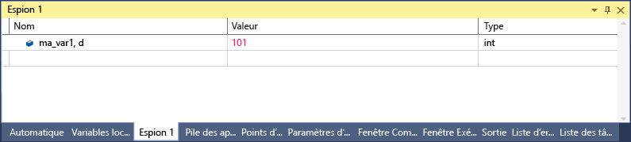

# <a name="format-specifiers-in-c-in-the-visual-studio-debugger"></a>Spécificateurs de format en c# dans le débogueur Visual Studio
Vous pouvez modifier le format dans lequel une valeur est affichée dans la fenêtre **Espion** à l’aide de spécificateurs de format. Vous pouvez également utiliser des spécificateurs de format dans le **exécution** fenêtre, le **commande** fenêtre, dans [trace](../debugger/using-breakpoints.md#BKMK_Print_to_the_Output_window_with_tracepoints)et même les fenêtres sources. Si vous effectuez une suspension sur une expression dans ces fenêtres, le résultat apparaît dans un DataTip. Les DataTips répercutent le spécificateur de format dans l’affichage du DataTip.  
  
 Pour utiliser un spécificateur de format, tapez l’expression suivie par une virgule. Après la virgule, ajoutez le spécificateur approprié.  
  
## <a name="using-format-specifiers"></a>Utilisation de spécificateurs de format  
 Si vous avez le code suivant :  
  
```csharp  
{  
        int my_var1 = 0x0065;  
        int my_var2 = 0x0066;  
        int my_var3 = 0x0067;  
}  
```  
  
 Ajouter le `my_var1` variable à la fenêtre Espion (pendant le débogage, **Déboguer > Windows > espion > Espion 1**) et passez à l’affichage hexadécimal (dans le **espion** fenêtre, avec le bouton droit de la variable et Sélectionnez **affichage hexadécimal**). La fenêtre **Espion** indique à présent qu’elle contient la valeur 0x0065. Pour voir cette valeur exprimée sous la forme d’un entier décimal plutôt que sous la forme d’un entier hexadécimal, dans la colonne Nom, après le nom de la variable, ajoutez le spécificateur de format décimal : **, d**. La colonne Valeur affiche désormais la valeur décimale 101.  
  
   
  
## <a name="format-specifiers"></a>Spécificateurs de format  
 Le tableau suivant montre les spécificateurs de format C# reconnus par le débogueur.  
  
|Spécificateur|Format|Valeur d’espion d’origine|Affiche|  
|---------------|------------|--------------------------|--------------|  
|ac|Force l’évaluation d’une expression. Cela peut être utile lorsque l’évaluation implicite d’appels de propriétés et de fonction implicite est désactivée.|Message « évaluation de fonction implicite est désactivée par l’utilisateur »|\<valeur >|  
|d|entier décimal|0x0065|101|  
|dynamic|Affiche l’objet spécifié à l’aide d’un affichage dynamique|Affiche tous les membres de l’objet, y compris l’affichage dynamique|Affiche uniquement l’affichage dynamique|  
|h|entier hexadécimal|61541|0x0000F065|  
|nq|chaîne sans guillemets|"Ma chaîne"|Ma chaîne|  
|hidden|Affiche tous les membres publics et non publics|Affiche les membres publics|Affiche tous les membres|  
|raw|Affiche l’élément tel qu’il apparaît dans le nœud élément brut. Valide uniquement sur les objets proxy.|Dictionnaire\<T >|Affichage brut de Dictionary\<T >|  
|résultats|Utilisé avec une variable d’un type qui implémente IEnumerable ou IEnumerable\<T >, habituellement le résultat d’une expression de requête. Affiche uniquement les membres contenant les résultats de requête.|Affiche tous les membres.|Affiche les membres qui répondent aux conditions de la requête.|  
  
## <a name="see-also"></a>Voir aussi  
 [Espion et Espion express, fenêtres](../debugger/watch-and-quickwatch-windows.md)   
 [Fenêtres Variables locales et Automatique](../debugger/autos-and-locals-windows.md)
