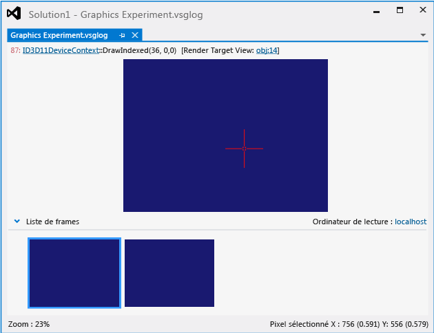

# Document de journal Graphics
[!INCLUDE[vs2017banner](../code-quality/includes/vs2017banner.md)]

Le document journal de graphisme est l'enregistrement des événements graphiques qui se sont produits pendant l'exécution de votre application sous une session Graphics Diagnostics.  Une fois les événements enregistrés, vous pouvez examiner le journal dans Visual Studio Graphics Analyzer pour diagnostiquer les problèmes de rendu et de performances.  
  
 Voici comment se présente un document journal de graphisme dans Graphics Analyzer :  
  
   
  
## Présentation des documents journaux de graphisme  
 En utilisant Graphics Analyzer pour examiner un document journal de graphisme, vous pouvez visualiser les effets des événements Direct3D qui se sont produits sur la cible de rendu pendant la capture.  Vous pouvez localiser avec précision les régions de la cible de rendu qui contiennent la sortie inattendue.  Quand vous sélectionnez un pixel dans la région affectée, vous pouvez utiliser Graphics Diagnostics pour l'inspecter, ainsi que ses nuanceurs, les événements Direct3D qui l'ont affecté, la pile des appels de l'application qui ont conduit à ces événements, puis les objets DirectX qui prennent en charge ces événements.  Vous pouvez utiliser ces informations pour diagnostiquer les problèmes de rendu dans votre jeu ou application.  
  
 La partie supérieure de la fenêtre \(**Expérimentation Graphics.vsglog**\) affiche la sortie cible de rendu actuelle du frame sélectionné, tandis que la partie inférieure affiche une **Liste de frames** qui contient les images miniatures des frames capturés.  
  
#### Pour inspecter un frame  
  
-   Dans la **Liste de frames**, sélectionnez le frame à inspecter.  La sortie cible de rendu figurant dans la partie supérieure du document journal de graphisme est mise à jour pour afficher le frame sélectionné.  
  
#### Pour inspecter un pixel  
  
-   Dans la partie supérieure du document journal de graphisme, sélectionnez le pixel souhaité dans la sortie cible de rendu.  Une fois le pixel sélectionné, vous pouvez utiliser la fenêtre **Historique des pixels Graphics** pour afficher des informations détaillées sur le pixel sélectionné.  Pour plus d'informations, voir [Historique des pixels](../debugger/graphics-pixel-history.md).  
  
## Ordinateur de lecture  
 Dans l'angle supérieur droit de la **Liste de frames** figure également l'**ordinateur de lecture**.  L'ordinateur de lecture est l'ordinateur ou l'appareil utilisé pour lire les événements graphiques d'un fichier journal de graphisme à l'occasion d'une session Graphics Diagnostics ultérieure.  En lisant les événements capturés sur un autre appareil que votre ordinateur de développement, vous pouvez reproduire avec une plus grande précision l'environnement d'exécution dans lequel le problème s'est produit. Par exemple, vous pouvez utiliser un ordinateur équipé de matériel ou de pilotes graphiques différents de ceux utilisés sur votre ordinateur de développement, ou d'autres types d'appareils, tels qu'une tablette Windows RT ou un appareil Windows Phone ARM.  
  
 Pour plus d'informations sur la spécification d'un ordinateur de lecture, voir [Comment : modifier l'ordinateur de lecture Graphics Diagnostics](../debugger/how-to-change-the-graphics-diagnostics-playback-machine.md).  
  
## Information résumées du journal de graphisme  
 Quand le document actif est un fichier journal de graphisme, la fenêtre **Propriétés** affiche des informations sur l'environnement qui a hébergé la session de capture Graphics Diagnostics.  Plusieurs catégories d'informations sont affichées.  
  
 **Informations Direct3D**  
 Répertorie des informations sur les caractéristiques matérielles et du pilote de la carte vidéo qui a été utilisée pendant la session de capture.  
  
|Propriété|Description|  
|---------------|-----------------|  
|**Format couleur XR 10 bits**|**True** si le format couleur XR 10 bits est pris en charge ; sinon, **False**.|  
|**DirectCompute CS 4.x**|**True** si Compute Shader 4.0 est pris en charge ; sinon, **False**.|  
|**Nuanceurs à double précision**|**True** si la carte vidéo prend en charge les valeurs à virgule flottante \(64 bits\) à double précision ; sinon, **False**.|  
|**Listes de commandes du pilote**|**True** si le pilote prend en charge les listes de commandes ; sinon, **False**.|  
|**Créations simultanées du pilote**|**True** si le pilote prend en charge la création \(asynchrone\) simultanée ; sinon, **False**.|  
|**Formats étendus \(BGRA, etc.\)**|**True** si les formats étendus comme BGRA sont pris en charge ; sinon, **False**.|  
|**Niveau de fonctionnalité HW max.**|Affiche le plus haut niveau de fonctionnalité pris en charge par la carte vidéo.|  
  
 **Afficher des informations**  
 Répertorie des informations sur la carte vidéo qui a été utilisée pendant la session de capture.  
  
|Propriété|Description|  
|---------------|-----------------|  
|**Description**|Chaîne de description de la carte vidéo.|  
|**Afficher la mémoire**|Quantité de mémoire installée sur la carte vidéo.|  
|**Nom du pilote**|Nom du pilote de la carte vidéo.|  
|**Version du pilote**|Version du pilote de la carte vidéo.|  
|**Nom**|Nom du pilote de la carte vidéo.|  
  
 **Fichier d'expérimentation**  
 Répertorie des informations sur le fichier d'expérimentation associé à la session de capture.  
  
|Propriété|Description|  
|---------------|-----------------|  
|**Chemin d'accès**|Chemin d'accès du fichier .vsglog. **Note:**  Dans le cas de la capture héritée, cette propriété n'est pas utilisée.|  
  
 **Informations sur le module**  
 Répertorie le nom et la version des bibliothèques de liens dynamiques \(DLL\) qui ont été chargées par l'application pendant la session de capture.  
  
 **Informations système**  
 Répertorie les informations sur le matériel et le système d'exploitation qui ont hébergé l'application pendant la session de capture.  
  
|Propriété|Description|  
|---------------|-----------------|  
|**Mémoire**|Quantité de mémoire installée sur l'ordinateur.|  
|**Architecture du système d'exploitation**|Architecture d'UC cible du système d'exploitation.|  
|**Version du système**|Version du système d'exploitation.|  
|**Processeur**|Processeur installé dans l'ordinateur.|  
|**Architecture de l'application cible**|Architecture d'UC cible de l'application.  Celle\-ci peut être différente de l'**Architecture du système d'exploitation**.|  
  
 **Application cible**  
 Répertorie des informations sur l'application qui fait l'objet de la session de capture.  
  
|Propriété|Description|  
|---------------|-----------------|  
|**Date\/heure dernière modification**|Date et heure de génération de l'application.|  
|**Chemin d'accès**|Chemin d'accès de l'application.|  
|**ID de processus**|ID de processus donné à l'application.|  
|**Version**|Version de l'application.|  
  
 **Fichier journal VSG**  
 Répertorie des informations sur le document journal de graphisme.  
  
|Propriété|Description|  
|---------------|-----------------|  
|**Créé par**|Nom de l'application qui a créé le document journal de graphisme.  Par exemple, si la session de capture a été initialisée à partir de [!INCLUDE[vsprvs](../code-quality/includes/vsprvs_md.md)] \(capture manuelle\), la valeur de cette propriété est [!INCLUDE[vsprvs](../code-quality/includes/vsprvs_md.md)].|  
|**Heure de début de la session**|Date et heure de début de la session de capture.|  
|**Taille**|Taille du document journal de graphisme.|  
  
## Voir aussi  
 [Procédure pas à pas : objets manquants en raison de Vertex Shader](../debugger/walkthrough-missing-objects-due-to-vertex-shading.md)   
 [Procédure pas à pas : débogage des erreurs de rendus dues à la trame](../debugger/walkthrough-debugging-rendering-errors-due-to-shading.md)