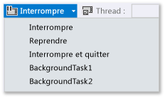
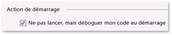
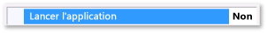

# Comment d&#233;clencher des &#233;v&#233;nements de suspension, de reprise et d&#39;arri&#232;re-plan pour les applications Windows&#160;Store dans Visual&#160;Studio
[!INCLUDE[vs2017banner](../code-quality/includes/vs2017banner.md)]

Lorsque vous n'effectuez pas de débogage, Windows **Process Lifetime Management** \(PLM\) contrôle l'état d'exécution de votre application, soit son démarrage, sa suspension, sa reprise et sa fin en réponse aux actions utilisateur et à l'état du périphérique. Lorsque vous effectuez un débogage, Windows désactive ces événements d'activation. Cette rubrique décrit comment déclencher ces événements dans le débogueur.  
  
 Cette rubrique décrit également comment déboguer les **tâches en arrière\-plan**. Les tâches en arrière\-plan vous permettent d'effectuer certaines opérations dans un processus en arrière\-plan, même lorsque votre application n'est pas en cours d'exécution. Utilisez le débogueur pour placer votre application en mode débogage, puis, sans démarrer l'interface utilisateur, démarrez et déboguez la tâche en arrière\-plan.  
  
 Pour plus d'informations sur PLM \(Process Lifetime Management\) et les tâches en arrière\-plan, consultez [Launching, resuming, and multitasking](http://msdn.microsoft.com/fr-fr/04307b1b-05af-46a6-b639-3f35e297f71b).  
  
##   Dans cette rubrique  
 [Déclencher les événements PLM (Process Lifetime Management)](#BKMK_Trigger_Process_Lifecycle_Management_events)  
  
 [Déclencher les tâches en arrière-plan](#BKMK_Trigger_background_tasks)  
  
-   [Déclencher un événement de tâche en arrière-plan à partir d'une session de débogage standard](#BKMK_Trigger_a_background_task_event_from_a_standard_debug_session)  
  
-   [Déclencher une tâche en arrière-plan lorsque l'application n'est pas en cours d'exécution](#BKMK_Trigger_a_background_task_when_the_app_is_not_running)  
  
 [Déclencher les événements PLM (Process Lifecycle Management) et les tâches en arrière-plan depuis une application installée](#BKMK_Trigger_Process_Lifetime_Management_events_and_background_tasks_from_an_installed_app)  
  
 [Diagnostic des erreurs d'activation des tâches en arrière-plan](#BKMK_Diagnosing_background_task_activation_errors)  
  
##   Déclencher les événements PLM \(Process Lifetime Management\)  
 Windows peut suspendre votre application lorsque l'utilisateur la quitte ou lorsque Windows entre dans un état de faible consommation d'énergie. Répondez à l'événement `Suspending` pour enregistrer des données appropriées relatives à l'application et aux utilisateurs dans un espace de stockage permanent et pour libérer les ressources. Lorsqu'une application quitte l'état **Suspendu**, elle entre dans l'état **Exécution** et reprend là où elle a été suspendue. Vous pouvez répondre à l'événement `Resuming` pour restaurer ou actualiser l'état de l'application et pour libérer les ressources.  
  
 Même si Windows essaie de conserver en mémoire autant d'applications suspendues que possible, Windows peut arrêter votre application si les ressources sont insuffisantes pour les conserver en mémoire. Un utilisateur peut également explicitement fermer votre application. Il n'existe aucun événement spécial qui indique que l'utilisateur a fermé une application.  
  
 Dans le débogueur Visual Studio, vous pouvez suspendre, reprendre et arrêter manuellement vos applications pour déboguer des événements du processus de cycle de vie. Pour déboguer un événement de processus du cycle de vie :  
  
1.  Définissez un point d'arrêt dans le gestionnaire de l'événement que vous souhaitez déboguer.  
  
2.  Appuyez sur **F5** pour démarrer le débogage.  
  
3.  Dans la barre d'outils **Emplacement de débogage**, choisissez l'événement à déclencher :  
  
       
  
     Notez que **Interrompre et quitter** ferme l'application et termine la session de débogage.  
  
##   Déclencher les tâches en arrière\-plan  
 Une application peut enregistrer une tâche en arrière\-plan pour répondre à certains événements système, même si l'application n'est pas en cours d'exécution. Les tâches en arrière\-plan ne peuvent pas exécuter le code qui met à jour directement l'interface utilisateur; En fait, elles affichent des informations à l'utilisateur avec des mises à jour de mosaïque, des mises à jour de badge et des notifications contextuelles. Pour plus d'informations, consultez [Supporting your app with background tasks](http://msdn.microsoft.com/fr-fr/4c7bb148-eb1f-4640-865e-41f627a46e8e)  
  
 Déclenchez les événements qui démarrent les tâches en arrière\-plan pour votre application à partir du débogueur.  
  
> [!NOTE]
>  Le débogueur peut déclencher uniquement les événements qui ne contiennent pas de données, comme les événements qui indiquent un changement d'état sur le périphérique. Vous devez déclencher manuellement les tâches en arrière\-plan qui nécessitent la saisie utilisateur ou d'autres données.  
  
 La méthode la plus réaliste pour déclencher un événement de tâche en arrière\-plan est le moment où votre application n'est pas en cours d'exécution. Toutefois, le déclenchement de l'événement dans une session de débogage standard est également pris en charge.  
  
###   Déclencher un événement de tâche en arrière\-plan à partir d'une session de débogage standard  
  
1.  Définissez un point d'arrêt dans le code d'une tâche en arrière\-plan à déboguer.  
  
2.  Appuyez sur **F5** pour démarrer le débogage.  
  
3.  Dans la liste des événements dans la barre d'outils **Emplacement de débogage**, choisissez la tâche en arrière\-plan à démarrer.  
  
       
  
###   Déclencher une tâche en arrière\-plan lorsque l'application n'est pas en cours d'exécution  
  
1.  Définissez un point d'arrêt dans le code d'une tâche en arrière\-plan à déboguer.  
  
2.  Ouvrez la page des propriétés de débogage du projet de démarrage. Dans l'Explorateur de solutions, sélectionnez le projet. Dans le menu **Déboguer**, choisissez **Propriétés**.  
  
     Pour les projets C\+\+, vous devrez peut\-être développer **Propriétés de configuration**, puis choisir **Débogage**.  
  
3.  Effectuez l’une des opérations suivantes :  
  
    -   Pour les projets Visual C\# et Visual Basic, choisissez **Ne pas lancer, mais déboguer mon code au démarrage**  
  
           
  
    -   Pour les projets JavaScript et Visual C\+\+, choisissez **Non** dans la liste **Lancer l'application**.  
  
           
  
4.  Appuyez sur **F5** pour exécuter l'application en mode débogage. Notez que la liste **Processus** dans la barre d'outils **Emplacement de débogage** affiche le nom du package d'application pour indiquer que vous êtes en mode débogage.  
  
       
  
5.  Dans la liste des événements dans la barre d'outils **Emplacement de débogage**, choisissez la tâche en arrière\-plan à démarrer.  
  
       
  
##   Déclencher les événements PLM \(Process Lifecycle Management\) et les tâches en arrière\-plan depuis une application installée  
 Utilisez la boîte de dialogue Déboguer l'application installée pour charger une application déjà installée dans le débogueur. Vous pouvez par exemple déboguer une application installée depuis Windows Store, ou pour laquelle vous disposez des fichiers source, mais pas un projet Visual Studio pour l'application. La boîte de dialogue Déboguer l'application installée vous permet de démarrer une application en mode débogage sur l'ordinateur Visual Studio ou sur un périphérique distant, ou de configurer l'application pour s'exécuter en mode débogage sans la démarrer. Pour plus d'informations, consultez la section **Démarrer une application installée dans le débogueur** dans les versions [JavaScript](../debugger/start-a-debugging-session-for-store-apps-in-visual-studio-javascript.md#BKMK_Start_an_installed_app_in_the_debugger) ou [Visual C\+\+, Visual C\# et Visual Basic](../debugger/start-a-debugging-session-for-a-store-app-in-visual-studio-vb-csharp-cpp-and-xaml.md#BKMK_Start_an_installed_app_in_the_debugger) de **Comment : démarrer une session de débogage**.  
  
 Une fois l'application chargée dans le débogueur, vous pouvez utiliser l'une des procédures décrites ci\-dessus.  
  
##   Diagnostic des erreurs d'activation des tâches en arrière\-plan  
 Les journaux de diagnostic dans l'Observateur d'événements Windows pour infrastructure en arrière\-plan contiennent des informations détaillées que vous pouvez utiliser pour diagnostiquer et résoudre les erreurs des tâches en arrière\-plan. Pour consulter le journal :  
  
1.  Ouvrez l'application Observateur d'événements.  
  
2.  Dans le volet **Actions**, choisissez **Afficher** et assurez\-vous que la case à cocher **Afficher les journaux d’analyse et de débogage** est activée.  
  
3.  Dans l'arborescence **Observateur d'événements \(local\)**, développez les nœuds **Journaux des applications et des services** \/ **Microsoft** \/ **Windows** \/ **BackgroundTasksInfrastructure**.  
  
4.  Choisissez le journal **Diagnostic**.  
  
## Voir aussi  
 [Test des applications du Windows Store avec Visual Studio](../test/testing-store-apps-with-visual-studio.md)   
 [Déboguer des applications dans Visual Studio](../debugger/debug-store-apps-in-visual-studio.md)   
 [Application lifecycle](http://msdn.microsoft.com/fr-fr/53cdc987-c547-49d1-a5a4-fd3f96b2259d)   
 [Launching, resuming, and multitasking](http://msdn.microsoft.com/fr-fr/04307b1b-05af-46a6-b639-3f35e297f71b)