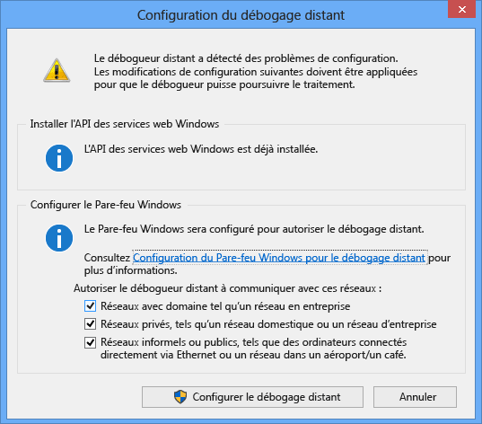

---
translation.priority.ht:
- cs-cz
- de-de
- es-es
- fr-fr
- it-it
- ja-jp
- ko-kr
- pl-pl
- pt-br
- ru-ru
- tr-tr
- zh-cn
- zh-tw
ms.openlocfilehash: 2e5782c49f26925d9eda81f04653b1a20666c6b1
ms.sourcegitcommit: da4079f5b6ec884baf3108cbd0519d20cb64c70b
ms.translationtype: MT
ms.contentlocale: fr-FR
ms.lasthandoff: 07/15/2019
ms.locfileid: "67043464"
---
1. Sur l’ordinateur distant, rechercher et démarrer le **débogueur distant** à partir de la **Démarrer** menu. 
   
   Si vous n’avez les autorisations administratives sur l’ordinateur distant, cliquez sur le **débogueur distant** application et sélectionnez **exécuter en tant qu’administrateur**. Sinon, simplement démarrer normalement.

   Si vous envisagez d’attacher à un processus qui s’exécute en tant qu’administrateur, ou s’exécute sous un autre utilisateur de compte (comme IIS), cliquez sur le **débogueur distant** application et sélectionnez **exécuter en tant qu’administrateur**. Pour plus d’informations, consultez [exécuter le débogueur distant en tant qu’administrateur](../remote-debugging-errors-and-troubleshooting.md#run-the-remote-debugger-as-an-administrator).
   
1. La première fois que vous démarrez le débogueur distant (ou avant que vous l’avez configuré), le **Configuration du débogage distant** boîte de dialogue s’affiche.  
  
      
  
1. Si l’API des Services Web Windows n’est pas installé, ce qui se produit uniquement sur Windows Server 2008 R2, sélectionnez le **installer** bouton.  
  
1. Sélectionnez au moins un type de réseau à utiliser les outils à distance sur. Si les ordinateurs sont connectés à un domaine, vous devez choisir le premier élément. Si les ordinateurs sont connectés à un groupe de travail ou un groupe résidentiel, choisissez la deuxième ou troisième élément comme il convient.  
  
1. Sélectionnez **configurer le débogage distant** pour configurer le pare-feu et démarrer le débogueur distant.  
  
1. Lors de la configuration est terminée, le **débogueur distant** fenêtre s’affiche.
  
    
  
    Le débogueur distant est maintenant en attente pour une connexion. Utiliser le nom du serveur et le port numéro indiqué pour définir la configuration de la connexion à distance dans Visual Studio.  
  
Pour arrêter le débogueur distant, sélectionnez **fichier** > **Exit**. Vous pouvez le redémarrer à partir de la **Démarrer** menu, ou à partir de la ligne de commande :  
  
```cmd
<Remote debugger installation directory>\msvsmon.exe
```
