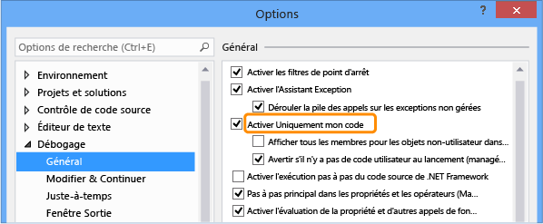

# <a name="debug-only-user-code-with-just-my-code"></a>Déboguer uniquement le code utilisateur avec uniquement mon Code

*Uniquement mon Code* n’est une fonctionnalité de débogage de Visual Studio automatiquement étapes au fil des appels système, framework et tout autre code non-utilisateur. Dans le **pile des appels** fenêtre, uniquement mon Code réduit ces appels dans **[Code externe]** cadres.

Uniquement mon Code fonctionne différemment dans les projets .NET Framework, C++ et JavaScript.

## <a name="BKMK_Enable_or_disable_Just_My_Code"></a> Activer ou désactiver Uniquement mon code

Pour la plupart des langages de programmation, uniquement mon Code est activé par défaut.

- Pour activer ou désactiver uniquement mon Code dans Visual Studio, sous **outils** > **Options** (ou **déboguer** > **Options**) > **Débogage** > **général**, sélectionnez ou désélectionnez **activer uniquement mon Code**.



> [!NOTE]
> **Activer uniquement mon Code** est un paramètre global qui s’applique à tous les projets Visual Studio dans toutes les langues.

## <a name="just-my-code-debugging"></a>Uniquement mon code (débogage)

Pendant une session de débogage, le **Modules** affiche la fenêtre modules traite en tant que mon Code (code de l’utilisateur), le débogueur de code, ainsi que leur état le chargement des symboles. Pour plus d’informations, consultez [vous familiariser avec la façon dont le débogueur s’attache à votre application](../debugger/debugger-tips-and-tricks.md#modules_window).


Dans le **pile des appels** ou **tâches** fenêtre, uniquement mon Code réduit le code non-utilisateur dans un bloc de code annoté grisé intitulé `[External Code]`.


>[!TIP]
>Pour ouvrir le **Modules**, **pile des appels**, **tâches**, ou la plupart des autres fenêtres de débogage, vous devez être dans une session de débogage. Pendant le débogage, sous **déboguer** > **Windows**, sélectionnez windows que vous souhaitez ouvrir.

<a name="BKMK_Override_call_stack_filtering"></a> Pour afficher le code dans un réduit **[Code externe]** frame, avec le bouton droit dans le **pile des appels** ou **tâche** , puis sélectionnez **afficher le Code externe**dans le menu contextuel. Remplacement les lignes de code externe développé le **[Code externe**] frame.


> [!NOTE]
> **Afficher le Code externe** est un générateur de profils utilisateur en cours qui s’applique à tous les projets dans toutes les langues qui sont ouverts par l’utilisateur.

Double-cliquez sur une ligne de code externe développée dans le **pile des appels** fenêtre met en surbrillance la ligne de code appelant en vert dans le code source. Pour les DLL ou d’autres modules pas trouvé ou chargé, un symbole ou une source introuvable peut s’ouvrir.

## <a name="BKMK__NET_Framework_Just_My_Code"></a>Uniquement mon code .NET Framework

Dans les projets .NET Framework, uniquement mon Code utilise le symbole (*.pdb*) les fichiers et les optimisations de programme pour classer le code utilisateur et non-utilisateur. Le débogueur .NET Framework prend en compte optimisé des fichiers binaires et non chargé *.pdb* fichiers doivent être du code non-utilisateur.

Trois attributs de compilateur affectent également ce que le débogueur .NET considère comme étant du code de l’utilisateur :

- <xref:System.Diagnostics.DebuggerNonUserCodeAttribute> Indique au débogueur que le code, à qu'il est appliqué n’est pas le code utilisateur.
- <xref:System.Diagnostics.DebuggerHiddenAttribute> masque le code au débogueur, même si l'option Uniquement mon code est désactivée.
- <xref:System.Diagnostics.DebuggerStepThroughAttribute> Indique au débogueur pour parcourir le code, qu'il s’applique, plutôt que de pas à pas détaillé du code.

Le débogueur .NET Framework prend en compte le reste du code au code utilisateur.

Pendant le débogage de .NET Framework :

- **Déboguer** > **pas à pas détaillé** (ou **F11**) sur le code non-utilisateur exécute le code à la ligne suivante du code utilisateur.
- **Déboguer** > **pas à pas sortant** (ou **MAJ**+**F11**) sur le code de non-utilisateur s’exécute à la ligne suivante du code utilisateur.

S’il n’existe plus aucun code utilisateur, le débogage se poursuit jusqu'à ce qu’il se termine, rencontre un autre point d’arrêt ou génère une erreur.

<a name="BKMK_NET_Breakpoint_behavior"></a> Si le débogueur s’arrête dans le code non-utilisateur (par exemple, vous utilisez **déboguer** > **interrompre tout** et pause dans le code non-utilisateur), le **aucune Source** fenêtre s’affiche. Vous pouvez ensuite utiliser un **déboguer** > **étape** commande pour accéder à la ligne suivante du code utilisateur.

Si une exception non gérée se produit dans le code non-utilisateur, le débogueur s’arrête à la ligne de code utilisateur où l’exception a été générée.

Si les exceptions de première chance sont activées pour l’exception, la ligne de code de l’utilisateur appelant est mis en surbrillance en vert dans le code source. Le **pile des appels** fenêtre affiche le cadre annoté intitulé **[Code externe]**.

## <a name="BKMK_C___Just_My_Code"></a> Uniquement mon code C++

À compter de Visual Studio 2017 version 15.8, uniquement mon Code pour le code pas à pas détaillé est également pris en charge. Cette fonctionnalité exige également l’utilisation de la [/JMC (débogage uniquement mon code)](/cpp/build/reference/jmc) commutateur de compilateur. Le commutateur est activé par défaut dans C++ projets. Pour **pile des appels** fenêtre et appel de prise en charge de la pile dans uniquement mon Code, le commutateur /JMC n’est pas nécessaire.

<a name="BKMK_CPP_User_and_non_user_code"></a> Pour être classés comme du code utilisateur, le fichier PDB pour le fichier binaire qui contient le code utilisateur doit être chargé par le débogueur (utiliser le **Modules** fenêtre pour vérifier cela).

Pour appeler un comportement pile, comme dans le **pile des appels** fenêtre, uniquement mon Code dans C++ considère uniquement ces fonctions *code non-utilisateur*:

- Fonctions avec des informations sources supprimées dans leur fichier de symboles.
- Fonctions où les fichiers de symboles indiquent qu'il n'existe pas de fichier source correspondant au frame de pile.
- Fonctions spécifiées dans  *\*.natjmc* des fichiers dans le *%VsInstallDirectory%\Common7\Packages\Debugger\Visualizers* dossier.

Pour le comportement de pas à pas de code, uniquement mon Code dans C++ considère uniquement ces fonctions *code non-utilisateur*:

- Fonctions pour laquelle le fichier PDB correspondant n’a pas été chargé dans le débogueur.
- Fonctions spécifiées dans  *\*.natjmc* des fichiers dans le *%VsInstallDirectory%\Common7\Packages\Debugger\Visualizers* dossier.

> [!NOTE]
> Pour la prise en charge pas à pas de code dans uniquement mon Code, C++ code doit être compilé à l’aide des compilateurs MSVC dans Visual Studio 15.8 Preview 3 ou version ultérieure, et le commutateur de compilateur /JMC doit être activé (elle est activée par défaut). Pour plus d’informations, consultez [personnaliser C++ pile des appels et le comportement du pas à pas de code](#BKMK_CPP_Customize_call_stack_behavior)) et cela [billet de blog](https://devblogs.microsoft.com/cppblog/announcing-jmc-stepping-in-visual-studio/). Pour le code compilé à l’aide d’un compilateur antérieur, *.natstepfilter* fichiers sont la seule façon de personnaliser le code pas à pas détaillé, qui est indépendante d’uniquement mon Code. Consultez [personnaliser C++ pas à pas de comportement](#BKMK_CPP_Customize_stepping_behavior).

<a name="BKMK_CPP_Stepping_behavior"></a> Pendant le débogage de C++ :

- **Déboguer** > **pas à pas détaillé** (ou **F11**) sur le code non-utilisateur exécute le code à la ligne suivante du code utilisateur.
- **Déboguer** > **pas à pas sortant** (ou **MAJ**+**F11**) sur le code de non-utilisateur s’exécute à la ligne suivante du code utilisateur.

S’il n’existe plus aucun code utilisateur, le débogage se poursuit jusqu'à ce qu’il se termine, rencontre un autre point d’arrêt ou génère une erreur.

Si le débogueur s’arrête dans le code non-utilisateur (par exemple, vous utilisez **déboguer** > **interrompre tout** et suspendre dans le code de non-utilisateur), pas à pas continue dans le code non-utilisateur.

Si le débogueur rencontre une exception, il s’arrête sur l’exception, s’il s’agit dans le code utilisateur ou non à l’utilisateur. **Non gérées par l’utilisateur** options dans le **paramètres d’Exception** boîte de dialogue sont ignorés.

### <a name="BKMK_CPP_Customize_call_stack_behavior"></a> Personnaliser C++ pile des appels et le comportement du pas à pas de code

Pour les projets C++, vous pouvez spécifier les modules, les fichiers sources et les fonctions le **pile des appels** fenêtre traite en tant que code non-utilisateur en les spécifiant dans  *\*.natjmc* fichiers. Cette personnalisation s’applique également au code pas à pas détaillé si vous utilisez la dernière version du compilateur (consultez [ C++ uniquement mon Code](#BKMK_CPP_User_and_non_user_code)).

- Pour spécifier le code non-utilisateur pour tous les utilisateurs de l’ordinateur Visual Studio, ajoutez le *.natjmc* de fichiers à la *%VsInstallDirectory%\Common7\Packages\Debugger\Visualizers* dossier.
- Pour spécifier le code non-utilisateur pour un utilisateur individuel, ajoutez le *.natjmc* de fichiers à la *%USERPROFILE%\My Documents\\< version de Visual Studio\>\Visualizers* dossier.

Un *.natjmc* fichier est un fichier XML avec la syntaxe suivante :

```xml
<?xml version="1.0" encoding="utf-8"?>
<NonUserCode xmlns="http://schemas.microsoft.com/vstudio/debugger/jmc/2015">

  <!-- Modules -->
  <Module Name="ModuleSpec" />
  <Module Name="ModuleSpec" Company="CompanyName" />

  <!-- Files -->
  <File Name="FileSpec"/>

  <!-- Functions -->
  <Function Name="FunctionSpec" />
  <Function Name="FunctionSpec" Module ="ModuleSpec" />
  <Function Name="FunctionSpec" Module ="ModuleSpec" ExceptionImplementation="true" />

</NonUserCode>

```

 **Attributs des éléments Module**

|Attribut|Description|
|---------------|-----------------|
|`Name`|Obligatoire. Chemin d’accès complet du ou des modules. Vous pouvez utiliser les caractères génériques Windows `?` (zéro ou un caractère) et `*` (zéro ou plusieurs caractères). Par exemple :<br /><br /> `<Module Name="?:\3rdParty\UtilLibs\*" />`<br /><br /> Indique au débogueur de traiter tous les modules dans *\3rdParty\UtilLibs* sur n’importe quel lecteur comme du code externe.|
|`Company`|Optionnel. Le nom de la société qui publie le module incorporé dans le fichier exécutable. Vous pouvez utiliser cet attribut pour lever l'ambiguïté entre les modules.|

 **Attributs des éléments File**

|Attribut|Description|
|---------------|-----------------|
|`Name`|Obligatoire. Chemin d’accès complet du ou des fichiers sources à traiter comme du code externe. Vous pouvez utiliser les caractères génériques Windows `?` et `*` quand vous spécifiez le chemin d’accès.|

 **Attributs des éléments Function**

|Attribut|Description|
|---------------|-----------------|
|`Name`|Obligatoire. Le nom complet de la fonction à traiter comme du code externe.|
|`Module`|Optionnel. Le nom ou le chemin d'accès complet au module qui contient la fonction. Vous pouvez utiliser cet attribut pour lever l'ambiguïté entre des fonctions du même nom.|
|`ExceptionImplementation`|Quand la valeur est définie sur `true`, la pile des appels affiche la fonction qui a levé l'exception, au lieu de cette fonction.|

### <a name="BKMK_CPP_Customize_stepping_behavior"></a> Personnaliser C++ pas à pas de comportement indépendant des paramètres d’uniquement mon Code

Dans les projets C++, vous pouvez spécifier des fonctions pour l’étape en les répertoriant comme étant du code non-utilisateur dans  *\*.natstepfilter* fichiers. Les fonctions répertoriées dans  *\*.natstepfilter* fichiers ne sont pas dépendants des paramètres d’uniquement mon Code.

- Pour spécifier le code non-utilisateur pour tous les utilisateurs de Visual Studio locales, ajoutez le *.natstepfilter* de fichiers à la *%VsInstallDirectory%\Common7\Packages\Debugger\Visualizers* dossier.
- Pour spécifier le code non-utilisateur pour un utilisateur individuel, ajoutez le *.natstepfilter* de fichiers à la *%USERPROFILE%\My Documents\\< version de Visual Studio\>\Visualizers* dossier.

Un *.natstepfilter* fichier est un fichier XML avec la syntaxe suivante :

```xml
<?xml version="1.0" encoding="utf-8"?>
<StepFilter xmlns="http://schemas.microsoft.com/vstudio/debugger/natstepfilter/2010">
    <Function>
        <Name>FunctionSpec</Name>
        <Action>StepAction</Action>
    </Function>
    <Function>
        <Name>FunctionSpec</Name>
        <Module>ModuleSpec</Module>
        <Action>StepAction</Action>
    </Function>
</StepFilter>

```

|Élément|Description|
|-------------|-----------------|
|`Function`|Obligatoire. Spécifie une ou plusieurs fonctions comme fonctions non-utilisateur.|
|`Name`|Obligatoire. Une expression régulière mise en forme selon ECMA-262 spécifiant le nom complet de la fonction concernée. Exemple :<br /><br /> `<Name>MyNS::MyClass.*</Name>`<br /><br /> indique au débogueur que toutes les méthodes de `MyNS::MyClass` doivent être considérées comme du code non-utilisateur. La recherche de correspondance respecte la casse.|
|`Module`|Optionnel. Une expression régulière mise en forme selon ECMA-262 spécifiant le chemin d'accès complet au module contenant la fonction. La recherche de correspondance ne respecte pas la casse.|
|`Action`|Obligatoire. Une des valeurs suivantes (respectant la casse) :<br /><br /> `NoStepInto`  -Indique au débogueur de survol de la fonction.<br /> `StepInto`  -Indique au débogueur de pas à pas détaillé de la fonction de la substitution de n’importe quel autre `NoStepInto` pour la fonction de mise en correspondance.|

## <a name="BKMK_JavaScript_Just_My_Code"></a> Uniquement mon code JavaScript

<a name="BKMK_JS_User_and_non_user_code"></a> Uniquement mon code JavaScript contrôle l’exécution pas à pas et l’affichage de la pile des appels en catégorisant le code selon la classification suivante :

|||
|-|-|
|**MyCode**|Code utilisateur dont vous êtes propriétaire et que vous contrôlez.|
|**LibraryCode**|Le code à partir de bibliothèques que vous utilisez régulièrement et votre application s’appuie sur pour fonctionner correctement (par exemple WinJS ou jQuery).|
|**UnrelatedCode**|Code non-utilisateur dans votre application, vous n’êtes pas propriétaire et votre application ne repose pas sur pour fonctionner correctement. Par exemple, une publicité SDK qui affiche des publicités peut être UnrelatedCode. Dans les projets UWP, tout code qui est chargé dans votre application à partir d’un URI HTTP ou HTTPS est également considéré comme UnrelatedCode.|

Le débogueur JavaScript classifie un code en tant qu’utilisateur ou non-utilisateur dans cet ordre :

1. Les classifications par défaut.
   - Script exécuté en passant une chaîne pour le fourni par l’hôte `eval` fonction est **MyCode**.
   - Script exécuté en passant une chaîne pour le `Function` constructeur est **LibraryCode**.
   - Script dans une référence de framework, comme WinJS ou le Kit de développement, est **LibraryCode**.
   - Script exécuté en passant une chaîne pour le `setTimeout`, `setImmediate`, ou `setInterval` functions est **UnrelatedCode**.

2. Les classifications spécifiées pour tous les projets JavaScript Visual Studio dans le *%VSInstallDirectory%\JavaScript\JustMyCode\mycode.default.wwa.json* fichier.

3. Classifications dans le *mycode.json* fichier du projet actuel.

Chaque étape de classification remplace les étapes précédentes.

Le reste du code est classé comme **MyCode**.

Vous pouvez modifier les classifications par défaut et classer des fichiers et des URL en tant que code utilisateur ou non à l’utilisateur, en ajoutant un *.json* fichier nommé *mycode.json* dans le dossier racine d’un projet JavaScript. Consultez [personnaliser uniquement mon Code JavaScript](#BKMK_JS_Customize_Just_My_Code).

<a name="BKMK_JS_Stepping_behavior"></a> Pendant le débogage de JavaScript :

- Si une fonction est le code non-utilisateur, **déboguer** > **pas à pas détaillé** (ou **F11**) se comporte comme **déboguer**  >  **Pas à pas principal** (ou **F10**).
- Si une étape commence dans non-utilisateur (**LibraryCode** ou **UnrelatedCode**) le code, pas à pas détaillé temporairement se comporte comme si uniquement mon Code n’est pas activé. Quand vous passez au code utilisateur, uniquement mon Code pas à pas est réactivé.
- Quand un code utilisateur étape aboutit à quitter le contexte d’exécution actuel, le débogueur s’arrête à la ligne de code exécutée utilisateur suivante. Par exemple, si un rappel s’exécute dans du code **LibraryCode**, le débogueur continue jusqu’à ce que la ligne suivante du code utilisateur s’exécute.
- **Pas à pas sortant** (ou **MAJ**+**F11**) s’arrête sur la ligne suivante du code utilisateur.

S’il n’existe plus aucun code utilisateur, le débogage se poursuit jusqu'à ce qu’il se termine, rencontre un autre point d’arrêt ou génère une erreur.

Points d’arrêt définis dans le code sont toujours atteints, mais le code est classé.

- Si le `debugger` mot clé se produit dans **LibraryCode**, le débogueur s’arrête toujours.
- Si le `debugger` mot clé se produit dans **UnrelatedCode**, le débogueur ne s’arrête.

<a name="BKMK_JS_Exception_behavior"></a> Si une exception non gérée se produit dans **MyCode** ou **LibraryCode** code, le débogueur s’arrête toujours.

Si une exception non gérée se produit dans **UnrelatedCode**, et **MyCode** ou **LibraryCode** se trouve sur la pile des appels, le débogueur s’arrête.

Si les exceptions de première chance sont activées pour l’exception et l’exception se produit dans **LibraryCode** ou **UnrelatedCode**:

- Si l’exception est gérée, le débogueur ne s’arrête pas.
- Si l'exception n'est pas gérée, le débogueur s'arrête.

### <a name="BKMK_JS_Customize_Just_My_Code"></a> Personnaliser uniquement mon Code JavaScript

Pour classer le code utilisateur et non-utilisateur pour un seul projet JavaScript, vous pouvez ajouter un *.json* fichier nommé *mycode.json* dans le dossier racine du projet.

Spécifications de ce fichier remplacent les classifications par défaut et le *mycode.default.wwa.json* fichier. Le *mycode.json* fichier n’a pas besoin de répertorier toutes les paires clé / valeur. Le **MyCode**, **bibliothèques**, et **Unrelated** valeurs peuvent être des tableaux vides.

*MyCode.JSON* fichiers utilisent cette syntaxe :

```json
{
    "Eval" : "Classification",
    "Function" : "Classification",
    "ScriptBlock" : "Classification",
    "MyCode" : [
        "UrlOrFileSpec",
        . . .
        "UrlOrFileSpec"
    ],
    "Libraries" : [
        "UrlOrFileSpec",
        . .
        "UrlOrFileSpec"
    ],
    "Unrelated" : [
        "UrlOrFileSpec",
        . . .
        "UrlOrFileSpec"
    ]
}

```

**Eval, Function et ScriptBlock**

Les paires clé-valeur **Eval**, **Function** et **ScriptBlock** déterminent comment le code généré dynamiquement est classifié :

|||
|-|-|
|**Eval**|un script qui est exécuté en passant une chaîne à la fonction `eval` fournie par l'hôte. Par défaut, le script Eval est classifié comme **MyCode**.|
|**Function**|un script qui est exécuté en passant une chaîne au constructeur `Function`. Par défaut, le script Function est classé comme **LibraryCode**.|
|**ScriptBlock**|un script qui est exécuté en passant une chaîne aux fonctions `setTimeout`, `setImmediate` ou `setInterval`. Par défaut, le script ScriptBlock est classé comme **UnrelatedCode**.|

Vous pouvez changer la valeur en un de ces mots clés :

- `MyCode` classifie le script comme **MyCode**.
- `Library` classifie le script comme **LibraryCode**.
- `Unrelated` classifie le script comme **UnrelatedCode**.

**MyCode, Libraries et Unrelated**

Les paires clé-valeur **MyCode**, **Libraries** et **Unrelated** spécifient les URL ou les fichiers que vous voulez inclure dans une classification :

|||
|-|-|
|**MyCode**|Un tableau d’URL ou de fichiers qui sont classés comme **MyCode**.|
|**Libraries**|Un tableau d’URL ou de fichiers qui sont classifiés comme **LibraryCode**.|
|**Unrelated**|Un tableau d’URL ou de fichiers qui sont classés comme **UnrelatedCode**.|

La chaîne URL ou le fichier peut avoir une ou plusieurs `*` caractères, ce qui correspond à zéro ou plusieurs caractères. `*` est le même que l’expression régulière `.*`.
