# Créer une carte visuelle de la pile des appels pendant le débogage (C#, Visual Basic, C++, JavaScript)

Créez une carte de code pour effectuer un suivi visuel de la pile des appels pendant le débogage. Vous pouvez rédiger des notes sur la carte pour effectuer le suivi de ce que fait le code afin de vous concentrer sur la recherche de bogues.

Pour une procédure pas à pas, regardez cette vidéo : [Vidéo : Déboguez visuellement avec intégration du débogueur (Channel 9)](https://channel9.msdn.com/Series/Visual-Studio-2012-Premium-and-Ultimate-Overview/Visual-Studio-Ultimate-2012Debug-visually-with-Code-Map-debugger-integration)

Pour plus d’informations sur les commandes et les actions que vous pouvez utiliser avec les cartes de code, consultez [Parcourir et réorganiser les cartes de code](../modeling/browse-and-rearrange-code-maps.md).

>[!IMPORTANT]
>Vous pouvez créer des cartes de code uniquement dans l' [édition Visual Studio Enterprise](https://visualstudio.microsoft.com/downloads).

Voici un aperçu rapide d’une carte de code :

 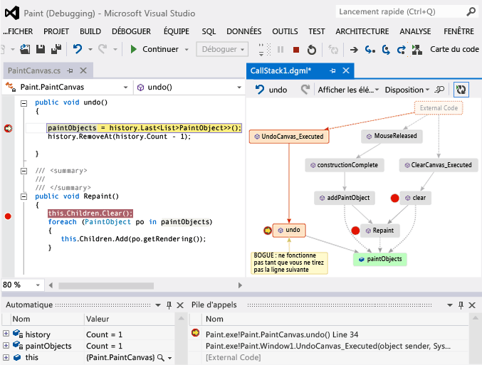

##  Mapper la pile des appels

1. Dans un projet Visual Studio Enterprise C#, Visual Basic, C++ ou JavaScript, commencez le débogage en sélectionnant **Déboguer**  >  **Démarrer** le débogage ou en appuyant sur **F5**.

1. Une fois que votre application passe en mode arrêt ou que vous exécutez pas à pas une fonction, sélectionnez **Déboguer** la  >  **carte de code** ou appuyez sur **CTRL** + **MAJ** + **`** .

   La pile d'appels actuelle apparaît en orange sur une nouvelle carte de code :

   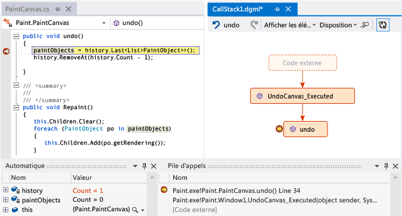

La carte de code se met à jour automatiquement lorsque vous continuez le débogage. La modification des éléments cartographiques ou de la disposition n’affecte en rien le code. N'hésitez pas à renommer, déplacer ou supprimer tout élément de la carte.

Pour obtenir plus d’informations sur un élément, pointez dessus et observez l’info-bulle de l’élément. Vous pouvez également sélectionner **légende** dans la barre d’outils pour savoir ce que signifie chaque icône.

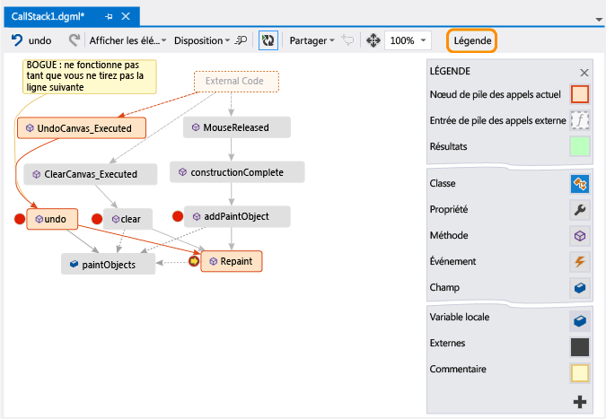

>[!NOTE]
>Le message **le diagramme peut être basé sur une version antérieure du code** en haut de la carte de code signifie que le code peut avoir changé après la dernière mise à jour de la carte. Par exemple, un appel sur la carte peut ne plus exister dans le code. Fermez le message et essayez de régénérer la solution avant de remettre à jour la carte.

## Mapper le code externe

Par défaut, seul votre propre code apparaît sur la carte. Pour afficher le code externe sur la carte :

- Cliquez avec le bouton droit dans la fenêtre **pile des appels** , puis sélectionnez **afficher le code externe**:

  
- Ou désélectionnez **activer les uniquement mon code** dans Visual Studio **Tools** (ou **débogage**) > **options** de  >  **débogage**:

  

## Contrôler la disposition de la carte

La modification de la disposition de la carte n’affecte en aucune façon le code.

Pour contrôler la disposition de la carte, sélectionnez le menu **disposition** dans la barre d’outils de la carte.

Dans le menu **disposition** , vous pouvez :

- Modifiez la disposition par défaut.
- Arrêter la réorganisation automatique de la carte, en désélectionnant **disposition automatique lors du débogage**.
- Réorganisez la carte le moins possible lorsque vous ajoutez des éléments, en désélectionnant **disposition incrémentielle**.

##  Rédiger des notes sur le code

Vous pouvez ajouter des commentaires pour suivre ce qui se passe dans le code.

Pour ajouter un commentaire, cliquez avec le bouton droit dans la carte de code et sélectionnez **modifier** le  >  **Nouveau commentaire**, puis tapez le commentaire.

Pour ajouter une nouvelle ligne dans un commentaire, appuyez sur **MAJ** + **entrée**.

 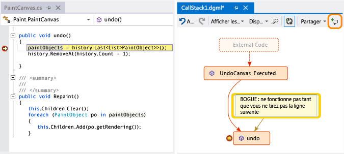

##  Mettre à jour la carte avec la pile d’appels suivante

Lorsque vous exécutez votre application jusqu’au point d’arrêt suivant ou pas à pas détaillé dans une fonction, le mappage ajoute automatiquement de nouvelles piles d’appels.

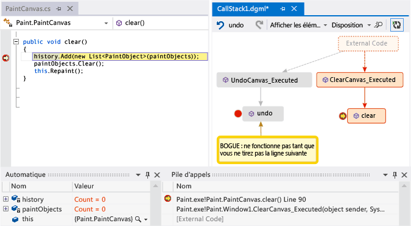

Pour empêcher le mappage d’ajouter automatiquement de nouvelles piles d’appels, sélectionnez  dans la barre d’outils de la carte de code. La carte continue à mettre en surbrillance les piles d’appels existantes. Pour ajouter manuellement la pile d’appels actuelle à la carte, appuyez sur **CTRL** + **MAJ** + **`** .

##  Ajouter du code associé à la carte

Maintenant que vous disposez d’un mappage, en C# ou Visual Basic, vous pouvez ajouter des éléments tels que des champs, des propriétés et d’autres méthodes, pour suivre ce qui se passe dans le code.

Pour accéder à la définition d’une méthode dans le code, double-cliquez sur la méthode dans la carte ou sélectionnez-la et appuyez sur **F12**, ou cliquez dessus avec le bouton droit et sélectionnez **atteindre la définition**.

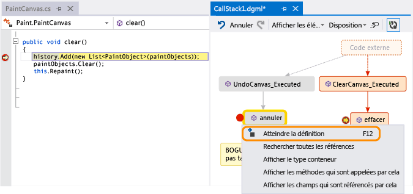

Pour ajouter des éléments que vous souhaitez suivre à la carte, cliquez avec le bouton droit sur une méthode et sélectionnez les éléments dont vous souhaitez effectuer le suivi. Les derniers éléments ajoutés apparaissent en vert.

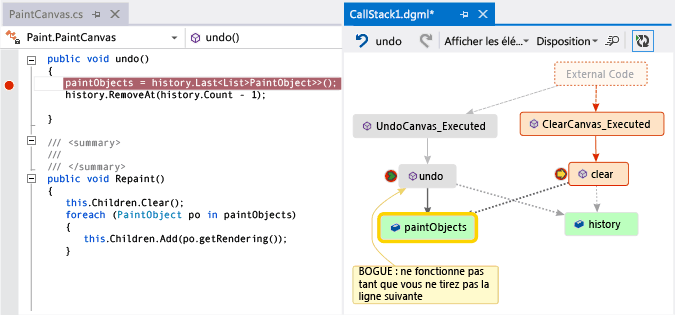

>[!NOTE]
>Par défaut, l'ajout d'éléments à la carte ajoute également les nœuds des groupes parents, comme la classe, l'espace de noms et l'assembly. Vous pouvez activer et désactiver cette fonctionnalité en sélectionnant le bouton **inclure les parents** dans la barre d’outils de la carte de code, ou en appuyant sur **CTRL** pendant que vous ajoutez des éléments.

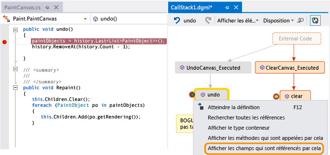

Poursuivez l'élaboration de la carte pour afficher davantage de code.

 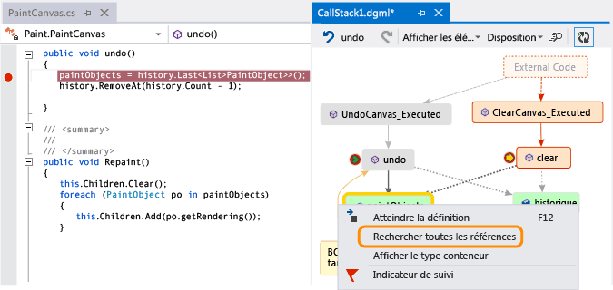

 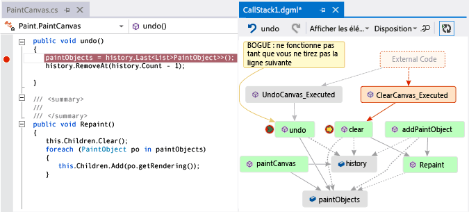

##  Rechercher des bogues à l’aide de la carte
 La visualisation de votre code peut vous aider à rechercher des bogues plus rapidement. Par exemple, supposons que vous recherchez un bogue dans une application de dessin. Lorsque vous tracez une ligne et essayez de l'annuler, rien ne se produit jusqu'à ce que vous traciez une autre ligne.

 Vous définissez donc des points d'arrêt dans les méthodes `clear`, `undo` et `Repaint`, vous démarrez le débogage et vous générez une carte comme celle-ci :

 

 Vous constatez que tous les mouvements de l'utilisateur sur la carte appellent `Repaint`, à l'exception de `undo`. Cela peut expliquer pourquoi `undo` ne fonctionne pas immédiatement.

 Une fois que vous avez corrigé le bogue et que vous continuez à exécuter l’application, la carte ajoute le nouvel appel de `undo` à `Repaint` :

 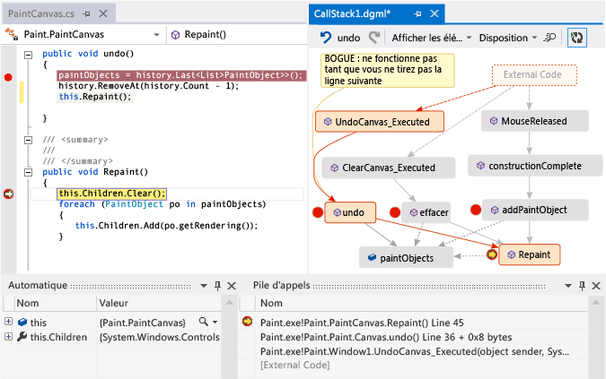

## Partager la carte avec d’autres utilisateurs

Vous pouvez exporter une carte, l’envoyer à d’autres utilisateurs avec Microsoft Outlook, l’enregistrer dans votre solution et l’archiver dans le contrôle de version.

Pour partager ou enregistrer le mappage, utilisez **partager** dans la barre d’outils de la carte de code.

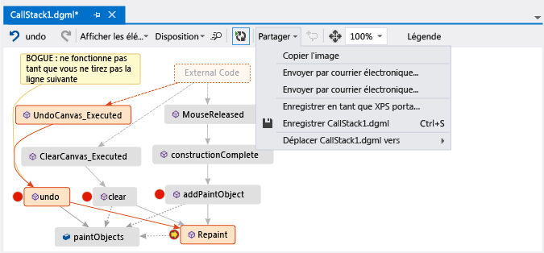

## Voir aussi
[Mapper les dépendances à travers vos solutions](../modeling/map-dependencies-across-your-solutions.md)

[Utiliser des cartes du code pour déboguer vos applications](../modeling/use-code-maps-to-debug-your-applications.md)

[Rechercher des problèmes potentiels à l’aide des analyseurs de carte du code](../modeling/find-potential-problems-using-code-map-analyzers.md)

[Parcourir et réorganiser des cartes de code](../modeling/browse-and-rearrange-code-maps.md)
