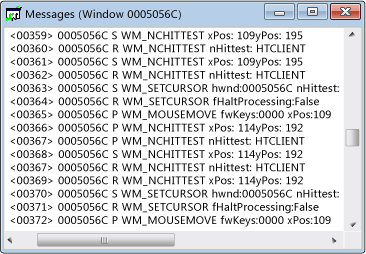

# Affichage Messages
Chaque fenêtre a un flux de message associé. Une fenêtre d’affichage de Messages affiche ce flux de message. Le handle de fenêtre, le code de message et le message sont affichés. Vous pouvez créer une vue Messages pour un thread ou un processus. Cela vous permet d’afficher les messages envoyés à toutes les fenêtres appartenant à un processus spécifique ou d’un thread, ce qui est particulièrement utile pour capturer les messages de l’initialisation de fenêtre.  
  
 Une fenêtre d’affichage de Messages par défaut s’affiche ci-dessous. Notez que la première colonne contient le handle de fenêtre et la deuxième colonne contient un code de message (expliqué dans [Codes des messages](../debugger/message-codes.md)). Paramètres de message décodés et les valeurs de retour sont à droite.  
  
   
Messages Spy++, vue  
  
## Procédures  
  
#### Pour ouvrir un affichage de Messages pour une fenêtre, un processus ou un thread  
  
1.  Déplacer le focus à un [affichage Windows](../debugger/windows-view.md), [vue processus](../debugger/processes-view.md), ou [vue Threads](../debugger/threads-view.md) fenêtre.  
  
2.  Recherchez le nœud de l’élément dont vous souhaitez examiner les messages et sélectionnez-le.  
  
3.  À partir de la **Spy** menu, choisissez **des Messages de journal**.  
  
     Le [la boîte de dialogue Options des messages](../debugger/message-options-dialog-box.md) s’ouvre.  
  
4.  Sélectionnez les options pour le message que vous souhaitez afficher.  
  
5.  Appuyez sur **OK** pour commencer l’enregistrement des messages.  
  
     Une fenêtre d’affichage des Messages et un **Messages** menu est ajouté à la barre d’outils Spy ++. Selon les options sélectionnées, les messages commencent de diffusion en continu dans la fenêtre d’affichage de Messages active.  
  
6.  Lorsque vous avez suffisamment de messages, sélectionnez **Stop Logging** à partir de la **Messages** menu.  
  
## Dans cette section  
 [Contrôle de la vue Messages](../debugger/how-to-control-messages-view.md)  
 Explique comment gérer la vue Messages.  
  
 [Affichage des Messages lors de l’ouverture à partir de la fenêtre Rechercher](../debugger/how-to-open-messages-view-from-find-window.md)  
 Explique comment ouvrir la vue Messages à partir de la boîte de dialogue Rechercher une fenêtre.  
  
 [Recherche d’un Message dans la vue Messages](../debugger/how-to-search-for-a-message-in-messages-view.md)  
 Explique comment rechercher un message spécifique dans la vue Messages.  
  
 [Démarrage et arrêt de l’affichage du journal des messages](../debugger/how-to-start-and-stop-the-message-log-display.md)  
 Explique comment démarrer et arrêter la journalisation des messages.  
  
 [Codes des messages](../debugger/message-codes.md)  
 Définit les codes des messages répertoriés dans la vue Messages.  
  
 [Affichage des propriétés de Message](../debugger/how-to-display-message-properties.md)  
 Comment afficher plus d’informations sur un message.  
  
## Rubriques connexes  
 [Vues Spy++](../debugger/spy-increment-views.md)  
 Explique les arborescences Spy ++ de windows, les messages, les processus et les threads.  
  
 [Utilisation de Spy++](../debugger/using-spy-increment.md)  
 Présente l’outil Spy ++ et explique comment elle peut être utilisée.  
  
 [Options des messages, boîte de dialogue](../debugger/message-options-dialog-box.md)  
 Permet de sélectionner les messages répertoriés dans la vue Messages active.  
  
 [Recherche d’un message, boîte de dialogue](../debugger/message-search-dialog-box.md)  
 Utilisé pour rechercher le nœud pour un message spécifique dans la vue Messages.  
  
 [Propriétés du message, boîte de dialogue](../debugger/message-properties-dialog-box.md)  
 Permet d’afficher les propriétés d’un message sélectionné dans la vue messages.  
  
 [Informations de référence sur Spy++](../debugger/spy-increment-reference.md)  
 Inclut des sections décrivant chaque Spy ++ menu et boîte de dialogue.