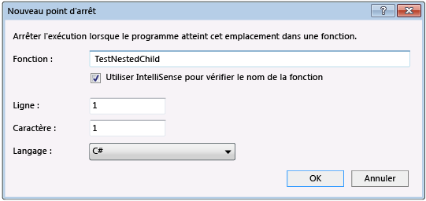

# <a name="navigate-through-code-with-the-visual-studio-debugger"></a>Naviguer dans le code avec le débogueur Visual Studio

Le débogueur Visual Studio peut vous aider à parcourir le code pour inspecter l’état d’une application et afficher son Workflow d’exécution. Vous pouvez utiliser les raccourcis clavier, les commandes de débogage, les points d’arrêt et d’autres fonctionnalités pour accéder rapidement au code que vous souhaitez examiner. Si vous êtes familiarisé avec les commandes de navigation et les raccourcis du débogueur, il est plus rapide et plus facile de trouver et de résoudre les problèmes liés aux applications.

> [!NOTE]
> S’il s’agit de la première fois que vous essayez de déboguer du code, vous souhaiterez peut-être lire le [débogage pour les débutants](../debugger/debugging-absolute-beginners.md) et les [techniques de débogage et les outils de débogage](../debugger/write-better-code-with-visual-studio.md) avant de passer en revue cet article.

## <a name="get-into-break-mode"></a>Passer en mode arrêt

En *mode arrêt*, l’exécution de l’application est interrompue lorsque les fonctions, les variables et les objets restent en mémoire. Une fois que le débogueur est en mode arrêt, vous pouvez naviguer dans votre code. Les méthodes les plus courantes pour passer en mode arrêt rapidement sont les suivantes :

- Commencez le code pas à pas en appuyant sur **F10** ou **F11**. Cela vous permet de trouver rapidement le point d’entrée de votre application, puis de continuer à appuyer sur les commandes Step pour naviguer dans le code.

- [Exécutez sur un emplacement ou une fonction spécifique](#BKMK_Break_into_code_by_using_breakpoints_or_Break_All), par exemple en [définissant un point d’arrêt](using-breakpoints.md) et en démarrant votre application.

   Par exemple, à partir de l’éditeur de code dans Visual Studio, vous pouvez utiliser la commande **Exécuter jusqu’au curseur** pour démarrer l’application, le débogueur attaché, puis passer en mode arrêt, puis **F11** pour naviguer dans le code.

   

Une fois en mode arrêt, vous pouvez utiliser diverses commandes pour naviguer dans votre code. En mode arrêt, vous pouvez examiner les valeurs des variables pour rechercher des violations ou des bogues. Pour certains types de projets, vous pouvez également apporter des modifications à l’application en mode arrêt.

La plupart des fenêtres du débogueur, telles que les **modules** et les fenêtres **Espion** , sont disponibles uniquement lorsque le débogueur est attaché à votre application. Certaines fonctionnalités du débogueur, telles que l’affichage des valeurs des variables dans la fenêtre **variables locales** ou l’évaluation des expressions dans la fenêtre **Espion** , sont disponibles uniquement lorsque le débogueur est suspendu (c’est-à-dire en mode arrêt).

> [!NOTE]
> Si vous vous débloquez dans du code qui n’a pas de fichiers sources ou de symboles (*. pdb*) chargés, le débogueur affiche une page **fichiers sources introuvables** ou **symboles introuvables** qui peuvent vous aider à trouver et à charger les fichiers. Consultez [spécifier les fichiers de symboles (. pdb) et les fichiers sources](../debugger/specify-symbol-dot-pdb-and-source-files-in-the-visual-studio-debugger.md). Si vous ne pouvez pas charger le symbole ou les fichiers sources, vous pouvez toujours déboguer les instructions de l’assembly dans **la fenêtre Code machine.**

## <a name="step-through-code"></a>Exécuter le code pas à pas

Les commandes de l’étape du débogueur vous aident à inspecter l’état de votre application ou à en savoir plus sur son Workflow d’exécution.

### <a name="step-into-code-line-by-line"></a><a name="BKMK_Step_into__over__or_out_of_the_code"></a> Pas à pas détaillé dans le code ligne par ligne

Pour arrêter l’opération sur chaque instruction pendant le débogage, utilisez le **débogage**  >  **pas à pas** détaillé ou appuyez sur **F11**.

Le débogueur parcourt les instructions de code, pas les lignes physiques. Par exemple, une clause `if` peut être écrite sur une ligne :

  ```csharp
  int x = 42;
  string s = "Not answered";
  if( int x == 42) s = "Answered!";
  ```

  ```vb
  Dim x As Integer = 42
  Dim s As String = "Not answered"
  If x = 42 Then s = "Answered!"
  ```

Toutefois, lorsque vous exécutez pas à pas cette ligne, le débogueur traite la condition comme une étape et la conséquence comme une autre. Dans l’exemple précédent, la condition a la valeur true.

Dans un appel à plusieurs fonctions imbriquées, **Pas à pas détaillé** va jusqu'à la fonction se trouvant au niveau le plus profond. Par exemple, si vous utilisez **pas à pas** détaillé dans un appel tel que `Func1(Func2())` , le débogueur parcourt la fonction `Func2` .

>[!TIP]
>À mesure que vous exécutez chaque ligne de code, vous pouvez pointer sur les variables pour voir leurs valeurs, ou utiliser les fenêtres variables [locales](autos-and-locals-windows.md) et [Espion](watch-and-quickwatch-windows.md) pour surveiller les valeurs modifiées. Vous pouvez également suivre visuellement la [pile des appels](how-to-use-the-call-stack-window.md) tout en effectuant un pas à pas détaillé dans les fonctions. (Pour Visual Studio Enterprise uniquement, consultez [mapper des méthodes sur la pile des appels pendant le débogage](../debugger/map-methods-on-the-call-stack-while-debugging-in-visual-studio.md)).

### <a name="step-through-code-and-skip-some-functions"></a><a name="BKMK_Step_over_Step_out"></a> Exécuter le code pas à pas et ignorer certaines fonctions

Vous ne vous souciez peut-être pas d’une fonction pendant le débogage, ou vous savez qu’elle fonctionne, comme un code de bibliothèque bien testé. Vous pouvez utiliser les commandes suivantes pour ignorer le code pendant l’exécution pas à pas du code. Les fonctions s’exécutent toujours, mais le débogueur les ignore.

|Commande clavier|Commande du menu Déboguer|Description|
|----------------------|------------------|-----------------|
|**F10**|**Pas à pas principal**|Si la ligne active contient un appel de fonction, **pas à pas principal** exécute le code, puis interrompt l’exécution à la première ligne de code après le retour de la fonction appelée.|
|**MAJ** + **F11**|**Pas à pas sortant**|**Pas à pas sortant** poursuit l’exécution du code et interrompt l’exécution lorsque la fonction active retourne. Le débogueur ignore la fonction active.|

## <a name="run-to-a-specific-location-or-function"></a><a name="BKMK_Break_into_code_by_using_breakpoints_or_Break_All"></a> Exécuter jusqu’à un emplacement ou une fonction spécifique

Vous préférerez peut-être exécuter directement à un emplacement ou une fonction spécifique si vous savez exactement quel code vous souhaitez inspecter ou si vous savez où vous souhaitez démarrer le débogage.

### <a name="run-to-a-breakpoint-in-code"></a>Exécuter jusqu’à un point d’arrêt dans le code

Pour définir un point d’arrêt simple dans votre code, cliquez sur la marge la plus à gauche en regard de la ligne de code où vous souhaitez suspendre l’exécution. Vous pouvez également sélectionner la ligne et appuyer sur **F9**, **Sélectionner**  >  **basculer le point d’arrêt** ou cliquer avec le bouton droit et sélectionner point d' **arrêt**  >  **Insérer un point d’arrêt**. Le point d’arrêt apparaît sous la forme d’un point rouge dans la marge de gauche, en regard de la ligne de code. Le débogueur interrompt l’exécution juste avant l’exécution de la ligne.


Les points d'arrêt dans Visual Studio fournissent un ensemble enrichi de fonctionnalités supplémentaires, telles que les points d'arrêt et les points de trace conditionnels. Pour plus d’informations, consultez [utilisation de points d’arrêt](../debugger/using-breakpoints.md).

### <a name="run-to-a-function-breakpoint"></a>Exécuter jusqu’à un point d’arrêt sur fonction

Vous pouvez demander au débogueur de s’exécuter jusqu’à ce qu’il atteigne une fonction spécifiée. Vous pouvez spécifier la fonction par nom ou la sélectionner dans la pile des appels.

**Pour spécifier un point d’arrêt sur fonction par nom**

1. Sélectionner le  >  point d’arrêt **de** la  >  **fonction** de débogage

1. Dans la boîte de dialogue **nouveau point d’arrêt sur fonction** , tapez le nom de la fonction et sélectionnez sa langue.

   

1. Sélectionnez **OK**.

Si la fonction est surchargée ou dans plusieurs espaces de noms, vous pouvez choisir celle que vous souhaitez dans la fenêtre **points d’arrêt** .


**Pour sélectionner un point d’arrêt sur fonction dans la pile des appels**

1. Pendant le débogage, ouvrez la fenêtre **pile des appels** en sélectionnant **Déboguer** la pile des  >    >  **appels** Windows.

1. Dans la fenêtre **pile des appels** , cliquez avec le bouton droit sur une fonction et sélectionnez **Exécuter jusqu’au curseur**, ou appuyez sur **CTRL** + **F10**.

Pour suivre visuellement la pile des appels, consultez [mapper des méthodes sur la pile des appels pendant le débogage](../debugger/map-methods-on-the-call-stack-while-debugging-in-visual-studio.md).

### <a name="run-to-a-cursor-location"></a>Exécuter jusqu’à un emplacement de curseur

Pour exécuter jusqu’à l’emplacement du curseur, dans le code source ou la fenêtre **pile des appels** , sélectionnez la ligne sur laquelle vous voulez vous arrêter, cliquez avec le bouton droit et sélectionnez **Exécuter jusqu’au curseur**, ou appuyez sur **CTRL** + **F10**. Sélectionner **Exécuter jusqu’au curseur revient à** définir un point d’arrêt temporaire.

### <a name="run-to-click"></a>Exécuter jusqu’au clic

Lorsque vous êtes en pause dans le débogueur, vous pouvez pointer sur une instruction dans le code source ou la fenêtre code **machine** , puis sélectionner l’icône de flèche verte **exécuter l’exécution jusqu’ici** . L’utilisation **de l’exécution pour cliquer** élimine la nécessité de définir un point d’arrêt temporaire.


> [!NOTE]
> **Exécuter jusqu’au clic** est disponible à partir de [!include[vs_dev15](../misc/includes/vs_dev15_md.md)] .

### <a name="manually-break-into-code"></a>S'arrêter manuellement dans le code

Pour rompre la ligne de code suivante disponible dans une application en cours d’exécution, sélectionnez **Déboguer**  >  **tout** ou appuyez sur **CTRL** + **ALT** + **arrêter**.

## <a name="move-the-pointer-to-change-the-execution-flow"></a><a name="BKMK_Set_the_next_statement_to_execute"></a> Déplacer le pointeur pour modifier le workflow d’exécution

Pendant que le débogueur est suspendu, une flèche jaune dans la marge de la fenêtre code source ou code **machine** marque l’emplacement de la prochaine instruction à exécuter. Vous pouvez modifier la prochaine instruction à exécuter en déplaçant cette flèche. Vous pouvez ignorer une partie du code ou revenir à une ligne précédente. Le déplacement du pointeur est utile dans des situations telles que l’omission d’une section de code qui contient un bogue connu.

 

Pour modifier l’instruction suivante à exécuter, le débogueur doit être en mode arrêt. Dans la fenêtre code source ou code **machine** , faites glisser la flèche jaune vers une autre ligne, ou cliquez avec le bouton droit sur la ligne que vous souhaitez exécuter ensuite, puis sélectionnez **définir l’instruction suivante**.

Le compteur de programme accède directement au nouvel emplacement, et les instructions entre l’ancien et le nouveau point d’exécution ne sont pas exécutées. Toutefois, si vous déplacez le point d’exécution vers l’arrière, les instructions qui s’y trouvent ne sont pas annulées.

>[!CAUTION]
>- Le déplacement de l'instruction suivante vers une autre fonction ou portée entraîne généralement une altération de la pile des appels, provoquant une erreur ou exception d'exécution. Si vous tentez de déplacer l'instruction suivante vers une autre portée, le débogueur ouvre une boîte de dialogue avec un avertissement et vous donne une occasion d'annuler l'opération.
>- En Visual Basic, vous ne pouvez pas déplacer l'instruction suivante à une autre portée ou fonction.
>- En C++ natif, si les contrôles d'exécution sont activés, la définition de l'instruction suivante peut provoquer la levée d'une exception lorsque l'exécution atteint la fin de la méthode.
>- Lorsque Modifier &amp; Continuer est activé, la commande **Définir l'instruction suivante** échoue si vous avez apporté des modifications qui ne peuvent pas être remappées immédiatement par Modifier &amp; Continuer. Par exemple, cela peut se produire si vous avez modifié le code contenu dans un bloc catch. Dans ce cas, un message d’erreur vous indique que l’opération n’est pas prise en charge.
>- En code managé, vous ne pouvez pas déplacer l’instruction suivante si :
>   - L'instruction suivante se trouve dans une méthode différente de celle de l'instruction actuelle.
>   - Le débogage a été démarré par le débogage juste-à-temps.
>   - Un déroulement de la pile des appels est en cours.
>   - Une exception System.StackOverflowException ou System.Threading.ThreadAbortException a été levée.

## <a name="debug-non-user-code"></a><a name="BKMK_Restrict_stepping_to_Just_My_Code"></a>Déboguer du code non-utilisateur

Par défaut, le débogueur tente de déboguer uniquement le code de votre application en activant un paramètre appelé *uniquement mon code*. Pour plus d’informations sur le fonctionnement de cette fonctionnalité pour différents types de projets et langages, et sur la façon dont vous pouvez la personnaliser, consultez [uniquement mon code](../debugger/just-my-code.md).

Pour examiner le code du Framework, le code de bibliothèque tiers ou les appels système pendant le débogage, vous pouvez désactiver Uniquement mon code. Dans **Outils** (ou **débogage**) > **options** de  >  **débogage**, désactivez la case à cocher **activer uniquement mon code** . Lorsque Uniquement mon code est désactivé, le code non-utilisateur apparaît dans les fenêtres du débogueur, et le débogueur peut effectuer un pas à pas détaillé dans le code non-utilisateur.

> [!NOTE]
> Uniquement mon code n'est pas pris en charge pour les projets Smart Device.

### <a name="debug-system-code"></a>Déboguer le code système

Si vous avez chargé des symboles de débogage pour le code système Microsoft et désactivé Uniquement mon code, vous pouvez effectuer un pas à pas détaillé dans un appel système, comme vous le feriez pour n’importe quel autre appel.

Pour charger des symboles Microsoft, consultez [configurer les emplacements de symboles et les options de chargement](specify-symbol-dot-pdb-and-source-files-in-the-visual-studio-debugger.md#configure-symbol-locations-and-loading-options).

**Pour charger des symboles pour un composant système spécifique :**

1. Pendant le débogage, ouvrez la fenêtre **modules** en sélectionnant **Déboguer** les  >    >  **modules** Windows, ou en appuyant sur **CTRL** + **ALT** + **U**.

1. Dans la fenêtre **modules** , vous pouvez déterminer les modules dont les symboles sont chargés dans la colonne **État du symbole** . Cliquez avec le bouton droit sur le module pour lequel vous souhaitez charger des symboles, puis sélectionnez **charger les symboles**.

## <a name="step-into-properties-and-operators-in-managed-code"></a><a name="BKMK_Step_into_properties_and_operators_in_managed_code"></a> Effectuer un pas à pas détaillé dans des propriétés et des opérateurs au sein du code managé
 Par défaut, le débogueur effectue un pas à pas principal sur les propriétés et les opérateurs dans le code managé. Dans la plupart des cas, cela fournit une meilleure expérience de débogage. Pour activer le pas à pas détaillé des propriétés ou des opérateurs, choisissez Options de **débogage**  >  . Dans la page **débogage**  >  **général** , désactivez la case à cocher **pas à pas principal dans les propriétés et les opérateurs (managé uniquement)** .

## <a name="see-also"></a>Voir aussi
- [Qu’est-ce que le débogage ?](../debugger/what-is-debugging.md)
- [Techniques et outils de débogage](../debugger/write-better-code-with-visual-studio.md)
- [Premier aperçu du débogage](../debugger/debugger-feature-tour.md)
