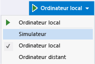

# <a name="refresh-a-uwp-or-windows-81-app"></a>Actualiser une plateforme Windows universelle ou Windows 8.1
  
  
 Vous pouvez apporter des modifications à votre code pendant le débogage, puis actualiser une application UWP en JavaScript en sélectionnant le **actualiser l’application Windows** bouton sur le **déboguer** barre d’outils. Ce bouton permet de recharger l'application sans arrêter, ni redémarrer le débogueur. La fonctionnalité Actualiser vous permet de modifier le code HTML, CSS et JavaScript et de visualiser rapidement le résultat. Cette fonctionnalité est prise en charge pour les applications UWP et Windows 8.1.  
  
 L'actualisation ne conserve pas l'état de votre application, ni ne reflète les modifications suivantes dans votre application :  
  
-   modifications du fichier manifeste du package, y compris les modifications des images spécifiées dans le manifeste du package ;  
  
-   modifications des références, telles que l'ajout ou la suppression d'une référence SDK, ou modifications des composants Windows Runtime (fichiers .winmd) ;  
  
-   modifications des ressources, telles que les modifications des chaînes dans les fichiers .resjson ;  
  
-   modifications des fichiers projet qui entraînent des changements de noms de chemin d'accès, de nouveaux fichiers projet ou des fichiers supprimés ;  
  
-   modifications des propriétés de projet et d'élément, telles que les modifications du périphérique de débogage sélectionné, ou les modifications de l'action du package pour un fichier (dans la fenêtre Propriétés).  
  
> [!IMPORTANT]
>  Lorsque vous modifiez des références ou le manifeste du package, ou que vous apportez d'autres modifications spécifiées dans la liste précédente, vous devez arrêter et redémarrer le débogueur pour mettre à jour les fichiers sources HTML, CSS et JavaScript.  
  
### <a name="to-refresh-an-app"></a>Pour actualiser une application  
  
1.  Dans Visual Studio, créez un projet à l'aide du modèle de projet Application de navigation.  
  
     Il peut s’agir d’application UWP ou une application Windows 8.1.  
  
2.  Avec le modèle ouvert dans Visual Studio, sélectionnez une cible de débogage.  
  
     Si un projet Windows Phone est votre projet de démarrage actuel, sélectionnez un émulateur Windows Phone pour la cible de débogage. Sinon, sélectionnez **simulateur** ou **ordinateur Local**.  
  
       
  
3.  Appuyez sur F5 pour exécuter l'application en mode débogage.  
  
4.  Passez dans Visual Studio. (Appuyez sur F12).  
  
5.  Dans **l’Explorateur de solutions**, dans le **pages** > **domestique** dossier, ouvrez home.html.  
  
6.  Remplacez le texte du titre de la page  
  
    ```html  
    Welcome to yourAppName!  
    ```  
  
     par un autre texte, similaire à :  
  
    ```html  
    Hello!  
    ```  
  
7.  Cliquez sur le **actualiser l’application Windows** bouton, qui ressemble à ceci : . (Ou appuyez sur F4.)  
  
8.  Basculez vers l'application. L'application est rechargée sans que le débogueur redémarre, et le nouveau titre de la page apparaît.  
  
## <a name="see-also"></a>Voir aussi  
 [Démarrage rapide : déboguer du code HTML et CSS](../debugger/quickstart-debug-html-and-css.md)