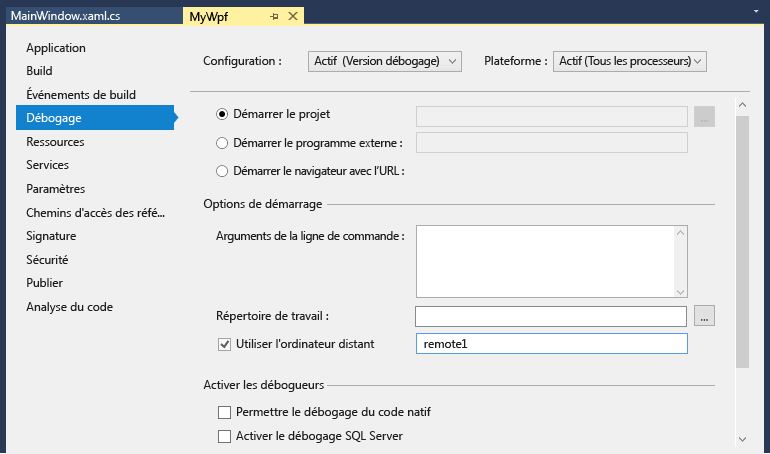

# Débogage à distance d' C# un projet ou Visual Basic dans Visual Studio
Pour déboguer une application Visual Studio qui a été déployée sur un autre ordinateur, installez et exécutez les outils de contrôle à distance sur l’ordinateur sur lequel vous avez déployé votre application, configurez votre projet pour qu’il se connecte à l’ordinateur distant à partir de Visual Studio, puis exécutez votre application.

Pour plus d’informations sur le débogage à distance des applications Windows universelles (UWP), consultez [Déboguer un package d’application installé](debug-installed-app-package.md).

## Configuration requise

Le débogueur distant est pris en charge sur Windows 7 et versions ultérieures (pas de téléphone) et les versions de Windows Server à partir de Windows Server 2008 Service Pack 2. Pour obtenir la liste complète des conditions requises, consultez [Configuration requise](../debugger/remote-debugging.md#requirements_msvsmon).

> [!NOTE]
> Le débogage entre deux ordinateurs connectés via un proxy n’est pas pris en charge. Le débogage sur une connexion à latence élevée ou à faible bande passante, tel qu’Internet à distance ou sur Internet dans les différents pays, n’est pas recommandé et peut échouer ou être trop lent.

## Télécharger et installer les outils de contrôle à distance

[!INCLUDE [remote-debugger-download](../debugger/includes/remote-debugger-download.md)]

> [!TIP]
> Dans certains scénarios, il peut être plus efficace d’exécuter le débogueur distant à partir d’un partage de fichiers. Pour plus d’informations, consultez [exécuter le débogueur distant à partir d’un partage de fichiers](../debugger/remote-debugging.md#fileshare_msvsmon).

##  Configurer le débogueur distant

[!INCLUDE [remote-debugger-configuration](../debugger/includes/remote-debugger-configuration.md)]

> [!NOTE]
> Si vous devez ajouter des autorisations pour des utilisateurs supplémentaires, modifier le mode d’authentification ou le numéro de port pour le débogueur distant, consultez [configurer le débogueur distant](../debugger/remote-debugging.md#configure_msvsmon).

## Déboguer à distance le projet
Le débogueur ne peut pas déployer d’applications de bureau Visual C# ou Visual Basic sur un ordinateur distant, mais vous pouvez toujours les déboguer à distance comme suit. La procédure suivante suppose que vous souhaitez la déboguer sur un ordinateur nommé **MJO-DL**, comme indiqué dans l’illustration ci-dessous.

1. Créez un projet WPF nommé **MyWpf**.

2. Définissez un point d’arrêt facilement accessible quelque part dans le code.

    Par exemple, vous pouvez définir un point d’arrêt dans un gestionnaire de boutons. Pour ce faire, Ouvrez MainWindow. xaml, ajoutez un contrôle Button à partir de la boîte à outils, puis double-cliquez sur le bouton pour ouvrir son gestionnaire.

3. Dans l’Explorateur de solutions, cliquez avec le bouton droit sur le projet et choisissez **Propriétés**.

4. Dans la page **Propriétés**, choisissez l’onglet **Déboguer**.

    

5. Assurez-vous que la zone de texte **Répertoire de travail** est vide.

6. Choisissez **utiliser l’ordinateur distant**, puis tapez **nomdevotremachine : port** dans la zone de texte. (Le numéro de port est affiché dans la fenêtre du débogueur distant. Le numéro de port incrémente 2 dans chaque version de Visual Studio.

    Dans cet exemple, utilisez :
    ::: moniker range=">=vs-2019"
    **MJO-DL : 4024** sur Visual Studio 2019
    ::: moniker-end
    ::: moniker range="vs-2017"
    **MJO-DL : 4022** sur Visual Studio 2017
    ::: moniker-end

7. Vérifiez que l’option **Permettre le débogage du code natif** n’est pas sélectionnée.

8. créer le projet ;

9. Créez un dossier sur l’ordinateur distant ayant le même chemin que le dossier **Debug** sur votre ordinateur Visual Studio : **\<<chemin_source>\MyWPF\MyWPF\bin\Debug**.

10. Copiez le fichier exécutable que vous venez de créer à partir de votre ordinateur Visual Studio dans le dossier nouvellement créé sur l’ordinateur distant.

    > [!CAUTION]
    > N’apportez pas de modifications au code ou à la régénération (ou vous devez répéter cette étape). Le fichier exécutable que vous avez copié sur l’ordinateur distant doit correspondre exactement à la source et aux symboles locaux.

    Vous pouvez copier le projet manuellement, utiliser xcopy, Robocopy, PowerShell ou d’autres options.

11. Assurez-vous que le débogueur distant est en cours d’exécution sur l’ordinateur cible (si ce n’est pas le cas, recherchez le **débogueur distant** dans le menu **Démarrer** ). La fenêtre du débogueur distant ressemble à ce qui suit.

     

12. Dans Visual Studio, démarrez le débogage (**Déboguer > Démarrer le débogage** ou appuyez sur **F5**).

13. Si vous y êtes invité, entrez les informations d’identification réseau pour vous connecter à la machine distante.

     Les informations d’identification requises varient en fonction de la configuration de sécurité de votre réseau. Par exemple, sur un ordinateur de domaine, vous pouvez entrer votre nom de domaine et votre mot de passe. Sur un ordinateur qui n’est pas un domaine, vous pouvez entrer le nom de l’ordinateur et un nom de compte d’utilisateur valide, comme <strong>MJO-DL\name@something.com</strong>, ainsi que le mot de passe correct.

     La fenêtre principale de l’application WPF doit être ouverte sur l’ordinateur distant.

14. Si nécessaire, prenez des mesures pour atteindre le point d’arrêt. Il doit être actif. Sinon, cela signifie que les symboles de l’application n’ont pas été chargés. Réessayez et, si cela ne fonctionne pas, récupérez des informations sur le chargement des symboles et comment les résoudre pour les résoudre lors de la [Présentation des fichiers de symboles et des paramètres de symbole de Visual Studio](https://devblogs.microsoft.com/devops/understanding-symbol-files-and-visual-studios-symbol-settings/).

15. Sur l’ordinateur Visual Studio, l’exécution doit être arrêtée au point d’arrêt.

    Si vous avez des fichiers non-code qui doivent être utilisés par l’application, vous devez les inclure dans le projet Visual Studio. Créez un dossier de projet pour les fichiers supplémentaires (dans l’**Explorateur de solutions**, cliquez sur **Ajouter > Nouveau dossier**). Ensuite, ajoutez les fichiers au dossier (dans l’**Explorateur de solutions**, cliquez sur **Ajouter > Élément existant**, puis sélectionnez les fichiers). Dans la page **Propriétés** de chaque fichier, définissez **Copier dans le répertoire de sortie** sur **Toujours copier**.

## Configurer le débogage avec des symboles distants

[!INCLUDE [remote-debugger-symbols](../debugger/includes/remote-debugger-symbols.md)]

## Voir aussi
- [Débogage dans Visual Studio](../debugger/index.yml)
- [Présentation du débogueur](../debugger/debugger-feature-tour.md)
- [Configurer le Pare-feu Windows pour le débogage distant](../debugger/configure-the-windows-firewall-for-remote-debugging.md)
- [Affectations de port du débogueur distant](../debugger/remote-debugger-port-assignments.md)
- [Débogage distant ASP.NET sur un ordinateur distant IIS](../debugger/remote-debugging-aspnet-on-a-remote-iis-computer.md)
- [Erreurs et résolution des problèmes du débogage distant](../debugger/remote-debugging-errors-and-troubleshooting.md)