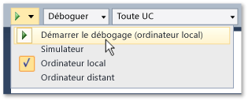

# Ex&#233;cuter des applications du Windows Store &#224; partir de Visual&#160;Studio
[!INCLUDE[vs2017banner](../code-quality/includes/vs2017banner.md)]

Les applications Windows Store s'exécutent sur une grande variété d'appareils et Visual Studio vous fournit plusieurs façons d'exécuter ces applications et d'interagir avec elles.  L'expérience « F5 » est améliorée pour faciliter le débogage, le profilage et le test des applications pendant le développement.  
  
   
  
## Dans cette section  
  
|||  
|-|-|  
|[Exécuter des applications du Windows Store sur un ordinateur local](../debugger/run-windows-store-apps-on-the-local-machine.md)|Exécuter votre application Windows Store sur l'appareil Visual Studio.|  
|[Exécuter des applications du Windows Store dans le simulateur](../debugger/run-windows-store-apps-in-the-simulator.md)|Exécuter votre application Windows Store dans une fenêtre du bureau qui simule les fonctionnalités [!INCLUDE[win8_appname_long](../debugger/includes/win8_appname_long_md.md)] telles que l'interaction tactile et l'orientation.|  
|[Exécuter des applications du Windows Store sur un ordinateur distant](../debugger/run-windows-store-apps-on-a-remote-machine.md)|Déployer et exécuter votre application Windows Store sur un appareil connecté à l'ordinateur Visual Studio en réseau ou directement via un câble Ethernet.|  
|[Exécuter des applications Windows Phone dans l'émulateur](../debugger/run-windows-phone-apps-in-the-emulator.md)|Exécuter votre application Windows Store dans une fenêtre du bureau qui simule un Windows Phone.|  
|[Déployer des applications du Windows Store à partir de Visual Studio](../debugger/deploy-windows-store-apps-from-visual-studio.md)|Déployer et enregistrer votre application Windows Store sur un appareil pour des tests ad hoc.|