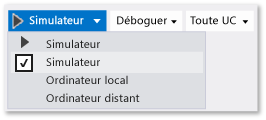

# Exécuter des applications UWP dans le simulateur

Le simulateur Visual Studio pour les applications UWP est une application de bureau qui simule une application UWP. En règle générale, vous devez déboguer sur l’ordinateur local, un appareil connecté ou un ordinateur distant. Toutefois, dans certains scénarios, vous souhaiterez utiliser le simulateur Visual Studio pour émuler une taille de l’écran physique différent et la résolution. Vous pouvez également simuler rotation événements tactiles et courants et les propriétés de connexion réseau.

Le simulateur fournit un environnement dans lequel vous pouvez concevoir, développer, déboguer et tester des applications UWP. Toutefois, avant de publier votre application dans Microsoft Store, vous devez tester votre application sur un appareil réel.

Le simulateur Visual Studio pour les applications UWP ne s’exécute pas dans un environnement isolé sur votre ordinateur local. Par conséquent, les erreurs qui se produisent dans un simulateur, tel qu'une erreur irrécupérable à l'échelle du système, peuvent également affecter l'ordinateur entier.

> [!IMPORTANT]
> Le simulateur Visual Studio 2015 n’inclut pas le bouton de géolocalisation. En effet, le simulateur Windows 10 n’inclut pas la simulation de géolocalisation.

##  Définir un simulateur comme cible

Pour exécuter votre application UWP dans le simulateur, sélectionnez **simulateur** à partir de la liste déroulante liste en regard du **démarrer le débogage** bouton sur le débogueur **Standard** barre d’outils. Cette option est disponible uniquement si votre application **minimale de la plateforme cible. Version** est inférieur ou égal au système d’exploitation sur votre ordinateur de développement.

##  Choisir un mode d'interaction

Vous pouvez choisir les modes d’interaction suivantes :

-  mode de la souris : définit le mode d’interaction des mouvements de souris. Les mouvements de souris incluent les clics, les double-clics et le déplacement d'objets par glissement.

-  démarrer l’émulation tactile : définit le mode d’interaction d’un seul doigt, les gestes tactiles. Les événements à un seul doigt incluent la pression simple, le déplacement et le glissement.

   
   
   L’icône de cible unique indique l’emplacement des événements dans le simulateur. Utilisez la souris pour positionner le pointeur.

   
   
   Appuyez sur le bouton gauche de la souris pour activer le mode tactile. Par exemple, cliquez sur le bouton pour simuler une pression simple, ou appuyez sur la touche et maintenez-la enfoncée pendant un déplacement ou un glissement.

## Pincement de deux doigts pour zoomer

Définit le mode d'interaction pour utiliser le pincement de deux doigts pour zoomer.

L'icône double cible indique l'emplacement des deux doigts sur l'écran du périphérique.

- Déplacez la souris pour positionner les icônes sur l'objet de l'écran du périphérique.

- Tournez la molette de la souris vers l'arrière ou vers l'avant pour modifier la distance simulée des deux doigts avant le pincement ou le zoom.

- Appuyez sur le bouton gauche et tournez la molette de la souris vers l'arrière (vers vous) pour effectuer un zoom avant (pincement).

- Appuyez sur le bouton gauche et tournez la molette de la souris vers l'avant (en s'éloignant de vous) pour effectuer un zoom arrière (zoom).

## Rotation de l'objet

Le bouton **Émulation de tactile : pivoter** définit le mode d’interaction sur les mouvements de rotation à l’aide de deux doigts.

- Déplacez la souris pour positionner les icônes sur l'objet de l'écran du périphérique. Tournez la molette de la souris vers l'arrière ou vers l'avant pour modifier l'orientation simulée des deux doigts avant de faire pivoter l'objet.

- Appuyez sur le bouton gauche et tournez la molette vers l'arrière (vers vous) pour faire pivoter l'objet dans le sens inverse des aiguilles d'une montre. Lorsque vous tournez la molette de la souris, l'une des deux icônes cibles pivote autour de l'autre pour indiquer la taille relative de la rotation.

- Appuyez sur le bouton gauche et tournez la molette de la souris vers l'avant (en s'éloignant de vous) pour faire pivoter l'objet dans le sens des aiguilles d'une montre.

##  Activer ou désactiver le mode Toujours visible
 Définissez la fenêtre du simulateur pour qu'elle s'affiche toujours au-dessus des autres fenêtres. Le bouton **Activer/désactiver la fenêtre au premier plan** active ou désactive le mode **Toujours visible** de la fenêtre du simulateur.

##  Modifier l'orientation de l'appareil
 Vous pouvez changer l'orientation du périphérique entre le mode Portrait et Paysage en appliquant au simulateur une rotation de 90 degrés dans n'importe quelle direction.

> [!NOTE]
> Le simulateur ne respecte pas la propriété [DisplayProperties.AutoRotationPreferences](http://go.microsoft.com/fwlink/?LinkId=249460) d’un projet. Par exemple, si votre projet définit l'orientation sur `Landscape`, et que vous appliquez au simulateur une rotation vers une orientation Portrait, l'image d'affichage du simulateur sera également pivotée et redimensionnée. Testez ces paramètres sur un périphérique réel.

> [!NOTE]
> Si vous faites pivoter un simulateur et qu'un bord du simulateur est plus grand que l'écran sur lequel il s'affiche, le simulateur est automatiquement redimensionné à la taille de l'écran. Le simulateur n'est pas redimensionné dans sa taille d'origine si vous lui appliquez une nouvelle rotation.

##  Modifier la taille et la résolution simulées de l'écran
 Pour modifier la taille et la résolution simulées de l’écran, sélectionnez le bouton **Modifier la résolution** dans la palette et choisissez une nouvelle taille et résolution dans la liste.

 La taille et la résolution de l'écran sont indiquées en *Largeur écran pouces, largeur pixel X hauteur pixel*. Notez que la taille et la résolution de l'écran sont simulées. Les coordonnées de l'emplacement sur le simulateur sont traduites en coordonnées de la taille et de la résolution du périphérique sélectionnées.

> [!NOTE]
> Enregistrez les versions mises à l'échelle d'images bitmap dans votre application et Windows chargera l'image appropriée à l'échelle actuelle. Pour plus d’informations, consultez [introduction de conception et de l’interface utilisateur](/windows/uwp/layout/design-and-ui-intro). Toutefois, si vous modifiez la résolution du simulateur pour que Windows sélectionne une image différente en fonction de la résolution, vous devez arrêter et redémarrer la session de débogage pour afficher la nouvelle image.

##  Effectuer une capture d’écran de votre application à envoyer au Microsoft Store
 Lorsque vous soumettez une application à Microsoft Store, vous devez inclure des captures d’écran de l’application.

> [!NOTE]
> La capture d'écran est enregistrée dans la résolution en cours du simulateur. Pour modifier la résolution, cliquez sur le bouton **Modifier la résolution** .

- Pour créer des captures de votre application à partir du simulateur, cliquez sur le bouton **Copier la capture d'écran** .

- Pour définir l’emplacement où se trouve les captures d’écran, sélectionnez le bouton **Paramètres de capture d’écran** et sélectionnez l’emplacement dans le menu contextuel.

   

##  Simuler des propriétés de connexion réseau

Vous pouvez aider les utilisateurs de votre application à gérer le coût des connexions réseau limitées en faisant bien comprendre le coût des connexions réseau ou les modifications de l'état du forfait données et en permettant à votre application d'utiliser ces informations pour éviter de subir des frais d'itinérance supplémentaires ou de dépasser la limite de transfert de données spécifiée. Les API [Windows.Networking.Connectivity](/uwp/api/windows.networking.connectivity) vous permettent de répondre aux événements [NetworkStatusChanged](/uwp/api/windows.networking.connectivity.networkinformation) et [TriggerType](/uwp/api/windows.applicationmodel.background.systemtrigger) qui assurent la connexion. Consultez [Démarrage rapide : Gestion des contraintes de coût réseau limitées](https://msdn.microsoft.com/library/windows/apps/Hh750310.aspx).

Pour déboguer ou tester votre code réseau sensible au coût, le simulateur peut simuler les propriétés d’un réseau qui sont exposées par l’objet [ConnectionProfile](/uwp/api/windows.networking.connectivity.connectionprofile) retourné par [GetInternetConnectionProfile](/uwp/api/windows.networking.connectivity.networkinformation).

Pour simuler les propriétés d'un réseau :

1. Dans la barre d’outils du simulateur, choisissez **Modifier les propriétés du réseau** .

2. Dans la boîte de dialogue **Définir les propriétés du réseau** , sélectionnez **Utiliser les propriétés du réseau simulé**.

    Désactivez la case à cocher pour supprimer la simulation et pour revenir aux propriétés du réseau de l'interface actuellement connectée.

3. Entrez un nom dans **Nom du profil** pour le réseau simulé. Nous vous recommandons d’utiliser un nom unique que vous pouvez utiliser pour identifier la simulation dans la propriété [ProfileName](/uwp/api/windows.networking.connectivity.connectionprofile) de l’objet [ConnectionProfile](/uwp/api/windows.networking.connectivity.connectionprofile) .

4. Sélectionnez la valeur [NetworkCostType](/uwp/api/windows.networking.connectivity.networkcosttype) du profil dans la liste **Type de coût réseau** .

5. Dans la liste **Indicateur d’état de limite de données** , vous pouvez affectez la valeur true à la propriété [ApproachingDataLimit](/uwp/api/windows.networking.connectivity.connectioncost) ou [OverDataLimit](/uwp/api/windows.networking.connectivity.connectioncost)ou choisir **En deçà de la limite de données** pour affecter la valeur false aux deux propriétés.

6. Dans la liste **État d’itinérance** , définissez la propriété [Roaming](/uwp/api/windows.networking.connectivity.connectioncost) .

7. Choisissez **Définir les propriétés** pour simuler les propriétés réseau en déclenchant un événement [NetworkStatusChanged](/uwp/api/windows.networking.connectivity.networkinformation) de premier plan et un événement [SystemTrigger](/uwp/api/windows.applicationmodel.background.systemtrigger) d’arrière-plan de type **NetworkStateChange**.

Pour plus d’informations sur la gestion des connexions réseau, consultez :

[Démarrage rapide : La gestion des contraintes de coût réseau limitées](https://msdn.microsoft.com/library/windows/apps/Hh750310.aspx)

[Exemple d’informations réseau](https://code.msdn.microsoft.com/windowsapps/Network-Information-Sample-63aaa201)

[Analyser l’utilisation de l’énergie](../profiling/analyze-energy-use-in-store-apps.md)

[Windows.Networking.Connectivity](/uwp/api/windows.networking.connectivity)

[Comment répondre aux événements système avec des tâches en arrière-plan](/previous-versions/windows/apps/hh977058(v=win.10))

[Comment déclencher des événements d’interruption, de reprise et d’arrière-plan dans des applications UWP](how-to-trigger-suspend-resume-and-background-events-for-windows-store-apps-in-visual-studio.md)

##  Naviguez dans le simulateur à l'aide du clavier

Vous pouvez accéder à la barre d’outils du simulateur en appuyant sur **CTRL + ALT + flèche haut** pour déplacer le focus à partir de la fenêtre du simulateur vers la barre d’outils du simulateur. Utilisez **Flèche haut** et **Flèche bas** pour basculer entre les boutons de la barre d'outils.

Vous pouvez arrêter le simulateur en appuyant sur **CTRL + ALT + F4**.

## Voir aussi

- [Exécuter des applications à partir de Visual Studio](/visualstudio/debugger/debugging-windows-store-and-windows-universal-apps)
