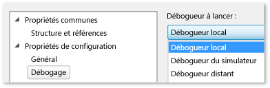

# Exécuter les applications UWP sur l’ordinateur local
  
  
 Pour déboguer, tester ou exécuter l’analyse de performances sur une application UWP, vous pouvez exécuter l’application sur le même ordinateur qui héberge Visual Studio. Si l'appareil dispose d'un écran tactile, vous pouvez tester l'ensemble des fonctionnalités de l'application ; sinon, vous devrez vous contenter du clavier et des mouvements de la souris.  
  
##  Comment exécuter sur un ordinateur local  
 Pour exécuter l’application sur l’ordinateur local, sélectionnez **ordinateur Local** dans la liste déroulante en regard du bouton Démarrer le débogage du débogueur **Standard** barre d’outils.  
  
   
  
 Si vous ne voyez pas le **Standard** barre d’outils, cliquez sur le **vue** menu, pointez sur **barres d’outils**, puis cliquez sur **Standard**.  
  
 Le choix que vous effectuez dans la liste déroulante est conservé dans le fichier des propriétés du projet et devient la cible d’exécution par défaut.  
  
 Vous pouvez aussi définir directement la cible d'exécution dans le fichier des propriétés du projet. Cliquez sur le nom du projet dans **l’Explorateur de solutions** , puis **propriétés**. Effectuez ensuite l'une des opérations suivantes :  
  
-   Dans les projets c# et Visual Basic, cliquez sur **déboguer** , puis sélectionnez **ordinateur Local** à partir de la **appareil cible** liste déroulante.  
  
       
  
-   Dans les projets C++ et JavaScript, développez le **propriétés de Configuration** nœud, cliquez sur **débogage**, puis sélectionnez **débogueur Local** à partir de la **débogueur Pour lancer** liste.  
  
       