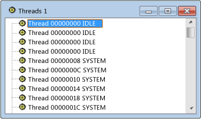

# vue Threads
La vue threads est une liste plate de tous les threads associés à Windows sur votre système. L’ID de thread et le nom de module pour chaque thread sont affichés. Les processus ne sont pas inclus, mais vous pouvez facilement trouver le processus qui possède un thread sélectionné.

## Procédures

#### Pour ouvrir la vue threads

1. Dans le menu **Spy** , choisissez **Threads**.

    Vue threads Spy + +

   La figure ci-dessus montre la vue threads.

## Dans cette section
 [Recherche d’un thread dans la vue threads](../debugger/how-to-search-for-a-thread-in-threads-view.md) Explique comment rechercher un thread spécifique dans la vue threads.

 [Affichage des propriétés](../debugger/how-to-display-thread-properties.md) d’un thread Explique comment afficher plus d’informations sur un thread.

## Sections connexes
 [Vues Spy + +](../debugger/spy-increment-views.md) Explique les vues de l’arborescence Spy + + des fenêtres, des messages, des processus et des threads.

 [Utilisation de Spy + +](../debugger/using-spy-increment.md) Présente l’outil Spy + + et explique comment l’utiliser.

 [Boîte de dialogue recherche](../debugger/thread-search-dialog-box.md) d’un thread Utilisé pour rechercher le nœud d’un thread spécifique dans la vue threads.

 [Boîte de dialogue Propriétés du thread](../debugger/message-properties-dialog-box.md) Affiche les propriétés d’un thread sélectionné dans la vue threads ou la vue messages.

 [Référence Spy + +](../debugger/spy-increment-reference.md) Comprend des sections décrivant chaque menu et boîte de dialogue Spy + +.