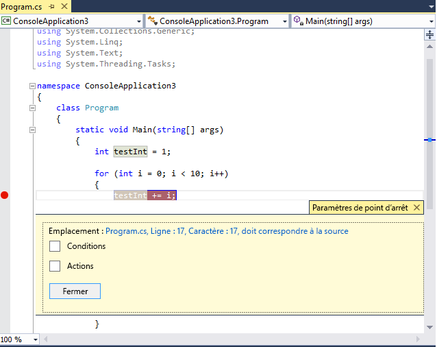
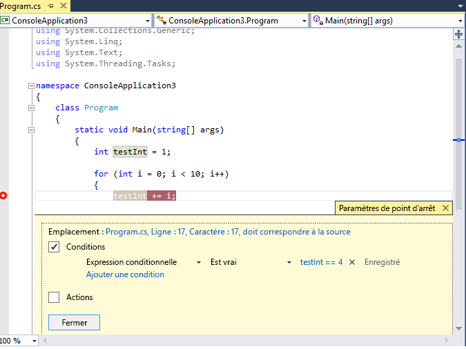
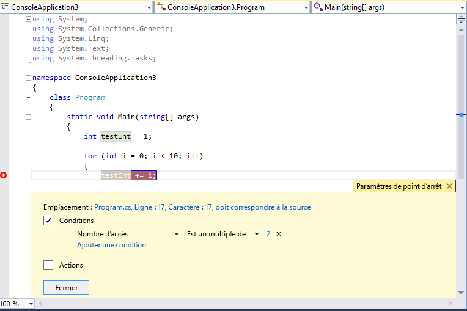

# <a name="use-breakpoints-in-the-visual-studio-debugger"></a>Utiliser des points d’arrêt dans le débogueur Visual Studio

Les points d’arrêt constituent l’une des techniques de débogage les plus importantes dans la boîte à outils de votre développeur. Vous définissez des points d’arrêt là où vous souhaitez suspendre l’exécution du débogueur. Par exemple, vous souhaiterez peut-être afficher l’état des variables de code ou examiner la pile des appels à un certain point d’arrêt.  Si vous essayez de résoudre un avertissement ou un problème lors de l’utilisation de points d’arrêt, consultez [résoudre les problèmes de points d’arrêt dans le débogueur Visual Studio](../debugger/troubleshooting-breakpoints.md).

> [!NOTE]
> Si vous connaissez la tâche ou le problème que vous tentez de résoudre, mais que vous devez connaître le type de point d’arrêt à utiliser, consultez [FAQ-Rechercher votre fonctionnalité de débogage](../debugger/find-your-debugging-task.yml#pause-running-code).

## <a name="set-breakpoints-in-source-code"></a><a name="BKMK_Overview"></a> Définir des points d’arrêt dans le code source

Vous pouvez définir un point d’arrêt sur n’importe quelle ligne de code exécutable. Par exemple, dans le code C# suivant, vous pouvez définir un point d’arrêt sur la ligne de code avec l’assignation de variable ( `int testInt = 1` ), la `for` boucle ou tout code à l’intérieur de la `for` boucle. Vous ne pouvez pas définir un point d’arrêt sur les signatures de méthode, les déclarations pour un espace de noms ou une classe, ou les déclarations de variable s’il n’y a aucune assignation et aucune méthode Getter/Setter.

Pour définir un point d’arrêt dans le code source, cliquez dans la marge de gauche située en regard d’une ligne de code. Vous pouvez également sélectionner la ligne et appuyer sur **F9**, **Sélectionner**  >  **basculer le point d’arrêt** ou cliquer avec le bouton droit et sélectionner point d' **arrêt**  >  **Insérer un point d’arrêt**. Le point d’arrêt apparaît sous la forme d’un point rouge dans la marge de gauche.

Pour la plupart des langues, y compris C#, les points d’arrêt et d’exécution actuels sont automatiquement mis en surbrillance. Pour le code C++, vous pouvez activer la mise en surbrillance du point d’arrêt et des lignes actives en sélectionnant **Outils** (ou **Déboguer**) > **options** de  >  **débogage**  >   **mettre en surbrillance la ligne source entière pour les points d’arrêt et l’instruction actuelle (C++ uniquement)**.


Lors du débogage, l’exécution s’interrompt au point d’arrêt, avant que le code de cette ligne ne soit exécuté. Le symbole de point d’arrêt affiche une flèche jaune.

Au point d’arrêt dans l’exemple suivant, la valeur de `testInt` est toujours 1. Par conséquent, la valeur n’a pas changé depuis que la variable a été initialisée (définie sur la valeur 1), car l’instruction en jaune n’a pas encore été exécutée.


Lorsque le débogueur s’arrête au point d’arrêt, vous pouvez examiner l’état actuel de l’application, y compris les [valeurs des variables](../debugger/debugger-feature-tour.md#inspect-variables-with-data-tips) et la [pile des appels](../debugger/how-to-use-the-call-stack-window.md).

Voici quelques instructions générales sur l’utilisation des points d’arrêt.

- Le point d’arrêt est un bouton bascule. Vous pouvez cliquer dessus, appuyer sur **F9** **ou utiliser**  >  **basculer le point d’arrêt** pour le supprimer ou le réinsérer.

- Pour désactiver un point d’arrêt sans le supprimer, pointez dessus ou cliquez dessus avec le bouton droit, puis sélectionnez **désactiver le point d’arrêt**. Les points d’arrêt désactivés apparaissent sous forme de points vides dans la marge de gauche ou la fenêtre **points d’arrêt** . Pour réactiver un point d’arrêt, pointez dessus ou cliquez dessus avec le bouton droit, puis sélectionnez **activer le point d’arrêt**.

- Définissez des conditions et des actions, ajoutez et modifiez des étiquettes, ou exportez un point d’arrêt en cliquant dessus avec le bouton droit et en sélectionnant la commande appropriée, ou en pointant dessus et en sélectionnant l’icône **paramètres** .

## <a name="breakpoint-actions-and-tracepoints"></a><a name="BKMK_Print_to_the_Output_window_with_tracepoints"></a> Actions de point d’arrêt et points de trace

Un point de *trace* est un point d’arrêt qui affiche un message dans la fenêtre **sortie** . Un point de trace peut agir comme une instruction de trace temporaire dans le langage de programmation et n’interrompt pas l’exécution du code. Pour créer un point de trace, vous devez définir une action spéciale dans la fenêtre **paramètres de point d’arrêt** . Pour obtenir des instructions détaillées, consultez [utiliser des points de trace dans le débogueur Visual Studio](../debugger/using-tracepoints.md).

## <a name="breakpoint-conditions"></a>Conditions de point d’arrêt

Vous pouvez contrôler quand et où un point d’arrêt s’exécute en définissant des conditions. La condition peut être toute expression valide reconnue par le débogueur. Pour plus d’informations sur les expressions valides, consultez [Expressions dans le débogueur](../debugger/expressions-in-the-debugger.md).

**Pour définir une condition de point d’arrêt :**

1. Cliquez avec le bouton droit sur le symbole du point d’arrêt et sélectionnez **conditions** (ou appuyez sur **ALT**  +  **F9**, **C**). Ou pointez sur le symbole de point d’arrêt, sélectionnez l’icône des **paramètres** , puis sélectionnez **conditions** dans la fenêtre **paramètres de point d’arrêt** .

   Vous pouvez également définir des conditions dans la fenêtre **points d’arrêt** en cliquant avec le bouton droit sur un point d’arrêt et en sélectionnant **paramètres**, puis en sélectionnant **conditions**.

   

2. Dans la liste déroulante, sélectionnez **expression conditionnelle**, **nombre d’accès** ou **filtre**, puis définissez la valeur en conséquence.

3. Sélectionnez **Fermer** ou appuyez sur **CTRL** + **entrée** pour fermer la fenêtre **paramètres de point d’arrêt** . Ou bien, dans la fenêtre **points d’arrêt** , sélectionnez **OK** pour fermer la boîte de dialogue.

Les points d’arrêt avec des conditions définies apparaissent avec un **+** symbole dans les fenêtres code source et **points d’arrêt** .

<a name="BKMK_Specify_a_breakpoint_condition_using_a_code_expression"></a>
### <a name="create-a-conditional-expression"></a>Créer une expression conditionnelle

Quand vous sélectionnez **expression conditionnelle**, vous avez le choix entre deux conditions : **est true** ou **en cas de modification**. Choisissez **est true** pour arrêter quand l’expression est satisfaite ou **lorsque** la valeur de l’expression a été modifiée pour s’arrêter lorsque la valeur de l’expression a changé.

Dans l’exemple suivant, le point d’arrêt est atteint uniquement lorsque la valeur de `testInt` est **4**:



Dans l’exemple suivant, le point d’arrêt est atteint uniquement lorsque la valeur de `testInt` change :


Si vous définissez une condition de point d’arrêt dont la syntaxe est incorrecte, un message d’avertissement s’affiche. Si vous spécifiez une condition de point d’arrêt avec une syntaxe valide, mais dont la sémantique n’est pas valide, un message d’avertissement apparaît quand le point d’arrêt est atteint pour la première fois. Dans les deux cas, le débogueur s’arrête lorsqu’il atteint le point d’arrêt non valide. Le point d’arrêt n’est ignoré que si la condition est valide et prend la valeur `false`.

>[!NOTE]
> Pour le champ **When Changed** , le débogueur ne considère pas la première évaluation de la condition comme étant une modification, donc n’atteint pas le point d’arrêt de la première évaluation.

<a name="using-object-ids-in-breakpoint-conditions-c-and-f"></a>
### <a name="use-object-ids-in-conditional-expressions-c-and-f-only"></a>Utiliser les ID d’objet dans les expressions conditionnelles (C# et F # uniquement)

 Il peut arriver que vous souhaitiez observer le comportement d’un objet spécifique. Par exemple, vous souhaiterez peut-être savoir pourquoi un objet a été inséré plusieurs fois dans une collection. En C# et en F#, vous pouvez créer des ID d’objet pour des instances spécifiques de [types référence](/dotnet/csharp/language-reference/keywords/reference-types) et les utiliser dans des conditions de point d’arrêt. L’ID d’objet est généré par les services de débogage du Common Language Runtime (CLR) et associé à l’objet.

**Pour créer un ID d’objet :**

1. Définissez un point d’arrêt dans le code après la création de l’objet.

2. Démarrez le débogage, et lorsque l’exécution s’interrompt au point d’arrêt, sélectionnez **Déboguer**  >    >  les **paramètres régionaux** Windows (ou appuyez sur **CTRL**  +  **ALT**  +  **V**, **L**) pour ouvrir la fenêtre **variables locales** .

   Recherchez l’instance d’objet spécifique dans la fenêtre **variables locales** , cliquez dessus avec le bouton droit, puis sélectionnez **créer un ID d’objet**.

   Vous devez voir un **$** plus un chiffre dans la fenêtre **variables locales** . Il s’agit de l’ID d’objet.

3. Ajoutez un nouveau point d’arrêt au point que vous souhaitez examiner. par exemple, lorsque l’objet doit être ajouté à la collection. Cliquez avec le bouton droit sur le point d’arrêt et sélectionnez **Conditions**.

4. Utilisez l’ID d’objet dans le champ **expression conditionnelle** . Par exemple, si la variable `item` est l’objet à ajouter à la collection, sélectionnez **a la valeur true** et tapez **Item = = \<n> $**, où \<n> est le numéro d’ID d’objet.

   L’exécution s’arrête au point où cet objet doit être ajouté à la collection.

   Pour supprimer l’ID de l’objet, cliquez avec le bouton droit sur la variable dans la fenêtre **variables locales** , puis sélectionnez **Supprimer l’ID** de l’objet.

> [!NOTE]
> Les ID d’objet créent des références faibles et n’empêchent pas l’objet de subir une récupération de mémoire. Leur validité ne vaut que pour la session de débogage active.

### <a name="set-a-hit-count-condition"></a>Définir une condition de nombre d’accès

Si vous pensez qu’une boucle de votre code commence à être incorrect après un certain nombre d’itérations, vous pouvez définir un point d’arrêt pour arrêter l’exécution après ce nombre d’accès, au lieu de devoir appuyer à plusieurs reprises sur **F5** pour atteindre cette itération.

Sous **conditions** dans la fenêtre **paramètres de point d’arrêt** , sélectionnez nombre d' **accès**, puis spécifiez le nombre d’itérations. Dans l’exemple suivant, le point d’arrêt est défini sur hit à chaque autre itération :



### <a name="set-a-filter-condition"></a>Définir une condition de filtre

Vous pouvez limiter le déclenchement d’un point d’arrêt seulement sur des appareils spécifiés ou dans des processus et des threads spécifiés.

Sous **conditions** dans la fenêtre **paramètres de point d’arrêt** , sélectionnez **filtre**, puis entrez une ou plusieurs des expressions suivantes :

- MachineName = "nom"
- ProcessId = valeur
- ProcessName = "nom"
- ThreadId = valeur
- ThreadName = "nom"

Placez les valeurs de chaîne entre guillemets doubles. Vous pouvez combiner des clauses à l’aide de `&` (AND), `||` (OR), `!` (NOT) et de parenthèses.

## <a name="set-function-breakpoints"></a><a name="BKMK_Set_a_breakpoint_in_a_source_file"></a> Définir des points d’arrêt sur fonction

Vous pouvez arrêter l’exécution lorsqu’une fonction est appelée. Cela est utile, par exemple, lorsque vous connaissez le nom de la fonction, mais pas son emplacement. Elle est également utile si vous avez des fonctions portant le même nom et que vous souhaitez les arrêter toutes (telles que des fonctions surchargées ou des fonctions dans différents projets).

**Pour définir un point d’arrêt sur fonction :**

1. Sélectionnez **Déboguer** le point d’arrêt de la fonction de point d'  >  **arrêt**  >  ou appuyez sur **CTRL**  +  **K**, **B**.

   Vous pouvez également sélectionner **nouveau**  >  **point d’arrêt sur fonction** dans la fenêtre **points d’arrêt** .

1. Dans la boîte de dialogue **nouveau point d’arrêt sur fonction** , entrez le nom de la fonction dans la zone nom de la **fonction** .

   Pour affiner la spécification de la fonction :

   - Utilisez le nom complet de la fonction.

     Exemple : `Namespace1.ClassX.MethodA()`

   - Ajoutez les types de paramètres d’une fonction surchargée.

     Exemple : `MethodA(int, string)`

   - Utilisez le symbole «  ! » pour spécifier le module.

     Exemple : `App1.dll!MethodA`

   - Utilisez l’opérateur de contexte en C++ natif.

     `{function, , [module]} [+<line offset from start of method>]`

     Exemple : `{MethodA, , App1.dll}+2`

1. Dans la liste déroulante **langue** , choisissez la langue de la fonction.

1. Sélectionnez **OK**.

### <a name="set-a-function-breakpoint-using-a-memory-address-native-c-only"></a>Définir un point d’arrêt sur fonction à l’aide d’une adresse mémoire (C++ natif uniquement)
 Vous pouvez utiliser l’adresse d’un objet pour définir un point d’arrêt sur fonction sur une méthode appelée par une instance spécifique d’une classe.  Par exemple, à partir d’un objet adressable de type `my_class` , vous pouvez définir un point d’arrêt sur fonction sur la `my_method` méthode appelée par l’instance.

1. Définissez un point d’arrêt quelque part après l’instanciation de l’instance de la classe.

2. Recherchez l’adresse de l’instance (par exemple, `0xcccccccc` ).

3. Sélectionnez **Déboguer** le point d’arrêt de la fonction de point d'  >  **arrêt**  >  ou appuyez sur **CTRL**  +  **K**, **B**.

4. Ajoutez le code suivant à la zone nom de la **fonction** , puis sélectionnez langage **C++** .

   ```cpp
   ((my_class *) 0xcccccccc)->my_method
   ```

::: moniker range=">= vs-2019"

## <a name="set-data-breakpoints-net-core-30-or-higher"></a><a name="BKMK_set_a_data_breakpoint_managed"></a>Définir des points d’arrêt sur variable (.NET Core 3,0 ou version ultérieure)

Les points d’arrêt sur variable interrompent l’exécution lorsque la propriété d’un objet spécifique change.

**Pour définir un point d’arrêt sur variable**

1. Dans un projet .NET Core, démarrez le débogage et attendez qu’un point d’arrêt soit atteint.

2. Dans la fenêtre **automatique**, **Espion** ou **variables locales** , cliquez avec le bouton droit sur une propriété et sélectionnez **arrêter quand la valeur change** dans le menu contextuel.

    

Les points d’arrêt sur variable dans .NET Core ne fonctionnent pas pour :

- Propriétés qui ne peuvent pas être développées dans l’info-bulle, les variables locales, la fonction automatique ou la Fenêtre Espion
- Variables statiques
- Classes avec l’attribut DebuggerTypeProxy
- Champs à l’intérieur des structs

::: moniker-end

## <a name="set-data-breakpoints-native-c-only"></a><a name="BKMK_set_a_data_breakpoint_native_cplusplus"></a>Définir des points d’arrêt sur variable (C++ natif uniquement)

 Les points d’arrêt sur variable interrompent l’exécution lorsqu’une valeur stockée à une adresse mémoire spécifiée change. Si la valeur est lue mais pas modifiée, l’exécution ne s’interrompt pas.

**Pour définir un point d’arrêt sur variable :**

1. Dans un projet C++, démarrez le débogage et attendez qu’un point d’arrêt soit atteint. Dans le menu **Déboguer** , choisissez nouveau point d’arrêt des données de **point d’arrêt**  >  .

    Vous pouvez également sélectionner **nouveau**  >  **point d’arrêt** sur les données dans la fenêtre **points d’arrêt** ou cliquer avec le bouton droit sur un élément dans la fenêtre **automatique**, **Espion** ou **variables locales** et sélectionner **arrêter lorsque des modifications de valeur sont effectuées** dans le menu contextuel.

2. Dans la zone **adresse** , tapez une adresse mémoire ou une expression qui prend la valeur d’une adresse mémoire. Par exemple, tapez `&avar` pour interrompre l’exécution quand le contenu de la variable `avar` change.

3. Dans la zone déroulante **Nombre d’octets** , sélectionnez le nombre d’octets que le débogueur doit surveiller. Par exemple, si vous sélectionnez **4**, le débogueur surveille les quatre octets à partir de `&avar` et interrompt l’exécution si l’un de ces octets change de valeur.

Les points d’arrêt sur variable ne fonctionnent pas dans les conditions suivantes :
- Un processus qui n’est pas en cours de débogage écrit à l’emplacement mémoire.
- L’emplacement mémoire est partagé entre plusieurs processus.
- L’emplacement de mémoire est mis à jour dans le noyau. Par exemple, si la mémoire est transmise à la fonction Windows 32 bits `ReadFile` , la mémoire est mise à jour à partir du mode noyau, de sorte que le débogueur ne s’arrête pas sur la mise à jour.
- Où l’expression espionne est supérieure à 4 octets sur le matériel 32 bits et 8 octets sur le matériel 64 bits. Il s’agit d’une limitation de l’architecture x86.

> [!NOTE]
> - Les points d’arrêt sur variable dépendent d’adresses mémoire spécifiques. L’adresse d’une variable change d’une session de débogage à la suivante, de sorte que les points d’arrêt sur variable sont automatiquement désactivés à la fin de chaque session de débogage.
>
> - Si vous définissez un point d’arrêt sur une variable locale, ce point d’arrêt reste activé quand la fonction s’arrête. Cependant, l’adresse mémoire n’est plus applicable, et le comportement du point d’arrêt est donc imprévisible. Si vous définissez un point d’arrêt sur une variable locale, vous devez supprimer ou désactiver le point d’arrêt avant la fin de la fonction.

## <a name="manage-breakpoints-in-the-breakpoints-window"></a><a name="BKMK_Specify_advanced_properties_of_a_breakpoint_"></a> Gérer les points d’arrêt dans la fenêtre Points d’arrêt

 Vous pouvez utiliser la fenêtre **points d’arrêt** pour afficher et gérer tous les points d’arrêt de votre solution. Cet emplacement centralisé est particulièrement utile dans une solution de grande taille ou pour des scénarios de débogage complexes où les points d’arrêt sont critiques.

Dans la fenêtre **points d’arrêt** , vous pouvez rechercher, trier, filtrer, activer/désactiver ou supprimer des points d’arrêt. Vous pouvez également définir des conditions et des actions, ou ajouter une nouvelle fonction ou un point d’arrêt de données.

Pour ouvrir la fenêtre **points d’arrêt** , sélectionnez **Déboguer** les points d'  >    >  **arrêt** Windows ou appuyez sur **CTRL** + **ALT** + **B**.

")

Pour sélectionner les colonnes à afficher dans la fenêtre **points d’arrêt** , sélectionnez Afficher les **colonnes**. Sélectionnez un en-tête de colonne pour trier la liste des points d’arrêt par cette colonne.

### <a name="breakpoint-labels"></a><a name="BKMK_Set_a_breakpoint_at_a_function_return_in_the_Call_Stack_window"></a> Étiquettes de point d’arrêt
Vous pouvez utiliser des étiquettes pour trier et filtrer la liste des points d’arrêt dans la fenêtre **points d’arrêt** .

1. Pour ajouter une étiquette à un point d’arrêt, cliquez avec le bouton droit sur le point d’arrêt dans le code source ou la fenêtre **points d’arrêt** , puis sélectionnez **modifier les étiquettes**. Ajoutez une nouvelle étiquette ou choisissez-en une existante, puis sélectionnez **OK**.
2. Triez la liste des points d’arrêt dans la fenêtre **points d’arrêt** en sélectionnant les **étiquettes**, les **conditions** ou d’autres en-têtes de colonnes. Vous pouvez sélectionner les colonnes à afficher en sélectionnant **afficher les colonnes** dans la barre d’outils.

### <a name="export-and-import-breakpoints"></a>Exporter et importer les points d'arrêt
 Pour enregistrer ou partager l’État et l’emplacement de vos points d’arrêt, vous pouvez les exporter ou les importer.

- Pour exporter un point d’arrêt unique vers un fichier XML, cliquez avec le bouton droit sur le point d’arrêt dans la fenêtre code source ou **points d’arrêt** , puis sélectionnez **Exporter** ou **Exporter la sélection**. Sélectionnez un emplacement d’exportation, puis cliquez sur **Enregistrer**. L’emplacement par défaut est le dossier de solution.
- Pour exporter plusieurs points d’arrêt, dans la fenêtre **points d’arrêt** , activez les cases à cocher en regard des points d’arrêt ou entrez des critères de recherche dans le champ de **recherche** . Sélectionnez l’icône **exporter tous les points d’arrêt correspondant aux critères de recherche actuels** , puis enregistrez le fichier.
- Pour exporter tous les points d’arrêt, désélectionnez toutes les zones et laissez le champ de **recherche** vide. Sélectionnez l’icône **exporter tous les points d’arrêt correspondant aux critères de recherche actuels** , puis enregistrez le fichier.
- Pour importer des points d’arrêt, dans la fenêtre **points d’arrêt** , sélectionnez l’icône **Importer les points d’arrêt à partir d’un fichier** , accédez à l’emplacement du fichier XML, puis sélectionnez **ouvrir**.

## <a name="set-breakpoints-from-debugger-windows"></a><a name="BKMK_Set_a_breakpoint_from_debugger_windows"></a> Définir des points d’arrêt à partir des fenêtres du débogueur

Vous pouvez également définir des points d’arrêt à partir des fenêtres **pile des appels** et débogueur du **code machine** .

### <a name="set-a-breakpoint-in-the-call-stack-window"></a>Définir un point d’arrêt dans la fenêtre pile des appels

 Pour arrêter l’instruction ou la ligne à laquelle une fonction appelante retourne, vous pouvez définir un point d’arrêt dans la fenêtre **pile des appels** .

**Pour définir un point d’arrêt dans la fenêtre pile des appels :**

1. Pour ouvrir la fenêtre **pile des appels** , vous devez être suspendu pendant le débogage. Sélectionnez **Déboguer** la  >    >  **pile des appels** Windows ou appuyez sur **CTRL** + **ALT** + **C**.

2. Dans la fenêtre **pile des appels** , cliquez avec le bouton droit sur la fonction appelante, sélectionnez point d' **arrêt**  >  **Insérer un point d’arrêt** ou appuyez sur **F9**.

   Un symbole de point d’arrêt apparaît en regard du nom de l’appel de fonction dans la marge de gauche de la pile des appels.

Le point d’arrêt de pile des appels apparaît dans la fenêtre **points d’arrêt** sous la forme d’une adresse, avec un emplacement de mémoire qui correspond à la prochaine instruction exécutable de la fonction.

Le débogueur s’arrête au niveau de l’instruction.

Pour plus d’informations sur la pile des appels, consultez [Comment : utiliser la fenêtre Pile des appels](../debugger/how-to-use-the-call-stack-window.md).

Pour suivre visuellement des points d’arrêt pendant l’exécution du code, consultez [mapper des méthodes sur la pile des appels pendant le débogage](../debugger/map-methods-on-the-call-stack-while-debugging-in-visual-studio.md).

### <a name="set-a-breakpoint-in-the-disassembly-window"></a>Définir un point d’arrêt dans la fenêtre Code machine

1. Pour ouvrir la fenêtre **code machine** , vous devez être suspendu pendant le débogage. Sélectionnez **Déboguer** le  >    >  **code machine** Windows ou appuyez sur **CTRL** + **ALT** + **D**.

2. Dans la fenêtre **code machine** , cliquez dans la marge de gauche de l’instruction que vous souhaitez arrêter. Vous pouvez également le sélectionner et appuyer sur **F9**, ou cliquer avec le bouton droit et sélectionner **point d’arrêt**  >  **Insérer un point d’arrêt**.

## <a name="see-also"></a>Voir aussi

- [Qu’est-ce que le débogage ?](../debugger/what-is-debugging.md)
- [Écrire du code C# amélioré à l’aide de Visual Studio](../debugger/write-better-code-with-visual-studio.md)
- [Premier aperçu du débogage](../debugger/debugger-feature-tour.md)
- [Résoudre les problèmes de points d’arrêt dans le débogueur Visual Studio](../debugger/troubleshooting-breakpoints.md)
