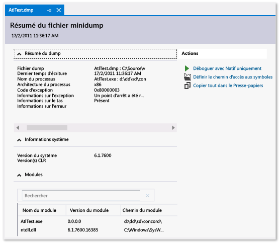

# Fichiers dump dans le débogueur Visual Studio

 Un *fichier dump* est un instantané qui montre le processus en cours d’exécution et les modules qui ont été chargés pour une application à un moment donné. Un vidage avec des informations de tas comprend également un instantané de la mémoire de l’application à ce stade.

L’ouverture d’un fichier dump avec un tas dans Visual Studio est semblable à l’arrêt à un point d’arrêt dans une session de débogage. Bien que vous ne puissiez pas continuer l’exécution, vous pouvez examiner les piles, les threads et les valeurs des variables de l’application au moment de l’image mémoire.

Les vidages sont principalement utilisés pour déboguer les problèmes des ordinateurs auxquels les développeurs n’ont pas accès. Vous pouvez utiliser un fichier de vidage à partir de l’ordinateur d’un client lorsque vous ne pouvez pas reproduire un incident ou un programme qui ne répond pas sur votre propre ordinateur. Les testeurs créent également des vidages pour enregistrer les données de programme en cas d’incident ou de non-réponse à utiliser pour un plus grand nombre de tests.

Le débogueur Visual Studio peut enregistrer des fichiers dump pour le code managé ou natif. Il peut déboguer des fichiers dump créés par Visual Studio ou par d’autres applications qui enregistrent des fichiers au format *Minidump* .

##  Configuration requise et limitations

- Pour déboguer des fichiers de vidage à partir d’ordinateurs 64 bits, Visual Studio doit s’exécuter sur un ordinateur 64 bits.

::: moniker range=">= vs-2019"
- Visual Studio peut déboguer les fichiers dump des applications gérées à partir du système d’exploitation Linux. 
::: moniker-end

- Visual Studio peut déboguer les fichiers dump des applications natives à partir des périphériques ARM. Il peut également déboguer des vidages d’applications gérées à partir d’appareils ARM, mais uniquement dans le débogueur natif.

- Pour déboguer des fichiers dump [en mode noyau](/windows-hardware/drivers/debugger/kernel-mode-dump-files) ou utiliser l’extension de débogage [SOS.dll](/dotnet/framework/tools/sos-dll-sos-debugging-extension) dans Visual Studio, téléchargez les outils de débogage pour Windows dans le [Kit WDK (Windows Driver Kit)](/windows-hardware/drivers/download-the-wdk).

- Visual Studio ne peut pas déboguer les fichiers de vidage enregistrés dans l’ancien format de [vidage complet en mode utilisateur](/windows/desktop/wer/collecting-user-mode-dumps) . Un vidage complet en mode utilisateur n’est pas le même qu’un dump avec segment de mémoire.

- Le débogage des fichiers dump de code optimisé peut faire l'objet de confusion. Par exemple, l’incorporation du compilateur des fonctions peut entraîner des piles d’appels inattendues et d’autres optimisations peuvent modifier la durée de vie des variables.

##  Fichiers dump, avec ou sans tas

Les fichiers dump peuvent avoir ou non des informations sur le tas.

- Les **fichiers dump avec des tas** contiennent un instantané de la mémoire de l’application, y compris les valeurs des variables, au moment du vidage. Visual Studio enregistre également les binaires des modules natifs chargés dans un fichier dump avec un segment de mémoire, ce qui peut faciliter le débogage. Visual Studio peut charger des symboles à partir d’un fichier dump avec un segment de mémoire, même s’il ne trouve pas de fichier binaire d’application.

- Les **fichiers dump sans tas** sont plus petits que les dumps avec les tas, mais le débogueur doit charger les binaires de l’application pour rechercher les informations de symbole. Les binaires chargés doivent correspondre exactement à ceux qui s’exécutent pendant la création du dump. Les fichiers dump sans tas n’enregistrent que les valeurs des variables de pile.

##  Créer un fichier dump

Pendant que vous déboguez un processus dans Visual Studio, vous pouvez enregistrer un dump quand le débogueur s’est arrêté à une exception ou un point d’arrêt.

Lorsque le [débogage juste-à-temps](../debugger/just-in-time-debugging-in-visual-studio.md) est activé, vous pouvez attacher le débogueur Visual Studio à un processus bloqué en dehors de Visual Studio, puis enregistrer un fichier dump à partir du débogueur. Consultez [attacher aux processus en cours d’exécution](../debugger/attach-to-running-processes-with-the-visual-studio-debugger.md).

**Pour enregistrer un fichier dump :**

1. Lorsqu’il est arrêté à une erreur ou un point d’arrêt pendant le débogage, sélectionnez **Déboguer**  >  **enregistrer le dump sous**.

1. Dans la boîte de dialogue **enregistrer le dump sous** , sous **type de fichier**, sélectionnez **Minidump** ou **Minidump avec segment mémoire** (valeur par défaut).

1. Accédez à un chemin d’accès et sélectionnez un nom pour le fichier dump, puis sélectionnez **Enregistrer**.

>[!NOTE]
>Vous pouvez créer des fichiers dump avec n’importe quel programme qui prend en charge le format minidump Windows. Par exemple, l’utilitaire en ligne de commande **Procdump** de [Windows Sysinternals](/sysinternals/) peut créer des fichiers de processus de vidage sur incident sur des déclencheurs ou à la demande. Consultez [Configuration requise et limitations](../debugger/using-dump-files.md#BKMK_Requirements_and_limitations) pour plus d’informations sur l’utilisation d’autres outils pour créer des fichiers dump.

##  Ouvrir un fichier dump

1. Dans Visual Studio, sélectionnez **fichier**  >  **ouvrir** un  >  **fichier**.

1. Dans la boîte de dialogue **Ouvrir un fichier**, localisez et sélectionnez le fichier dump. Elle aura généralement une extension *. dmp* . Sélectionnez **OK**.

   La fenêtre **Résumé du fichier Minidump** affiche les informations de résumé et de module pour le fichier dump, ainsi que les actions que vous pouvez effectuer.

   

1. Sous **actions**:
   - Pour définir les emplacements de chargement des symboles, sélectionnez **définir les chemins d’accès aux symboles**.
   - Pour démarrer le débogage, sélectionnez **Déboguer avec managé uniquement**, **Déboguer avec natif uniquement**, **Déboguer avec mixte** ou **Déboguer avec la mémoire managée**.

##  Rechercher les fichiers .exe,. pdb et source

Pour utiliser les fonctionnalités de débogage complètes sur un fichier dump, Visual Studio a besoin des éléments suivants :

- Le fichier *.exe* pour lequel le dump a été créé, ainsi que d’autres fichiers binaires (dll, etc.) utilisés par le processus de vidage.
- Fichiers de symboles (*. pdb*) pour le *.exe* et d’autres fichiers binaires.
- Les fichiers *.exe* et *. pdb* qui correspondent exactement à la version et à la build des fichiers lors de la création du dump.
- Fichiers sources des modules appropriés. Vous pouvez utiliser le code machine des modules si vous ne trouvez pas les fichiers sources.

Si le dump contient des données de tas, Visual Studio peut faire face à des binaires manquants pour certains modules, mais il doit avoir des binaires pour les modules suffisants pour générer des piles d’appels valides.

### Chemins de recherche pour les fichiers .exe

Visual Studio recherche automatiquement ces emplacements pour les fichiers *.exe* qui ne sont pas inclus dans le fichier dump :

1. Dossier qui contient le fichier dump.
2. Le chemin d’accès du module spécifie le fichier dump, qui est le chemin d’accès du module sur l’ordinateur qui a collecté le vidage.
3. Les chemins d’accès aux symboles spécifiés dans **Outils** (ou **débogage**) > **options**  >  **débogage** des  >  **symboles**. Vous pouvez également ouvrir la page **symboles** à partir du volet **actions** de la fenêtre Résumé du **fichier de vidage** . Dans cette page, vous pouvez ajouter d’autres emplacements à rechercher.

### Utiliser les pages aucun binaire, aucun symbole ou aucune source trouvée

Si Visual Studio ne peut pas trouver les fichiers dont il a besoin pour déboguer un module dans le dump, il affiche aucun **binaire trouvé**, **aucun symbole n’a été trouvé**, ou **aucune page source n’a été trouvée** . Ces pages fournissent des informations détaillées sur la cause du problème et fournissent des liens d’action qui peuvent vous aider à localiser les fichiers. Consultez [spécifier les fichiers de symboles (. pdb) et les fichiers sources](../debugger/specify-symbol-dot-pdb-and-source-files-in-the-visual-studio-debugger.md).

## Voir aussi

- [Comment déboguer une image mémoire managée avec des analyseurs de diagnostic .NET](../debugger/how-to-debug-managed-memory-dump.md)
- [Débogage juste-à-temps](../debugger/just-in-time-debugging-in-visual-studio.md)
- [Spécifier les fichiers de symboles (. pdb) et les fichiers sources](../debugger/specify-symbol-dot-pdb-and-source-files-in-the-visual-studio-debugger.md)
- [IntelliTrace](../debugger/intellitrace.md)