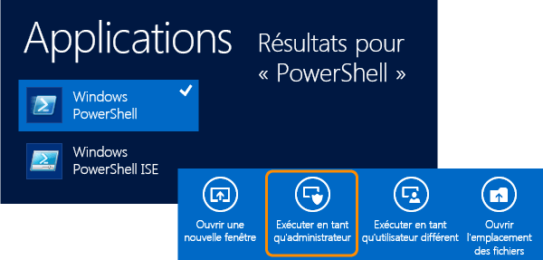
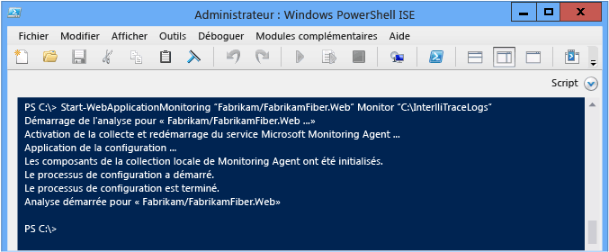
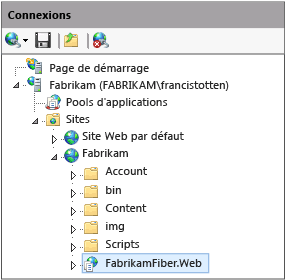
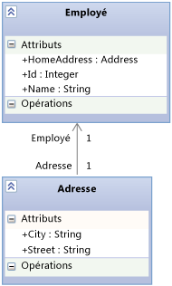

# <a name="using-the-microsoft-monitoring-agent"></a>Utilisation de Microsoft Monitoring Agent
**Microsoft Monitoring Agent**vous permet de surveiller localement les applications web ASP.NET hébergées sur IIS et les applications SharePoint 2010 ou 2013 pour diagnostiquer les erreurs, les problèmes de performances ou autres dysfonctionnements. Vous pouvez enregistrer les événements de diagnostic de l’agent dans un journal IntelliTrace (.iTrace), puis ouvrir ce journal dans Visual Studio Enterprise (mais pas Professional ni Community) pour résoudre les problèmes à l’aide des différents outils de diagnostic de Visual Studio. Vous pouvez également collecter des données de diagnostic et de méthode IntelliTrace en exécutant l’agent en mode **Trace** . Microsoft Monitoring Agent peut être intégré à [Application Insights](/azure/application-insights/) et [System Center Operations Manager](/previous-versions/system-center/system-center-2012-R2/hh205987(v=sc.12)). Microsoft Monitoring Agent modifie l’environnement du système cible quand il est installé.  
  
> [!NOTE]
>  Vous pouvez également collecter des données de diagnostic et de méthode IntelliTrace pour les applications web, SharePoint, WPF et Windows Forms s’exécutant sur des ordinateurs distants sans avoir à modifier l’environnement cible, en utilisant le **collecteur autonome IntelliTrace**. Le collecteur autonome a plus d’impact sur les performances que Microsoft Monitoring Agent exécuté en mode **Monitor** . Consultez [à l’aide du collecteur autonome IntelliTrace](../debugger/using-the-intellitrace-stand-alone-collector.md).  
  
 Si vous utilisez System Center 2012, utilisez Microsoft Monitoring Agent avec Operations Manager pour recevoir des alertes sur les problèmes détectés et créer des éléments de travail Team Foundation Server avec des liens vers les fichiers journaux IntelliTrace enregistrés. Vous pouvez ensuite affecter ces éléments de travail à d’autres personnes pour la suite du débogage. Consultez [Intégration d’Operations Manager à des processus de développement](/previous-versions/system-center/system-center-2012-R2/jj614609(v=sc.12)) et [Surveillance avec Microsoft Monitoring Agent](/previous-versions/system-center/system-center-2012-R2/dn465153(v=sc.12)).  
  
 Avant de commencer, vérifiez que vous disposez des fichiers sources et de symboles correspondants pour le code généré et déployé. Ces informations vous aident à accéder directement au code de l’application quand vous commencez l’examen et le débogage des événements de diagnostic dans le journal IntelliTrace. [Configurez vos builds](../debugger/diagnose-problems-after-deployment.md) pour que Visual Studio puisse automatiquement trouver et ouvrir la source correspondante pour votre code déployé.  
  
1.  [Étape 1 : Configurer Microsoft Monitoring Agent](#SetUpMonitoring)  
  
2.  [Étape 2 : Démarrer la surveillance de votre application](#MonitorEvents)  
  
3.  [Étape 3 : Enregistrer les événements enregistrés](#SaveEvents)  
  
##  <a name="SetUpMonitoring"></a> Étape 1 : Configurer Microsoft Monitoring Agent  
 Configurez l’agent autonome sur votre serveur web pour effectuer une surveillance locale sans modifier votre application. Si vous utilisez System Center 2012, consultez [Installation de Microsoft Monitoring Agent](/previous-versions/system-center/system-center-2012-R2/dn465156(v=sc.12)).  
  
###  <a name="SetUpStandaloneMMA"></a> Configurer l’agent autonome  
  
1.  Vérifiez les points suivants :  
  
    -   Votre serveur web exécute des [versions d’Internet Information Services (IIS) prises en charge](/previous-versions/system-center/system-center-2012-R2/dn465154(v=sc.12)).  
  
    -   Votre serveur web dispose de .NET Framework 3.5, 4 ou 4.5.  
  
    -   Votre serveur web exécute Windows PowerShell version 3.0 ou ultérieure. [Q : Que faire si j’utilise Windows PowerShell 2.0 ?](#PowerShell2)  
  
    -   Vous disposez des autorisations d’administrateur sur votre serveur web pour exécuter des commandes PowerShell et recycler le pool d’applications au démarrage de la surveillance.  
  
    -   Vous avez désinstallé les versions antérieures de Microsoft Monitoring Agent.  
  
2.  [Téléchargez gratuitement Microsoft Monitoring Agent](http://go.microsoft.com/fwlink/?LinkId=320384)( **MMASetup-i386.exe** pour la version 32 bits ou **MMASetup-AMD64.exe**pour la version 64 bits) sur votre serveur web à partir du Centre de téléchargement Microsoft.  
  
3.  Exécutez le fichier exécutable téléchargé pour démarrer l’Assistant Installation.  
  
4.  Créez un répertoire sécurisé sur votre serveur web pour y stocker les journaux IntelliTrace (par exemple, **C:\IntelliTraceLogs**).  
  
     Veillez à créer ce répertoire avant de commencer la surveillance. Pour éviter de ralentir votre application, choisissez un emplacement sur un disque local rapide et qui n’est pas très actif.  
  
    > [!IMPORTANT]
    >  Les fichiers journaux IntelliTrace peuvent contenir des données personnelles et sensibles. Limitez l’accès à ce répertoire uniquement aux identités qui ont besoin d’utiliser ces fichiers. Respectez la politique de confidentialité de votre société.  
  
5.  Pour effectuer une surveillance détaillée au niveau des fonctions ou pour surveiller des applications SharePoint, accordez au pool d’applications qui héberge votre application web ou SharePoint les autorisations de lecture et d’écriture pour le répertoire des journaux IntelliTrace. [Q : Comment définir des autorisations pour le pool d’applications ?](#FullPermissionsITLog)  
  
### <a name="q--a"></a>Questions et réponses  
  
####  <a name="PowerShell2"></a> Q : Que faire si j'utilise Windows PowerShell 2.0 ?  
 **R :** Nous vous recommandons vivement d’utiliser PowerShell 3.0. Sinon, vous devrez importer les applets de commande PowerShell de Microsoft Monitoring Agent chaque fois que vous exécuterez PowerShell. De plus, vous n’aurez pas accès au contenu d’aide téléchargeable.  
  
1.  Ouvrez une fenêtre d’invite de commandes **Windows PowerShell** ou **Windows PowerShell ISE** en tant qu’administrateur.  
  
2.  Importez le module PowerShell de Microsoft Monitoring Agent à partir de l’emplacement d’installation par défaut :  
  
     **PS C : > Import-Module « C:\Program Files\Microsoft Monitoring Agent\Agent\PowerShell\Microsoft.MonitoringAgent.PowerShell\Microsoft.MonitoringAgent.PowerShell.dll »**  
  
3.  [Visitez TechNet](http://technet.microsoft.com/systemcenter/default) pour obtenir le contenu d’aide le plus récent.  
  
####  <a name="FullPermissionsITLog"></a> Q : Comment définir des autorisations pour le pool d'applications ?  
 **R :** Utilisez la commande Windows **icacls** ou l’Explorateur Windows (ou l’Explorateur de fichiers). Par exemple :  
  
- Pour définir des autorisations avec la commande Windows **icacls** :  
  
  - Pour une application web du pool d’applications **DefaultAppPool** :  
  
     `icacls "C:\IntelliTraceLogs" /grant "IIS APPPOOL\DefaultAppPool":RX`  
  
  - Pour une application SharePoint du pool d’applications **SharePoint – 80** :  
  
     `icacls "C:\IntelliTraceLogs" /grant "IIS APPPOOL\SharePoint - 80":RX`  
  
    - ou -  
  
- Pour définir des autorisations avec l’Explorateur Windows (ou l’Explorateur de fichiers) :  
  
  1.  Ouvrez **Propriétés** pour le répertoire des journaux IntelliTrace.  
  
  2.  Sous l’onglet **Sécurité** , choisissez **Modifier**, puis **Ajouter**.  
  
  3.  Vérifiez que l’élément **Principaux de sécurité intégrés** est affiché dans la zone **Sélectionnez le type de cet objet** . S’il n’y est pas, choisissez **Types d’objets** pour l’ajouter.  
  
  4.  Vérifiez que votre ordinateur local apparaît dans la zone **À partir de cet emplacement** . S’il n’est pas présent, choisissez **Emplacements** pour le modifier.  
  
  5.  Dans la zone **Entrez les noms des objets à sélectionner** , ajoutez le pool d’applications de l’application web ou SharePoint.  
  
  6.  Choisissez **Vérifier les noms** pour résoudre le nom. Cliquez sur **OK**.  
  
  7.  Vérifiez que le pool d’applications a les autorisations **Lire et exécuter**.  
  
##  <a name="MonitorEvents"></a> Étape 2 : Démarrer la surveillance de votre application  
 Utilisez la commande Windows PowerShell [Start-WebApplicationMonitoring](http://go.microsoft.com/fwlink/?LinkID=313686) pour démarrer la surveillance de votre application. Si vous utilisez System Center 2012, consultez [Analyse des applications web avec Microsoft Monitoring Agent](http://technet.microsoft.com/library/dn465157.aspx).  
  
1.  Sur votre serveur web, ouvrez une fenêtre d’invite de commandes **Windows PowerShell** ou **Windows PowerShell ISE** en tant qu’administrateur.  
  
       
  
2.  Exécutez la commande [Start-WebApplicationMonitoring](http://go.microsoft.com/fwlink/?LinkID=313686) pour démarrer la surveillance de votre application. Cette opération aura pour effet de redémarrer toutes les applications web sur votre serveur web.  
  
     Voici la syntaxe courte :  
  
     **Start-WebApplicationMonitoring** *»\<appName > «*  *\<monitoringMode >* *»\<outputPath > «*  *\<UInt32 >* *»\<collectionPlanPathAndFileName > »*  
  
     Voici un exemple qui utilise seulement le nom de l’application web et le mode léger **Monitor** :  
  
     **PS C : > Start-WebApplicationMonitoring « FabrikamFabrikamFiber.Web » surveiller « C:IntelliTraceLogs »**  
  
     Voici un exemple qui utilise le chemin d’accès IIS et le mode léger **Monitor** :  
  
     **PS C : > Start-WebApplicationMonitoring « IIS:sitesFabrikamFabrikamFiber.Web » surveiller « C:IntelliTraceLogs »**  
  
     Une fois la surveillance démarrée, il se peut que Microsoft Monitoring Agent soit suspendu pendant que vos applications redémarrent.  
  
       
  
    |||  
    |-|-|  
    |*«\<appName > »*|Spécifiez le chemin d’accès au site web et le nom de l’application web dans IIS. Vous pouvez également inclure le chemin d’accès à IIS, si vous le souhaitez.<br /><br /> *«\<IISWebsiteName >\\< IISWebAppName\>»*<br /><br /> - ou -<br /><br /> **« IIS:\sites**  *\\< IISWebsiteName\>\\< IISWebAppName\>»*<br /><br /> Ce chemin d’accès est indiqué dans le Gestionnaire des services IIS. Par exemple :<br /><br /> <br /><br /> Vous pouvez aussi utiliser les commandes [Get-WebSite](http://technet.microsoft.com/library/ee807832.aspx) et [Get WebApplication](http://technet.microsoft.com/library/ee790554.aspx) .|  
    |*\<monitoringMode >*|Spécifiez un mode de surveillance :<br /><br /> <ul><li>**Moniteur** : Enregistre le minimum de détails sur les événements d’exception et les événements de performances. Ce mode utilise le plan de collecte par défaut.</li><li>**Trace** : Enregistre les détails au niveau des fonctions ou surveille les applications SharePoint 2010 et SharePoint 2013 à l’aide du plan de collecte spécifié. Ce mode peut ralentir votre application.<br /><br /> <ul><li>[Q : Comment définir des autorisations pour le pool d’applications ?](#FullPermissionsITLog)</li><li>[Q : Comment puis-je obtenir le maximum de données sans ralentir mon application ?](#Minimizing)</li></ul><br />     Cet exemple enregistre les événements pour une application SharePoint hébergée sur un site SharePoint :<br /><br />     **Start-WebApplicationMonitoring « FabrikamSharePointSite\FabrikamSharePointApp » suivi de « C:\Program Files\Microsoft Monitoring Agent\Agent\IntelliTraceCollector\collection_plan.ASP.NET.default.xml » « C:\IntelliTraceLogs »**</li><li>**Personnalisé** : Enregistre les détails personnalisés sur la base du plan de collecte personnalisé spécifié. Si vous modifiez le plan de collecte au cours d’un processus de surveillance, vous devrez redémarrer la surveillance.</li></ul>|  
    |*«\<outputPath > »*|Spécifiez le chemin d’accès complet du répertoire de stockage des journaux IntelliTrace. Veillez à créer ce répertoire avant de commencer la surveillance.|  
    |*\<UInt32 >*|Spécifiez la taille maximale du journal IntelliTrace. Par défaut, la taille maximale du journal IntelliTrace est de 250 Mo.<br /><br /> Quand le journal atteint cette limite, l’agent supprime les entrées les plus anciennes du journal pour faire de la place aux nouvelles entrées. Pour changer cette limite, utilisez l’option **-MaximumFileSizeInMegabytes** ou modifiez l’attribut `MaximumLogFileSize` défini dans le plan de collecte.|  
    |*«\<collectionPlanPathAndFileName > »*|Spécifiez le chemin d’accès complet ou le chemin d’accès relatif et le nom de fichier du plan de collecte. Ce plan est un fichier .xml qui configure les paramètres de l’agent.<br /><br /> Ces plans sont inclus avec l’agent et fonctionnent avec des applications web et SharePoint :<br /><br /> -   **collection_plan.ASP.NET.default.xml**<br />     Collecte uniquement les événements, tels que les exceptions, les événements de performances, les appels de base de données et les demandes de serveur web.<br />-   **collection_plan.ASP.NET.trace.xml**<br />     Collecte les appels de fonction ainsi que toutes les données du plan de collecte par défaut. Ce plan est approprié pour une analyse détaillée, mais il risque de ralentir votre application.<br /><br /> Vous trouverez des versions localisées de ces plans dans les sous-dossiers de l’agent. Vous pouvez également [personnaliser ces plans ou créer vos propres plans](http://go.microsoft.com/fwlink/?LinkId=227871) pour éviter de ralentir votre application. Placez tous les plans personnalisés dans le même emplacement sécurisé que l’agent.<br /><br /> [Q : Comment puis-je obtenir le maximum de données sans ralentir mon application ?](#Minimizing)|  
  
     Pour plus d’informations sur la syntaxe complète du code et obtenir d’autres exemples, exécutez la commande **get-help Start-WebApplicationMonitoring –detailed** ou la commande **get-help Start-WebApplicationMonitoring –examples**.  
  
3.  Pour vérifier l’état de toutes les applications web surveillées, exécutez la commande [Get-WebApplicationMonitoringStatus](http://go.microsoft.com/fwlink/?LinkID=313685) .  
  
### <a name="q--a"></a>Questions et réponses  
  
####  <a name="Minimizing"></a> Q : Comment puis-je obtenir le maximum de données sans ralentir mon application ?  
 **R :** Microsoft Monitoring Agent peut collecter beaucoup de données. L’impact de la collecte sur les performances de votre application dépend donc des données collectées et du mode de collecte choisi. Voici quelques méthodes permettant d’obtenir le maximum de données sans ralentir votre application :  
  
- Pour les applications web et SharePoint, l’agent enregistre les données pour chaque application partageant le pool d’applications spécifié. La collecte peut donc ralentir n’importe quelle application partageant le même pool d’applications, même si vous choisissez de limiter la collecte aux modules d’une seule application. Pour éviter de ralentir d’autres applications, hébergez chaque application dans son propre pool d’applications.  
  
- Passez en revue les événements du plan de collecte pour lesquels l’agent collecte des données. Modifiez le plan de collecte en y désactivant les événements qui ne sont pas pertinents ou qui ne vous intéressent pas. Cela peut améliorer les performances de démarrage et les performances d’exécution.  
  
   Pour désactiver un événement, définissez l’attribut `enabled` pour l’élément `<DiagnosticEventSpecification>` avec la valeur `false`:  
  
   `<DiagnosticEventSpecification enabled="false">`  
  
   Si l’attribut `enabled` n’existe pas, l’événement est activé.  
  
   Par exemple :  
  
  -   Désactivez les événements Windows Workflow pour les applications qui n’utilisent pas Windows Workflow.  
  
  -   Désactivez les événements de Registre pour les applications qui accèdent au Registre, mais qui n’affichent pas les problèmes liés aux paramètres du Registre.  
  
- Passez en revue les modules du plan de collecte pour lesquels l’agent collecte des données. Modifiez le plan de collecte en y incluant seulement les modules qui vous intéressent.  
  
   Cela réduit la quantité d’informations sur les appels de méthode et autres données d’instrumentation que l’agent collecte quand l’application démarre et s’exécute. Ces données vous aident à parcourir le code quand vous examinez et déboguez les valeurs passées aux appels de fonction et les valeurs de retour correspondantes.  
  
  1. Ouvrez le plan de collecte. Recherchez l’élément `<ModuleList>` .  
  
  2. Dans `<ModuleList>`, définissez l’attribut `isExclusionList` avec la valeur `false`.  
  
  3. Utilisez l’élément `<Name>` pour spécifier chaque module avec un des éléments suivants : nom de fichier, valeur de chaîne pour inclure un module dont le nom contient cette chaîne, ou clé publique.  
  
     Cet exemple crée une liste qui collecte uniquement des données du module principal de l’application web Fabrikam Fiber :  
  
  ```xml  
  <ModuleList isExclusionList="false">  
     <Name>FabrikamFiber.Web.dll</Name>  
  </ModuleList>  
  
  ```  
  
   Pour collecter des données d’un module dont le nom inclut « Fabrikam », créez une liste comme celle-ci :  
  
  ```xml  
  <ModuleList isExclusionList="false">  
     <Name>Fabrikam</Name>  
  </ModuleList>  
  
  ```  
  
   Pour collecter des données de modules en spécifiant leurs jetons de clé publique, créez une liste comme celle-ci :  
  
  ```xml  
  <ModuleList isExclusionList="false">  
     <Name>PublicKeyToken:B77A5C561934E089</Name>  
     <Name>PublicKeyToken:B03F5F7F11D50A3A</Name>  
     <Name>PublicKeyToken:31BF3856AD364E35</Name>  
     <Name>PublicKeyToken:89845DCD8080CC91</Name>  
     <Name>PublicKeyToken:71E9BCE111E9429C</Name>  
  </ModuleList>  
  
  ```  
  
   **Q : Pourquoi ne pas simplement exclure des modules à la place ?**  
  
   **R :** Par défaut, les plans de collecte excluent les modules en définissant l’attribut `isExclusionList` avec la valeur `true`. Toutefois, malgré l’exclusion des modules, il est possible que des données soient collectées dans des modules qui ne répondent pas aux critères de la liste d’exclusion ou qui ne vous intéressent pas (par exemple, les modules tiers ou open source).  
  
#### <a name="q-what-values-does-the-agent-collect"></a>Q : Quelles sont les valeurs collectées par l’agent ?  
 **R :** Pour réduire l’impact sur les performances, l’agent limite la collecte des données aux valeurs suivantes :  
  
- Types de données primitives qui sont passés à des méthodes et retournés par ces dernières.  
  
- Types de données primitives dans les champs sur les objets de niveau supérieur qui sont passés à des méthodes et retournés par ces dernières.  
  
  Par exemple, supposons que vous avez une signature de méthode `AlterEmployee` qui accepte un `id` entier et un objet `Employee` `oldemployee`:  
  
  `public Employee AlterEmployee(int id, Employee oldemployee)`  
  
  Le type `Employee` a les attributs suivants : `Id`, `Name`et `HomeAddress`. Une relation d’association existe entre `Employee` et le type `Address` .  
  
    
  
  L’agent enregistre les valeurs pour `id`, `Employee.Id`, `Employee.Name` et l’objet `Employee` retourné par la méthode `AlterEmployee` . Toutefois, l’agent n’enregistre pas d’informations sur l’objet `Address` (il indique seulement si cet objet a ou non une valeur null). L’agent n’enregistre pas non plus de données sur les variables locales de la méthode `AlterEmployee` , sauf si d’autres méthodes utilisent ces variables locales en tant que paramètres (elles sont alors enregistrées en tant que paramètres de méthode).  
  
##  <a name="SaveEvents">Étape 3 :</a> Enregistrer les événements enregistrés  
 Si vous trouvez une erreur ou un problème de performances, consignez les événements enregistrés dans un journal IntelliTrace. L’agent ne crée un journal que s’il a enregistré des événements. Si vous utilisez System Center 2012, consultez [Analyse des applications web avec Microsoft Monitoring Agent](http://technet.microsoft.com/library/dn465157.aspx).  
  
### <a name="save-recorded-events-but-continue-monitoring"></a>Créer un journal des événements enregistrés et continuer la surveillance  
 Suivez la procédure ci-dessous pour créer le journal IntelliTrace sans avoir à redémarrer votre application ni arrêter la surveillance. L’agent continue alors la surveillance même si le serveur ou l’application redémarre.  
  
1. Sur votre serveur web, ouvrez une fenêtre d’invite de commandes Windows PowerShell en tant qu’administrateur.  
  
2. Exécutez la commande [Checkpoint-WebApplicationMonitoring](http://go.microsoft.com/fwlink/?LinkID=313684) pour enregistrer un instantané du journal IntelliTrace :  
  
    **Checkpoint-WebApplicationMonitoring** *»\<IISWebsiteName >\\< IISWebAppName\>»*  
  
    \- ou -  
  
    **Checkpoint-WebApplicationMonitoring » IIS:\sites**  *\\< IISWebsiteName\>\\< IISWebAppName\>»*  
  
    Par exemple :  
  
    **PS C :\\> Checkpoint-WebApplicationMonitoring « Fabrikam\FabrikamFiber.Web »**  
  
    - ou -  
  
    **PS C : > Checkpoint-WebApplicationMonitoring « IIS:sitesFabrikamFabrikamFiber.Web »**  
  
    Pour plus d’informations, exécutez la commande **get-help Checkpoint-WebApplicationMonitoring –detailed** ou la commande **get-help Checkpoint-WebApplicationMonitoring –examples**.  
  
3. Copiez le journal dans un dossier partagé sécurisé, puis ouvrez-le à partir d’un ordinateur équipé de Visual Studio Enterprise (mais pas Professional ni Community).  
  
   > [!IMPORTANT]
   >  Partagez vos journaux IntelliTrace avec précaution, car ils peuvent contenir des données personnelles et sensibles. Assurez-vous que les autres utilisateurs qui ont accès à ces journaux sont autorisés à consulter ces données. Respectez la politique de confidentialité de votre société.  
  
   **Next** [Diagnostiquer les événements enregistrés dans Visual Studio Enterprise](../debugger/diagnose-problems-after-deployment.md#InvestigateEvents)  
  
### <a name="save-recorded-events-and-stop-monitoring"></a>Créer un journal des événements enregistrés et arrêter la surveillance  
 Suivez la procédure ci-dessous si vous voulez simplement obtenir des informations de diagnostic lors de la reproduction d’un problème. Cette opération aura pour effet de redémarrer toutes les applications web sur votre serveur web.  
  
1. Sur votre serveur web, ouvrez une fenêtre d’invite de commandes Windows PowerShell en tant qu’administrateur.  
  
2. Exécutez la commande [Stop-WebApplicationMonitoring](http://go.microsoft.com/fwlink/?LinkID=313687) pour créer le journal IntelliTrace et arrêter la surveillance d’une application web spécifique :  
  
    **Stop-WebApplicationMonitoring** *»\<IISWebsiteName >\\< IISWebAppName\>»*  
  
    \- ou -  
  
    **Stop-WebApplicationMonitoring » IIS:\sites**  *\\< IISWebsiteName\>\\< IISWebAppName\>»*  
  
    Vous pouvez aussi arrêter la surveillance de toutes les applications web :  
  
    **Stop-WebApplicationMonitoring - tous les**  
  
    Par exemple :  
  
    **PS C :\\> Stop-WebApplicationMonitoring « Fabrikam\iFabrikamFiber.Web »**  
  
    \- ou -  
  
    **PS C :\\> Stop-WebApplicationMonitoring « IIS:\sites\Fabrikam\FabrikamFiber.Web »**  
  
    Pour plus d’informations, exécutez la commande **get-help Stop-WebApplicationMonitoring –detailed** ou la commande **get-help Stop-WebApplicationMonitoring –examples**.  
  
3. Copiez le journal dans un dossier partagé sécurisé, puis ouvrez-le à partir d’un ordinateur équipé de Visual Studio Enterprise.  
  
   **Next** [Diagnostiquer les événements enregistrés dans Visual Studio Enterprise](../debugger/diagnose-problems-after-deployment.md#InvestigateEvents)  
  
## <a name="q--a"></a>Questions et réponses  
  
### <a name="q-where-can-i-get-more-information"></a>Q : Où peut-on obtenir plus d’informations ?  
  
#### <a name="blogs"></a>Blogs  
 [Présentation de Microsoft Monitoring Agent](https://blogs.msdn.microsoft.com/devops/2013/09/20/introducing-microsoft-monitoring-agent/)  
  
 [Optimisation de la collecte IntelliTrace sur les serveurs de production](http://go.microsoft.com/fwlink/?LinkId=255233)  
  
#### <a name="forums"></a>Forums  
 [Diagnostics Visual Studio](http://go.microsoft.com/fwlink/?LinkId=262263)
