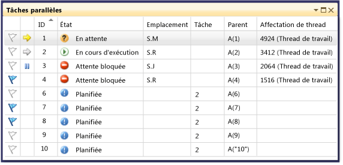
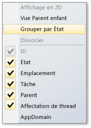
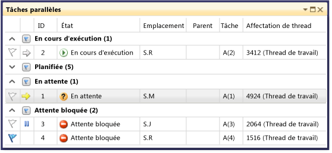
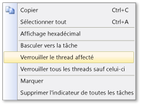

# À l’aide de la fenêtre tâches (C#, Visual Basic, C++)

La fenêtre **Tâches** ressemble à la fenêtre **Threads**, hormis le fait qu'elle comporte des informations sur les objets <xref:System.Threading.Tasks.Task?displayProperty=fullName> , [task_handle](/cpp/parallel/concrt/reference/task-group-class) ou [WinJS.Promise](/previous-versions/windows/apps/br211867(v=win.10)), et non pas sur chaque thread. Comme les threads, les tâches représentent des opérations asynchrones qui peuvent s'exécuter simultanément. Toutefois, plusieurs tâches peuvent s'exécuter sur le même thread.

Le code managé vous permet d’utiliser la fenêtre **Tâches** lorsque vous travaillez avec des objets <xref:System.Threading.Tasks.Task?displayProperty=fullName> ou avec les mots clés **await** et **async** (**Await** et **Asynchrone** en Visual Basic). Pour plus d’informations sur les tâches en code managé, consultez [à la programmation parallèle](/dotnet/standard/parallel-programming/index).

En code natif, vous pouvez utiliser la fenêtre **Tâches** lorsque vous travaillez avec des [groupes de tâches](/cpp/parallel/concrt/task-parallelism-concurrency-runtime), des [algorithmes parallèles](/cpp/parallel/concrt/parallel-algorithms), des [agents asynchrones](/cpp/parallel/concrt/asynchronous-agents) et des [tâches légères](/cpp/parallel/concrt/task-scheduler-concurrency-runtime). Pour plus d’informations sur les tâches en code natif, consultez [Runtime d’accès concurrentiel](/cpp/parallel/concrt/concurrency-runtime).

Dans JavaScript, vous pouvez utiliser la fenêtre tâches lorsque vous travaillez avec la promesse `.then` code. Consultez [programmation asynchrone dans JavaScript (applications UWP)](/previous-versions/windows/apps/hh700330(v=win.10)) pour plus d’informations.

Vous pouvez utiliser la fenêtre **Tâches** chaque fois que l’exécution s’arrête dans le débogueur. Pour y accéder, dans le menu **Déboguer**, cliquez sur **Fenêtres**, puis sur **Tâches**. L’illustration suivante présente la fenêtre **Tâches** dans son mode par défaut.

> [!NOTE]
> Dans le code managé, un <xref:System.Threading.Tasks.Task> qui a le statut [TaskStatus.Created](<xref:System.Threading.Tasks.TaskStatus.Created>), [TaskStatus.WaitingForActivation](<xref:System.Threading.Tasks.TaskStatus.WaitingForActivation>), ou [TaskStatus.WaitingToRun](<xref:System.Threading.Tasks.TaskStatus.WaitingToRun>) peut ne pas être affiché dans le **tâches** fenêtre lorsque les threads managés sont dans un état de veille ou de jointure.

## Informations sur les colonnes de la fenêtre Tâches

Les colonnes de la fenêtre **Tâches** contiennent les informations suivantes.

|Nom de la colonne|Description|
|-----------------|-----------------|
|**Indicateurs**|Affiche les tâches avec indicateur et vous permet d’ajouter un indicateur à une tâche ou d’en supprimer un.|
|**Icônes**|La flèche jaune indique la tâche actuelle. La tâche actuelle est la tâche supérieure du thread actuel.   Une flèche blanche indique la tâche d’arrêt, autrement dit, celle qui était actuelle lorsque le débogueur a été appelé.   L'icône de pause indique une tâche gelée par l'utilisateur. Vous pouvez geler et libérer une tâche en cliquant dessus avec le bouton droit dans la liste.|
|**ID**|Numéro fourni par le système pour la tâche. En code natif, il s’agit de l’adresse de la tâche.|
|**État**|L’état actuel (planifié, actif, bloqué, bloqué, en attente ou terminé) de la tâche. Une tâche planifiée est une tâche qui n’a pas encore été exécutée et, par conséquent, qui de possède pas encore une pile d’appels, un thread assigné ou des informations connexes.   Une tâche active est une tâche qui était en train d'exécuter du code avant de s'arrêter dans le débogueur.   Une tâche en attente ou bloquée est un qui est bloquée, car il attend un événement soit signalé, un verrou soit libéré ou une autre tâche se termine.   Une tâche bloquée est une tâche en attente dont le thread est bloqué par un autre thread.   Placez le curseur sur le **état** cellule d’une tâche bloquée ou en attente voir plus d’informations sur le bloc. **Avertissement :**  La fenêtre **Tâches** signale les interblocages uniquement pour les tâches bloquées utilisant une primitive de synchronisation prise en charge par le parcours du type d’attente (WCT). Par exemple, pour un interblocage <xref:System.Threading.Tasks.Task> objet, qui utilise le WCT, le débogueur signale **bloquée en attente**. Pour une tâche bloquée gérée par le runtime d’accès concurrentiel qui n’utilise pas Wait Chain Traversal, le débogueur signale **En attente**. Pour plus d'informations sur WCT, consultez [Wait Chain Traversal](/windows/desktop/Debug/wait-chain-traversal) (page éventuellement en anglais).|
|**Heure de début**|Heure à laquelle la tâche est devenue active.|
|**Durée**|Nombre de secondes durant lesquelles la tâche a été active.|
|**Heure d'achèvement**|Heure à laquelle la tâche s’est terminée.|
|**Emplacement**|Emplacement actuel dans la pile d’appels de la tâche. Pointez sur cette cellule pour visualiser l’ensemble de la pile des appels de la tâche. Les tâches planifiées ne disposent pas de valeur dans cette colonne.|
|**Task**|Méthode initiale et tous les arguments passés à la tâche lorsqu'elle a été créée.|
|**AsyncState**|En matière de code managé, état de la tâche. Par défaut, cette colonne est masquée. Pour afficher cette colonne, ouvrez le menu contextuel pour l'une des en-têtes de colonnes. Sélectionnez **Colonnes**, **AsyncState**.|
|**Parent**|ID de la tâche qui a créé cette tâche. Si rien n’est indiqué, la tâche n’a aucun parent. Ceci s'applique uniquement aux programmes gérés.|
|**Assignation de thread**|ID et nom du thread sur lequel la tâche s'exécute.|
|**AppDomain**|Pour du code managé, domaine d’application dans lequel la tâche s’exécute.|
|**task_group**|Pour du code natif, adresse de l’objet [task_group](/cpp/parallel/concrt/reference/task-group-class) qui a planifié la tâche. Pour les agents asynchrones et les tâches légères, cette colonne a la valeur 0.|
|**Process**|ID du processus que la tâche exécute.|

 Vous pouvez ajouter des colonnes à la vue en cliquant avec le bouton droit sur un en-tête de colonne et en sélectionnant ensuite les colonnes souhaitées. (Supprimez des colonnes en effaçant les sélections.) Vous pouvez également réorganiser les colonnes en les faisant glisser à gauche ou à droite. Le menu contextuel des colonnes est présenté dans l'illustration suivante.

 

## Tri de tâches
 Pour trier des tâches en fonction des critères de colonne, cliquez sur l’en-tête d’une colonne. Par exemple, en cliquant sur le **ID** en-tête de colonne, vous pouvez trier les tâches par ID de tâche : 1,2,3,4,5 et ainsi de suite. Pour inverser l'ordre de tri, cliquez à nouveau sur l'en-tête de la colonne. La colonne et l'ordre de tri actuels sont indiqués par une flèche dans la colonne.

## Regroupement de tâches
 Vous pouvez regrouper des tâches en fonction d’une colonne de la vue Liste. Ainsi, lorsque vous cliquez avec le bouton droit sur l’en-tête de colonne **État** et que vous cliquez ensuite sur **Grouper par** > **[*état*]**, vous pouvez regrouper toutes les tâches possédant le même état. Par exemple, vous pouvez rapidement voir en attente de tâches afin que vous pouviez vous concentrer sur la raison pour laquelle ils sont bloqués. Vous pouvez également réduire un groupe qui ne présente pas d‘intérêt pour la session de débogage. De la même manière, vous pouvez regrouper les tâches en fonction des autres colonnes. Pour ajouter un indicateur à un groupe (ou en supprimer un), il suffit de cliquer sur le bouton en regard de l'en-tête de groupe. L’illustration suivante présente la fenêtre **Tâches** en mode regroupé.

 

## Vue Parent enfant
 (cette vue est uniquement disponible pour le code managé) En double-cliquant sur le **état** en-tête de colonne, puis cliquez sur **Group by** > **Parent**, vous pouvez modifier la liste des tâches pour une vue hiérarchique, dans lequel chaque tâche enfant est un sous-nœud qui peut être affiché ou masqué sous son parent.

## Ajout d'indicateurs à des tâches
 Vous pouvez marquer le thread de la tâche sur lequel une tâche est en cours d’exécution en sélectionnant la tâche liste élément, puis en choisissant **Thread avec indicateur assigné** dans le menu contextuel ou en cliquant sur l’icône d’indicateur dans la première colonne. Si vous signalez plusieurs tâches, vous pouvez ensuite effectuer un tri sur la colonne d'indicateur pour déplacer toutes les tâches avec indicateur vers le haut afin de pouvoir vous concentrer uniquement sur celles-ci. Vous pouvez également utiliser la fenêtre **Piles parallèles** pour afficher uniquement les tâches avec indicateur. Cela vous permet d'éliminer par filtrage les tâches qui ne vous intéressent pas pour le débogage. Les indicateurs ne sont pas persistants entre les sessions de débogage.

## Gel et libération des tâches
 Vous pouvez geler le thread sur lequel une tâche s’exécute en cliquant avec le bouton droit sur la tâche, puis en cliquant sur **Verrouiller le thread affecté**. (Si une tâche est déjà gelée, la commande s’intitule **Libérer le thread affecté**.) Lorsque vous gelez un thread, celui-ci ne s'exécute pas lorsque vous parcourez le code après le point d'arrêt actuel. Le **figer tous les Threads, mais celui-ci** commande gèle tous les threads sauf celui qui exécute la tâche.

 L’illustration suivante présente les autres éléments de menu pour chaque tâche.

 

## Basculement de la tâche Active ou le Frame

Le **basculer vers la tâche** commande rend la tâche en cours de la tâche active. Le **basculer vers le Frame** commande rend la pile sélectionnée frame le frame de pile actif. Le contexte du débogueur passe à la tâche en cours ou le frame de pile sélectionné.

## Voir aussi

- [Présentation du débogueur](../debugger/debugger-feature-tour.md)
- [Débogage du code managé](../debugger/debugging-managed-code.md)
- [Programmation parallèle](/dotnet/standard/parallel-programming/index)
- [Le runtime d’accès concurrentiel](/cpp/parallel/concrt/concurrency-runtime)
- [Utilisation de la fenêtre Piles parallèles](../debugger/using-the-parallel-stacks-window.md)
- [Procédure pas à pas : Débogage d'une application parallèle](../debugger/walkthrough-debugging-a-parallel-application.md)