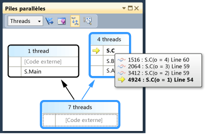
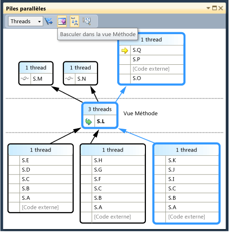
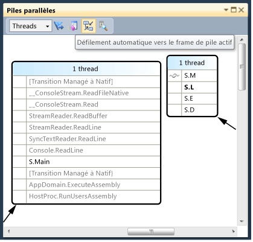
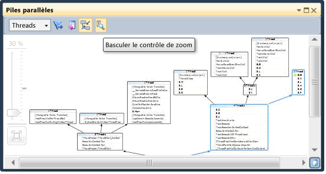
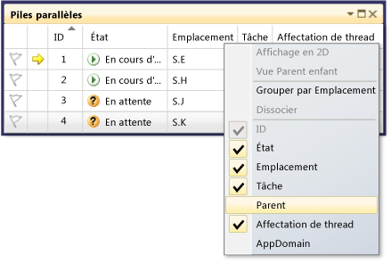
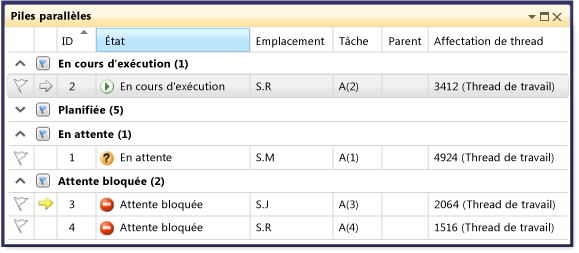
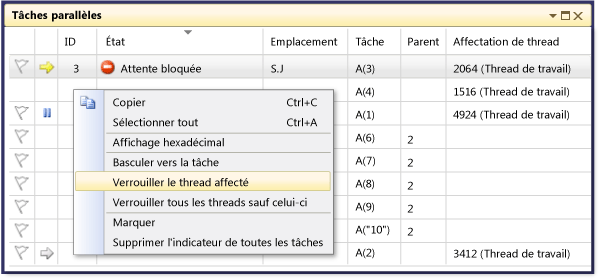

# Proc&#233;dure pas &#224; pas&#160;: d&#233;bogage d&#39;une application parall&#232;le
[!INCLUDE[vs2017banner](../code-quality/includes/vs2017banner.md)]

Cette procédure pas à pas indique comment utiliser les fenêtres **Tâches parallèles** et **Piles parallèles** pour déboguer une application parallèle.  Ces fenêtres vous aident à comprendre et à vérifier le comportement au moment de l'exécution du code qui utilise la [Task Parallel Library \(TPL\)](../Topic/Task%20Parallel%20Library%20\(TPL\).md) ou le [Concurrency Runtime](/visual-cpp/parallel/concrt/concurrency-runtime).  Cette procédure pas à pas fournit un exemple de code qui comporte des points d'arrêt intégrés.  Une fois le code arrêté, la procédure pas à pas indique comment utiliser les fenêtres **Tâches parallèles** et **Piles parallèles** pour l'examiner.  
  
 Cette procédure pas à pas aborde les tâches suivantes :  
  
-   Comment afficher les piles d'appels de tous les threads dans une vue.  
  
-   Comment afficher la liste des instances `System.Threading.Tasks.Task` créées dans votre application.  
  
-   Comment afficher les véritables piles d'appels des tâches au lieu des threads.  
  
-   Comment accéder au code à partir des fenêtres **Tâches parallèles** et **Piles parallèles**.  
  
-   Comment les fenêtres gèrent l'échelle avec les fonctionnalités de regroupement, de zoom et autres.  
  
## Composants requis  
 Cette procédure pas à pas suppose que l'option **Uniquement mon code** est activée.  Dans le menu **Outils**, cliquez sur **Options**, développez le nœud **Débogage**, sélectionnez **Général**, puis choisissez **Activer Uniquement mon code \(Managé uniquement\)**.  Si vous ne définissez pas cette fonctionnalité, vous pouvez quand même effectuer cette procédure pas à pas, mais vos résultats peuvent différer de ceux des illustrations.  
  
## Exemple C\#  
 Si vous utilisez l'exemple C\#, cette procédure pas à pas suppose également que le code externe est masqué.  Pour afficher ou masquer le code externe, cliquez avec le bouton droit sur l'en\-tête de table **Nom** de la fenêtre **Pile des appels**, puis activez ou désactivez **Afficher le code externe**.  Si vous ne définissez pas cette fonctionnalité, vous pouvez quand même effectuer cette procédure pas à pas, mais vos résultats peuvent différer de ceux des illustrations.  
  
## Exemple C\+\+  
 Si vous utilisez l'exemple C\+\+, vous pouvez ignorer les références au code externe de cette rubrique.  Le code externe s'applique uniquement à l'exemple C\#.  
  
## Illustrations  
 Les illustrations de cette rubrique ont été enregistrées sur un ordinateur quadricœur exécutant l'exemple C\#.  Bien que vous puissiez utiliser d'autres configurations pour effectuer cette procédure pas à pas, les illustrations peuvent différer de celles affichées sur votre ordinateur.  
  
## Création de l'exemple de projet  
 L'exemple de code de cette procédure pas à pas est relatif à une application qui ne fait rien.  L'objectif est simplement de comprendre comment utiliser les fenêtres Outils pour déboguer une application parallèle.  
  
#### Pour créer l'exemple de projet  
  
1.  Dans le menu **Fichier** de Visual Studio, pointez sur **Nouveau**, puis cliquez sur **Projet**.  
  
2.  Dans le volet **Modèles installés**, sélectionnez Visual C\#, Visual Basic ou Visual C\+\+.  Pour les langages managés, assurez\-vous que [!INCLUDE[net_v40_short](../debugger/includes/net_v40_short_md.md)] est affiché dans la fenêtre .NET Framework.  
  
3.  Sélectionnez **Application console** et cliquez sur **OK**.  Restez en configuration Debug, qui est la valeur par défaut.  
  
4.  Ouvrez le fichier de code .cpp, .cs ou .vb dans le projet.  Supprimez son contenu pour créer un fichier de code vide.  
  
5.  Collez le code suivant dans le langage choisi dans le fichier de code vide.  
  
 [!code-cs[Debugger#1](../debugger/codesnippet/CSharp/walkthrough-debugging-a-parallel-application_1.cs)]
 [!code-cpp[Debugger#1](../debugger/codesnippet/CPP/walkthrough-debugging-a-parallel-application_1.cpp)]
 [!code-vb[Debugger#1](../debugger/codesnippet/VisualBasic/walkthrough-debugging-a-parallel-application_1.vb)]  
  
1.  Dans le menu **Fichier**, cliquez sur **Enregistrer tout**.  
  
2.  Dans le menu **Générer**, cliquez sur **Régénérer la solution**.  
  
     Notez qu'il y a quatre appels à `Debugger.Break` \(`DebugBreak` dans l'exemple C\+\+\). Vous n'avez donc pas à insérer de points d'arrêt. La simple exécution de l'application entraînera son arrêt dans le débogueur jusqu'à quatre fois.  
  
## Utilisation de la fenêtre Piles parallèles : vue Threads  
 Dans le menu **Déboguer**, cliquez sur **Démarrer le débogage**.  Attendez que le premier point d'arrêt soit atteint.  
  
#### Pour afficher la pile des appels d'un thread unique  
  
1.  Dans le menu **Déboguer**, pointez sur **Fenêtres**, puis cliquez sur **Threads**.  Ancrez la fenêtre **Threads** en bas de Visual Studio.  
  
2.  Dans le menu **Déboguer**, pointez sur **Fenêtres**, puis cliquez sur **Pile des appels**.  Ancrez la fenêtre **Pile des appels** en bas de Visual Studio.  
  
3.  Double\-cliquez sur un thread dans la fenêtre **Threads** pour le rendre actuel.  Les threads actuels comportent une flèche jaune.  Lorsque vous modifiez le thread actuel, sa pile des appels est affichée dans la fenêtre **Pile des appels**.  
  
#### Pour examiner la fenêtre Piles parallèles  
  
1.  Dans le menu **Déboguer**, pointez sur **Fenêtres**, puis cliquez sur **Piles parallèles**.  Assurez\-vous que l'option **Threads** est sélectionnée dans la zone située dans l'angle supérieur gauche.  
  
     Grâce à la fenêtre **Piles parallèles**, vous pouvez afficher plusieurs piles d'appels en même temps au sein d'une seule vue.  L'illustration suivante présente la fenêtre **Piles parallèles** au\-dessus de la fenêtre **Pile des appels**.  
  
       
  
     La pile des appels du thread principal s'affiche dans une zone et les piles des appels des quatre autres threads sont regroupées dans une autre zone.  Quatre threads sont regroupés car leurs frames de pile partagent les mêmes contextes de méthode, ce qui signifie qu'ils se trouvent dans les mêmes méthodes : `A`, `B` et `C`.  Pour afficher les ID et noms de threads qui partagent la même zone, pointez sur l'en\-tête \(**4 Threads**\).  Le thread actuel est affiché en gras, comme indiqué dans l'illustration suivante.  
  
       
  
     La flèche jaune indique le frame de pile actif du thread actuel.  Pour obtenir plus d'informations, placez votre pointeur au\-dessus.  
  
       
  
     Vous pouvez indiquer le détail souhaité pour les frames de pile \(**Afficher les noms de modules**, **Afficher les types de paramètre**, **Afficher les noms de paramètres**, **Afficher les valeurs de paramètre**, **Afficher les numéros de ligne** et **Afficher les offsets d'octet**\) en cliquant avec le bouton droit dans la fenêtre **Pile des appels**.  
  
     Une surbrillance bleue autour d'une zone indique que le thread actuel fait partie de cette zone.  Le thread actuel est également indiqué par le frame de pile en gras dans l'info\-bulle.  Si vous double\-cliquez sur le thread principal dans la fenêtre Threads, vous pouvez observer que la surbrillance bleue dans la fenêtre **Piles parallèles** se déplace en conséquence.  
  
       
  
#### Pour continuer l'exécution jusqu'au deuxième point d'arrêt  
  
1.  Pour reprendre l'exécution jusqu'au deuxième point d'arrêt, dans le menu **Déboguer**, cliquez sur **Continuer**.  L'illustration suivante présente l'arborescence des threads au deuxième point d'arrêt.  
  
       
  
     Au premier point d'arrêt, les quatre threads sont tous allés de la méthode S.A à S.B et S.C.  Ces informations sont toujours visibles dans la fenêtre **Piles parallèles**, mais les quatre threads ont depuis progressé plus loin.  L'un d'entre eux a continué vers S.D, puis S.E.  Un autre est allé vers S.F, S.G et S.H.  Deux autres ont continué vers S.I et S.J et, de là, l'un d'eux est allé vers S.K et l'autre est parti vers du code externe non\-utilisateur.  
  
     Vous pouvez pointer sur l'en\-tête de zone, par exemple **1 Thread** ou **2 Threads**, pour afficher les ID des threads.  Vous pouvez pointer sur des frames de pile pour afficher les ID des threads et d'autres détails sur les frames.  La surbrillance bleue indique le thread actuel et la flèche jaune indique le frame de pile actif du thread actuel.  
  
     L'icône de maillage \(lignes ondulées bleue et rouge se chevauchant\) indique les frames de pile actifs des threads non actuels.  Dans la fenêtre **Pile des appels**, double\-cliquez sur S.B pour basculer des frames.  La fenêtre **Piles parallèles** indique le frame de pile actuel du thread actuel à l'aide d'une icône de flèche incurvée verte.  
  
     Dans la fenêtre **Threads**, basculez entre les threads et remarquez que la vue de la fenêtre **Piles parallèles** est mise à jour.  
  
     Vous pouvez basculer vers un autre thread, ou vers un autre frame d'un autre thread, à l'aide du menu contextuel de la fenêtre **Piles parallèles**.  Par exemple, cliquez avec le bouton droit sur S.J, pointez sur **Basculer vers le frame**, puis cliquez sur une commande.  
  
       
  
     Cliquez avec le bouton droit sur S.C et pointez sur **Basculer vers le frame**.  L'une des commandes comporte une coche qui indique le frame de pile du thread actuel.  Vous pouvez basculer vers ce frame du même thread \(seule la flèche verte se déplace\) ou vous pouvez basculer vers l'autre thread \(la surbrillance bleue se déplace également\).  L'illustration suivante présente le sous\-menu.  
  
       
  
     Lorsqu'un contexte de méthode est associé à un seul frame de pile, l'en\-tête de zone indique **1 Thread** et vous pouvez basculer vers lui en double\-cliquant.  Si vous double\-cliquez sur un contexte de méthode associé à plus d'1 frame, le menu apparaît automatiquement.  Lorsque vous pointez sur les contextes de méthode, remarquez le triangle noir à droite.  Le fait de cliquer sur ce triangle affiche également le menu contextuel.  
  
     Pour les grandes applications qui comportent de nombreux threads, vous pouvez vous concentrer sur un seul sous\-ensemble de threads.  La fenêtre **Piles parallèles** peut afficher des piles d'appels uniquement pour les threads avec indicateur.  Dans la barre d'outils, cliquez sur le bouton **Afficher uniquement les threads avec indicateur** situé à côté de la zone de liste.  
  
       
  
     Ensuite, dans la fenêtre **Threads**, signalez les threads un par un pour voir comment leurs piles d'appels s'affichent dans la fenêtre **Piles parallèles**.  Pour signaler des threads, utilisez le menu contextuel ou la première cellule d'un thread.  Cliquez à nouveau sur le bouton de barre d'outils **Afficher uniquement les threads avec indicateur** pour afficher tous les threads.  
  
#### Pour continuer l'exécution jusqu'au troisième point d'arrêt  
  
1.  Pour reprendre l'exécution jusqu'au troisième point d'arrêt, dans le menu **Déboguer**, cliquez sur **Continuer**.  
  
     Lorsque plusieurs threads se trouvent dans la même méthode mais que cette méthode ne figure pas au début de la pile des appels, la méthode s'affiche dans des zones différentes.  Un exemple au point d'arrêt actuel est S.L, qui possède trois threads et apparaît dans trois zones.  Double\-cliquez sur S.L.  
  
       
  
     Remarquez que S.L apparaît en gras dans les deux autres zones afin que vous puissiez voir où il s'affiche.  Si vous souhaitez voir quels frames appeler dans S.L et quels frames sont appelés, cliquez sur le bouton **Basculer dans la vue Méthode** de la barre d'outils.  L'illustration suivante présente la vue Méthode de la fenêtre **Piles parallèles**.  
  
       
  
     Remarquez comment le diagramme a pivoté sur la méthode sélectionnée et l'a positionnée dans sa propre zone au milieu de la vue.  Les appelés et appelants s'affichent en haut et en bas.  Cliquez à nouveau sur le bouton **Basculer dans la vue Méthode** pour quitter ce mode.  
  
     Le menu contextuel de la fenêtre **Piles parallèles** comporte également les éléments suivants.  
  
    -   **Affichage hexadécimal** bascule les nombres apparaissant dans les info\-bulles entre affichage décimal et hexadécimal.  
  
    -   **Informations sur le chargement de symboles** et **Paramètres des symboles** ouvrent leurs boîtes de dialogue respectives.  
  
    -   **Atteindre le code source** et **Atteindre le code machine** permettent de naviguer dans l'éditeur vers la méthode sélectionnée.  
  
    -   **Afficher le code externe** affiche tous les frames même s'ils ne figurent pas dans le code utilisateur.  Essayez cet élément pour voir le diagramme se développer pour accueillir les frames supplémentaires \(qui peuvent être grisés car vous n'avez pas de symboles pour eux\).  
  
     Lorsque vous possédez de grands diagrammes et que vous accédez au point d'arrêt suivant, vous pouvez souhaiter que la vue défile automatiquement vers le frame de pile actif du thread actuel, à savoir le thread qui a atteint en premier le point d'arrêt.  Dans la fenêtre **Piles parallèles**, assurez\-vous que le bouton **Défilement automatique vers le frame de pile actif** de la barre d'outils est activé.  
  
       
  
2.  Avant de continuer, dans la fenêtre **Piles parallèles**, défilez tout à gauche et tout en bas.  
  
#### Pour continuer l'exécution jusqu'au quatrième point d'arrêt  
  
1.  Pour reprendre l'exécution jusqu'au quatrième point d'arrêt, dans le menu **Déboguer**, cliquez sur **Continuer**.  
  
     Remarquez comment la vue défile automatiquement.  Basculez des threads dans la fenêtre **Threads** ou basculez des frames de pile dans la fenêtre **Pile des appels**. Notez comment la vue défile toujours automatiquement vers le frame approprié.  Désactivez l'option **Défilement automatique vers le frame de pile actif** et notez la différence.  
  
     La **Vue aérienne** est également utile avec les diagrammes de taille importante dans la fenêtre **Piles parallèles**.  Vous pouvez afficher la **Vue aérienne** en cliquant sur le bouton situé entre les barres de défilement dans l'angle inférieur droit de la fenêtre, comme indiqué dans l'illustration suivante.  
  
       
  
     Vous pouvez déplacer le rectangle pour effectuer un panoramique rapide autour du diagramme.  
  
     Une autre façon de déplacer le diagramme consiste à cliquer dans une zone vide de celui\-ci et à le faire glisser où vous le souhaitez.  
  
     Pour effectuer un zoom avant ou arrière dans le diagramme, appuyez sur CTRL et maintenez cette touche enfoncée pendant que vous déplacez la roulette de la souris.  Vous pouvez également cliquer sur le bouton Zoom de la barre d'outils, puis utiliser l'outil Zoom.  
  
       
  
     Vous pouvez également afficher les piles dans le sens haut\/bas, plutôt que bas\/haut. Pour cela, dans le menu **Outils**, cliquez sur **Options**, puis activez ou désactivez l'option sous le nœud **Débogage**.  
  
2.  Avant de continuer, dans le menu **Déboguer**, cliquez sur **Arrêter le débogage** pour arrêter l'exécution.  
  
## Utilisation de la fenêtre Tâches parallèles et de la vue Tâches de la fenêtre Piles parallèles  
 Nous vous recommandons d'effectuer les procédures précédentes avant de continuer.  
  
#### Pour redémarrer l'application jusqu'à ce que le premier point d'arrêt soit atteint  
  
1.  Dans le menu **Déboguer**, cliquez sur **Démarrer le débogage** et attendez le premier point d'arrêt soit atteint.  
  
2.  Dans le menu **Déboguer**, pointez sur **Fenêtres**, puis cliquez sur **Threads**.  Ancrez la fenêtre **Threads** en bas de Visual Studio.  
  
3.  Dans le menu **Déboguer**, pointez sur **Fenêtres** et cliquez sur **Pile des appels**.  Ancrez la fenêtre **Pile des appels** en bas de Visual Studio.  
  
4.  Double\-cliquez sur un thread dans la fenêtre **Threads** pour le rendre actuel.  Les threads actuels comportent une flèche jaune.  Lorsque vous modifiez le thread actuel, les autres fenêtres sont mises à jour.  Nous allons maintenant examiner les tâches.  
  
5.  Dans le menu **Déboguer**, pointez sur **Fenêtres**, puis cliquez sur **Tâches parallèles**.  L'illustration suivante présente la fenêtre **Tâches parallèles**.  
  
       
  
     Pour chaque tâche en cours, vous pouvez lire l'ID, retourné par la propriété de même nom, l'ID et le nom du thread qui l'exécute, ainsi que son emplacement \(le fait de pointer dessus affiche une info\-bulle qui comporte l'ensemble de la pile des appels\).  Dans la colonne **Tâche**, vous pouvez également voir la méthode qui a été passée dans la tâche; en d'autres termes, le point de début.  
  
     Vous pouvez trier toutes les colonnes.  Remarquez le glyphe de tri qui indique la colonne et le sens du tri.  Vous pouvez également réorganiser les colonnes en les faisant glisser à gauche ou à droite.  
  
     La flèche jaune indique la tâche actuelle.  Vous pouvez basculer des tâches en double\-cliquant dessus ou en utilisant le menu contextuel.  Lorsque vous basculez des tâches, le thread sous\-jacent devient le thread actuel et les autres fenêtres sont mises à jour.  
  
     Lorsque vous basculez manuellement d'une tâche à une autre, la flèche jaune se déplace, mais une flèche blanche indique toujours la tâche qui a provoqué l'arrêt du débogueur.  
  
#### Pour continuer l'exécution jusqu'au deuxième point d'arrêt  
  
1.  Pour reprendre l'exécution jusqu'au deuxième point d'arrêt, dans le menu **Déboguer**, cliquez sur **Continuer**.  
  
     Auparavant, la colonne **État** indiquait toutes les tâches comme étant En cours d'exécution, mais maintenant deux tâches ont l'état En attente.  Les tâches peuvent être bloquées pour de nombreuses raisons.  Dans la colonne **État**, pointez sur une tâche en attente pour savoir pourquoi elle est bloquée.  Par exemple, dans l'illustration suivante, la tâche 3 attend la tâche 4.  
  
       
  
     La tâche 4, ensuite, attend un gestionnaire possédé par le thread assigné à la tâche 2.  
  
       
  
     Vous pouvez signaler une tâche en cliquant sur l'indicateur dans la première colonne de la fenêtre **Tâches parallèles**.  
  
     Vous pouvez utiliser un indicateur pour effectuer le suivi des tâches entre différents points d'arrêt d'une même session de débogage ou pour filtrer les tâches dont les piles d'appels sont affichées dans la fenêtre **Piles parallèles**.  
  
     Lorsque vous avez utilisé la fenêtre **Piles parallèles** auparavant, vous avez affiché les threads d'application.  Affichez à nouveau la fenêtre **Piles parallèles**, mais cette fois, visualisez les tâches d'application.  Pour cela, sélectionnez **Tâches** dans la zone dans l'angle supérieur gauche.  L'illustration suivante présente la vue Tâches.  
  
       
  
     Les threads qui n'exécutent actuellement pas de tâches n'apparaissent pas dans la vue Tâches de la fenêtre **Piles parallèles**.  En outre, pour les threads qui exécutent des tâches, certains des frames de pile qui ne sont pas associés aux tâches sont filtrés à partir du haut et bas de la pile.  
  
     Ouvrez à nouveau la fenêtre **Tâches parallèles**.  Cliquez avec le bouton droit sur un en\-tête de colonne pour afficher un menu contextuel pour cette colonne.  
  
       
  
     Vous pouvez utiliser le menu contextuel pour ajouter ou supprimer des colonnes.  Par exemple, la colonne AppDomain n'est pas sélectionnée. Elle ne s'affiche donc pas dans la liste.  Cliquez sur **Parent**.  La colonne **Parent** s'affiche sans valeur pour chacune des quatre tâches.  
  
#### Pour continuer l'exécution jusqu'au troisième point d'arrêt  
  
1.  Pour reprendre l'exécution jusqu'au troisième point d'arrêt, dans le menu **Déboguer**, cliquez sur **Continuer**.  
  
     Une nouvelle tâche, la tâche 5, est en cours d'exécution et la tâche 4 est maintenant en attente.  Vous pouvez voir pourquoi en pointant sur la tâche en attente dans la fenêtre **État**.  Dans la colonne **Parent**, remarquez que la tâche 4 est la tâche parent de la tâche 5.  
  
     Pour mieux visualiser la relation parent\-enfant, cliquez avec le bouton droit sur l'en\-tête de colonne **Parent**, puis cliquez sur **Vue Parent enfant**.  L'illustration suivante doit apparaître.  
  
       
  
     Remarquez que la tâche 4 et la tâche 5 s'exécutent sur le même thread.  Ces informations ne sont pas affichées dans la fenêtre **Threads**. Leur affichage ici constitue un autre avantage de la fenêtre **Tâches parallèles**.  Pour confirmer ceci, affichez la fenêtre **Piles parallèles**.  Assurez\-vous que vous visualisez bien la vue **Tâches**.  Localisez les tâches 4 et 5 en double\-cliquant dessus dans la fenêtre **Tâches parallèles**.  La surbrillance bleue de la fenêtre **Piles parallèles** est alors mise à jour.  Vous pouvez également localiser les tâches 4 et 5 en analysant les info\-bulles de la fenêtre **Piles parallèles**.  
  
       
  
     Dans la fenêtre **Piles parallèles**, cliquez avec le bouton droit sur S.P, puis cliquez sur **Atteindre le thread**.  La fenêtre passe à la vue Threads et le frame correspondant s'affiche.  Vous pouvez voir les deux tâches sur le même thread.  
  
       
  
     Ceci est un autre avantage de la vue Tâches de la fenêtre **Piles parallèles** par rapport à la fenêtre **Threads**.  
  
#### Pour continuer l'exécution jusqu'au quatrième point d'arrêt  
  
1.  Pour reprendre l'exécution jusqu'au troisième point d'arrêt, dans le menu **Déboguer**, cliquez sur **Continuer**.  Cliquez sur l'en\-tête de colonne **ID** pour trier par ID.  L'illustration suivante doit apparaître.  
  
       
  
     Étant donné que la tâche 5 est terminée, elle n'est plus affichée.  Si ce n'est pas le cas sur votre ordinateur et que l'interblocage n'est pas indiqué, appuyez sur F11.  
  
     Les tâches 3 et 4 s'attendent maintenant l'une l'autre et sont bloquées.  Il y a également 5 nouvelles tâches qui sont des enfants de la tâche 2 et qui sont maintenant planifiées.  Les tâches planifiées sont des tâches qui ont été démarrées dans le code mais qui n'ont pas encore été exécutées.  Par conséquent, leurs colonnes **Emplacement** et **Affectation de thread** sont vides.  
  
     Ouvrez à nouveau la fenêtre **Piles parallèles**.  L'en\-tête de chaque zone comporte une info\-bulle qui affiche les ID et noms de thread.  Basculez en vue Tâches dans la fenêtre **Piles parallèles**.  Pointez sur un en\-tête pour afficher l'ID et le nom de la tâche, ainsi que son état, comme indiqué dans l'illustration suivante.  
  
       
  
     Vous pouvez regrouper les tâches par colonne.  Dans la fenêtre **Tâches parallèles**, cliquez avec le bouton droit sur l'en\-tête de colonne **État**, puis cliquez sur **Grouper par État**.  L'illustration suivante présente la fenêtre **Tâches parallèles** regroupée par état.  
  
       
  
     Vous pouvez également regrouper les tâches en fonction d'une autre colonne.  Cela vous permet de vous concentrer sur un sous\-ensemble de tâches.  Chaque groupe réductible comporte un certain nombre des éléments regroupés ensemble.  Vous pouvez également signaler rapidement tous les éléments du groupe en cliquant sur le bouton **Marquer** à droite du bouton **Réduire**.  
  
       
  
     La dernière fonctionnalité de la fenêtre **Tâches parallèles** à examiner est le menu contextuel qui s'affiche lorsque vous cliquez avec le bouton droit sur une tâche.  
  
       
  
     Ce menu contextuel contient différentes commandes en fonction de l'état de la tâche.  Ces commandes sont **Copier**, **Sélectionner tout**, **Affichage hexadécimal**, **Basculer vers la tâche**, **Verrouiller le thread affecté**, **Verrouiller tous les threads sauf celui\-ci**, **Libérer le thread affecté** et **Marquer**.  
  
     Vous pouvez verrouiller le thread sous\-jacent d'une ou plusieurs tâches, ainsi que verrouiller tous les threads sauf celui qui est assigné.  Un thread verrouillé est représenté dans la fenêtre **Tâches parallèles** comme dans la fenêtre **Threads**, par une icône de *pause* bleue.  
  
## Résumé  
 Cette procédure pas à pas a présenté les fenêtres de débogage **Tâches parallèles** et **Piles parallèles**.  Vous pouvez utiliser ces fenêtres sur de véritables projets qui utilisent du code multithread.  Vous pouvez examiner le code parallèle rédigé en C\+\+, C\# ou Visual Basic.  
  
## Voir aussi  
 [Debugging Multithreaded Applications](../debugger/walkthrough-debugging-a-parallel-application.md)   
 [Principes de base du débogueur](../debugger/debugger-basics.md)   
 [Débogage du code managé](../debugger/debugging-managed-code.md)   
 [Parallel Programming](../Topic/Parallel%20Programming%20in%20the%20.NET%20Framework.md)   
 [Concurrency Runtime](/visual-cpp/parallel/concrt/concurrency-runtime)   
 [Utilisation de la fenêtre Piles parallèles](../debugger/using-the-parallel-stacks-window.md)   
 [Utilisation de la fenêtre Tâches](../debugger/using-the-tasks-window.md)