# Procédure pas à pas : Débogage d’une Application parallèle dans Visual Studio
Cette procédure pas à pas montre comment utiliser le **tâches parallèles** et **piles parallèles** windows pour déboguer une application parallèle. Ces fenêtres vous aident à comprendre et à vérifier le comportement d’exécution de code qui utilise le [bibliothèque parallèle de tâches (TPL)](/dotnet/standard/parallel-programming/task-parallel-library-tpl) ou [Runtime d’accès concurrentiel](/cpp/parallel/concrt/concurrency-runtime). Cette procédure pas à pas fournit un exemple de code qui comporte des points d'arrêt intégrés. Une fois que le code s’arrête, la procédure pas à pas montre comment utiliser le **tâches parallèles** et **piles parallèles** windows pour l’examiner.  
  
 Cette procédure pas à pas aborde les tâches suivantes :  
  
-   Comment afficher les piles d'appels de tous les threads dans une vue.  
  
-   Comment afficher la liste des instances `System.Threading.Tasks.Task` créées dans votre application.  
  
-   Comment afficher les véritables piles d’appels des tâches au lieu des threads.  
  
-   Comment accéder au code à partir de la **tâches parallèles** et **piles parallèles** windows.  
  
-   Comment les fenêtres gèrent l’échelle avec les fonctionnalités de regroupement, de zoom et autres.  
  
## Prérequis  
 Cette procédure pas à pas suppose que **uniquement mon Code** est activée (elle est activée par défaut dans les versions plus récentes de Visual Studio). Sur le **outils** menu, cliquez sur **Options**, développez le **débogage** nœud, sélectionnez **général**, puis sélectionnez **activer Uniquement mon Code (managé uniquement)**. Si vous ne définissez pas cette fonctionnalité, vous pouvez quand même effectuer cette procédure pas à pas, mais vos résultats peuvent différer de ceux des illustrations.  
  
## Exemple C#  
 Si vous utilisez l'exemple C#, cette procédure pas à pas suppose également que le code externe est masqué. Pour afficher ou masquer le code externe, cliquez sur le **nom** en-tête de table de la **pile des appels** fenêtre, puis activez ou désactivez **afficher le Code externe**. Si vous ne définissez pas cette fonctionnalité, vous pouvez quand même effectuer cette procédure pas à pas, mais vos résultats peuvent différer de ceux des illustrations.  
  
## Exemple C++  
 Si vous utilisez l'exemple C++, vous pouvez ignorer les références au code externe de cette rubrique. Le code externe s'applique uniquement à l'exemple C#.  
  
## Illustrations  
 Les illustrations de cette rubrique ont été enregistrées sur un ordinateur quadricœur exécutant l'exemple C#. Bien que vous puissiez utiliser d'autres configurations pour effectuer cette procédure pas à pas, les illustrations peuvent différer de celles affichées sur votre ordinateur.  
  
## Création de l'exemple de projet  
 L'exemple de code de cette procédure pas à pas est relatif à une application qui ne fait rien. L'objectif est simplement de comprendre comment utiliser les fenêtres Outils pour déboguer une application parallèle.  
  
#### Pour créer l'exemple de projet  
  
1.  Dans Visual Studio, dans le menu **Fichier**,pointez sur **Nouveau**, puis cliquez sur **Projet**.  
  
2.  Dans le **modèles installés** volet, sélectionnez Visual c#, Visual Basic ou Visual C++. Pour les langages managés, assurez-vous que [!INCLUDE[net_v40_short](../code-quality/includes/net_v40_short_md.md)] est affiché dans la fenêtre .NET Framework.  
  
3.  Sélectionnez **Application Console** puis cliquez sur **OK**. Restez en configuration Debug, qui est la valeur par défaut.  
  
4.  Ouvrez le fichier de code .cpp, .cs ou .vb dans le projet. Supprimez son contenu pour créer un fichier de code vide.  
  
5.  Collez le code suivant dans le langage choisi dans le fichier de code vide.  
  
 [!code-csharp[Debugger#1](../debugger/codesnippet/CSharp/walkthrough-debugging-a-parallel-application_1.cs)]
 [!code-cpp[Debugger#1](../debugger/codesnippet/CPP/walkthrough-debugging-a-parallel-application_1.cpp)]
 [!code-vb[Debugger#1](../debugger/codesnippet/VisualBasic/walkthrough-debugging-a-parallel-application_1.vb)]  
  
1.  Sur le **fichier** menu, cliquez sur **Enregistrer tout**.  
  
2.  Sur le **générer** menu, cliquez sur **régénérer la Solution**.  
  
     Notez qu'il y a quatre appels à `Debugger.Break` (`DebugBreak` dans l'exemple C++). Vous n'avez donc pas à insérer de points d'arrêt. La simple exécution de l'application entraînera son arrêt dans le débogueur jusqu'à quatre fois.  
  
## Utilisation de la fenêtre Piles parallèles : vue Threads  
 Dans le menu **Déboguer**, cliquez sur **Démarrer le débogage**. Attendez que le premier point d'arrêt soit atteint.  
  
#### Pour afficher la pile des appels d'un thread unique  
  
1.  Sur le **déboguer** menu, pointez sur **Windows** puis cliquez sur **Threads**. Ancrer le **Threads** fenêtre en bas de Visual Studio.  
  
2.  Sur le **déboguer** menu, pointez sur **Windows** puis cliquez sur **pile des appels**. Ancrer le **pile des appels** fenêtre en bas de Visual Studio.  
  
3.  Double-cliquez sur un thread dans le **Threads** fenêtre pour le rendre actuel. Les threads actuels comportent une flèche jaune. Lorsque vous modifiez le thread actuel, sa pile des appels est affichée dans le **pile des appels** fenêtre.  
  
#### Pour examiner la fenêtre Piles parallèles  
  
1.  Sur le **déboguer** menu, pointez sur **Windows** puis cliquez sur **piles parallèles**. Assurez-vous que **Threads** est sélectionné dans la zone dans l’angle supérieur gauche.  
  
     À l’aide de la **piles parallèles** , vous pouvez afficher plusieurs piles d’appels en même temps dans une vue. L’illustration suivante montre le **piles parallèles** fenêtre ci-dessus le **pile des appels** fenêtre.  
  
     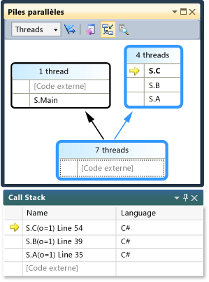  
  
     La pile des appels du thread principal s'affiche dans une zone et les piles des appels des quatre autres threads sont regroupées dans une autre zone. Quatre threads sont regroupés car leurs frames de pile partagent les mêmes contextes de méthode, ce qui signifie qu'ils se trouvent dans les mêmes méthodes : `A`, `B` et `C`. Pour afficher les ID de thread et les noms de threads qui partagent la même zone, pointez sur la zone de l’en-tête (**4 Threads**). Le thread actuel est affiché en gras.  
  
       
  
     La flèche jaune indique le frame de pile actif du thread actuel.
  
     Vous pouvez définir le niveau de détail à afficher pour les frames de pile (**les noms de Module**, **des Types de paramètres**, **les noms de paramètres**, **les valeurs de paramètre**, **Les numéros de ligne** et **Offsets d’octet**) en cliquant dans le **pile des appels** fenêtre.  
  
     Une surbrillance bleue autour d'une zone indique que le thread actuel fait partie de cette zone. Le thread actuel est également indiqué par le frame de pile en gras dans l'info-bulle. Si vous double-cliquez sur le thread principal dans la fenêtre Threads, vous pouvez observer que la surbrillance bleue de la **piles parallèles** fenêtre se déplace en conséquence.  
  
       
  
#### Pour continuer l'exécution jusqu'au deuxième point d'arrêt  
  
1.  Pour reprendre l’exécution jusqu'à ce que le deuxième point d’arrêt est atteint, sur le **déboguer** menu, cliquez sur **continuer**. L’illustration suivante présente l’arborescence des threads au deuxième point d’arrêt.  
  
     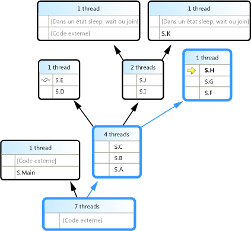  
  
     Au premier point d'arrêt, les quatre threads sont tous allés de la méthode S.A à S.B et S.C. Que les informations sont toujours visibles dans le **piles parallèles** fenêtre, mais les quatre threads ont depuis progressé plus loin. L'un d'entre eux a continué vers S.D, puis S.E. Un autre est allé vers S.F, S.G et S.H. Deux autres ont continué vers S.I et S.J et, de là, l'un d'eux est allé vers S.K et l'autre est parti vers du code externe non-utilisateur.  
  
     Vous pouvez pointer sur l’en-tête de zone, par exemple, **1 Thread** ou **2 Threads**, pour afficher les ID des threads. Vous pouvez pointer sur des frames de pile pour afficher les ID des threads et d'autres détails sur les frames. La surbrillance bleue indique le thread actuel et la flèche jaune indique le frame de pile actif du thread actuel.  
  
     L’icône de maillage (lignes d’interweaved) indiquent les frames de pile actifs des threads non actuels. Dans le **pile des appels** fenêtre, double-cliquez sur S.B pour basculer des frames. Le **piles parallèles** fenêtre indique le frame de pile actuel du thread actuel à l’aide d’une icône de flèche incurvée verte.  
  
     Dans le **Threads** fenêtre, basculez entre les threads et remarquez que la vue dans le **piles parallèles** fenêtre est mise à jour.  
  
     Vous pouvez basculer vers un autre thread, ou vers un autre frame d’un autre thread, à l’aide du menu contextuel de la **piles parallèles** fenêtre. Par exemple, cliquez sur S.J, pointez sur **basculer vers le Frame**, puis cliquez sur une commande.  
  
     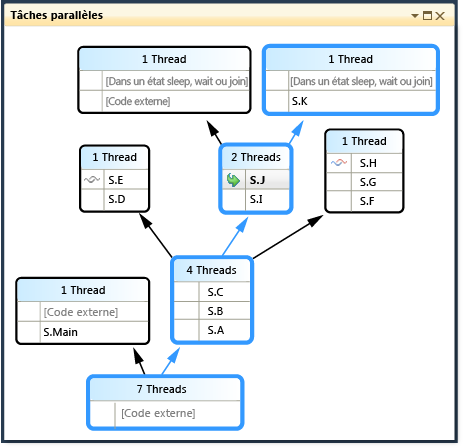  
  
     Cliquez sur S.C et pointez sur **basculer vers le Frame**. L'une des commandes comporte une coche qui indique le frame de pile du thread actuel. Vous pouvez basculer vers ce frame du même thread (seule la flèche verte se déplace) ou vous pouvez basculer vers l'autre thread (la surbrillance bleue se déplace également). L'illustration suivante présente le sous-menu.  
  
     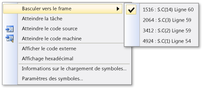  
  
     Lorsqu’un contexte de méthode est associé à seulement un frame de pile, l’en-tête de zone affiche **1 Thread** et vous pouvez basculer vers lui en double-cliquant. Si vous double-cliquez sur un contexte de méthode associé à plus d'1 frame, le menu apparaît automatiquement. Lorsque vous pointez sur les contextes de méthode, remarquez le triangle noir à droite. Le fait de cliquer sur ce triangle affiche également le menu contextuel.  
  
     Pour les grandes applications qui comportent de nombreux threads, vous pouvez vous concentrer sur un seul sous-ensemble de threads. Le **piles parallèles** fenêtre peut afficher des piles d’appels uniquement pour les threads avec indicateur. Pour signaler des threads, utilisez le menu contextuel ou la première cellule d'un thread. 

     Dans la barre d’outils, cliquez sur le **afficher uniquement avec indicateur** bouton en regard de la zone de liste.  

     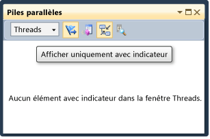  

     Désormais, seul le thread avec indicateur apparaît dans le **piles parallèles** fenêtre.
  
#### Pour continuer l'exécution jusqu'au troisième point d'arrêt  
  
1.  Pour reprendre l’exécution jusqu'à ce que le troisième point d’arrêt est atteint, sur le **déboguer** menu, cliquez sur **continuer**.  
  
     Lorsque plusieurs threads se trouvent dans la même méthode mais que cette méthode ne figure pas au début de la pile des appels, la méthode s'affiche dans des zones différentes. Un exemple au point d'arrêt actuel est S.L, qui possède trois threads et apparaît dans trois zones. Double-cliquez sur S.L.  
  
       
  
     Remarquez que S.L apparaît en gras dans les deux autres zones afin que vous puissiez voir où il s'affiche. Si vous souhaitez voir quels frames appeler dans S.L et quels frames, cliquez sur le **basculer dans la vue méthode** dans la barre d’outils. L’illustration suivante montre la vue méthode de la **piles parallèles** fenêtre.  
  
       
  
     Remarquez comment le diagramme a pivoté sur la méthode sélectionnée et l'a positionnée dans sa propre zone au milieu de la vue. Les appelés et appelants s'affichent en haut et en bas. Cliquez sur le **basculer dans la vue méthode** bouton pour quitter ce mode.  
  
     Le menu contextuel de la **piles parallèles** fenêtre possède également les éléments suivants autres éléments.  
  
    -   **Affichage hexadécimal** Active ou désactive les nombres dans les info-bulles entre décimal et hexadécimal.  
  
    -   **Paramètres de symboles** ouvrir les boîtes de dialogue correspondante.  
  
    -   **Afficher les Threads dans la Source** Active ou désactive l’affichage des marqueurs de thread dans votre code source, qui affiche l’emplacement des threads dans votre code source.
  
    -   **Afficher le Code externe** affiche tous les frames même s’ils ne sont pas dans le code utilisateur. Essayez cet élément pour voir le diagramme se développer pour accueillir les frames supplémentaires (qui peuvent être grisés car vous n’avez pas de symboles pour eux).  

2.  Dans le **piles parallèles** fenêtre, assurez-vous que le **défilement automatique vers le Frame de pile actuel** bouton de la barre d’outils est activé.  

     Lorsque vous possédez de grands diagrammes et que vous accédez au point d'arrêt suivant, vous pouvez souhaiter que la vue défile automatiquement vers le frame de pile actif du thread actuel, à savoir le thread qui a atteint en premier le point d'arrêt.
  
3.  Avant de continuer, dans le **piles parallèles** fenêtre, défilez tout à gauche et vers le bas.  
  
#### Pour continuer l'exécution jusqu'au quatrième point d'arrêt  
  
1.  Pour reprendre l’exécution jusqu'à ce que la quatrième point d’arrêt est atteint, sur le **déboguer** menu, cliquez sur **continuer**.  
  
     Remarquez comment la vue défile automatiquement. Basculez des threads dans le **Threads** frames de pile de fenêtre ou un commutateur dans la **pile des appels** fenêtre et notez comment la vue défile toujours automatiquement vers le frame approprié. Désactiver **défilement automatique vers le Frame de pile actif** option et notez la différence.  
  
     Le **vue aérienne** est également utile avec les diagrammes de grande taille dans le **piles parallèles** fenêtre. Par défaut, le **vue aérienne** sur. Mais vous pouvez l’activer en cliquant sur le bouton situé entre les barres de défilement sur le coin inférieur droit de la fenêtre, comme indiqué dans l’illustration suivante.  
  
     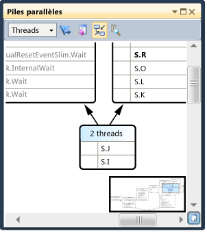  
  
     Dans la vue aérienne, vous pouvez déplacer le rectangle pour effectuer un panoramique rapide autour du diagramme.  
  
     Une autre façon de déplacer le diagramme consiste à cliquer dans une zone vide de celui-ci et à le faire glisser où vous le souhaitez.  
  
     Pour effectuer un zoom avant ou arrière dans le diagramme, appuyez sur CTRL et maintenez cette touche enfoncée pendant que vous déplacez la roulette de la souris. Vous pouvez également cliquer sur le bouton Zoom de la barre d'outils, puis utiliser l'outil Zoom.  
  
     Vous pouvez également afficher les piles dans une direction de haut en bas au lieu de bas en haut, en cliquant sur le **outils** menu, en cliquant sur **Options**, puis activez ou désactivez l’option sous le **dedébogage** nœud.  
  
2.  Avant de continuer, sur le **déboguer** menu, cliquez sur **arrêter le débogage** pour arrêter l’exécution.  
  
## Utilisation de la fenêtre Tâches parallèles et de la vue Tâches de la fenêtre Piles parallèles  
 Nous vous recommandons d'effectuer les procédures précédentes avant de continuer.  
  
#### Pour redémarrer l'application jusqu'à ce que le premier point d'arrêt soit atteint  
  
1.  Sur le **déboguer** menu, cliquez sur **démarrer le débogage** et attendez que le premier point d’arrêt soit atteint.  
  
2.  Sur le **déboguer** menu, pointez sur **Windows** puis cliquez sur **Threads**. Ancrer le **Threads** fenêtre en bas de Visual Studio.  
  
3.  Sur le **déboguer** menu, pointez sur **Windows** et cliquez sur **pile des appels**. Ancrer le **pile des appels** fenêtre en bas de Visual Studio.  
  
4.  Double-cliquez sur un thread dans le **Threads** fenêtre pour le rendre actuel. Les threads actuels comportent une flèche jaune. Lorsque vous modifiez le thread actuel, les autres fenêtres sont mises à jour. Nous allons maintenant examiner les tâches.  
  
5.  Sur le **déboguer** menu, pointez sur **Windows**, puis cliquez sur **tâches**. L’illustration suivante montre le **tâches** fenêtre.  
  
       
  
     Pour chaque tâche en cours, vous pouvez lire l’ID, retourné par la propriété de même nom, l’ID et le nom du thread qui l’exécute, ainsi que son emplacement (le fait de pointer dessus affiche une info-bulle qui comporte l’ensemble de la pile des appels). En outre, sous la **tâche** colonne, vous pouvez voir la méthode qui a été passée dans la tâche ; en d’autres termes, le point de départ.  
  
     Vous pouvez trier toutes les colonnes. Remarquez le glyphe de tri qui indique la colonne et le sens du tri. Vous pouvez également réorganiser les colonnes en les faisant glisser à gauche ou à droite.  
  
     La flèche jaune indique la tâche actuelle. Vous pouvez basculer des tâches en double-cliquant dessus ou en utilisant le menu contextuel. Lorsque vous basculez des tâches, le thread sous-jacent devient le thread actuel et les autres fenêtres sont mises à jour.  
  
     Lorsque vous basculez manuellement d'une tâche à une autre, la flèche jaune se déplace, mais une flèche blanche indique toujours la tâche qui a provoqué l'arrêt du débogueur.  
  
#### Pour continuer l'exécution jusqu'au deuxième point d'arrêt  
  
1.  Pour reprendre l’exécution jusqu'à ce que le deuxième point d’arrêt est atteint, sur le **déboguer** menu, cliquez sur **continuer**.  
  
     Auparavant, les **état** colonne indiquait toutes les tâches comme étant actif, mais maintenant deux tâches sont bloquées. Les tâches peuvent être bloquées pour de nombreuses raisons. Dans le **état** colonne, pointez sur une tâche en attente pour savoir pourquoi elle est bloquée. Par exemple, dans l’illustration suivante, la tâche 3 attend la tâche 4.  
  
     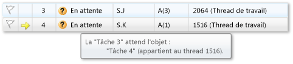  
  
     La tâche 4, ensuite, attend un gestionnaire possédé par le thread assigné à la tâche 2. (Avec le bouton droit de la ligne d’en-tête et choisissez **colonnes** > **affectation de Thread** pour afficher la valeur d’affectation de thread pour la tâche 2).
  
     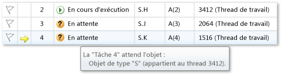
  
     Vous pouvez signaler une tâche en cliquant sur l’indicateur dans la première colonne de la **tâches** fenêtre.  
  
     Vous pouvez utiliser un indicateur pour effectuer le suivi des tâches entre différents points d’arrêt dans la même session de débogage ou pour filtrer les tâches dont les piles d’appels sont affichées dans le **piles parallèles** fenêtre.  
  
     Lorsque vous avez utilisé le **piles parallèles** fenêtre précédemment, vous avez affiché les threads d’application. Afficher le **piles parallèles** fenêtre à nouveau, mais cette fois permet d’afficher les tâches d’application. Cela en sélectionnant **tâches** dans la zone de l’angle supérieur gauche. L’illustration suivante présente la vue Tâches.  
  
       
  
     Les threads qui n’exécutent actuellement pas de tâches n’apparaissent pas dans la vue tâches de la **piles parallèles** fenêtre. En outre, pour les threads qui exécutent des tâches, certains des frames de pile qui ne sont pas associés aux tâches sont filtrés à partir du haut et bas de la pile.  
  
     Afficher le **tâches** fenêtre à nouveau. Cliquez avec le bouton droit sur un en-tête de colonne pour afficher un menu contextuel pour cette colonne.  
  
     Vous pouvez utiliser le menu contextuel pour ajouter ou supprimer des colonnes. Par exemple, la colonne AppDomain n'est pas sélectionnée. Elle ne s'affiche donc pas dans la liste. Cliquez sur **Parent**. Le **Parent** colonne s’affiche sans valeur pour chacune des quatre tâches.  
  
#### Pour continuer l'exécution jusqu'au troisième point d'arrêt  
  
1.  Pour reprendre l’exécution jusqu'à ce que le troisième point d’arrêt est atteint, sur le **déboguer** menu, cliquez sur **continuer**.  
  
     Une nouvelle tâche, la tâche 5, est en cours d’exécution et la tâche 4 est maintenant en attente. Vous pouvez voir pourquoi en pointant sur la tâche en attente dans le **état** fenêtre. Dans le **Parent** colonne, notez que la tâche 4 est le parent de la tâche 5.  
  
     Pour mieux visualiser la relation parent-enfant, avec le bouton droit de la ligne d’en-tête de colonne, puis cliquez sur **Vue Parent enfant**. L'illustration suivante doit apparaître.  
  
     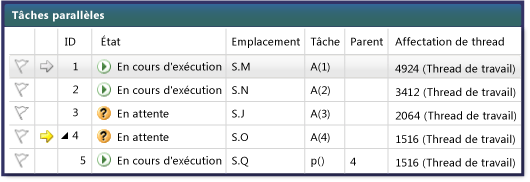  
  
     Remarquez que la tâche 4 et la tâche 5 sont exécutent sur le même thread (afficher les **affectation de Thread** colonne si elle est masquée). Ces informations s’affichent pas dans le **Threads** fenêtre ; leur affichage ici constitue un autre avantage de la **tâches** fenêtre. Pour confirmer ceci, affichez la **piles parallèles** fenêtre. Assurez-vous que vous visualisez **tâches**. Localisez les tâches 4 et 5 en double-cliquant dessus dans le **tâches** fenêtre. Dans ce cas, la surbrillance bleue la **piles parallèles** fenêtre est mise à jour. Vous pouvez également localiser les tâches 4 et 5 en analysant les info-bulles de la **piles parallèles** fenêtre.  
  
     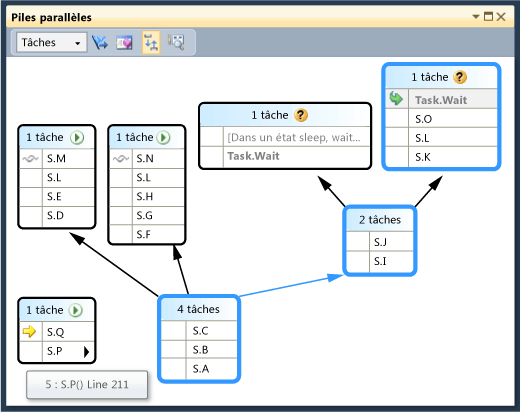  
  
     Dans le **piles parallèles** fenêtre, cliquez sur S.P, puis cliquez sur **atteindre le Thread**. La fenêtre passe à la vue Threads et le frame correspondant s'affiche. Vous pouvez voir les deux tâches sur le même thread.  
  
       
  
     Il s’agit d’un autre avantage de la vue tâches de la **piles parallèles** fenêtre, par rapport à la **Threads** fenêtre.  
  
#### Pour continuer l'exécution jusqu'au quatrième point d'arrêt  
  
1.  Pour reprendre l’exécution jusqu'à ce que le troisième point d’arrêt est atteint, sur le **déboguer** menu, cliquez sur **continuer**. Cliquez sur le **ID** en-tête de colonne pour trier par ID. L'illustration suivante doit apparaître.  
  
     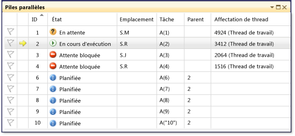  
  
     Étant donné que la tâche 5 est terminée, elle n’est plus affichée. Une fois l’étape si qui n’est pas le cas sur votre ordinateur et que le blocage n’est pas affiché, en appuyant sur **F11**.  
  
     Tâches 3 et 4 sont attendent maintenant l’autre et sont bloquées. Il y a également 5 nouvelles tâches qui sont des enfants de la tâche 2 et qui sont maintenant planifiées. Les tâches planifiées sont des tâches qui ont été démarrées dans le code mais qui n’ont pas encore été exécutées. Par conséquent, leur **emplacement** et **affectation de Thread** colonnes sont vides.  
  
     Afficher le **piles parallèles** fenêtre à nouveau. L'en-tête de chaque zone comporte une info-bulle qui affiche les ID et noms de thread. Basculez en vue tâches dans le **piles parallèles** fenêtre. Pointez sur un en-tête pour afficher l’ID et le nom de la tâche, ainsi que son état, comme indiqué dans l’illustration suivante.  
  
     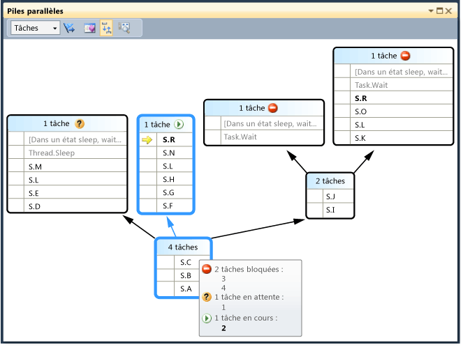  
  
     Vous pouvez regrouper les tâches par colonne. Dans le **tâches** fenêtre, avec le bouton droit le **état** en-tête de colonne, puis cliquez sur **Grouper par état**. L’illustration suivante montre le **tâches** fenêtre regroupés par état.  
  
       
  
     Vous pouvez également regrouper les tâches en fonction d'une autre colonne. Cela vous permet de vous concentrer sur un sous-ensemble de tâches. Chaque groupe réductible comporte un certain nombre des éléments regroupés ensemble.
  
     La dernière fonctionnalité de la **tâches** fenêtre à examiner est le menu contextuel qui s’affiche lorsque vous cliquez sur une tâche.  
  
     Ce menu contextuel contient différentes commandes en fonction de l’état de la tâche. Ces commandes sont **copie**, **sélectionner tout**, **affichage hexadécimal**, **basculer vers la tâche**, **figer affecté Thread**, **figer tous les Threads, mais il**, et **libérer le Thread assigné**, et **indicateur**.  
  
     Vous pouvez verrouiller le thread sous-jacent d’une ou plusieurs tâches, ainsi que verrouiller tous les threads sauf celui qui est assigné. Un thread verrouillé est représenté dans le **tâches** fenêtre telle qu’elle est dans le **Threads** fenêtre, en un bleu *suspendre* icône.  
  
## Récapitulatif  
 Cette procédure pas à pas démontré la **tâches parallèles** et **piles parallèles** fenêtres du débogueur. Vous pouvez utiliser ces fenêtres sur de véritables projets qui utilisent du code multithread. Vous pouvez examiner le code parallèle rédigé en C++, C# ou Visual Basic.  
  
## Voir aussi  
 [Débogage d’Applications multithread](../debugger/walkthrough-debugging-a-parallel-application.md)   
 [Principes de base du débogueur](../debugger/debugger-basics.md)   
 [Débogage du code managé](../debugger/debugging-managed-code.md)   
 [Programmation parallèle](/dotnet/standard/parallel-programming/index)   
 [Runtime d’accès concurrentiel](/cpp/parallel/concrt/concurrency-runtime)   
 [À l’aide de la fenêtre Piles parallèles](../debugger/using-the-parallel-stacks-window.md)   
 [Utilisation de la fenêtre Tâches](../debugger/using-the-tasks-window.md)