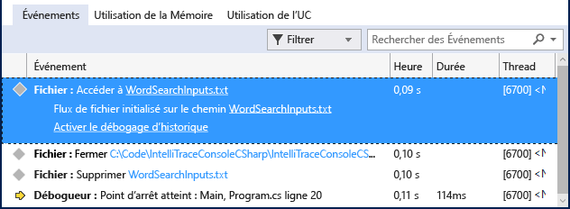

# <a name="view-events-with-intellitrace-in-visual-studio"></a>Afficher les événements IntelliTrace dans Visual Studio
Vous pouvez utiliser IntelliTrace pour collecter des informations sur des événements spécifiques ou des catégories d'événements, ou sur des appels de fonction individuels en plus d'événements. Les procédures suivantes montrent comment procéder.  
  
 Vous pouvez utiliser IntelliTrace dans Visual Studio Enterprise edition, mais pas les éditions Professional ou Community.  
  
##  <a name="GettingStarted"></a>Configurer Intellitrace  
 Vous pouvez essayer de déboguer avec seulement les événements IntelliTrace. Les événements IntelliTrace sont des événements de débogueur, des exceptions, des événements .NET Framework et d'autres événements système. Avant de commencer le débogage, vous devez activer ou désactiver des événements spécifiques pour contrôler les événements qu'IntelliTrace enregistre. Pour plus d’informations, consultez [des fonctionnalités IntelliTrace](../debugger/intellitrace-features.md).  
  
 - Activez l'événement IntelliTrace pour l'accès aux fichiers. Accédez à la **Outils > Options > IntelliTrace > événements IntelliTrace** page, puis développez le **fichier** catégorie. Cochez la catégorie d'événements **Fichier** . Ainsi, tous les événements concernant les fichiers (accès, fermeture, suppression) sont cochés.

## <a name="create-your-app"></a>Créer votre application
  
1.  Créez une application console C#. Ouvrez le fichier Program.cs et ajoutez l'instruction `using` suivante :  
  
    ```CSharp  
    using System.IO;  
    ```  
  
2.  Créez un <xref:System.IO.FileStream> dans la méthode Main, lisez dans ce flux, fermez-le et supprimez le fichier. Ajoutez une autre ligne juste pour avoir un emplacement où définir un point d'arrêt :  
  
    ```CSharp  
    static void Main(string[] args)  
    {  
        FileStream fs = File.Create("WordSearchInputs.txt");  
        fs.ReadByte();  
        fs.Close();  
        File.Delete("WordSearchInputs.txt");  
  
        Console.WriteLine("done");  
    }  
    ```  
  
3.  Définissez un point d'arrêt sur `Console.WriteLine("done");`  

## <a name="start-debugging-and-view-intellitrace-events"></a>Démarrer le débogage et d’afficher les événements IntelliTrace
  
1.  Démarrez le débogage selon la procédure habituelle. (Appuyez sur **F5** ou cliquez sur **Déboguer > Démarrer le débogage**.  
  
    > [!TIP]
    >  Conserver le **variables locales** et **automatique** ouvertes pendant que vous déboguez pour voir et enregistrer les valeurs dans ces fenêtres.  
  
2.  L'exécution s'arrête au point d'arrêt. Si vous ne voyez pas le **outils de Diagnostic** fenêtre, cliquez sur **Déboguer > Windows > événements IntelliTrace**.  
  
     Dans la fenêtre **Outils de diagnostic** , recherchez l'onglet **Événements** (vous voyez normalement trois onglets, **Événements**, **Utilisation de la mémoire**et **Utilisation de l'UC**). L'onglet **Événements** affiche une liste chronologique des événements, qui se termine par le dernier événement avant que le débogueur ait interrompu l'exécution. Vous devez voir un événement nommé **Accès à WordSearchInputs.txt**.  
  
     La capture d’écran suivante a été faite à partir de Visual Studio 2015 Update 1.  
  
       
  
3.  Sélectionnez l'événement pour développer ses détails.  
  
     La capture d’écran suivante a été faite à partir de Visual Studio 2015 Update 1.  
  
       
  
     Vous pouvez choisir le lien de chemin d'accès pour ouvrir le fichier. Si le chemin d'accès complet n'est pas disponible, la boîte de dialogue **Ouvrir un fichier** s'affiche.  
  
     Cliquez sur **activer le débogage d’historique**, qui définit le contexte du débogueur pour le moment où l’événement sélectionné a été collecté, affichant les données historiques dans le **pile des appels**, **devariableslocales** et les autres fenêtres concernées du débogueur. Si le code source est disponible, Visual Studio déplace le pointeur jusqu'au code correspondant dans la fenêtre source afin de vous permettre de l'examiner.  
  
     La capture d’écran suivante a été faite à partir de Visual Studio 2015 Update 1.  
  
       
  
4.  Si vous ne trouvez pas le bogue, essayez de tester d'autres événements aboutissant au bogue. IntelliTrace peut également enregistrer des informations sur les appels pour vous permettre de parcourir pas à pas les appels de fonction. 
  
## <a name="next-steps"></a>Étapes suivantes

Vous pouvez utiliser certaines des fonctionnalités avancées d’IntelliTrace avec le débogage d’historique :

 - Pour afficher des instantanés, consultez [afficher des instantanés à l’aide d’IntelliTrace étape différée](../debugger/how-to-use-intellitrace-step-back.md)
 - Pour savoir comment inspecter des variables et parcourir le code, consultez [Inspecter votre application avec débogage d’historique](../debugger/historical-debugging-inspect-app.md)