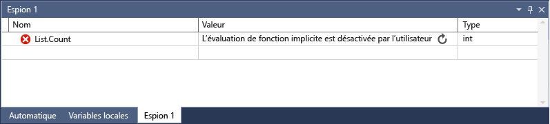

# <a name="watch-variables-with-watch-windows-and-quickwatch"></a>Surveiller les variables avec les fenêtres espion et espion Express

Pendant le débogage, vous pouvez utiliser les fenêtres **Espion** et **Espion express** pour surveiller les variables et les expressions. Les fenêtres sont uniquement disponibles pendant une session de débogage.

Les fenêtres **Espion** peuvent afficher plusieurs variables à la fois lors du débogage. La boîte de dialogue **Espion express** affiche une seule variable à la fois et doit être fermée pour que le débogage puisse continuer.

> [!NOTE]
> S’il s’agit de la première fois que vous essayez de déboguer du code, vous souhaiterez peut-être lire le [débogage pour les débutants](../debugger/debugging-absolute-beginners.md) et les [techniques de débogage et les outils de débogage](../debugger/write-better-code-with-visual-studio.md) avant de passer en revue cet article.

## <a name="observe-variables-with-a-watch-window"></a>Observer les variables avec un Fenêtre Espion

Vous pouvez ouvrir plusieurs fenêtres **Espion** et observer plusieurs variables dans une fenêtre **Espion** .

Par exemple, pour définir un espion sur les valeurs de `a` , `b` et `c` dans le code suivant :

```C++
int main()
{
    int a, b, c;
    a = 1;
    b = 2;
    c = 0;

    for (int i = 0; i < 10; i++)
    {
        a++;
        b *= 2;
        c = a + b;
    }

    return 0;
}

```

1. Définissez un point d’arrêt sur la `c = a + b;` ligne en cliquant dans la marge de gauche, en sélectionnant  >  **basculer le point d’arrêt** ou en appuyant sur **F9**.

1. Démarrez le débogage en sélectionnant la flèche verte de **démarrage** **ou Déboguer**  >  **Démarrer le débogage**, ou appuyez sur **F5**. L’exécution s’interrompt au point d’arrêt.

1. Ouvrez une fenêtre **Espion** en sélectionnant **Déboguer**  >  **Windows**  >  **Watch**  >  **regarder 1** ou en appuyant sur **CTRL** + **ALT** + **W**  >  **1**.

   Vous pouvez ouvrir des fenêtres **Espion** supplémentaires en sélectionnant Windows **2**, **3** ou **4**.

1. Dans la fenêtre **Espion** , sélectionnez une ligne vide, puis tapez variable `a` . Procédez de la même façon pour `b` et `c` .

   

1. Poursuivez le débogage en sélectionnant étape de **débogage**  >  **dans** ou en appuyant sur **F11** si nécessaire pour avancer. Les valeurs des variables dans la fenêtre **Espion** changent à mesure que vous itérez au sein de la `for` boucle.

>[!NOTE]
>Pour C++ uniquement,
>- Vous devrez peut-être qualifier le contexte d’un nom de variable ou une expression qui utilise un nom de variable. Le contexte est la fonction, le fichier source ou le module où se trouve une variable. Si vous devez qualifier le contexte, utilisez la syntaxe de l' [opérateur de contexte (C++)](../debugger/context-operator-cpp.md) dans le **nom** dans la fenêtre **Espion** .
>
>- Vous pouvez ajouter des noms de registres et des noms de variables à l’aide de **$\<register&nbsp;name>** ou **@\<register&nbsp;name>** au **nom** dans la fenêtre **Espion** . Pour plus d’informations, consultez [Pseudovariables](../debugger/pseudovariables.md).

## <a name="use-expressions-in-a-watch-window"></a>Utiliser des expressions dans un Fenêtre Espion

Vous pouvez observer toute expression valide reconnue par le débogueur dans une fenêtre **Espion** .

Par exemple, pour le code de la section précédente, vous pouvez obtenir la moyenne des trois valeurs en entrant `(a + b + c) / 3` dans la fenêtre **Espion** :


Les règles d’évaluation des expressions dans la fenêtre **Espion** sont généralement les mêmes que celles relatives à l’évaluation des expressions dans le langage de code. Si une expression contient une erreur de syntaxe, attendez-vous à la même erreur de compilation que dans l’éditeur de code. Par exemple, une faute de frappe dans l’expression ci-dessus génère cette erreur dans la fenêtre **Espion** :


Un cercle avec deux lignes ondulées peut apparaître dans la fenêtre **Espion** . Cette icône signifie que le débogueur n’évalue pas l’expression en raison d’une dépendance entre threads potentielle. L’évaluation du code nécessite l’exécution temporaire d’autres threads dans votre application, mais comme vous êtes en mode arrêt, tous les threads de votre application sont généralement arrêtés. Permettre à d’autres threads de s’exécuter temporairement peut avoir des effets inattendus sur l’état de votre application, et le débogueur peut ignorer des événements tels que des points d’arrêt et des exceptions sur ces threads.

::: moniker range=">= vs-2019" 
## <a name="search-in-the-watch-window"></a>Rechercher dans le Fenêtre Espion

Vous pouvez rechercher des mots clés dans les colonnes nom, valeur et type de la fenêtre **Espion** à l’aide de la barre de recherche au-dessus de chaque fenêtre. Appuyez sur entrée ou sélectionnez l’une des flèches pour exécuter une recherche. Pour annuler une recherche en cours, sélectionnez l’icône « x » dans la barre de recherche.

Utilisez les flèches gauche et droite (Maj + F3 et F3, respectivement) pour naviguer entre les correspondances trouvées.


Pour que votre recherche soit plus ou moins complète, utilisez la liste déroulante de **recherche plus approfondie** en haut de la fenêtre **Espion** pour sélectionner le nombre de niveaux que vous souhaitez rechercher dans les objets imbriqués. 

## <a name="pin-properties-in-the-watch-window"></a>Épingler les propriétés dans le Fenêtre Espion

>[!NOTE]
> Cette fonctionnalité est prise en charge dans .NET Core 3,0 ou version ultérieure.

Vous pouvez inspecter rapidement des objets en fonction de leurs propriétés dans le Fenêtre Espion à l’aide de l’outil **Propriétés regroupement** .  Pour utiliser cet outil, pointez sur une propriété et sélectionnez l’icône d’épingle qui s’affiche ou cliquez avec le bouton droit et sélectionnez l’option **épingler le membre en tant que favori** dans le menu contextuel résultant.  Cela propage cette propriété vers le haut de la liste de propriétés de l’objet, et le nom et la valeur de la propriété s’affichent dans la colonne **valeur** .  Pour désépingler une propriété, sélectionnez à nouveau l’icône d’épingle ou sélectionnez l’option **détacher le membre en tant que favori** dans le menu contextuel.


Vous pouvez également activer/désactiver les noms de propriété et exclure les propriétés non épinglées lors de l’affichage de la liste de propriétés de l’objet dans la Fenêtre Espion.  Vous pouvez accéder aux deux options en sélectionnant les boutons de la barre d’outils au-dessus de la fenêtre Espion.

::: moniker-end

### <a name="refresh-watch-values"></a><a name="bkmk_refreshWatch"></a> Actualiser les valeurs de la surveillance

Une icône d’actualisation (flèche circulaire) peut apparaître dans la fenêtre **Espion** lorsqu’une expression est évaluée. L’icône d’actualisation indique une erreur ou une valeur obsolète.

Pour actualiser la valeur, sélectionnez l’icône d’actualisation ou appuyez sur la barre d’espace. Le débogueur essaie de réévaluer l'expression. Toutefois, vous pouvez ne pas vouloir réévaluer l’expression, en fonction de la raison pour laquelle la valeur n’a pas été évaluée.

Pointez sur l’icône d’actualisation ou consultez la colonne **valeur** pour la raison pour laquelle l’expression n’a pas été évaluée. En voici plusieurs raisons :

- Une erreur s’est produite lors de l’évaluation de l’expression, comme dans l’exemple précédent. Un délai d’expiration peut se produire ou une variable peut être hors de portée.

- L’expression contient un appel de fonction qui peut déclencher un effet secondaire dans l’application. Consultez [effets secondaires](#bkmk_sideEffects)de l’expression.

- L’évaluation automatique des propriétés et des appels de fonction implicite est désactivée.

Si l’icône d’actualisation apparaît parce que l’évaluation automatique des propriétés et les appels de fonction implicite est désactivée, vous pouvez l’activer en sélectionnant activer l’évaluation de la **propriété et d’autres appels de fonction implicite** dans **Outils**  >  **options**  >  **débogage**  >  **général**.

Pour illustrer l’utilisation de l’icône d’actualisation :

1. Dans **Outils**  >  **options**  >  **débogage**  >  **général**, désactivez la case à cocher **activer l’évaluation de la propriété et d’autres appels de fonction implicite** .

1. Entrez le code suivant et, dans la fenêtre **Espion** , définissez un espion sur la `list.Count` propriété.

   ```csharp
   static void Main(string[] args)
   {
       List<string> list = new List<string>();
       list.Add("hello");
       list.Add("goodbye");
   }
   ```

1. Démarrez le débogage. La fenêtre **Espion** affiche un message semblable au suivant :

   

1. Pour actualiser la valeur, sélectionnez l’icône d’actualisation ou appuyez sur la barre d’espace. Le débogueur réévalue l’expression.

### <a name="expression-side-effects"></a><a name="bkmk_sideEffects"></a> Effets secondaires de l’expression

L’évaluation de certaines expressions peut modifier la valeur d’une variable ou affecter l’état de votre application. Par exemple, l’évaluation de l’expression suivante modifie la valeur de `var1`:

```csharp
var1 = var2
```

Ce code peut provoquer un [effet secondaire](https://en.wikipedia.org/wiki/Side_effect_\(computer_science\)). Les effets secondaires peuvent compliquer le débogage en modifiant le mode de fonctionnement de votre application.

Une expression avec des effets secondaires n’est évaluée qu’une seule fois, lorsque vous l’entrez pour la première fois. Après cela, l’expression apparaît grisée dans la fenêtre **Espion** et les évaluations suivantes sont désactivées. La colonne info-bulle ou **valeur** explique que l’expression provoque un effet secondaire. Vous pouvez forcer la réévaluation en sélectionnant l’icône d’actualisation qui apparaît en regard de la valeur.

Une façon d’empêcher la désignation des effets secondaires est de désactiver l’évaluation automatique des fonctions. Dans **Outils**  >  **options**  >  **débogage**  >  **général**, désélectionnez **activer l’évaluation de la propriété et d’autres appels de fonction implicite**.

Pour C# uniquement, lorsque l’évaluation des propriétés ou des appels de fonction implicite est désactivée, vous pouvez forcer l’évaluation en ajoutant le modificateur de format **AC** à un **nom** de variable dans la fenêtre **Espion** . Consultez [spécificateurs de format en C#](../debugger/format-specifiers-in-csharp.md).

## <a name="use-object-ids-in-the-watch-window-c-and-visual-basic"></a><a name="bkmk_objectIds"></a> Utiliser les ID d’objet dans le Fenêtre Espion (C# et Visual Basic)

Vous pouvez parfois observer le comportement d’un objet spécifique. Par exemple, vous pouvez souhaiter effectuer le suivi d’un objet référencé par une variable locale une fois que cette variable est hors de portée. En C# et Visual Basic, vous pouvez créer des ID d’objet pour des instances spécifiques de types référence et les utiliser dans la fenêtre **Espion** et dans les conditions de point d’arrêt. L’ID d’objet est généré par les services de débogage du Common Language Runtime (CLR) et associé à l’objet.

> [!NOTE]
> Les ID d’objet créent des références faibles qui n’empêchent pas l’objet d’être récupéré par le garbage collector. Leur validité ne vaut que pour la session de débogage active.

Dans le code suivant, la `MakePerson()` méthode crée un `Person` à l’aide d’une variable locale :

```csharp
class Person
{
    public Person(string name)
    {
        Name = name;
    }
    public string Name { get; set; }
}

public class Program
{
    static List<Person> _people = new List<Person>();
    public static void Main(string[] args)
    {
        MakePerson();
        DoSomething();
    }

    private static void MakePerson()
    {
        var p = new Person("Bob");
        _people.Add(p);
    }

    private static void DoSomething()
    {
        // more processing
         Console.WriteLine("done");
    }
}
```

Pour déterminer le nom du `Person` dans la `DoSomething()` méthode, vous pouvez ajouter une référence à l’ID d' `Person` objet dans la fenêtre **Espion** .

1. Définissez un point d’arrêt dans le code après la création de l' `Person` objet.

1. Démarrez le débogage.

1. Lorsque l’exécution s’interrompt au point d’arrêt, ouvrez la fenêtre **variables locales** en choisissant **Déboguer** les  >    >  **paramètres régionaux** Windows.

1. Dans la fenêtre **variables locales** , cliquez avec le bouton droit sur la `Person` variable et sélectionnez **créer un ID d’objet**.

   Vous devez voir un signe dollar ( **$** ) plus un nombre dans la fenêtre **variables locales** , qui est l’ID d’objet.

1. Ajoutez l’ID d’objet dans la fenêtre **Espion** en cliquant avec le bouton droit sur l’ID d’objet et en sélectionnant **Ajouter un espion**.

1. Définissez un autre point d’arrêt dans la `DoSomething()` méthode.

1. Poursuivez le débogage. Lorsque l’exécution est suspendue dans la `DoSomething()` méthode, la fenêtre **Espion** affiche l' `Person` objet.

   > [!NOTE]
   > Si vous souhaitez afficher les propriétés de l’objet, par exemple `Person.Name` , vous devez activer l’évaluation de la propriété en sélectionnant **Outils**  >  **options**  >  **débogage**  >  **général**  >  **activer l’évaluation de la propriété et d’autres appels de fonction implicite**.

## <a name="dynamic-view-and-the-watch-window"></a>Affichage dynamique et Fenêtre Espion

Certains langages de script (par exemple, JavaScript ou python) utilisent le typage dynamique ou [canard](https://en.wikipedia.org/wiki/Duck_typing) , et .net version 4,0 et versions ultérieures prennent en charge les objets difficiles à observer dans les fenêtres de débogage normales.

La fenêtre **Espion** affiche ces objets en tant qu’objets dynamiques, qui sont créés à partir des types qui implémentent l' <xref:System.Dynamic.IDynamicMetaObjectProvider> interface. Les nœuds d’objets dynamiques affichent les membres dynamiques des objets dynamiques, mais n’autorisent pas la modification des valeurs de membre.

Pour actualiser les valeurs de l' **affichage dynamique** , sélectionnez l' [icône Actualiser](#bkmk_refreshWatch) en regard du nœud objet dynamique.

Pour afficher uniquement l' **affichage dynamique** pour un objet, ajoutez un spécificateur de format **dynamique** après le nom de l’objet dynamique dans la fenêtre **Espion** :

- Pour C# : `ObjectName, dynamic`
- Pour Visual Basic : `$dynamic, ObjectName`

>[!NOTE]
>- Le débogueur C# ne réévalue pas automatiquement les valeurs de l' **affichage dynamique** lorsque vous parcourez la ligne de code suivante.
>- Le débogueur Visual Basic actualise automatiquement les expressions ajoutées par le biais de l' **affichage dynamique**.
>- L’évaluation des membres d’un **affichage dynamique** peut avoir des [effets secondaires](https://en.wikipedia.org/wiki/Side_effect_\(computer_science\)).

**Pour insérer une nouvelle variable Watch qui effectue un cast d’un objet en objet dynamique :**

1. Cliquez avec le bouton droit sur l’un des enfants d’un **affichage dynamique**.
1. Choisissez **Ajouter un espion**. Le `object.name` devient `((dynamic) object).name` et s’affiche dans une nouvelle fenêtre **Espion** .

Le débogueur ajoute également un nœud enfant de **vue dynamique** de l’objet à la fenêtre **automatique** . Pour ouvrir la fenêtre **automatique** , pendant le débogage, sélectionnez **Déboguer**  >  **Windows**  >  **automatique**.

L' **affichage dynamique** améliore également le débogage pour les objets com. Quand le débogueur obtient un objet COM encapsulé dans **System.__ComObject**, il ajoute un nœud **affichage dynamique** pour l’objet.

## <a name="observe-a-single-variable-or-expression-with-quickwatch"></a>Observer une variable ou une expression unique avec espion Express

Vous pouvez utiliser la fenêtre **Espion express** pour observer une variable unique.

Par exemple, pour le code suivant :

```csharp
static void Main(string[] args)
{
    int a, b;
    a = 1;
    b = 2;
    for (int i = 0; i < 10; i++)
    {
        a = a + b;
    }
}
```

Pour observer la `a` variable,

1. Définissez un point d’arrêt sur la ligne `a = a + b;` .

1. Démarrez le débogage. L’exécution s’interrompt au point d’arrêt.

1. Sélectionnez la variable `a` dans le code.

1. Sélectionnez **Déboguer**  >  **Espion express**, appuyez sur **MAJ** + **F9**, ou cliquez avec le bouton droit et sélectionnez **Espion express**.

   La boîte de dialogue **Espion express** s’affiche. La `a` variable se trouve dans la zone **expression** avec  la valeur **1**.

   

1. Pour évaluer une expression à l’aide de la variable, tapez une expression telle que `a + b` dans la zone **expression** , puis sélectionnez **réévaluer**.

   

1. Pour ajouter la variable ou l’expression d' **Espion express** à la fenêtre **Espion** , sélectionnez **Ajouter un espion**.

1. Sélectionnez **Fermer** pour fermer la fenêtre **Espion express** . (**Espion express** étant une boîte de dialogue modale, vous ne pouvez pas continuer le débogage tant qu’il est ouvert.)

1. Poursuivez le débogage. Vous pouvez observer la variable dans la fenêtre **Espion** .

## <a name="see-also"></a>Voir aussi
- [Qu’est-ce que le débogage ?](../debugger/what-is-debugging.md)
- [Techniques et outils de débogage](../debugger/write-better-code-with-visual-studio.md)
- [Premier aperçu du débogage](../debugger/debugger-feature-tour.md)
- [Fenêtres du débogueur](../debugger/debugger-windows.md)
