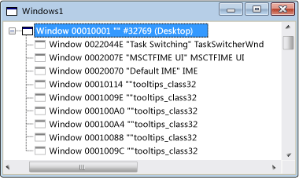

# Vue Fenêtres
Lorsque vous ouvrez Spy + + pour la première fois, la vue fenêtres affiche une arborescence de toutes les fenêtres et de tous les contrôles du système. Le handle de fenêtre et le nom de classe sont affichés. La fenêtre du Bureau active se trouve en haut de l’arborescence. Toutes les autres fenêtres sont des enfants du bureau et sont répertoriées en fonction de la hiérarchie de la fenêtre standard. Les fenêtres sœurs apparaissent dans les listes expansible en retrait sous leurs parents.

 La figure ci-dessous illustre une vue de fenêtres Spy + + standard avec le nœud supérieur développé.

  Vue fenêtres Spy + +

 La fenêtre du Bureau active se trouve en haut de l’arborescence. Toutes les autres fenêtres sont des enfants du bureau et sont répertoriées en fonction de la hiérarchie de la fenêtre standard, avec les fenêtres sœurs classées selon l’ordre de plan. Vous pouvez développer ou réduire tout nœud parent de l’arborescence en cliquant sur le symbole + ou-en regard du nœud.

 Lorsque la vue Windows est active, vous pouvez utiliser l’outil Finder dans la [boîte de dialogue recherche](../debugger/window-search-dialog-box.md) d’une fenêtre pour afficher des informations à partir de n’importe quelle fenêtre ouverte sur votre système.

## Dans cette section
 [Comment : utiliser l’outil Finder](../debugger/how-to-use-the-finder-tool.md) Montre comment cet outil analyse les propriétés ou les messages de Windows.

 [Comment : Rechercher une fenêtre dans la vue fenêtres](../debugger/how-to-search-for-a-window-in-windows-view.md) Explique comment rechercher une fenêtre spécifique dans la vue Windows.

 [Comment : afficher les propriétés](../debugger/how-to-display-window-properties.md) d’une fenêtre m procédures pour ouvrir la boîte de dialogue Propriétés de la fenêtre.

## Sections connexes
 [Vues Spy + +](../debugger/spy-increment-views.md) Explique les vues de l’arborescence Spy + + des fenêtres, des messages, des processus et des threads.

 [Utilisation de Spy + +](../debugger/using-spy-increment.md) Présente l’outil Spy + + et explique comment l’utiliser.

 [Rechercher une fenêtre, boîte de dialogue](../debugger/find-window-dialog-box.md) Permet d’afficher les propriétés ou les messages d’une fenêtre spécifique.

 [Boîte de dialogue recherche de fenêtre](../debugger/window-search-dialog-box.md) Utilisé pour rechercher le nœud pour une fenêtre spécifique dans la vue Windows.

 [Boîte de dialogue Propriétés de la fenêtre](../debugger/window-properties-dialog-box.md) Permet d’afficher les propriétés d’une fenêtre sélectionnée en mode fenêtres.

 [Référence Spy + +](../debugger/spy-increment-reference.md) Comprend des sections décrivant chaque menu et boîte de dialogue Spy + +.