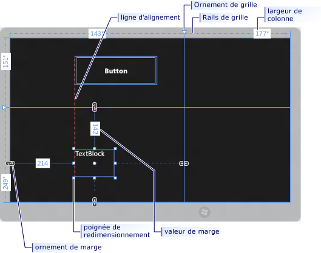
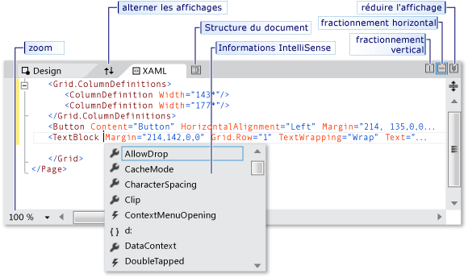
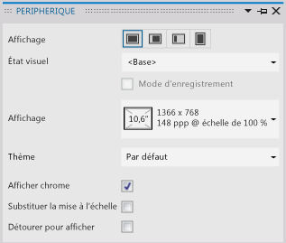
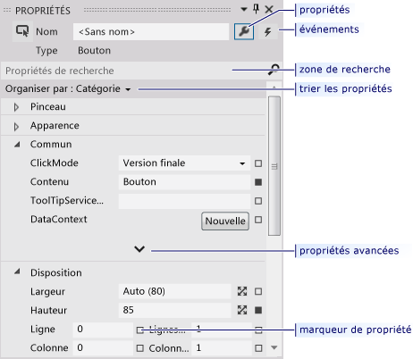

# Créer une interface utilisateur avec le concepteur XAML dans Visual Studio

Le concepteur XAML dans Visual Studio fournit une interface visuelle pour vous aider à concevoir des applications web et Windows basées sur XAML. Vous pouvez créer des interfaces utilisateur pour vos applications en faisant glisser des contrôles à partir de la **boîte à outils** et en définissant des propriétés dans la fenêtre **Propriétés** . Vous pouvez également modifier le XAML directement en mode XAML.

Pour plus d’informations sur les tâches de conception XAML avancées telles que les animations et les comportements, consultez [Creating a UI by using Blend for Visual Studio](../designers/creating-a-ui-by-using-blend-for-visual-studio.md). Consultez également [Conception XAML dans Visual Studio et Blend pour Visual Studio](../designers/designing-xaml-in-visual-studio.md) pour avoir une comparaison des outils.

## Espace de travail du concepteur XML

L'espace de travail du concepteur XML se compose de plusieurs éléments d'interface graphique. Ceux-ci incluent la **planche graphique**, l’**Éditeur XAML**, la fenêtre **Appareil**, la fenêtre **Structure du document** et la fenêtre **Propriétés**. Pour ouvrir le concepteur XAML, cliquez avec le bouton droit sur un fichier XAML dans l' **Explorateur de solutions** et choisissez **Concepteur de vues**.

## Création des vues

Le concepteur XAML fournit un mode XAML et un mode Création synchronisé du balisage XAML rendu de votre application. Quand un fichier XAML est ouvert dans Visual Studio, vous pouvez basculer entre le mode Création et le mode XAML à l'aide des onglets **Conception** et **XAML** . Vous pouvez utiliser le bouton **Permuter les volets** pour définir la fenêtre qui doit s'afficher au premier plan : la planche graphique ou l'Éditeur XAML.

En mode Création, la fenêtre contenant la *planche graphique* est la fenêtre active et vous pouvez l'utiliser comme surface de travail principale. Vous pouvez l'utiliser pour concevoir visuellement une page dans votre application en ajoutant ou en dessinant des éléments, puis en les modifiant. Pour plus d'informations, consultez [Working with elements in XAML Designer](../designers/working-with-elements-in-xaml-designer.md). Cette illustration montre la planche graphique en mode Création.

Les fonctionnalités suivantes sont disponibles dans la planche graphique :

**Lignes d'alignement**

Les lignes d'alignement sont des *limites d'alignement* qui apparaissent sous forme de lignes en pointillés rouges quand les bords des contrôles sont alignés ou que les lignes de base de texte sont alignées. Les limites d'alignement n'apparaissent que si l' **alignement sur les lignes d'alignement** est activé.

**Quadrillage de grille**

Les quadrillages`Grid` permettent de gérer les lignes et les colonnes dans un panneau [Grid](/uwp/api/Windows.UI.Xaml.Controls.Grid) . Vous pouvez créer et supprimer des lignes et des colonnes, ainsi qu'ajuster leurs largeurs et hauteurs relatives. Le quadrillage de grille vertical, qui apparaît à gauche de la planche graphique, est utilisé pour les lignes, et la ligne horizontale, qui apparaît en haut, est utilisée pour les colonnes.

**Ornements de grille**

Un ornement de grille apparaît sous la forme d’un triangle auquel est rattachée une ligne verticale ou horizontale sur le quadrillage. Quand vous faites glisser un ornement de grille, les largeurs ou hauteurs des lignes ou colonnes adjacentes se mettent à jour au fur et à mesure que vous déplacez la souris.

Les ornements de grille permettent de contrôler la largeur et la hauteur des lignes et des colonnes d’une grille. Vous pouvez ajouter une nouvelle colonne ou ligne en cliquant sur le quadrillage. Quand vous ajoutez une nouvelle ligne ou ligne de colonne pour un panneau Grille qui comporte plusieurs colonnes ou lignes, une mini-barre d’outils apparaît en dehors du quadrillage pour vous permettre de définir la largeur et la hauteur explicitement. La mini-barre d’outils vous permet de définir des options de dimensionnement pour les lignes et les colonnes de grille.

**Poignées de redimensionnement**

Des poignées de redimensionnement apparaissent sur les contrôles sélectionnés et vous permettent de redimensionner le contrôle. Quand vous redimensionnez un contrôle, les valeurs de largeur et de hauteur s'affichent généralement pour permettre de déterminer la taille du contrôle. Pour plus d’informations sur la manipulation des contrôles en mode **Création**, consultez [Travailler avec des éléments dans le concepteur XAML](../designers/working-with-elements-in-xaml-designer.md).

**Marges**

Les marges représentent la quantité d'espace fixe entre le bord d'un contrôle et le bord du conteneur associé. Vous pouvez définir les marges d’un contrôle à l’aide des propriétés [Margin](/uwp/api/windows.ui.xaml.frameworkelement.margin) sous **Disposition** dans la fenêtre Propriétés.

**Ornements de marge**

Vous pouvez utiliser des ornements de marge pour modifier les marges d'un élément par rapport à son conteneur de disposition. Quand un ornement de marge est ouvert, une marge n'est pas définie et l'ornement de marge affiche une chaîne interrompue. Quand la marge n’est pas définie et que le conteneur de disposition est redimensionné au moment de l’exécution, les éléments restent en place. Quand un ornement de marge est fermé, un ornement de marge affiche une chaîne ininterrompue, et les éléments se déplacent avec la marge au fur et à mesure que le conteneur de disposition est redimensionné au moment de l’exécution (la marge reste fixe).

**Poignées d'élément**

Vous pouvez modifier un élément à l'aide des poignées d'élément qui apparaissent sur la planche graphique quand vous déplacez le pointeur sur les angles de la zone bleue qui entoure un élément. Ces poignées permettent de faire pivoter un élément, de le redimensionner, retourner, déplacer ou d'y ajouter un rayon d'angle. Le symbole de la poignée d'élément varie selon les fonctions et change par rapport à l'emplacement exact du pointeur. Si les poignées d'élément ne s'affichent pas, vérifiez que l'élément est sélectionné.

En mode **Création**, des commandes supplémentaires de la planche graphique sont disponibles dans la partie inférieure gauche de la zone de l’écran, comme indiqué ci-après :

Les commandes suivantes sont disponibles dans cette barre d'outils :

**Zoom**

Le zoom vous permet de dimensionner l'aire de conception. Vous pouvez effectuer un zoom de 12,5 % à 800 % ou sélectionner des options comme **Ajuster à la sélection** et **Ajuster à tout**.

**Afficher/Masquer la grille d'accrochage**

Affiche ou masque la grille d'accrochage qui indique le quadrillage. Le quadrillage est utilisé quand vous activez l’**alignement sur le quadrillage** ou l’**alignement sur les lignes d’alignement**.

**Activer/Désactiver l'alignement sur le quadrillage**

Si **l’alignement sur le quadrillage** est activé quand vous faites glisser un élément sur la planche graphique, celui-ci tend à s’aligner sur les lignes de quadrillage horizontales et verticales les plus proches.

**Activer/Désactiver l'alignement sur les lignes d'alignement**

Les lignes d'alignement vous aident à aligner les contrôles les uns par rapport aux autres. Si l' **alignement sur les lignes d'alignement** est activé, quand vous faites glisser un contrôle par rapport à d'autres contrôles, des limites d'alignement apparaissent quand les bords et le texte de certains contrôles sont alignés horizontalement ou verticalement. Une limite d'alignement apparaît sous la forme d'une ligne en pointillés rouge.

En mode **XAML**, la fenêtre de l’éditeur XAML est la fenêtre active, et l’éditeur XAML est votre principal outil de création. Le langage XAML (Extensible Application Markup Language) fournit un vocabulaire XML déclaratif permettant de spécifier l'interface utilisateur d'une application. Le mode XAML inclut IntelliSense, la mise en forme automatique, la mise en surbrillance de la syntaxe et la navigation de balises. Cette illustration montre le mode XAML :

**Barre Mode fractionné**

La barre Mode fractionné apparaît en haut du mode XAML quand l'éditeur XAML s'affiche dans la fenêtre inférieure. La barre Mode fractionné vous permet de contrôler les tailles relatives du mode **Création** et du mode **XAML**. Vous pouvez également échanger les emplacements des vues (à l'aide du bouton **Permuter les volets** ), spécifier si les vues sont réorganisées horizontalement ou verticalement et réduire l'une ou l'autre des vues.

**Zoom de balisage**

Le zoom de balisage permet de dimensionner l’affichage **XAML**. Vous pouvez effectuer un zoom de 20 % à 400 %.

## Fenêtre Périphérique

> [!NOTE]
> Si la version de la plateforme cible (`TargetPlatformVersion`) d’une application UWP est 10.0.16299.0 ou ultérieure, la fenêtre **Appareil** n’est pas disponible.

La fenêtre **Appareil** du concepteur XAML vous permet de faire des simulations à l’aide de plusieurs vues, écrans et options d’affichage pour votre projet au moment du design. La fenêtre **Appareil** est disponible dans le menu **Design** quand vous travaillez dans le concepteur XAML. Voici à quoi elle ressemble :

Les options disponibles dans la fenêtre Périphérique sont les suivantes :

**Afficher**

Spécifie différentes tailles et résolutions d'affichage pour votre application.

**Orientation**

Spécifie différentes orientations de l’application : **Paysage** ou **Portrait**.

**Bord**

Spécifie différents alignements de bord de votre application : **Les deux**, **Gauche**, **Droit**ou **Aucun**.

**Contraste élevé**

Affiche un aperçu de l'application en fonction du paramètre de contraste sélectionné Ce paramètre, quand il est défini sur une valeur différente de **Par défaut**, remplace la propriété `RequestedTheme` définie dans *App.xaml*.

**Substituer la mise à l'échelle**

Active ou désactive l'émulation de la mise à l'échelle de document dans l'aire de conception. Cela vous permet d'augmenter le pourcentage de mise à l'échelle d'un facteur. Cochez la case pour activer l'émulation. Par exemple, si votre pourcentage de mise à l'échelle est de 100 %, le document dans l'aire de conception bénéficiera d'une mise à l'échelle pouvant atteindre 140 %. Cette option est désactivée si le pourcentage de mise à l'échelle actuel est 180.

**Largeur minimale**

Spécifie le paramètre de largeur minimale. La largeur minimale peut être changée dans *App.xaml*.

**Thème**

Spécifie le thème d'application. Par exemple, vous pouvez basculer entre un thème **Sombre** et un thème **Clair**.

**Afficher le chrome**

Active et désactive le frame de tablette simulée autour de votre application en mode Création. Cochez la case pour afficher le frame.

**Détourer pour afficher**

Spécifie le mode d'affichage. Cochez la case pour détourer la taille du document selon la taille d'affichage.

## Fenêtre Structure du document

La fenêtre Structure du document dans le concepteur XAML vous permet d'effectuer les tâches suivantes :

- Afficher la structure hiérarchique de tous les éléments de la planche graphique.

- Sélectionner des éléments pour pouvoir les modifier (les déplacer dans la hiérarchie, les modifier sur la planche graphique, définir leurs propriétés dans la fenêtre Propriétés, etc.). Pour plus d’informations, consultez [Travailler avec des éléments dans le concepteur XAML](../designers/working-with-elements-in-xaml-designer.md).

- Créer et modifier les modèles des éléments qui sont des contrôles.

- Utiliser le menu contextuel des éléments sélectionnés. Le même menu est également disponible pour les éléments sélectionnés dans la planche graphique.

Pour afficher la fenêtre **Structure du document**, dans la barre de menus, choisissez **Affichage** > **Autres fenêtres** > **Structure du document**.

Les options disponibles dans la fenêtre **Structure du document** sont les suivantes :

**Structure du document**

L’affichage principal de la fenêtre **Structure du document** montre la hiérarchie du document dans une arborescence. Vous pouvez utiliser la nature hiérarchique de la structure du document pour consulter le document à des niveaux de détail différents, et pour verrouiller et masquer des éléments séparément ou en groupes.

**Afficher/Masquer**

Affiche ou masque les éléments de la planche graphique qui correspondent aux éléments de la structure du document. Utilisez les boutons **Afficher/Masquer**, qui affichent le symbole d’un œil en cas d’affichage, ou appuyez sur **Ctrl**+**H** pour masquer les éléments, et sur **Mah**+**Ctrl**+**H** pour les afficher.

**Verrouiller/Déverrouiller**

Verrouille ou déverrouille les éléments de la planche graphique qui correspondent aux éléments de la structure du document. Les éléments verrouillés ne peuvent pas être modifiés. Utilisez les boutons **Verrouiller/Déverrouiller**, qui affichent un symbole de cadenas en cas de verrouillage, ou appuyez sur **Ctrl**+**L** pour verrouiller des éléments, et sur **Maj**+**Ctrl**+**L** pour les déverrouiller.

**Rétablir l'étendue à pageRoot**

L’option en haut de la fenêtre **Structure du document**, qui présente un symbole de flèche vers le haut, rétablit la structure du document à la portée précédente. La portée supérieure n'est applicable que quand vous êtes dans la portée d'un style ou d'un modèle.

## Fenêtre Propriétés

La fenêtre **Propriétés** vous permet de définir des valeurs de propriété sur les contrôles. Voici à quoi elle ressemble :

Plusieurs options apparaissent en haut de la fenêtre **Propriétés**. Vous pouvez modifier le nom de l'élément actuellement sélectionné à l'aide de la zone **Nom** . Dans le coin supérieur gauche, il existe une icône qui représente l'élément actuellement sélectionné. Pour réorganiser les propriétés par catégorie ou par ordre alphabétique, cliquez sur **Catégorie**, **Nom**ou **Source** dans la liste **Réorganiser par** . Pour afficher la liste des événements pour un contrôle, cliquez sur le bouton **Événements** , symbolisé par un éclair. Pour rechercher une propriété, commencez à taper son nom dans la zone **Propriétés de recherche** . La fenêtre **Propriétés** affiche les propriétés correspondant aux termes de recherche en cours de frappe. Certaines propriétés vous permettent de définir des propriétés avancées en sélectionnant un bouton de flèche vers le bas. Pour plus d’informations sur l’utilisation des propriétés et la gestion des événements, consultez [Présentation des contrôles et des modèles](/windows/uwp/design/controls-and-patterns/controls-and-events-intro)

À droite de chaque valeur de propriété figure un *marqueur de propriété* qui apparaît comme un symbole de zone. L'apparence du marqueur de propriété indique s'il y a une liaison de données ou une ressource appliquée à la propriété. Par exemple, un symbole de zone vide indique une valeur par défaut, un symbole de zone noire indique généralement qu'une ressource locale a été appliquée, et enfin une zone orange indique généralement qu'une liaison de données a été appliquée. Quand vous cliquez sur le marqueur de propriété, vous pouvez accéder à la définition d'un style, ouvrir le générateur de liaisons de données ou ouvrir le sélecteur de ressources.

## Voir aussi

- [Utilisation des éléments dans le concepteur XAML](../designers/working-with-elements-in-xaml-designer.md)
- [Comment créer et appliquer une ressource](../designers/how-to-create-and-apply-a-resource.md)
- [Procédure pas à pas : Effectuer une liaison de données dans le concepteur XAML](../designers/walkthrough-binding-to-data-in-xaml-designer.md)